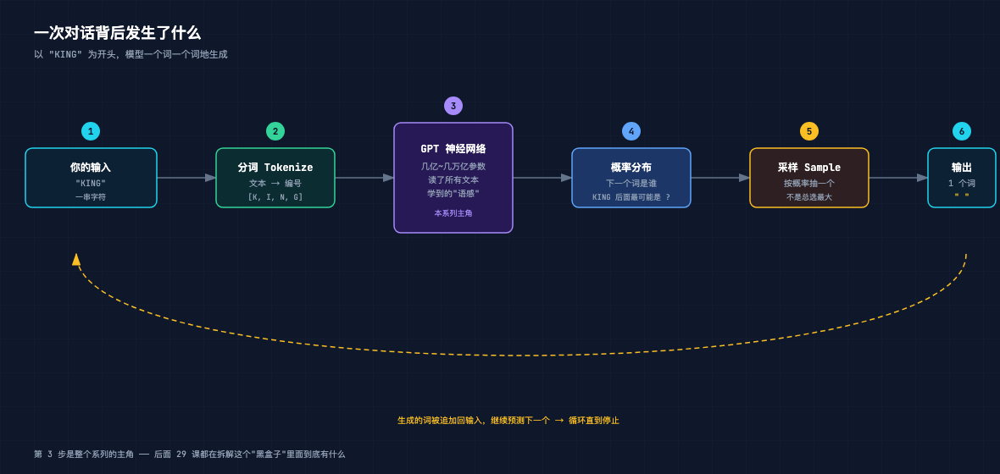

# 手搓大模型 01：一次对话背后发生了什么

> 本节代码：无（纯概念）。本章用已训练好的模型做生成演示，代码在第 26 课会完整呈现。
>
> 本系列《手搓大模型：从零构建 NanoGPT》的第一课。
> 目标读者：零基础。会一点 Python 更好，不会也能看懂今天这篇。

先看一段真实的文本。它不是一个人类写的，也不是 ChatGPT 写的，是一个"只训练了 1000 步、参数只有 1000 万"的幼儿园级小模型，在我这台 Mac mini 上自己生成的：

```
KING HENRY VI:
The king souls I say it pursuit to the country.

LADY GREY:
O, cause me, you do not pass
Father.

LADY GRUY:
Be found: the fair feets love I was not in me as your wife,
If I would
```

一眼能看出两个事实：

- 它**不通顺**。"The king souls I say it pursuit to the country"——这是什么鬼？
- 但它**有结构**。有角色名（KING HENRY VI、LADY GREY）、有冒号、有换行、有戏剧对白的样子。

一个只学了 1000 步的模型，为什么能"学会"戏剧的格式，却说不出人话？

今天这一课，就是把这个问题的答案摊开。从一次最简单的对话开始，看大模型运行的时候，到底在干什么。

---

## 一句话直觉

大模型不是一个"什么都知道的数据库"。它是一个**见过海量文本、会预测下一个词的概率机器**。

它不会"查答案"。它只会做一件事：看着你给它的文字，猜下一个词最可能是什么，然后把它写下来。写完一个，再看一遍，再猜下一个。就这样一个词一个词地"续写"。

今天我们把这件事拆成六步。

## 六步流程：一次生成的全过程

假设模型正在生成一段话，当前它已经写了三个字符：`KING`。

接下来的每一毫秒，它都在重复这六步：

**① 输入**：当前已有的文字（`KING`）。

**② 分词**：把文字变成编号。模型不认识字母，只认识数字。`K`→某个编号，`I`→某个编号，`N`→某个编号，`G`→某个编号。这一套"文字↔编号"的规则叫**分词器**（Tokenizer），后面第 13 课专门讲。

**③ 送入神经网络**：这些编号进入一个巨大的神经网络——就是 GPT 本身。这个网络里有几亿到几万亿个参数（我们这个小模型有 1000 万）。这些参数不是"知识"，是它在海量文本里"读"出来的**语感**：什么词喜欢跟着什么词。

**④ 算出概率分布**：网络输出一个列表，给词表里的每一个词打分——"K-I-N-G 后面，下一个词是 X 的概率是 p%"。

**⑤ 采样**：按这个概率抽一个词。注意，不是总选概率最大的那个（那样生成会又呆又重复），而是"越大越可能被选中"——这步叫**采样**（Sampling），第 25 课细讲。

**⑥ 输出**：把抽中的词追加到 `KING` 后面，变成新的输入，回到第 ① 步。

```
你输入 "KING" → 分词 → GPT 神经网络 → 概率分布 → 采样 → 输出 1 个词
     ↑                                                          │
     └──────────── 把新词追加回去，继续预测下一个 ←──────────────┘
```



看懂这张图，就懂了大模型最基本的运行方式。后面 29 课，全部是在拆这张图里那个"GPT 神经网络"的黑盒子。

## 数学直觉：概率分布到底是什么

第 ④ 步"算概率"，是全过程的灵魂。用一句话说透：

> 模型的词表里假设有 65 个字符（我们这个迷你模型只有 65 个候选），网络对每一个候选给一个"分数"，分数越高越像下一个词。把这些分数统一换算成加起来等于 1 的概率，就是**概率分布**。

一个小例子。训练了 1000 步的模型，看到 `KING` 之后，它心里的概率大概是这种感觉：

| 候选 | 概率 |
|---|---|
| 空格 | ~30% |
| H（拼 HENRY？） | ~20% |
| R（拼 RICHARD？） | ~10% |
| 逗号 | ~8% |
| ……（其余 60 个字符） | 剩下所有 |

这个模型没有"背"过国王名单。它只是从莎士比亚的文本里发现：`KING` 后面，最常见的是空格，然后经常跟着 H、R 这些字母。它学到的不是知识，是**统计规律**。

这就是为什么它能"学会"戏剧格式——因为"角色名 + 冒号 + 换行"这个模式，在它读过的文本里出现了成千上万次，它的参数把这种规律牢牢记了下来。

## 代码层：采样就这几行

上面说的六步，落到代码上。这是 nanoGPT 里 `sample.py` 的核心循环（现在看不懂没关系，每个函数后面都会拆开讲）：

```python
for _ in range(max_new_tokens):
    # 把当前所有 token 送入模型，得到 logits（每个候选的分数）
    logits, _ = model(idx)
    # 只看最后一个位置的分数
    logits = logits[:, -1, :]
    # 分数转概率
    probs = F.softmax(logits, dim=-1)
    # 按概率采样（不是选最大）
    idx_next = torch.multinomial(probs, num_samples=1)
    # 把新 token 追加回去，继续循环
    idx = torch.cat((idx, idx_next), dim=1)
```

五行核心代码：算分数 → 转概率 → 采样 → 追加 → 循环。整个大模型生成文本的流程，骨架就是这么简单。复杂的是"模型怎么算出这些分数"——那是后面 28 课的事。

## 实验：真实训练出来的效果

文章开头的文本，来自我在这台 Mac mini 上真实训练的一个模型：

- 模型：baby GPT（6 层 Transformer，1000 万参数）
- 数据：莎士比亚全集（100 万字符）
- 训练：1000 步，大约 20 分钟
- 训练中损失函数从 4.27 一路降到 1.28——这个数字后面第 8 课会解释

训练完，让它以 `KING` 开头生成 250 个字符，完整输出是这样：

```
KING HENRY VI:
The king souls I say it pursuit to the country.

LADY GREY:
O, cause me, you do not pass
Father.

LADY GRUY:
Be found: the fair feets love I was not in me as your wife,
If I would
```

再看一个更典型的例子，角色名和台词结构更明显：

```
KING RICHARD II:
Well, stand, or I worthy walk in thy heart.

KING RICHARD II:
And I fear thee of my heart.

QUEEN ELIZABETH:
Now Ely let's Queen, I thy stay.

KING HENRY VI

QUEEN ELIZABETH:
Go; believe me, by thy wife bath my son.
```

注意这些细节：

- 角色名基本都来自真实的莎士比亚人物（HENRY VI、RICHARD II、GREY、ELIZABETH）——它在 1000 步里记住了高频人名
- 每句台词都以"角色名 + 冒号"开头——它学会了剧本格式
- 但具体句子完全不通——它还没学够，词与词之间的搭配还没形成

**1000 步 = 学会格式，还没学会语义。** 这就是为什么训练要跑 5000 步、为什么真实的大模型要在几万亿 token 上训练几个月。第 26 课，我们会跑完 5000 步，看看"学够了"的模型能生成什么。

## 三个常见误区

**误区一："模型是在数据库里查答案"**
不是。模型没有数据库，它只有一个概率分布。所有输出都是"算出来的"，不是"查出来的"。这也是为什么同样的问题，模型每次回答可能不一样——因为每次都在采样。

**误区二："模型理解了文字的意思"**
在严格意义上，模型没有"理解"任何东西。它学到的是 token 之间的统计关联。为什么这些统计关联足够强大，强大到看起来像"理解"？这是当前 AI 研究最核心的谜题之一，第 31 课（Scaling law）会聊。

**误区三："模型越大就越聪明，原理也一样"**
原理确实一样——都是"预测下一个词"。但规模带来的能力跃迁非常反直觉，这也是这个系列最后要讲的重头戏。

---

## 接下来的 29 课

今天这张流程图里，最神秘的是第 ③ 步那个"GPT 神经网络"。

后面的课程会一层一层把它拆开：

- **第 3-5 课**：补数学地基（只需要直觉，不推公式墙）
- **第 7-8 课**：反向传播、损失函数——模型是怎么"学"的
- **第 11 课**：Embedding——文字是怎么变成数字的
- **第 15 课**：QKV——Transformer 里最著名的三个字母
- **第 21-24 课**：手搓 Self-Attention、手搓整个 GPT
- **第 26 课**：里程碑——完整训练一个莎士比亚模型

每天一课，30 天，从零到能自己训练一个 GPT。

## 一点个人感受

写第一课之前，我在自己的 Mac mini 上把整个流程跑了一遍：装环境、下载莎士比亚全集、训练模型、让模型生成文本。看到那堆"KING HENRY VI: The king souls I say it..."的时候，我笑了很久。

它让我想起一个小孩刚学会认字时的样子——字都认得，连词成句还笨拙，但已经开始模仿大人的语气了。

大模型的本质，就是一个被喂了海量文字、用最简单的方式（猜下一个词）训练出来的"超级小孩"。理解了这一点，后面所有的数学、所有的架构、所有的代码，都只是回答同一个问题：**这个小孩是怎么学会说话的？**

明天见。第 2 课，把环境搭起来，让模型在我们自己电脑上跑起来。
