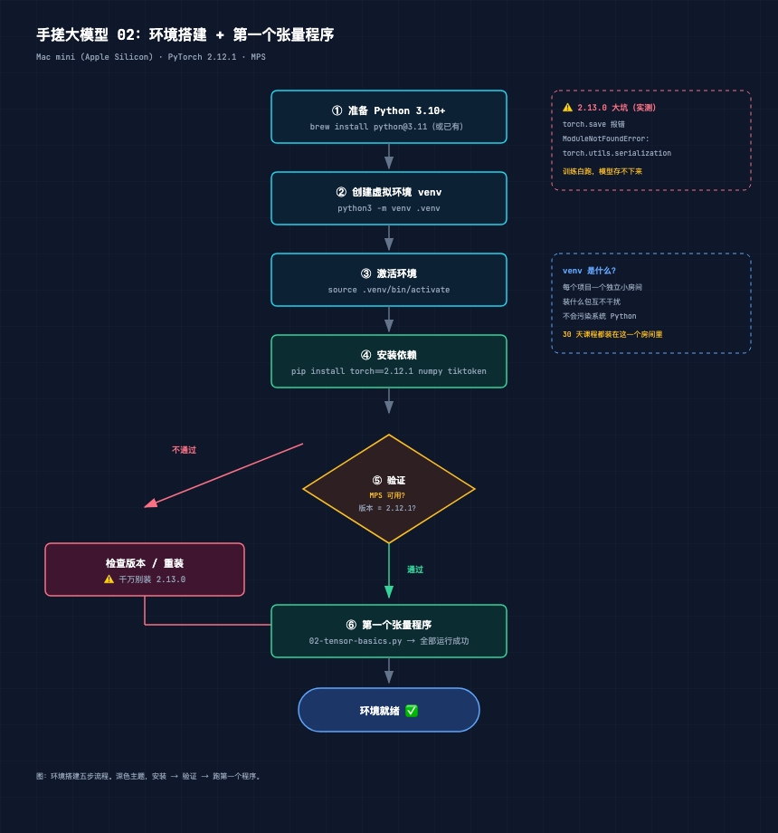
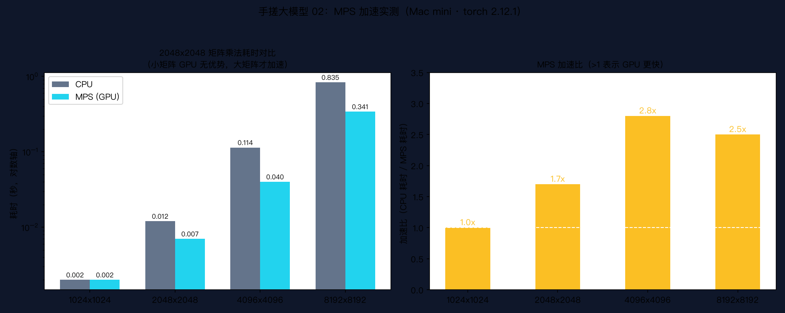

# 手搓大模型 02：环境搭建 + 第一个张量程序

> 本节代码：✅ 见 `code/`（02-tensor-basics.py 主程序 + 02-mps-benchmark.py 基准 + 02-benchmark-chart.py 画图）
>
> 本系列《手搓大模型：从零构建 NanoGPT》的第二课。
> 目标读者：零基础。会一点 Python 基本语法（变量、列表、for 循环）就够了。

先看一段真实输出。它来自本系列课程用的那台 Mac mini，是"第一个张量程序"跑出来的最后几行：

```
MPS (Apple 芯片 GPU) 可用: True
CPU  矩阵乘法 2048x2048: 0.012 秒
MPS  矩阵乘法 2048x2048: 0.007 秒
加速比: 1.7x
torch 版本: 2.12.1
版本检查通过 ✅
```

短短几行里藏着今天要说的三件事：

- **MPS 是什么**：Mac 上那块 GPU 的官方名字，深度学习用它加速
- **矩阵乘法**：整个 GPT 最核心的计算，没有之一，后面 28 课全在算它
- **版本号 2.12.1**：一个必须盯死的数字，差一个小版本，训练可能白跑

今天这课的任务，就是把环境搭好，让这台电脑能算深度学习。

---

## 先给结论：环境搭建就 3 条命令

先别被"环境搭建"四个字吓到。整套环境，浓缩成三条命令：

```bash
python3 -m venv .venv              # ① 创建独立环境
source .venv/bin/activate          # ② 激活它
pip install torch==2.12.1 numpy tiktoken   # ③ 装三个包
```

第一条命令要解释一下：`python3 -m venv .venv` 的意思是"用 Python 自己（-m）调用 venv 模块，在当前目录创建一个叫 .venv 的虚拟环境"。装完这三个包，环境就算搭好了。

为什么只有三个包？因为整个 30 天课程，从零手搓 GPT，只依赖这三样：

| 包 | 干什么的 | 什么时候用 |
|---|---|---|
| torch | 张量计算 + 神经网络（PyTorch） | 每一课 |
| numpy | 数值计算（老牌数学库） | 数学课、数据预处理 |
| tiktoken | OpenAI 的官方分词器 | 第 13/20 课 |

记住：**深度学习项目的依赖，少到令人发指。** 一个大模型项目的核心依赖，往往比一个普通网页项目还少。

## 动机：直接装不行吗？为什么非要 venv

有人会问：为什么不直接 `pip install torch` 装到系统里？省事多了。

问题是"装到系统里"会出事。假设系统 Python 里已经装了一个 torch 2.0（某个旧项目用的），现在这个课程要 torch 2.12.1。直接覆盖安装，旧项目可能就崩了；不覆盖，版本又对不上。

venv 就是来解决这个问题的：**给每个项目一个独立小房间**。房间里装什么版本、怎么折腾，都不影响外面的世界。这是 Python 世界几十年沉淀下来的标准做法，任何正经教程都会先来这一步。

也可以简单理解成：系统 Python 是公共食堂，venv 是自己家的小厨房。深度学习实验经常要换配方（换版本），当然得在自己家厨房折腾。

## 第一层解剖：装完怎么验证

装完三行命令，别急着写代码。先跑一句验证，确认三件事：

```bash
python -c "import torch; print(torch.__version__); print(torch.backends.mps.is_available())"
```

期望输出：

```
2.12.1
True
```

第一行是版本号，必须是 **2.12.1**。第二行 `True` 表示 MPS 可用——也就是这台 Mac 的 GPU 能被 torch 调用。如果输出 `False`，通常是 torch 版本太老或者装错了 CPU 版，检查一下是不是真的装了 2.12.1。

整个搭建流程，见这张图：



图的右侧框了两个重点：**2.13.0 的坑**（下文专门讲）和 **venv 是什么**（上文刚讲）。

## 第二层解剖：张量到底是什么

环境搭好了，第一个程序要操作的东西叫**张量**（Tensor）。这是本系列第一个必须搞懂的名词。

一句话直觉：**张量就是一个装数字的多维盒子。**

- 装 1 个数字：标量（Scalar）
- 装 1 排数字：向量（Vector），像一列队伍
- 装 1 张表格：矩阵（Matrix），像一张 Excel 表
- 装一摞表格：3 维张量，像一叠纸

所有深度学习的数据，最终都装进这种盒子里。文字、图片、声音，进模型之前全部变成数字盒子。第 1 课说过，模型不认识文字只认识数字——张量就是那个"装数字"的标准容器。

GPT 里的数据长什么样？后面会反复看到这个形状：

```
[batch, seq_len, dim] = [4, 8, 384]
```

意思是一批（batch）4 段文字，每段 8 个 token，每个 token 用一个 384 维的向量表示。这个形状从第 11 课开始会反复出现，今天先混个脸熟。

数学上，张量不过是"多维数组"的学名。有高中数学基础就够了：一维是数列，二维是矩阵，三维就是矩阵叠矩阵。没有更多花样。

## 第三层解剖：MPS 是什么，为什么能加速

MPS = Metal Performance Shaders，是苹果给自家 GPU 写的计算框架。说人话：**Mac 里的显卡，在深度学习里叫 MPS。**

一块 GPU 为什么能加速？因为 GPU 里有几千个"小计算器"，可以同时算几千个乘法。而矩阵乘法（也就是 GPT 的核心计算）正好是"一堆乘法各算各的、互不干扰"，天生适合 GPU。

类比：CPU 是一个特别聪明的厨师，什么菜都会做，但一次只能做一道；GPU 是一千个只会做固定菜的帮厨，一次能做一千道，但只会那几道。深度学习恰好就是"那几道菜"，所以 GPU 完胜。

但这有个隐藏前提：**活儿要够多，GPU 才划算。** 如果只做一道菜，叫一千个帮厨的启动成本，比一个厨师直接做完还慢。这就是后面实验会看到的真实现象。

## 代码层：第一个张量程序

下面是今天唯一要跑的完整程序，保存为 `02-tensor-basics.py`：

```bash
python 02-tensor-basics.py
```

```python
import torch
import time

# 1. 张量：装数字的多维盒子
scalar = torch.tensor(7)                    # 标量：一个数
vector = torch.tensor([1, 2, 3])            # 向量：一排数
matrix = torch.tensor([[1, 2, 3], [4, 5, 6]])  # 矩阵：一张表格
tensor_3d = torch.zeros(4, 8, 384)          # 3 维：一摞表格（GPT 输入的形状）
print("标量:", scalar, "| 形状:", scalar.shape)
print("矩阵形状:", matrix.shape)
print("3 维张量形状 (batch, seq, dim):", tensor_3d.shape)

# 2. 设备：代码在哪里算
print("MPS 可用:", torch.backends.mps.is_available())
cpu_tensor = torch.randn(1000, 1000)        # CPU 上创建一个随机张量
print("CPU 张量设备:", cpu_tensor.device)
mps_tensor = cpu_tensor.to("mps")           # 搬到 GPU 上
print("MPS 张量设备:", mps_tensor.device)

# 3. 真实计算：大矩阵乘法 CPU vs MPS
size = 2048
a_cpu, b_cpu = torch.randn(size, size), torch.randn(size, size)
t0 = time.time(); _ = a_cpu @ b_cpu         # @ 是矩阵乘法运算符
cpu_time = time.time() - t0
a_mps, b_mps = a_cpu.to("mps"), b_cpu.to("mps")
torch.mps.synchronize()                     # 等 GPU 真正算完（GPU 是异步的）
t0 = time.time(); _ = a_mps @ b_mps
torch.mps.synchronize()
mps_time = time.time() - t0
print(f"CPU 矩阵乘法: {cpu_time:.3f}s | MPS: {mps_time:.3f}s | 加速比: {cpu_time/mps_time:.1f}x")
```

几个细节值得停下来看：

- `torch.randn(1000, 1000)`：生成一个 1000×1000 的随机张量，数字服从标准正态分布（大部分在 -1 到 1 之间）。`randn` = random normal
- `.to("mps")`：把张量从内存搬到显存。注意**两个张量要放同一个设备才能运算**，CPU 的和 GPU 的不能直接相加——这是新手最常见的报错来源
- `torch.mps.synchronize()`：GPU 是异步的，命令发出去就返回，不等算完。要测真实耗时，必须手动等它同步。忘了这行，测出来的时间会严重偏小
- `@` 符号：Python 里矩阵乘法的运算符。`a @ b` 就是 a 乘以 b，一个符号搞定

## 实验层：真实输出

上面程序在本机（Mac mini，Apple Silicon）的实际输出：

```
标量: tensor(7) | 形状: torch.Size([])
矩阵形状: torch.Size([2, 3])
3 维张量形状 (batch, seq, dim): torch.Size([4, 8, 384])
MPS 可用: True
CPU 张量设备: cpu
MPS 张量设备: mps:0
CPU 矩阵乘法: 0.012s | MPS: 0.007s | 加速比: 1.7x
```

注意 `shape` 里有个 `torch.Size([2, 3])`——它读作"2 行 3 列"。PyTorch 里一切形状都这么表示。

只看一次 2048 的矩阵乘法，加速比只有 1.7 倍，好像不惊艳。把规模从小到大各跑一遍，看趋势（这是真实数据，matplotlib 画的）：



左图是耗时（对数轴），右图是加速比。两个信息：

1. **规模越大，GPU 优势越明显**。1024 时两边打平，4096 时 MPS 快 2.8 倍。GPU 的几千个"帮厨"要喂饱才划算
2. **小矩阵反而没用**。1024×1024 时 GPU 和 CPU 一样快，甚至第一次调用会更慢——启动几千个并行单元的开销比计算本身还大

这就是为什么深度学习训练要"喂大批量"：不只是为了收敛稳定，还因为 GPU 只有吃大活儿才显本事。

完整基准脚本（`02-mps-benchmark.py`）实测输出：

```
规模 |     CPU(s) |     MPS(s) |      加速比
--------------------------------------------------
  1024x1024   |      0.002 |      0.002 |     1.0x
  2048x2048   |      0.012 |      0.007 |     1.7x
  4096x4096   |      0.114 |      0.040 |     2.8x
  8192x8192   |      0.835 |      0.341 |     2.5x
```

## 误区与彩蛋

**误区 1：torch 版本别乱升。** 这是本课程环境里最大的一个坑：**torch 2.13.0 有 torch.save 的 bug**，训练跑完保存模型时会报 `ModuleNotFoundError: torch.utils.serialization`。训练几个小时，模型存不下来，全白跑。所以全系列锁死 2.12.1，装的时候 `torch==2.12.1` 那个 `==` 不能省。

**误区 2：GPU 一定比 CPU 快？** 刚看过数据——不一定。小任务 GPU 无优势，甚至更慢。判断标准不是"用了 GPU 就快"，而是"计算量大不大"。这也是为什么很多人跑小 demo 时感觉不到加速。

**误区 3：MPS 和 CUDA 不一样。** 网上教程 90% 是 NVIDIA 显卡 + CUDA 写的。Mac 上没有 CUDA，用的是 MPS。很多教程代码里 `tensor.cuda()` 在 Mac 上会直接报错，改成 `tensor.to("mps")` 就行。后面课程里的代码都会写成 Mac 能跑的版本。

**彩蛋：为什么 GPT 训练"看起来慢"？** 本系列的 baby GPT 有 1065 万参数，在这台 Mac mini 上每步约 0.79 秒，5000 步大约 1.5-2 小时。这个速度放在 GPU 集群（A100）上，同样的模型可能只要几分钟。但没关系——本系列的目标是"看懂 + 能跑"，不是"跑得飞快"。一台 Mac mini 足够完成全部 30 课实验，这是刻意选的环境：**零门槛，人人都能复现。**

---

下一课开始进入数学地基：线性代数和微积分。但只讲直觉，不讲公式推导。比如矩阵乘法，会用"批量映射"的视角重新看一遍——那正是 GPT 内部每天都在做的事。

*手搓大模型，第 2 课完成。环境已就绪，张量已上手。*
