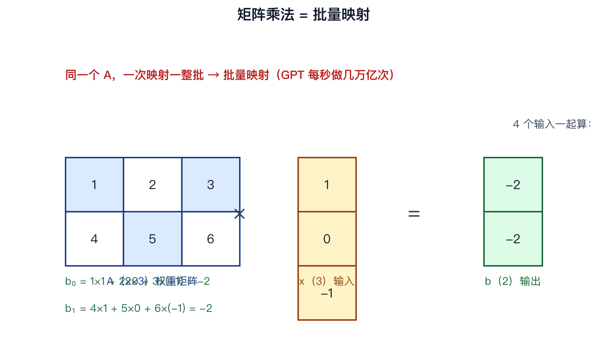
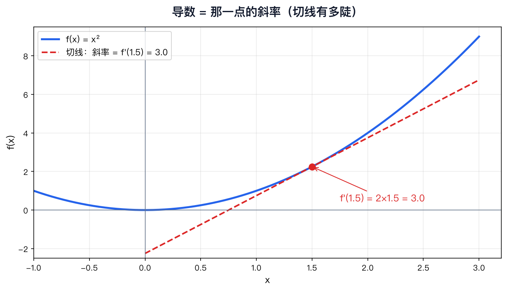

# 03 数学地基上：线代 + 微积分直觉

> 本节代码：✅ 见 `code/`（`03-math-intuition.py` 主程序，`03-make-charts.py` 配图生成脚本）

《手搓大模型：从零构建 NanoGPT》第三课。数学忘光了也没关系——这一课只讲直觉，不讲公式推导。

**一句话总结：** GPT 内部 99% 的计算是矩阵乘法；训练靠导数（斜率）；反向传播是链式法则。这三样，就是后面 27 课全部数学的 90%。

## 三句话结论

- **矩阵乘法 = 批量映射**：一个数字格子，把一大排数字同时变成另一大排数字。
- **导数 = 斜率**：函数曲线在某个点有多陡，就是那个点的导数。
- **链式法则 = 一层层拆**：复合函数求导，从外到内一层层乘起来。

## 第一层：矩阵乘法 = 批量映射

**矩阵（Matrix）= 一张数字表格**（如 2×3 矩阵 A）；**向量（Vector）= 一列（或一排）数字**（如 3 维向量 x）。

乘法规则只有一条：A 的每一行，和 x 的每一行，对应相乘再相加：

```
b₀ = 1×1 + 2×0 + 3×(-1) = -2
b₁ = 4×1 + 5×0 + 6×(-1) = -2
```



关键视角是"批量映射"：同一个 A，可以同时作用在一批 x 上（4×3 @ 3×2 = 4×2）。GPU 之所以快，就是因为能一次算一整批。GPT 里每个词是向量，几十个词的向量摞在一起和权重矩阵一乘，一次完成——这就是 GPT 每秒做几万亿次矩阵乘法的样子。

## 第二层：导数 = 斜率

直线有多陡用**斜率**描述。曲线不是直线，每一点的陡度不一样：**导数 = 曲线在某一点的切线斜率**。以 f(x) = x² 为例，f'(x) = 2x。



训练的本质是调整参数让 loss 变小：**往导数下降的方向走**。曲线往上爬方向导数为正，往下坡方向导数为负；要让函数值变小，就顺着导数相反方向迈一小步。

## 第三层：链式法则 = 一层层拆

**复合函数 = 套娃函数**，如 f(x) = (3x + 2)²：先算内层 u = 3x + 2，再算外层 y = u²。

**复合函数求导 = 每一层的导数乘起来：**

```
df/dx = (dy/du) × (du/dx) = 2u × 3 = 6(3x + 2)
```

**神经网络 = 一堆套娃函数。** 最简单的两层网络（第 1 层 u = 3x + 2，第 2 层 y = u²）的梯度从 y 出发往回传，一层层传回 x——这就是"反向传播"的全部秘密：它就是链式法则。

## 代码

```bash
python 03-math-intuition.py
```

完整程序见 [`code/03-math-intuition.py`](code/03-math-intuition.py)（20 多行，把三个概念全部跑一遍）。

## 真实输出（Mac mini / Apple Silicon / torch 2.12.1）

```
1. 矩阵乘法 = 批量映射
A @ x = [-2.0, -2.0]
批量输入形状: (4, 3) → 输出形状: (4, 2)
GPT 输入形状: (4, 8, 384) → 乘权重后: (4, 8, 128)

2. 导数 = 斜率
x=1.0: 数值导数≈2.0000  解析 2x=2.0
x=2.0: 数值导数≈4.0000  解析 2x=4.0
x=3.0: 数值导数≈6.0000  解析 2x=6.0

3. 链式法则：一层层拆
x=0.5: 数值≈21.0000  链式法则公式=21.0000  一致=True
x=1.5: 数值≈39.0000  链式法则公式=39.0000  一致=True
```

三个细节：

1. 矩阵乘法没有魔法，就是"对应乘、再相加"，和手算完全一致。
2. 数值求导（附近两点连线近似切线）和公式误差 < 1e-4。以后遇到不知道怎么求导的函数，直接数值近似——深度学习里经常这么干（梯度检查，第 7 课用到）。
3. 链式法则公式与数值分毫不差。

## 误区与彩蛋

- **误区 1**：矩阵乘法不用背"前行乘后列"，torch 里一个 `@` 全搞定，重要的是"批量映射"视角。
- **误区 2**：导数先是一个几何事实（切线多陡），公式只是快捷方式。
- **误区 3**：链式法则是 17 世纪的微积分常识，神经网络只是把它用到极致。反向传播 = 链式法则。
- **彩蛋**：GPT-2 生成一个 token 要做**几亿次**矩阵乘法单元运算，而基础就是这张 2×3 格子图。

## 环境

Mac mini（Apple Silicon / MPS）+ PyTorch 2.12.1（注意 2.13.0 有 torch.save bug，请勿使用）。

参考实现：nanoGPT（https://github.com/karpathy/nanoGPT）

**系列仓库：** https://github.com/flyingcloud-code/learning-nanogpt-from-0-to-1
