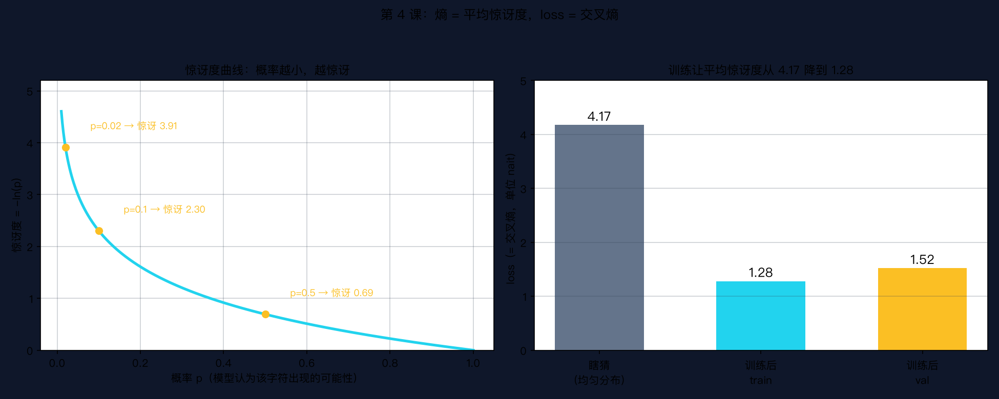

# 手搓大模型 04：数学地基下——概率+信息论

> 本节代码：✅ 见 `code/`（04-prob-info.py 主程序 + 04-make-charts.py 画图）
>
> 本系列《手搓大模型：从零构建 NanoGPT》的第四课。
> 目标读者：零基础。上一课讲完了矩阵乘法和微积分，这一课把最后一块数学地基补齐：概率和信息论。

先看一组数字。第 1 课训练模型时，loss 从 4.27 一路降到 1.28。当时只说"loss 越小越好"，没解释它到底是什么。这一课把它彻底讲清楚：

- **loss = 交叉熵 = 模型的平均惊讶度**
- **4.27 是什么水平？** 65 个字符瞎猜（均匀分布）的熵是 ln(65) ≈ 4.17。模型起步 4.27，比瞎猜还差一点。
- **1.28 是什么水平？** 平均惊讶度 e^1.28 ≈ 3.6，也就是模型平均只在 3.6 个字符里纠结，而不是 65 个。

训练的本质，就是让模型的"平均惊讶度"不断下降。这一课把这句话拆开，每一层都讲明白。

---

## 先给结论：三句话

- **分布（distribution）= 每个可能性各占多少概率。** 一句话里每个字符出现的可能性，就是一个分布。
- **熵（entropy）= 一个分布的平均惊讶度。** 越平均越难猜，熵越大；越确定越好猜，熵越小。
- **交叉熵（cross-entropy）= 用模型的预测去猜真实世界的平均惊讶度。** GPT 训练时用的 loss，就是这个数。

再加一条 KL 散度：**因为猜错，多付的那部分惊讶。** 它是交叉熵减去熵的差值。

## 动机：没有它行不行

第 1 课开始，loss 这个数字就反复出现：4.27、1.90、1.28。训练时盯着它，调参时看它，断点续训还是它。但"loss 是什么"一直没有正面回答——第 3 课讲矩阵和导数时，也只说"训练让 loss 变小"。

现在必须正面回答，因为后面所有课都绕不开它：第 8 课专门讲 Loss 与收敛，第 12 课讲语言模型训练目标，第 24 课实战训练时盯着 loss 曲线看。如果不知道 loss 是什么，后面全是空中楼阁。

答案是：**loss 是一个平均惊讶度。** 这是整个信息论送给机器学习最值钱的一句话。

## 第一层解剖：分布 = 每个可能性的概率

### 概率是什么

**概率（probability）= 一件事发生的可能性，0 到 1 之间。** 掷硬币正面朝上概率 0.5；明天下雨概率 0.3；太阳从东边升起概率接近 1。

### 分布是什么

**分布 = 把"所有可能"的概率都列出来。** 一个简化版的莎士比亚世界只有 2 个字符 'a' 和 'b'：

```
分布 1：p = [0.5, 0.5]    → 完全猜不到下一个是啥
分布 2：p = [0.9, 0.1]    → 九成是 'a'，基本猜得到
分布 3：p = [1.0, 0.0]    → 永远是 'a'，毫无悬念
```

GPT 做的事情，就是给每个位置输出一个分布：下一个字符是 'a' 的概率 0.1、是 'b' 的概率 0.05……一共 65 个数，加起来等于 1。**模型输出的不是字符，是一个分布。**

## 第二层解剖：熵 = 平均惊讶度

### 惊讶度是什么

看到一件事发生，如果它概率高，就"不惊讶"；概率低，就"很惊讶"。这个直觉量化成公式：

```
惊讶度 = -ln(p)
```

- p = 0.5：惊讶度 -ln(0.5) ≈ 0.69
- p = 0.1：惊讶度 -ln(0.1) ≈ 2.30
- p = 0.02：惊讶度 -ln(0.02) ≈ 3.91

为什么是 ln？只需要知道一条：**概率越小，负数对数越大，惊讶度越高。** 具体曲线长这样：



左图那条青色曲线就是惊讶度：横轴是模型给的概率 p，纵轴是看到它发生时的惊讶度。概率 0.5 时只有 0.69，概率 0.02 时飙到 3.91。

### 熵 = 惊讶度的平均值

**熵 = 把分布里每个事件的惊讶度，按概率加权平均。** 公式长这样：

```
熵 H = -Σ pᵢ · ln(pᵢ)
```

读法：把每个可能字符 i 的概率 pᵢ 乘上它的惊讶度 -ln(pᵢ)，全部加起来。直觉：**这个分布平均下来，每次会让人惊讶多少。**

验证三个直觉：

- p = [0.5, 0.5]：熵 0.6931。两种可能五五开，每次都猜不准，惊讶最多。
- p = [0.9, 0.1]：熵 0.3251。九成是 'a'，大部分时候猜得到，惊讶少。
- p = [1.0, 0.0]：熵 0。永远不变，零惊讶。

所以：**熵不是"混乱程度"，而是"平均惊讶度"。** 均匀分布熵最大，确定性分布熵为 0。

## 第三层解剖：交叉熵 = loss 的源头

### 两个分布的故事

真实世界有自己的分布 p（莎士比亚文本里每个字符真实出现的频率）。模型输出的分布是 q。模型 q 猜得准不准，用交叉熵衡量：

```
交叉熵 H(p, q) = -Σ pᵢ · ln(qᵢ)
```

对比熵的公式，唯一的差别：**真实概率 pᵢ 照旧，但惊讶度用模型给出的 qᵢ 来算。** 直觉：**用模型 q 的概率去猜真实世界 p，平均每次会惊讶多少。**

### 模型猜得越好，交叉熵越小

还是那个 2 字符世界，真实分布 p = [0.9, 0.1]（'a' 出现九成）：

- 模型 q = [0.85, 0.15]（猜得准）：交叉熵 0.3360，只比真实熵 0.3251 多一点点。
- 模型 q = [0.10, 0.90]（完全猜反）：交叉熵 2.0829，惊讶翻了好几倍。

**交叉熵永远 ≥ 熵。** 只有当模型 q 完全等于真实 p 时，交叉熵才等于熵。这个"永远多付一点"的性质，就是 KL 散度：

```
KL(p ‖ q) = 交叉熵 - 熵 = 因为猜错多付的平均惊讶
```

- 猜得准：KL = 0.0109（几乎没多付）
- 猜反了：KL = 1.7578（多付了一大截）

## 代码层：最小可运行程序

下面这个程序 30 多行，把熵、交叉熵、KL 散度全部算一遍，最后回到 GPT 的 loss。保存为 `04-prob-info.py`：

```bash
~/projects/main-agent/nanoGPT/.venv/bin/python 04-prob-info.py
```

```python
import numpy as np

print("=" * 62)
print("1. 熵 H = 平均惊讶度（一个分布本身有多不确定）")
print("=" * 62)

# 一个只有 2 个字符的世界（简化版莎士比亚：'a' 和 'b'）
def entropy(p):
    """p 是概率数组，返回熵（nait，自然对数单位）。
    约定 0*ln(0) = 0：概率为 0 的事件从不发生，不贡献惊讶度。"""
    p = np.asarray(p, dtype=float)
    p = p[p > 0]                      # 丢掉概率为 0 的项（0*ln0 无意义）
    h = -np.sum(p * np.log(p))
    return h + 0.0                    # 熵 ≥ 0，+0.0 把 -0.0 归正（max 对负零无效）

# 分布 1：一半一半 → 完全猜不到 → 熵最大
p_even = np.array([0.5, 0.5])
# 分布 2：九成是 'a' → 基本能猜到 → 熵小
p_skew = np.array([0.9, 0.1])
# 分布 3：永远是 'a' → 毫无悬念 → 熵为 0
p_certain = np.array([1.0, 0.0])

print(f"p=[0.5, 0.5]   熵 H = {entropy(p_even):.4f}   （越平均越难猜）")
print(f"p=[0.9, 0.1]   熵 H = {entropy(p_skew):.4f}   （基本猜得到，惊讶少）")
print(f"p=[1.0, 0.0]   熵 H = {entropy(p_certain):.4f}  （永远不变，零惊讶）")

print()
print("=" * 62)
print("2. 交叉熵 H(p,q) = 用模型 q 猜真实世界 p 的平均惊讶度")
print("=" * 62)

# 真实世界 p：'a' 出现 90%
p_true = np.array([0.9, 0.1])
# 两个候选模型 q
q_good = np.array([0.85, 0.15])   # 猜得挺准
q_bad = np.array([0.1, 0.9])      # 完全猜反

def cross_entropy(p, q):
    return -np.sum(p * np.log(q))

print(f"q 猜得准 (0.85, 0.15): 交叉熵 = {cross_entropy(p_true, q_good):.4f}")
print(f"q 猜反了   (0.10, 0.90): 交叉熵 = {cross_entropy(p_true, q_bad):.4f}")
print(f"真实世界自身 p 的熵:      H(p)   = {entropy(p_true):.4f}   ← 交叉熵的下限")

print()
print("=" * 62)
print("3. KL 散度 = 交叉熵 - 熵 = 因为猜错多付的惊讶")
print("=" * 62)

for name, q in [("猜得准", q_good), ("猜反了", q_bad)]:
    kl = cross_entropy(p_true, q) - entropy(p_true)
    print(f"{name} (q={q.tolist()}): KL = {kl:.4f}  （交叉熵比下限多出的部分）")

print()
print("=" * 62)
print("4. 回到 GPT：loss 就是交叉熵（nait 单位）")
print("=" * 62)

V = 65  # 莎士比亚数据集词表大小（第 1 课验证过）
print(f"词表大小 V = {V}")
print(f"瞎猜的熵   = ln({V}) = {np.log(V):.4f}  （均匀分布，loss 起点）")
print(f"训练 300 步 loss ≈ 4.27（比瞎猜还高，说明一开始连均匀都不如）")
print(f"训练 1000 步 loss = 1.28 → 平均惊讶度 e^1.28 = {np.exp(1.28):.2f}")
print(f"含义：模型平均只需在 {np.exp(1.28):.1f} 个字符里纠结，而不是 65 个")
print()
print("loss 数值越小 = 平均惊讶度越小 = 模型越会猜下一个字符")
```

## 实验层：真实输出

以上程序在 Mac mini 上的真实输出（一字未改）：

```
==============================================================
1. 熵 H = 平均惊讶度（一个分布本身有多不确定）
==============================================================
p=[0.5, 0.5]   熵 H = 0.6931   （越平均越难猜）
p=[0.9, 0.1]   熵 H = 0.3251   （基本猜得到，惊讶少）
p=[1.0, 0.0]   熵 H = 0.0000  （永远不变，零惊讶）

==============================================================
2. 交叉熵 H(p,q) = 用模型 q 猜真实世界 p 的平均惊讶度
==============================================================
q 猜得准 (0.85, 0.15): 交叉熵 = 0.3360
q 猜反了   (0.10, 0.90): 交叉熵 = 2.0829
真实世界自身 p 的熵:      H(p)   = 0.3251   ← 交叉熵的下限

==============================================================
3. KL 散度 = 交叉熵 - 熵 = 因为猜错多付的惊讶
==============================================================
猜得准 (q=[0.85, 0.15]): KL = 0.0109  （交叉熵比下限多出的部分）
猜反了 (q=[0.1, 0.9]): KL = 1.7578  （交叉熵比下限多出的部分）

==============================================================
4. 回到 GPT：loss 就是交叉熵（nait 单位）
==============================================================
词表大小 V = 65
瞎猜的熵   = ln(65) = 4.1744  （均匀分布，loss 起点）
训练 300 步 loss ≈ 4.27（比瞎猜还高，说明一开始连均匀都不如）
训练 1000 步 loss = 1.28 → 平均惊讶度 e^1.28 = 3.60
含义：模型平均只需在 3.6 个字符里纠结，而不是 65 个

loss 数值越小 = 平均惊讶度越小 = 模型越会猜下一个字符
```

三个值得留意的细节：

1. **熵的单位是 nait（自然对数单位）。** 用 ln 算出来就叫 nait；用 log₂ 算出来叫 bit（比特）。GPT 的 loss 用 nait。1 bit ≈ 0.693 nait，同一个信息两种说法。
2. **交叉熵永远 ≥ 熵。** 猜得准的模型 0.3360 贴着下限 0.3251，猜反的模型 2.0829 远远偏离。loss 再怎么降，也不可能低于真实数据本身的熵——这是理论的底线。
3. **"瞎猜"不是 0，是 4.17。** 65 个字符均匀分布，平均惊讶度 4.17。所以第 1 课的初始 loss 4.27 意味着：刚初始化的模型，比"完全瞎猜"还要差一点点。训练 1000 步降到 1.28，模型平均只在 3.6 个字符里犹豫。

## 误区与彩蛋

**误区 1：熵是"混乱程度"？**
常见的说法，但容易误导。熵的准确定义是**平均惊讶度**。"混乱"只是它的一个推论：越混乱越难猜，越难猜越惊讶。回到 GPT：loss 1.28 不是说"模型混乱"，而是说"模型对每个位置平均惊讶 1.28 nait"，也就是平均在 3.6 个候选里挑。

**误区 2：loss 越低越好，无限低更好？**
不是。loss 有下限：真实数据本身的熵。莎士比亚文本再完美也做不到 0 loss，因为下一个字符天然有不确定性。低于这个底线只有两种可能：过拟合（把训练集背下来了，第 10 课讲）或者数据有问题。看到离谱低的 loss，先怀疑。

**误区 3：交叉熵是 GPT 专用？**
不是。交叉熵是 1948 年香农信息论的老概念，比 GPT 早 70 年。机器学习只是把它借来当训练目标：**让模型的预测分布尽量贴近真实分布。** 分类问题、语言模型、推荐系统，用的都是它。

**彩蛋：loss 1.28 的另一种读法。**
第 1 课里模型训练到 1000 步，loss 1.28。它等价于说：**每生成一个字符，模型平均只需在 3.6 个候选字符里纠结。** 从"65 选 1"到"3.6 选 1"，这就是 1000 步训练的全部成果。后面第 8 课会专门讲怎么读 loss 曲线、学习率怎么影响它；第 12 课会把"next token prediction"和今天的内容接上。

---

下一课把这些数学真正用起来：用 NumPy 从零手写线性回归 + 梯度下降，第一次亲手把 loss 从高处一路降下来。那将是系列里第一段"训练"代码。

*手搓大模型，第 4 课完成。概率、熵、交叉熵、KL 散度，数学地基封顶。*

---

**本课完整代码与全文已开源到 GitHub（public）：**

https://github.com/flyingcloud-code/learning-nanogpt-from-0-to-1/tree/main/04-probability-information

**系列仓库（30 课陆续更新中）：**

https://github.com/flyingcloud-code/learning-nanogpt-from-0-to-1
