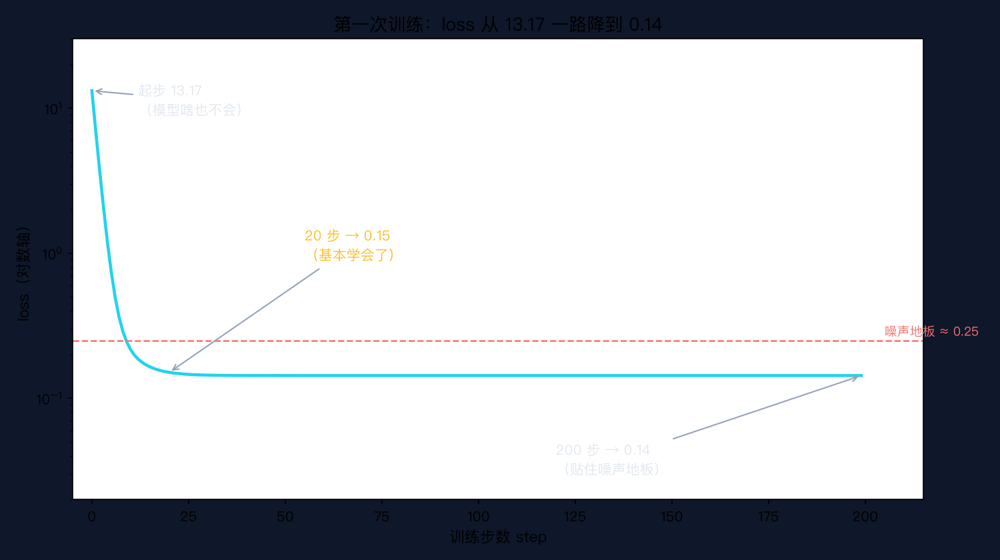
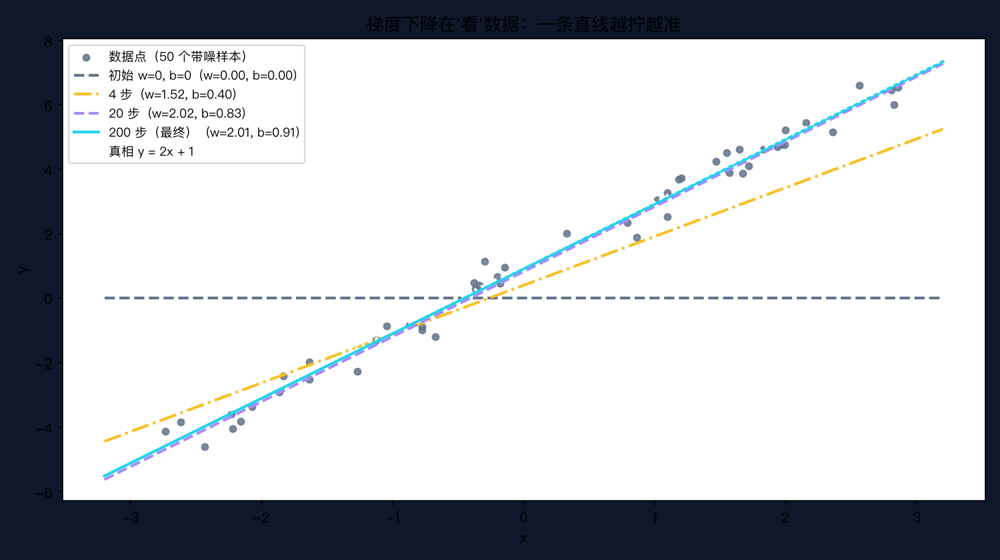

# 手搓大模型 05：第一次训练——NumPy 手写线性回归 + 梯度下降

> 本节代码：✅ 见 `code/`（05-linear-regression.py 主程序 + 05-make-charts.py 画图 + 05-lr-experiment.py 学习率实验）
>
> 本系列《手搓大模型：从零构建 NanoGPT》的第五课。
> 目标读者：零基础。前三课把矩阵、导数、概率铺完，这一课终于动手：第一次亲手训练一个模型。

先看一组真实数字。第一次训练，loss 从 **13.17** 一路跌到 **0.14**；只用了 **20 步**，一条直线就自己学会了 `y = 2x + 1`；更离谱的是，模型从没见过 `x = 10`，却能算出 `y ≈ 21.02`（真相是 21.0）。

这一课全部训练代码只有 **6 行**。没有用任何"机器学习库"，就是乘、加、平均——小学算数级别。

而且：GPT 的训练，骨架和这 6 行一模一样。

## 先给结论：三句话

- **训练 = 算误差 + 往误差变小的方向挪参数，反复做。**
- **挪的方向由梯度（误差的斜率）决定，步子大小由学习率决定。**
- **今天这条直线学会 2x+1 的方式，就是 GPT 学会莎士比亚的方式——规模不同，骨架相同。**

## 动机：没有它行不行

前 4 课全是地基：矩阵、导数、概率、交叉熵。每课结尾都说"后面训练要用"，但"训练"本身长什么样，一直没有正面演示。名词堆了四课，再不落地就成空中楼阁了。

第 1 课里 GPT 训练时 loss 从 4.27 降到 1.28，那个"训练"到底在干什么？这一课用最小模型完整演一遍：**一条直线，50 个带噪声的点，让模型自己找到规律。**

看懂这条直线怎么学会 2x+1，就看懂了 GPT 怎么学会莎士比亚。

## 第一层解剖：把"学习"翻译成数字游戏

### 模型 = 一条线

最简单的模型：`y_hat = w * x + b`。`w` 是斜率（线有多斜），`b` 是截距（线在哪里穿过纵轴），`y_hat` 是模型的预测值。

训练前，模型对世界一无所知：`w = 0, b = 0`，画出来是一条贴在横轴上的水平线，预测永远是 0。

### 误差 = 预测 - 真相

对每个样本，模型有个预测 `y_hat`，数据里有真实答案 `y`。两者的差就是误差：

```
误差 diff = y_hat - y
```

误差为正，说明预测高了；为负，说明预测低了。**训练的每一步，都是在缩小这一堆误差。**

### loss = 平均误差平方（MSE）

一堆误差怎么变成一个数字？直接平均会出问题：误差有正有负，正负抵消后平均可能接近 0，看起来"挺准"，其实差得离谱。所以平方后再平均：

```
loss = mean(diff²)   （MSE = Mean Squared Error，平均误差平方）
```

平方有两个作用：一是把所有误差变成正数，不会抵消；二是把大误差放得更大——差 1 的误差贡献 1，差 3 的误差贡献 9，模型会优先消灭大误差。

手算一遍：假设只有 2 个样本 `(x=1, y=3)` 和 `(x=2, y=5)`（干净数据，正好是 2x+1）。初始 `w=0, b=0`：

| 样本 | x | 真相 y | 预测 y_hat | 误差 diff | diff² |
|---|---|---|---|---|---|
| 1 | 1 | 3 | 0 | -3 | 9 |
| 2 | 2 | 5 | 0 | -5 | 25 |

```
loss = (9 + 25) / 2 = 17
```

模型预测全是 0，loss 高达 17。接下来的问题：**参数 w、b 怎么动，loss 才会变小？**

## 第二层解剖：梯度 = 误差的斜率

第 3 课讲过：**导数 = 斜率 = "参数动一点点，loss 动多少"。** 现在用上。

loss 对 w 的梯度：

```
grad_w = mean(2 * diff * x)
```

直觉拆开看每个符号：

- `diff`：误差。误差越大，说明这条线偏得越远，w 需要动得越多。
- `x`：对 w 来说，误差还要乘上 x——x 越大，w 对预测的影响越大，责任越大。
- `2`：来自平方求导（`(diff²)' = 2·diff`），就是个常数倍数，不用纠结。
- `mean`：把所有样本的意见平均一下，免得单个点带偏。

loss 对 b 的梯度同理，只是 b 不乘 x（b 是常数项）：

```
grad_b = mean(2 * diff)
```

接着手算上面 2 个样本，初始 `w=0, b=0`：

```
diff = [-3, -5]
grad_w = mean(2 * diff * x) = (2·(-3)·1 + 2·(-5)·2) / 2 = (-6 - 20) / 2 = -13
grad_b = mean(2 * diff)     = (-6 - 10) / 2 = -8
```

梯度是 **-13** 和 **-8**：说明 w 每增加 1，loss 大约要涨 13；反过来，**w 减小，loss 才会降**。这就是下山的方向。

## 第三层解剖：下山

梯度指向"loss 上升最快"的方向。想下降，就往反方向走：

```
w -= lr * grad_w
b -= lr * grad_b
```

`lr` 是**学习率（learning rate）**，控制每一步迈多大。`lr = 0.05` 就是每次只走梯度的 5%。

继续手算，取 `lr = 0.05`：

```
w = 0 - 0.05 · (-13) = 0.65
b = 0 - 0.05 · (-8)  = 0.40
```

验证一下：新线 `y = 0.65x + 0.40`，对样本 1 预测 `0.65·1 + 0.40 = 1.05`（真相 3，比之前的 0 近了）；样本 2 预测 `0.65·2 + 0.40 = 1.70`（真相 5，也近了）。**一步之后，两个预测都朝着真相挪了。**

这就是梯度下降：**看着脚下最陡的方向，迈一小步，反复做。** 和下山走法一模一样。

## 代码层：6 行核心

完整程序 `05-linear-regression.py`，保存后直接运行：

```bash
~/projects/main-agent/nanoGPT/.venv/bin/python 05-linear-regression.py
```

```python
import numpy as np

# ---------- 1. 造一份"真实世界"的数据 ----------
rng = np.random.default_rng(42)          # 固定随机种子，结果可复现
N = 50                                   # 50 个样本
x = rng.uniform(-3, 3, N)                # 输入 x：-3 到 3 均匀分布
true_w, true_b = 2.0, 1.0                # 世界的真实参数（模型不知道）
y = true_w * x + true_b + rng.normal(0, 0.5, N)   # y = 2x+1 + 噪声

# ---------- 2. 模型与参数 ----------
w = 0.0                                  # 斜率，初始全猜 0
b = 0.0                                  # 截距，初始全猜 0
lr = 0.05                                # 学习率：每次下山迈多大步子
steps = 200                              # 走多少步

# ---------- 3. 训练循环（核心就 6 行） ----------
losses = []                              # 记录每一步的 loss
for step in range(steps):
    y_hat = w * x + b                    # 前向：用当前参数算预测值
    diff = y_hat - y                     # 误差：预测 - 真实
    loss = np.mean(diff ** 2)            # loss = 平均误差平方（MSE）
    losses.append(loss)
    grad_w = np.mean(2 * diff * x)       # 梯度：误差乘 x 再平均
    grad_b = np.mean(2 * diff)           # 梯度：误差平均
    w -= lr * grad_w                     # 往梯度反方向走一步（下山）
    b -= lr * grad_b
    if step < 5 or step % 20 == 0:
        print(f"step {step:3d}  loss = {loss:.4f}  w = {w:+.4f}  b = {b:+.4f}")

# ---------- 4. 结果 ----------
print(f"真实参数: w = {true_w}, b = {true_b}")
print(f"学到的:   w = {w:.4f}, b = {b:.4f}")
print(f"最终 loss = {losses[-1]:.4f}（噪声 std=0.5、方差 0.25，loss 已贴住噪声地板）")
y_predict = w * 10 + b
print(f"预测 x = 10 → y ≈ {y_predict:.2f}（训练数据里根本没有 x=10，模型靠规律外推）")
print(f"如果知道真相：2*10+1 = {true_w * 10 + true_b}")
```

训练循环的核心，去掉打印只有 6 行：

```
y_hat = w * x + b        # 1. 预测
diff = y_hat - y         # 2. 误差
loss = np.mean(diff**2)  # 3. 打分
grad_w = np.mean(2*diff*x)  # 4. 算 w 的方向
grad_b = np.mean(2*diff)    # 5. 算 b 的方向
w -= lr*grad_w; b -= lr*grad_b  # 6. 下山一步
```

**没有魔法。** 所谓"训练"，就是这 6 行：预测、算差、打分、看方向、走一步、重复。

## 实验层：真实输出

以上程序在 Mac mini 上的真实输出（一字未改）：

```
==================================================================
数据：50 个样本，真相是 y = 2x + 1，观测带噪声（std=0.5）
初始参数: w = 0.0, b = 0.0  （模型猜的，啥也不知道）
初始 loss = 13.1656
==================================================================
step   0  loss = 13.1656  w = +0.5869  b = +0.1339
step   1  loss = 6.9413  w = +1.0053  b = +0.2421
step   2  loss = 3.7321  w = +1.3032  b = +0.3306
step   3  loss = 2.0697  w = +1.5151  b = +0.4039
step   4  loss = 1.2026  w = +1.6657  b = +0.4654
step  20  loss = 0.1508  w = +2.0172  b = +0.8361
step  40  loss = 0.1435  w = +2.0112  b = +0.9045
step  60  loss = 0.1434  w = +2.0102  b = +0.9132
step  80  loss = 0.1434  w = +2.0101  b = +0.9144
step 100  loss = 0.1434  w = +2.0101  b = +0.9145
step 120  loss = 0.1434  w = +2.0101  b = +0.9145
step 140  loss = 0.1434  w = +2.0101  b = +0.9145
step 160  loss = 0.1434  w = +2.0101  b = +0.9145
step 180  loss = 0.1434  w = +2.0101  b = +0.9145
==================================================================
真实参数: w = 2.0, b = 1.0
学到的:   w = 2.0101, b = 0.9145
最终 loss = 0.1434（噪声 std=0.5、方差 0.25，loss 已贴住噪声地板）
预测 x = 10 → y ≈ 21.02（训练数据里根本没有 x=10，模型靠规律外推）
如果知道真相：2*10+1 = 21.0
```

把 loss 画出来，下降过程一目了然（真实训练数据）：



对数纵轴下，曲线几乎是一条直线——**loss 在指数级下降**。头几步掉得最狠：13.17 → 6.94 → 3.73 → 2.07 → 1.20，第 4 步就只剩零头；20 步到 0.15，已经贴住地板；之后 180 步几乎没动，因为能学的都学完了。

再看直线本身是怎么"看"数据的（同样真实数据，取 0、4、20、200 步的快照）：



初始是贴在横轴上的灰线（预测全是 0）；第 4 步的橙线已经歪向数据；第 20 步的紫线基本到位；第 200 步的青线与真相（白色虚线）几乎重合。

三个值得留意的细节：

1. **初始 loss 13.17 是个"瞎猜"分数。** w=0、b=0 时，模型对 50 个点全预测 0，平均误差平方高达 13 以上。第 4 课讲过，GPT 起步时 loss 4.27 意味着"比瞎猜还差一点"；这里的 13.17 同理——什么都不学，就是这个数。
2. **20 步后 loss 就 0.15 了。** 后面的 180 步只把 0.1508 磨到 0.1434，收益极小。训练后期"磨洋工"是常态，第 8 课讲 loss 曲线时专门展开。
3. **最终 loss 0.1434 贴住了噪声地板。** 数据的噪声 std=0.5、方差 0.25，模型不可能比"真相线"更好——因为真相线本身就在噪声里。loss 到 0.14 附近就该停，再降就是在背噪声。

## 惊喜时刻

**惊喜 1：全部训练代码只有 6 行。** 没有神经网络的复杂结构、没有反向传播的大段推导，一次最简单的训练就是"预测 → 算差 → 打分 → 看方向 → 走一步"。后面所有课都是在这 6 行骨架上加肉。

**惊喜 2：20 步就学会了。** 人眼可能还没看清散点图的形状，梯度下降已经把线放到正确位置。机器学习的"快"从这里第一次有了体感——200 步全程只要几毫秒。

**惊喜 3：外推。x = 10 从未出现在训练数据里**（数据只有 -3 到 3），模型却算出 21.02。这说明它学到的是**规律**（w≈2、b≈1），而不是背下了 50 个点。GPT 写诗也是同一个机制：训练时从没"背"过那首诗，但学会了文字背后的规律，于是能生成没见过的新句子。

## 误区与彩蛋

**误区 1：梯度下降很高级？**
就是下山。每步看看脚下最陡的方向（梯度），迈一小步（学习率），重复。第 3 课的"导数 = 斜率"，今天第一次真正用上。

**误区 2：loss 越低越好，降到 0 更好？**
不行。数据里有噪声，loss 有地板——今天的地板是噪声方差 0.25 附近。真把 loss 干到 0，说明模型把噪声也背下来了（这叫**过拟合**，第 10 课专门讲）。看到离谱低的 loss，先怀疑。

**误区 3：学习率越大学得越快？**
不一定。同一份数据只改学习率，真实实验结果：

```
lr=0.05:  13.17 → 6.94 → 3.73 → 2.07 → 1.20 → 0.75 ... → 0.14（平稳下山）
lr=0.2:   13.17 → 0.55 → 0.21 → 0.17 → 0.15 → 0.15 ... → 0.14（一步接近）
lr=1.0:   13.17 → 277.74 → 6112.35 → 134765.21 → 2971534.14 → ... → 2.3e47（爆炸）
```

lr=1.0 时一步跨过头，w、b 越甩越远，loss 一路涨到天文数字（溢出到 2 后面跟 47 个零）。**学习率不是越大越好，步子太大直接摔下悬崖。** 这个"发散"场景后面第 8 课、第 24 课都会再见。

**彩蛋 1：`np.random.default_rng(42)` 里的 42。** 42 是《银河系漫游指南》里"生命、宇宙以及一切"的答案，也是机器学习社区最常用的随机种子。固定种子，别人的实验才能和这里完全复现。

**彩蛋 2：今天这 6 行 = GPT 训练的骨架。** 第 24 课会打开 nanoGPT 的训练循环，结构完全一样：取数据 → 前向算 loss → 反传算梯度 → 更新参数。差别只在"预测"从一条直线变成了几亿参数的 Transformer，"算梯度"从手写公式变成了自动微分。骨架，还是今天这 6 行。

---

下一课，从一条直线升级到神经网络：第 6 课《感知机 → MLP：前向传播》，第一次出现"神经元"，模型第一次能处理曲线关系。

*手搓大模型，第 5 课完成。第一次训练，跑通。*

---

**本课完整代码与全文已开源到 GitHub（public）：**

https://github.com/flyingcloud-code/learning-nanogpt-from-0-to-1/tree/main/05-linear-regression

**系列仓库（30 课陆续更新中）：**

https://github.com/flyingcloud-code/learning-nanogpt-from-0-to-1
