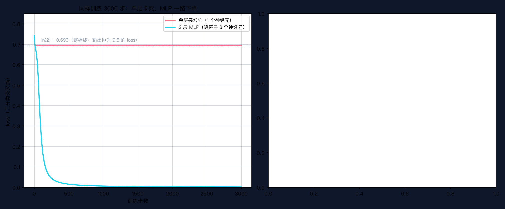
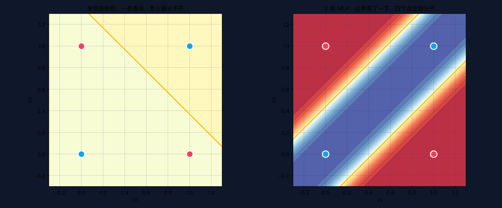

# 手搓大模型 06：感知机 → MLP——前向传播

> 本节代码：✅ 见 `code/`（06-perceptron-mlp.py 主实验 + 06-make-charts.py 画图）
>
> 本系列《手搓大模型：从零构建 NanoGPT》的第六课。
> 目标读者：零基础。第 5 课用一条直线学会了 `y = 2x + 1`，这一课给模型"加脑子"：从 1 个神经元到一层神经元，模型第一次能处理直线搞不定的问题。

先看一组真实数字。同一个 XOR 数据集（4 个点），同样训练 3000 步：

```
单层感知机：loss 卡在 0.6931  准确率 50%  ← 和瞎猜一模一样
2 层 MLP：  loss 降到 0.001757  准确率 100%  ← 完美学会
```

**XOR 是 1969 年刺穿第一代神经网络心脏的那把刀。** 两位 MIT 教授用一道"小学生都会"的逻辑题证明了：单层感知机（当时最火的 AI 模型）永远学不会它。此后十年，整个领域进入寒冬，经费被砍、论文被拒。直到 1986 年，人们发现只需要**在中间多加一层**，问题迎刃而解。

今天就把这"多出来的一层"解剖干净：前向传播——数据从输入到输出，到底走了哪些路。

## 先给结论：三句话

- **感知机 = 一个神经元 = 加权求和 + 激活函数 = 一条直线。**
- **MLP（多层感知机）= 好几条直线先各自判断，再综合成一条弯的边界。**
- **前向传播 = 从输入到输出，一层层"矩阵乘 + 偏置 + 激活"，重复若干次。**

## 动机：一条直线不够用了

第 5 课训练的是一条直线 `y = w·x + b`。直线能做的很有限：只能把平面分成"线的这边 / 线的那边"。

但世界不是线性划分的。举个最经典的例子——**XOR（异或）**：

| 输入 x1 | 输入 x2 | 输出（异或） |
|---|---|---|
| 0 | 0 | 0 |
| 0 | 1 | 1 |
| 1 | 0 | 1 |
| 1 | 1 | 0 |

规则一句话：**两个输入相同输出 0，不同输出 1**。四个点画在坐标平面上（0,0 和 1,1 是一类，0,1 和 1,0 是另一类），就像棋盘的对角——**任何一条直线都切不开**。画一条试试：要么把 (0,0) 和 (1,1) 分错一个，要么把另外两个分错一个，永远有一半是错的。

第 5 课的模型碰到这种问题会直接报废。这一课造出能"拐弯"的模型。

## 第一层解剖：一个神经元内部长什么样

先看最小的零件。感知机（Perceptron）是 1958 年提出的最早的人工神经元，内部就三步：

```
输入 x1, x2       每个输入乘一个权重      求和 + 偏置        过激活函数
  ──→  x1 × w1 ─┐
                 ├──→  z = w1·x1 + w2·x2 + b  ──→  a = σ(z)  ──→ 输出
  ──→  x2 × w2 ─┘
```

每个符号用大白话解释一遍：

- **x1、x2**：输入。比如判断"要不要出门"，x1 = 天气好不好（0/1），x2 = 有没有约人（0/1）。
- **w1、w2（权重）**：每个输入的"重要程度"。天气权重 0.8、约人权重 0.5，说明天气更重要。权重是模型**要学的参数**。
- **b（偏置）**：一个"自带倾向"。b 大，神经元天生容易激活；b 小，天生沉默。也是要学的参数。
- **z（加权和）**：所有输入按重要程度加起来的总分。
- **σ（激活函数）**：把任意总分 z 压到 0~1 之间。sigmoid（读作"西格莫伊德"）是最经典的一种：z 越大越接近 1，z 越小越接近 0，像个 S 形。输出 0.9 就是"90% 觉得该出门"。
- **a（激活值）**：这个神经元最终说的话，0~1 之间的小数。

手算一遍（第 5 课之后，读者应该习惯手算了）。取权重 w1=0.5、w2=-0.8、b=0.3，输入 (0, 1)：

```
z = 0.5 × 0 + (-0.8) × 1 + 0.3 = -0.500
a = σ(-0.500) = 0.378
```

输出 0.378 < 0.5，判为"负类"。**一个神经元的全部动作，就是"加权求和 → 压到 0~1"。** 就这么多。

## 第二层解剖：从一条线到一层线

单神经元是直线，那"好几个神经元"呢？把 3 个神经元并排放，每个都接收同样的输入 x1、x2，各自算出自己的 a1、a2、a3。这 3 个输出再喂给最后 1 个神经元，综合成最终判断——这就是 2 层 MLP（输入层 → 隐藏层 → 输出层）：

```
输入层           隐藏层（3 个神经元）          输出层
x1 ──╮        ╭── h1 ──╮
     ├──×W1──→ ├── h2 ──┼──×W2──→ ŷ
x2 ──╯        ╰── h3 ──╯
```


**关键就在隐藏层**。3 个神经元 = 3 条直线，每条线从自己的角度切一刀；输出层的神经元再"综合三票"决定最终答案。三条直线拼起来，边界就弯了。

还是用 XOR 说。3 个隐藏神经元被训练成了 3 条不同的直线：

- h1 负责"x1 比较大"的区域
- h2 负责"x2 比较大"的区域  
- 输出神经元看这俩怎么组合

于是 (0,0)：两个都小 → 判 0；(1,1)：两个都大 → 判 0；而 (0,1) 和 (1,0)：一个大一个小 → 判 1。**四条直线围出一个"叉"，四个点完美分开。**

为什么 1969 年那两位教授说"单层永远学不会 XOR"？因为他们证明了：**单层 = 一条直线 = 线性可分**，而 XOR 不是线性可分——这是数学结论，不是训练技巧能补救的。加上隐藏层，模型从"只能画直线"升级成"能画折线"，表达能力立刻跳档。**数学上有个著名的万能近似定理：只要隐藏层够宽，两层网络能近似任何连续函数。**

## 第三层解剖：前向传播的数学——全是矩阵乘

第 3 课讲过：**矩阵乘法 = 批量映射**。前向传播就是把这句话用到极致。

一层神经元做的事，写成矩阵就是一次乘加：

```
z1 = X @ W1 + b1        # 输入 X（4个样本 × 2维）乘权重 W1（2×3）→ 4×3
h  = ReLU(z1)           # 激活：把负数全压成 0
z2 = h @ W2 + b2        # 隐藏层输出乘 W2（3×1）→ 4×1
ŷ  = σ(z2)              # 输出激活：压到 0~1
```

每个符号的直觉：

- **X（4×2）**：4 个样本（XOR 的 4 个点），每个样本 2 个特征。
- **W1（2×3）**：第一层的权重矩阵。**第 i 行第 j 列 = "第 i 个输入对第 j 个隐藏神经元的权重"。** 所以 2 个输入 × 3 个隐藏神经元 = 6 个权重。
- **b1（3）**：3 个隐藏神经元各自的偏置。
- **z1（4×3）**：4 个样本各自在 3 个隐藏神经元上的"总分"。
- **ReLU**：本课用的激活函数，比 sigmoid 更简单粗暴——**正数原样过，负数直接归零**。它的作用只有一个：**引入非线性**。没有它，两层矩阵乘叠起来还是线性，加再多层都等于一层（这是本课最重要的误区，见文末）。
- **h（4×3）**：激活后的隐藏层输出。
- **W2（3×1）、b2、z2、ŷ**：输出层，把 3 个隐藏值综合成 1 个 0~1 的最终答案。

**前向传播的完整定义：数据从输入层出发，依次经过每一层的"矩阵乘 + 偏置 + 激活"，直到输出层。** 名字里的"前向"是相对于"反向传播"说的——第 7 课要解剖的反向传播，就是沿着这条路倒着走回去算梯度。

## 代码层：手写前向传播

完整程序 `06-perceptron-mlp.py`，保存后直接运行：

```bash
~/projects/main-agent/nanoGPT/.venv/bin/python 06-perceptron-mlp.py
```

```python
import torch
import numpy as np

torch.manual_seed(0); np.random.seed(0)

# ---------- 0. XOR 数据集 ----------
# 相同→0，不同→1。4 个点，一条直线永远分不开。
X = torch.tensor([[0., 0.], [0., 1.], [1., 0.], [1., 1.]])
y = torch.tensor([[0.], [1.], [1.], [0.]])

# ---------- 1. 单个感知机：手写前向 ----------
def sigmoid_scalar(z):
    return 1.0 / (1.0 + np.exp(-z))     # 把总分压到 0~1

w1, w2, b = 0.5, -0.8, 0.3              # 随便搓的权重
x1, x2 = 0.0, 1.0
z = w1 * x1 + w2 * x2 + b               # 加权求和
a = sigmoid_scalar(z)                   # 激活
print(f"手算：z = {z:.3f}，a = {a:.3f}")

# ---------- 2. 手写 2 层 MLP 前向 ----------
# 结构 2-3-1：输入 2 → 隐藏 3 → 输出 1。全程不用现成层。
def mlp_forward(x, W1, b1, W2, b2):
    z1 = x @ W1 + b1                    # 第一层：加权求和（矩阵乘）
    h = torch.relu(z1)                  # 激活：负数归零（关键非线性）
    z2 = h @ W2 + b2                    # 第二层：再加权求和
    return torch.sigmoid(z2), h, z1     # 输出激活，压到 0~1

W1 = (torch.randn(2, 3) * 0.5).requires_grad_()
b1 = (torch.randn(3) * 0.5).requires_grad_()
W2 = (torch.randn(3, 1) * 0.5).requires_grad_()
b2 = (torch.randn(1) * 0.5).requires_grad_()

# ---------- 3. 训练对比：单层 vs 2 层 ----------
def train_linear(n_steps=3000, lr=0.3):
    """训练单层感知机：y = σ(X @ W + b)，只有一条直线。"""
    W = (torch.randn(2, 1) * 0.5).requires_grad_()
    bb = (torch.randn(1) * 0.5).requires_grad_()
    losses = []
    for step in range(n_steps):
        y_hat = torch.sigmoid(X @ W + bb)
        loss = torch.nn.functional.binary_cross_entropy(y_hat, y)
        losses.append(loss.item())
        loss.backward()                 # autograd 自动算梯度（第 7 课手写它）
        with torch.no_grad():
            W.data -= lr * W.grad       # 梯度下降，和第 5 课一模一样的下山
            bb.data -= lr * bb.grad
            W.grad.zero_(); bb.grad.zero_()
        if step % 500 == 0:
            print(f"  step {step:4d}  loss = {loss.item():.4f}")
    with torch.no_grad():
        acc = ((torch.sigmoid(X @ W + bb) > 0.5).float() == y).float().mean().item()
    return losses, acc

def train_mlp(n_steps=3000, lr=0.3):
    """训练 2 层 MLP：隐藏层 3 个神经元。"""
    W1p = (torch.randn(2, 3) * 0.5).requires_grad_()
    b1p = (torch.randn(3) * 0.5).requires_grad_()
    W2p = (torch.randn(3, 1) * 0.5).requires_grad_()
    b2p = (torch.randn(1) * 0.5).requires_grad_()
    losses = []
    for step in range(n_steps):
        y_hat, _, _ = mlp_forward(X, W1p, b1p, W2p, b2p)
        loss = torch.nn.functional.binary_cross_entropy(y_hat, y)
        losses.append(loss.item())
        loss.backward()
        with torch.no_grad():
            for p in (W1p, b1p, W2p, b2p):
                p.data -= lr * p.grad
                p.grad.zero_()
        if step % 500 == 0:
            print(f"  step {step:4d}  loss = {loss.item():.6f}")
    with torch.no_grad():
        y_hat, _, _ = mlp_forward(X, W1p, b1p, W2p, b2p)
        acc = ((y_hat > 0.5).float() == y).float().mean().item()
    return losses, acc, W1p.detach(), b1p.detach(), W2p.detach(), b2p.detach()

print("\n训练单层感知机（一条直线）...")
losses_lin, acc_lin = train_linear()
print(f"  最终 loss = {losses_lin[-1]:.4f}  准确率 = {acc_lin*100:.0f}%")

print("\n训练 2 层 MLP（隐藏层 3 个神经元）...")
losses_mlp, acc_mlp, W1_f, b1_f, W2_f, b2_f = train_mlp()
print(f"  最终 loss = {losses_mlp[-1]:.6f}  准确率 = {acc_mlp*100:.0f}%")
```

**逐段说明**（对应上面编号）：

- `0.` XOR 数据集就 4 行——这是机器学习里最小的"非线性难题"，一节课讲透刚好。
- `1.` 单个神经元手算：所有参数手搓，验证"加权求和 + 激活"这一套动作。
- `2.` 手写 MLP 前向：**全程没有调用任何现成神经网络层**，只有 `@`（矩阵乘）、`+`、`relu`、`sigmoid` 四个操作。这就是前向传播的全部。
- `3.` 两个训练函数只有一处不同：单层的"预测"是 `σ(X@W+b)`，MLP 的"预测"是 `mlp_forward(...)`——**训练循环骨架和第 5 课的 6 行一模一样**：预测 → 算 loss → 反传 → 下山。第 5 课的话在这里应验了：换的只是"模型长什么样"，"怎么学"没变。

## 实验层：真实输出

在 Mac mini 上的真实输出（一字未改）：

```
================================================================
XOR 数据集（异或）：相同→0，不同→1
  (0, 0) -> 0
  (0, 1) -> 1
  (1, 0) -> 1
  (1, 1) -> 0
================================================================
单个神经元前向（手算）：权重 w1=0.5 w2=-0.8 b=0.3，输入 (0,1)
  z = 0.5*0.0 + -0.8*1.0 + 0.3 = -0.500
  a = sigmoid(-0.500) = 0.378   （>0.5 判为正类，<0.5 判为负类）
================================================================

训练单层感知机（一条直线，试图分开 XOR）...
  step    0  loss = 0.7268
  step  500  loss = 0.6931
  step 1000  loss = 0.6931
  step 1500  loss = 0.6931
  step 2000  loss = 0.6931
  step 2500  loss = 0.6931
  最终 loss = 0.6931  准确率 = 50%

训练 2 层 MLP（隐藏层 3 个神经元）...
  step    0  loss = 0.742898
  step  500  loss = 0.015323
  step 1000  loss = 0.006271
  step 1500  loss = 0.003860
  step 2000  loss = 0.002773
  step 2500  loss = 0.002155
  最终 loss = 0.001757  准确率 = 100%

结论：
  单层感知机：loss 卡在 0.693，准确率 50% —— 一条直线分不开 XOR
  2 层 MLP：  loss 降到 0.001757，准确率 100% —— 弯一下就能分开
  差的那一层，就是隐藏层 + ReLU 带来的非线性。
```

**0.6931 这个数字有讲究。** 二分类里，模型永远输出 0.5（完全瞎猜）时，交叉熵 loss 正好是 `-ln(0.5) = 0.6931`。单层感知机的 loss 精准地卡死在这个数上，一分不多一分不少——**它在数学上退回了"瞎猜"**。这不是训练不够，是它根本没有表达 XOR 的能力。

loss 曲线对比（真实训练数据）：



红线（单层）从 0.7268 跌到 0.6931 就躺平，之后 2500 步纹丝不动；青线（MLP）500 步就杀到 0.015，一路贴着地板走。**同一次实验、同样的优化器、同样的步数，差的只有"有没有隐藏层"。**

决策边界（真实数据，把平面上每个点喂给训练好的模型，按输出染色）：



左图单层感知机的分界线是一条直线，怎么摆都切不开四角；右图 MLP 的分界线弯成了"叉"形，四个点被完美分开。**"表达能力"从这条弯曲的边界开始。**

程序最后还有一段"对拍验证"——把训练好的 MLP 权重，分别用手写前向和 torch.nn 封装各算一遍：

```
手写前向 vs torch.nn 封装对拍（同一个权重，4 个样本）：
  (0, 0)  手写=0.0030  封装=0.0030
  (0, 1)  手写=0.9995  封装=0.9995
  (1, 0)  手写=0.9995  封装=0.9995
  (1, 1)  手写=0.0030  封装=0.0030
  最大误差 = 0.00e+00 —— 完全一致，手写前向没写错
```

手写实现和官方封装输出一模一样——**证明"前向传播 = 矩阵乘 + 偏置 + 激活"这个理解是准确的，没有漏掉任何隐藏步骤。** 以后读 nanoGPT 的 `model.py`，里面的 forward 就是这个结构的豪华放大版。

## 惊喜时刻

**惊喜 1：全部前向代码只有 3 行。** `z1 = x @ W1 + b1`、`h = relu(z1)`、`z2 = h @ W2 + b2`。整个"多层感知机的前向传播"，压缩到极致就这三行。GPT 的 forward 再复杂，骨架也是这三行的超集。

**惊喜 2：加一层，50% → 100%。** 同样的数据、同样的训练，单层卡死在瞎猜线，加 3 个隐藏神经元立刻满分。这个"多一层天壤之别"的感觉，值得记住——后面 Transformer 的深度设计，动机之一就是"层越多，能表达的规律越复杂"。

**惊喜 3：0.6931 不是巧合。** 它是 `-ln(0.5)`，是"完全瞎猜"的数学指纹。以后看到哪个模型 loss 卡在奇怪的位置下不去，先算算那个数是不是某个"平凡策略"的理论 loss——很多"训练失败"其实是"模型没这个能力"。

## 误区与彩蛋

**误区 1：层数越多越好？**
不是。这一课为了讲透只加了 1 层。实际工程里层数、宽度要跟数据量匹配：数据少、层数多，模型会把噪声背下来（过拟合，第 10 课专门讲）。而且层数增加会带来梯度消失/爆炸（第 7 课讲反向传播时会看到苗头）。**先学会走路，再学跑。**

**误区 2：激活函数可有可无？**
**这是本课最危险的误区。** 如果把 ReLU 拿掉，两层就变成：

```
h  = X @ W1 + b1        （没有激活）
ŷ  = σ(h @ W2 + b2)
   = σ((X @ W1 + b1) @ W2 + b2)
   = σ(X @ (W1 @ W2) + ...)      ← 两个矩阵乘可以合并成一个！
```

两个线性变换叠起来还是线性变换，**等价于只有一个隐藏神经元的单层网络**——XOR 永远学不会，准确率必然卡在 50%。激活函数的唯一使命就是打破这种"线性叠加"，让层数真正有意义。**没有激活的"深"网络，是纸糊的深。**

**误区 3：神经元和大脑神经元是一回事？**
不是。人工神经元是 1958 年从生物学借来的**灵感**：加权求和像"多个突触信号的叠加"，激活函数像"超过阈值才放电"。但现代神经网络早就走远了，ReLU 这种函数在大脑里根本没有对应物。名字是致敬，不是仿真。

**彩蛋 1：1969 年的"打脸论文"。** Minsky 和 Papert 在《感知机》一书里证明单层感知机学不了 XOR，还断言"多层感知机也不会有本质突破"。这个论断过于悲观——1986 年反向传播算法（第 7 课主角）让多层网络真正可训练，直接引爆了第一波深度学习。**今天看起来理所当然的"加一层"，当年是赌上整个领域十年的一步棋。**

**彩蛋 2：XOR 是神经网络的"hello world"。** 就像学编程先写"打印 Hello World"，学神经网络先让模型学会 XOR。它小到一眼能看懂、难到恰好卡住线性模型，是验证"模型表达能力"的完美试金石。后面手搓 Attention、手搓 GPT，都会用类似的"最小难题"验证实现对不对。

**彩蛋 3：w1=0.5, w2=-0.8 那组手算权重不是随便搓的。** 正权重让"x1=1"倾向正类，负权重让"x2=1"倾向负类——单个神经元已经能对"单变量"做判断。真正难的是组合起来，这正是隐藏层做的事。

---

下一课，回答训练里最大的悬念：梯度到底是怎么算出来的？第 7 课《反向传播：从错误反推梯度》，把"loss.backward()"这一行拆开，手推 2 层网络，让"多出来的一层"真正学会。

*手搓大模型，第 6 课完成。加一层，世界弯了。*

---

**本课完整代码与全文已开源到 GitHub（public）：**

https://github.com/flyingcloud-code/learning-nanogpt-from-0-to-1/tree/main/06-mlp-forward

**系列仓库（30 课陆续更新中）：**

https://github.com/flyingcloud-code/learning-nanogpt-from-0-to-1
