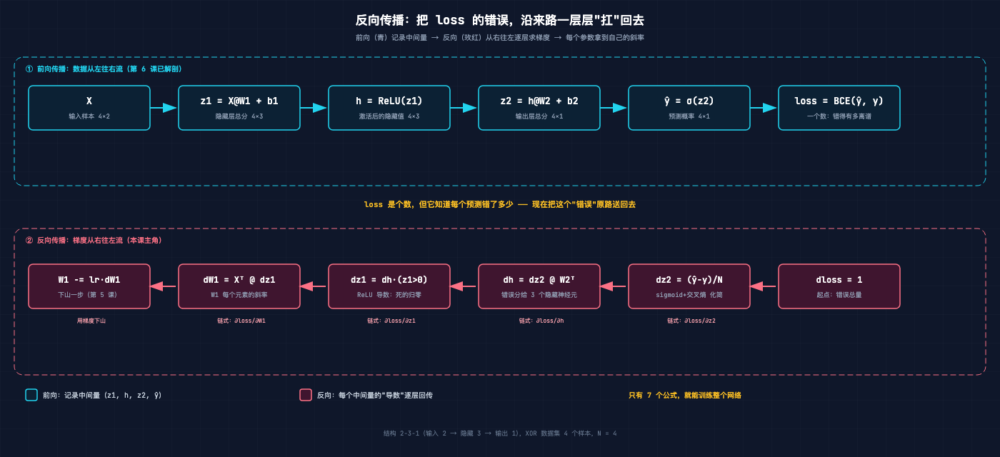
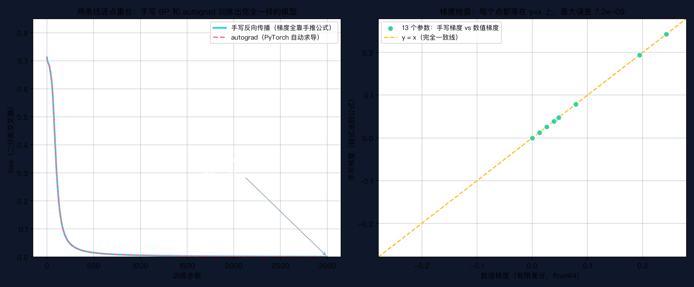

# 手搓大模型 07：反向传播——从错误反推梯度

> 本节代码：✅ 见 `code/`（07-backprop.py 主实验 + 07-make-charts.py 画图 + 07-handcalc.py 手算示例）
>
> 本系列《手搓大模型：从零构建 NanoGPT》的第七课。
> 目标读者：零基础。第 6 课把 2 层 MLP 的前向传播解剖干净了，但留下一个巨大的悬念：训练时那行 `loss.backward()`，到底是怎么知道每个权重该往哪边调、调多少的？这一课把它拆开。

先看一组真实数字。同一个 2 层 MLP（2-3-1 结构），同一组随机初始权重，训练 3000 步：

```
梯度对拍（13 个参数逐一比较）：
  手写反向传播 vs PyTorch autograd：最大差 = 0.00e+00   ← 逐位一模一样
  手写反向传播 vs 数值梯度（float64）：最大差 = 7.2e-09  ← 和"定义"对得上

训练 3000 步（手写 BP 和 autograd 各跑一遍，曲线逐点重合）：
  loss 0.7120 → 0.001762   准确率 100%
```

**第 6 课的 `loss.backward()` 不是魔法。** 这一课把它的内脏掏出来：反向传播的全部梯度公式，压缩到极致只有 **7 行**——3 行算"错误往上游传多少"，4 行算"每个参数该负多大责任"。手写这 7 行，训练出来的模型和 PyTorch 自动求导训练出来的**逐位相同**。

这是整个深度学习最核心的一课。GPT 的参数量从这一课的 13 个涨到千亿，靠的还是同一个机制：一次前向，一次反向，每个参数拿到自己的梯度。

## 先给结论：三句话

- **反向传播 = 把最终的错误，沿着前向的来路一层层"扛"回去，每个参数收到自己那份责任（梯度）。**
- **梯度 = 这个参数动一点点，loss 会变多少。** 梯度是正是负、是大是小，决定了参数往哪调、调多快（第 5 课的下山逻辑）。
- **反向传播的全部公式只有 7 行**：`dz2 → dh → dz1` 是"错误逐层回传"，`dW1/db1/dW2/db2` 是"每个参数领走自己的责任"。

## 动机：梯度不能靠"一个个试"

第 5 课学过，训练就是下山：算出 loss 对每个参数的斜率（梯度），然后朝反方向迈一步。第 6 课把模型从 1 个神经元升级成 2 层 MLP，参数从 2 个涨到 **13 个**（W1 有 6 个、b1 有 3 个、W2 有 3 个、b2 有 1 个）。

斜率怎么算？最笨的办法是"用定义"：把某个参数拨动一点点（比如 +1e-6），看 loss 变多少，斜率 = 变化量 ÷ 拨动量。这是数值梯度，数学上绝对正确，但代价是：**每个参数都要额外跑两次前向**。13 个参数要 26 次前向，3000 步训练就要跑 78000 次前向。等模型到 GPT 的量级，这个办法直接报废。

反向传播的思路完全相反：**只跑一次前向，把沿途的中间量都记下来；再跑一次反向，沿着来路把错误"分摊"回去。** 一次前向 + 一次反向，13 个梯度全到手。以后不管参数涨到几百万还是几千亿，这个"一正一反"的骨架都不变。

## 第一层解剖：计算图——前向留脚印，反向踩着脚印走回去

把第 6 课的 2 层 MLP 摊开，前向就是一条函数链：

```
X ──→ z1 = X@W1 + b1 ──→ h = ReLU(z1) ──→ z2 = h@W2 + b2 ──→ ŷ = σ(z2) ──→ loss = BCE(ŷ, y)
```

每个中间量（z1、h、z2、ŷ）都是前向留下的"脚印"。反向传播要做的事，就是**从最后一个脚印（loss）出发，倒着走回去**，每走一步算一个"导数"：

```
dloss ──→ dz2 = (ŷ−y)/N ──→ dh = dz2@W2ᵀ ──→ dz1 = dh·(z1>0) ──→ dW1 = Xᵀ@dz1, db1 = Σdz1
```



图中上排青色是前向：数据从左往右流，每个节点算出自己的值。下排玫红是反向：错误从右往左流，每个节点算出"自己这一步该往上游传多少错误"。**两排节点一一对应，反向的每一步都正好是前向某一步的"求导"。** 这就是"计算图"的含义：同一张图，正着走是算值，倒着走是算梯度。

## 第二层解剖：链式法则——错误是怎么"传导"的

反向传播的数学内核只有一条：**链式法则**。第 3 课讲过：导数 = 斜率 = "这个量动一点，结果变多少"。链式法则说的是：**影响的传递是相乘的**。

直觉版本：油价涨 10% → 运输成本涨 5% → 奶茶价格涨 3%。问"油价对奶茶价格的影响"，就是两步斜率相乘：0.05 × 0.6 = 0.03（数字是编的，道理是真的）。中间隔了几层，就把每一层的斜率一路乘下去。

对神经网络来说：loss 受 ŷ 影响，ŷ 受 z2 影响，z2 受 h 影响，h 受 z1 影响，z1 受 W1 影响。所以"W1 动一点，loss 变多少"，就是把这一路上的斜率全乘起来。**反向传播就是把这个乘法链从后往前一步步算出来**，每一步只需要知道"局部的斜率"，不用面对整个复合函数。

现在把 7 行公式逐个拆开。用第 6 课约定好的符号：X 是 4 个样本（4×2），N=4 是样本数，W1/b1 是隐藏层参数，W2/b2 是输出层参数。

**第一组：错误往上游传（3 行）**

```python
dz2 = (y_hat - y) / N      # ① loss 对 z2 的梯度
dh  = dz2 @ W2.T           # ② loss 对 h 的梯度
dz1 = dh * (z1 > 0).float()  # ③ loss 对 z1 的梯度
```

- ① `dz2 = (ŷ − y) / N`：这是本课最"魔法"的一行。数学上它来自"sigmoid 的导数 × 交叉熵的导数"两个东西相乘，结果惊人地化简成 `ŷ − y`——**预测值和真实值的差**。直觉：模型错得越离谱（ŷ 离 y 越远），这层收到的错误信号越大。除以 N 是因为 loss 是 4 个样本的平均值（PyTorch 的 `binary_cross_entropy` 默认取平均），梯度要跟着除以样本数。**这个 `/N` 是新手最容易漏的，漏了梯度就大 N 倍**（文章后面有真实踩坑记录）。
- ② `dh = dz2 @ W2.T`：错误从输出层回传给 3 个隐藏神经元。**转置矩阵 W2ᵀ 的作用是把错误"按权重分摊"**——W2 里权重大的隐藏神经元，收到更多错误。这和第 6 课"前向用 W2 把隐藏值加权求和"正好是反过来的操作。
- ③ `dz1 = dh * (z1 > 0)`：ReLU 的导数。ReLU 是"正数原样过、负数归零"，所以它的斜率只有两种：z1 > 0 时是 1（活着，错误照单全收），z1 ≤ 0 时是 0（**死了，错误传不过去，梯度直接归零**）。那个 `(z1 > 0).float()` 就是把 0/1 掩码乘上去。

**第二组：每个参数领走责任（4 行）**

```python
dW1 = X.T @ dz1            # ④ W1 的梯度
db1 = dz1.sum(0)           # ⑤ b1 的梯度
dW2 = h.T @ dz2            # ⑥ W2 的梯度
db2 = dz2.sum(0)           # ⑦ b2 的梯度
```

这一组的统一规律一句话：**参数收到的梯度 = 它的"输入" × 它的"输出端传来的错误"**。

- ④ `dW1 = Xᵀ @ dz1`：W1 的输入是 X（形状 2×4 转置成 4×2 来乘）。**W1 第 i 行第 j 列的梯度 = 第 i 个输入特征 × 第 j 个隐藏神经元收到的错误**。直觉：某个权重"喂进去的输入"越大、或者"下游怪罪它的错误"越大，这个权重就越该被调。
- ⑤ `db1 = dz1.sum(0)`：偏置的输入恒为 1（每个样本都加同一个 b1），所以梯度就是把所有样本的错误加起来。
- ⑥ ⑦ 同理：W2 的输入是 h，b2 的输入恒为 1。

**所以"反向传播"这个名字很直白：前向把数据从前往后推，反向把错误从后往前推。** 名字里没有魔法，只有"链式法则"这一个数学工具。

## 第三层解剖：手算一个样本（真实数字）

光看公式会晕，手算一遍就通了。用和实验完全相同的初始权重（seed=42），取第 1 个样本 (0, 0)，它的正确答案 y=0。前向（第 6 课的动作）：

| 步骤 | 公式 | 数值（真实） |
|---|---|---|
| 1 | z1 = x@W1 + b1 | [1.1041, −0.3190, 0.2308] |
| 2 | h = ReLU(z1) | [1.1041, **0**, 0.2308] ← 中间那个神经元死了 |
| 3 | z2 = h@W2 + b2 | 0.7961 |
| 4 | ŷ = σ(z2) | 0.6892（正确答案是 0，错得挺多） |
| 5 | loss = BCE(ŷ, y) | 1.1747（4 个样本平均前的单个值） |

反向（这一课的 7 行公式）：

| 步骤 | 公式 | 数值（真实） |
|---|---|---|
| 1 | dz2 = (ŷ − y)/4 | 0.1723 ← 错得越多，这个信号越大 |
| 2 | dh = dz2@W2ᵀ | [0.0230, 0.0461, 0.0697] |
| 3 | dz1 = dh·(z1>0) | [0.0230, **0**, 0.0697] ← 死掉的神经元分不到错误 |
| 4 | dW1 = xᵀ@dz1 | [[0,0,0],[0,0,0]] ← 全是 0！ |
| 5 | db1 = Σdz1 | [0.0230, 0, 0.0697] |
| 6 | dW2 = hᵀ@dz2 | [0.1902, 0, 0.0398] |
| 7 | db2 = Σdz2 | [0.1723] |

表格里有两个值得盯一眼的 0：

- **dW1 全是 0**：因为这个样本的输入是 (0, 0)。"参数收到的梯度 = 输入 × 错误"，输入是 0，无论错误多大，W1 都收不到信号。**如果某个输入特征在所有样本里都是 0，对应权重永远学不动**——这就是"特征要归一化/不要喂全 0 特征"的底层原因。
- **第二个隐藏神经元梯度为 0**：它被 ReLU 杀死了（z1 = −0.319 < 0）。**死了的神经元不学习**，这是 ReLU 的特性，也是后面讲"神经元死亡"问题的伏笔（第 17 课 Transformer 里会看到处理办法）。

一个样本的梯度算完，把 4 个样本的梯度加起来（严格说是平均，就是前面那个 /N），就是这一整步训练要用的梯度。**4 个样本、13 个参数，一次前向 + 一次反向全部搞定。**

## 代码层：手写反向传播，一行 autograd 都不用

完整程序 `07-backprop.py`，保存后直接运行：

```bash
~/projects/main-agent/nanoGPT/.venv/bin/python 07-backprop.py
```

```python
import torch
import numpy as np

torch.manual_seed(42)
np.random.seed(42)

# ---------- 0. XOR 数据集 ----------
# 相同→0，不同→1。第 6 课的主角：一条直线分不开的 4 个点。
X = torch.tensor([[0., 0.], [0., 1.], [1., 0.], [1., 1.]])
y = torch.tensor([[0.], [1.], [1.], [0.]])

# ---------- 1. 前向传播（和第 6 课一模一样） ----------
def forward_manual(X, y, W1, b1, W2, b2):
    """前向：返回 loss 和中间量 cache（反向要用这些"脚印"）。"""
    z1 = X @ W1 + b1              # 第一层总分（4×3）
    h = torch.relu(z1)            # 激活：负数归零（4×3）
    z2 = h @ W2 + b2              # 第二层总分（4×1）
    y_hat = torch.sigmoid(z2)     # 输出压到 0~1（4×1）
    loss = torch.nn.functional.binary_cross_entropy(y_hat, y)
    return loss, (z1, h, z2, y_hat)   # cache 就是"脚印"

# ---------- 2. 反向传播：本课主角，全部 7 行 ----------
def backward_manual(X, y, W1, b1, W2, b2, cache):
    """反向：从 loss 出发，沿前向的脚印倒着走，逐层算梯度。"""
    z1, h, z2, y_hat = cache      # 取出前向记录
    N = X.shape[0]                # 样本数 4（loss 取平均，梯度要除以 N）
    dz2 = (y_hat - y) / N         # ① loss 对 z2 的梯度（sigmoid+交叉熵化简）
    dW2 = h.T @ dz2               # ⑥ W2 的梯度 = 输入 h × 输出端错误
    db2 = dz2.sum(0)              # ⑦ b2 的梯度 = 错误求和
    dh = dz2 @ W2.T               # ② 错误按 W2 分摊回隐藏层
    dz1 = dh * (z1 > 0).float()   # ③ ReLU 导数：活着的传，死了的归零
    dW1 = X.T @ dz1               # ④ W1 的梯度 = 输入 X × 隐藏层错误
    db1 = dz1.sum(0)              # ⑤ b1 的梯度 = 错误求和
    return dW1, db1, dW2, db2

# ---------- 3. 三路对拍：手写 vs autograd vs 数值梯度 ----------
# （完整对拍代码在 07-backprop.py，这里展示最核心的对比方式）
# 对拍 1：手写 backward_manual 的返回 vs PyTorch autograd 的 .grad
# 对拍 2：手写 vs 数值梯度（把每个参数拨动 ±1e-6，用 loss 变化算斜率）

# ---------- 4. 训练循环：和第 5/6 课同骨架 ----------
def train_manual(n_steps=3000, lr=0.3, init=None):
    W1, b1, W2, b2 = [t.clone() for t in init]
    losses = []
    for step in range(n_steps):
        loss, cache = forward_manual(X, y, W1, b1, W2, b2)   # 前向：算 loss + 留脚印
        dW1, db1, dW2, db2 = backward_manual(X, y, W1, b1, W2, b2, cache)  # 反向：算梯度
        losses.append(loss.item())
        with torch.no_grad():          # 梯度下降：下山一步（第 5 课的骨架）
            W1 -= lr * dW1
            b1 -= lr * db1
            W2 -= lr * dW2
            b2 -= lr * db2
        if step % 500 == 0:
            print(f"  step {step:4d}  loss = {loss.item():.6f}")
    return losses
```

**逐段说明**：

- `1.` 前向完全复用第 6 课的代码，只多了一件事：**把中间量 (z1, h, z2, ŷ) 打包成 cache 返回**。反向需要这些"脚印"。
- `2.` **本课的心脏**：7 行公式。`dz2 → dh → dz1` 是错误回传链，`dW1/db1/dW2/db2` 是参数领责任。注释里标了每个张量的形状，方便对照计算图。
- `3.` 对拍代码在完整脚本里：同一组随机权重，分别用手写公式、PyTorch autograd、数值梯度算三份梯度，逐元素比较。**这是验证"手写实现有没有写错"的标准动作**，PyTorch 官方文档称之为 gradient check。
- `4.` 训练循环和第 5/6 课一模一样：前向 → 算 loss → 反向 → 下山。**唯一区别：第 6 课这行是 `loss.backward()`，这一课换成了手写的 `backward_manual(...)`。**

## 实验层：真实输出

Mac mini 上的真实输出（一字未改）：

```
====================================================================
第 7 课：手写反向传播 —— 训练 2 层 MLP（结构 2-3-1）学会 XOR
====================================================================

[对拍 1] 手写梯度 vs autograd 梯度（同一组随机权重）
  dW1: 手写 max=0.040791  autograd max=0.040791  最大差=0.00e+00
  db1: 手写 max=0.078578  autograd max=0.078578  最大差=0.00e+00
  dW2: 手写 max=0.242401  autograd max=0.242401  最大差=0.00e+00
  db2: 手写 max=0.194174  autograd max=0.194174  最大差=0.00e+00

[对拍 2] 手写梯度 vs 数值梯度（有限差分 float64，把每个参数拨动 ±1e-6）
  dW1: 手写 max=0.040791  数值 max=0.040791  最大差=4.16e-09
  db1: 手写 max=0.078578  数值 max=0.078578  最大差=2.77e-09
  dW2: 手写 max=0.242401  数值 max=0.242401  最大差=7.15e-09
  db2: 手写 max=0.194174  数值 max=0.194174  最大差=6.40e-10

[训练 A] 手写反向传播训练（梯度全靠手推公式）
  step    0  loss = 0.712020
  step  500  loss = 0.015682
  step 1000  loss = 0.006324
  step 1500  loss = 0.003885
  step 2000  loss = 0.002783
  step 2500  loss = 0.002160
  最终 loss = 0.001762  准确率 = 100%

[训练 B] autograd 训练（相同初始化，梯度交给 PyTorch）
  step    0  loss = 0.712020
  step  500  loss = 0.015682
  step 1000  loss = 0.006324
  step 1500  loss = 0.003885
  step 2000  loss = 0.002783
  step 2500  loss = 0.002160
  最终 loss = 0.001762  准确率 = 100%
```

三个关键结论：

1. **对拍 1：手写和 autograd 逐位一致（最大差 0.00e+00）**。这不是"差不多"，是每一位小数都相同。**手写 7 行公式 = PyTorch 内部做的事**。
2. **对拍 2：手写和数值梯度误差 ~1e-9**。数值梯度是用"导数定义"硬算的，不依赖任何求导技巧，是验证公式的金标准。1e-9 的差距来自 float64 下的截断误差，说明手写公式在数学上完全正确。
3. **训练 A 和 B 的 loss 曲线逐点重合**。两条曲线在 3000 个点上每一个都相同，因为梯度相同、初始化相同、学习率相同。**用自己手写的反向传播，训练出了和 PyTorch 完全一样的模型。**

loss 曲线和梯度检查散点（真实训练数据）：



左图两条线（青色=手写、玫红虚线=autograd）完全重叠；右图 13 个参数的散点全部落在 y=x 线上——**每个参数的手写梯度都等于数值梯度**。

## 惊喜时刻

**惊喜 1：全部反向传播代码只有 7 行。** `dz2`、`dh`、`dz1`、`dW1`、`db1`、`dW2`、`db2`。整个现代深度学习（GPT、扩散模型、强化学习）的训练机制，压缩到极致就是这么几行链式法则。参数量可以从 13 涨到 1.8 万亿，骨架不变。

**惊喜 2：手写 BP 和 autograd 训练出逐位相同的模型。** 0.00e+00 的最大差不是巧合——它说明"反向传播 = 链式法则"这个理解是**精确**的，没有漏掉任何隐藏步骤。以后读 nanoGPT 的 `train.py`，看到 `loss.backward()` 就知道它在做什么。

**惊喜 3：踩坑现场。** 写这一课实验时第一次跑，梯度对拍差了整整 4 倍——因为忘了 `/N`：PyTorch 的 `binary_cross_entropy` 默认对 4 个样本取平均，手写梯度却按"总和"算。除以 4 之后，从 1e-1 量级的差异直接掉到 0.00e+00。**这个坑是反向传播新手必踩的第一坑，值得记住：loss 取平均，梯度就要除以样本数。**

## 误区与彩蛋

**误区 1：反向传播 = 梯度下降？**
不是，两件事。反向传播只负责**算梯度**（这一课）；梯度下降负责**拿梯度下山**（第 5 课）。`loss.backward()` 之后还必须手动 `W -= lr * W.grad`（或者交给优化器），模型才会更新。**反向传播是"测量坡度"，梯度下降是"沿坡走一步"。**

**误区 2：autograd 是黑魔法，和手写公式是两套东西？**
不是。PyTorch 的 autograd 做的就是这一课的事：记录前向的计算图（脚印），反向时用链式法则自动求出每个参数的梯度。**它只是把手写公式机械化、自动化了**——遇到没有现成公式的复杂算子，它用数值/解析混合方式处理，但骨架就是这 7 行。这也是为什么这一课值得手写一遍：理解了 7 行公式，`loss.backward()` 就不再是魔法。

**误区 3：ReLU 在 0 点不可导，程序会崩？**
数学上 ReLU 在 0 点确实没有导数（左边斜率 0，右边斜率 1）。但工程上无所谓：权重是连续随机量，某个 z1 **恰好精确等于 0** 的概率几乎为 0；就算撞上，`(z1 > 0)` 会把它归到 0 或 1 其中一边，训练照样跑。**数学的"不完美"在工程里常常可以忽略，选哪边都行。**

**误区 4：层数越深，反向传播越难？**
反向传播的公式不会变，变的是"传着传着梯度会变小（或爆炸）"。想一想 ③ 行：`dz1 = dh * (z1 > 0)`，如果一层里很多神经元被 ReLU 杀死，错误传过这层就损失一大块；层数多了，浅层收到的错误可能小到 1e-10，**梯度消失**，浅层学不动。这是第 17 课讲 Transformer 的 LayerNorm 和残差连接时要解决的核心问题。

**彩蛋 1：反向传播的"再发现"故事。** 1986 年 Rumelhart、Hinton、Williams 发表《Learning representations by back-propagating errors》，把反向传播变成可训练多层网络的标准武器，直接引爆第一波深度学习。但严格说，这个想法 1960 年代在控制论领域就有人用过，1986 是"重新发现 + 证明它管用"。而 Hinton 本人 2024 年拿了诺贝尔物理学奖（虽然主要因为玻尔兹曼机那条线）——**深度学习祖师爷的含金量，这一课摸到了。**

**彩蛋 2：数值梯度是"金标准"，但慢到没法用。** 这一课实验里，13 个参数做一次完整梯度检查要跑 26 次前向（每个参数 ± 各一次）。如果模型有 10 亿参数，就要跑 20 亿次前向——而反向传播只要 1 次前向 + 1 次反向。**"慢的正确"用来验证，"快的近似"用来训练**，这是工程上很典型的分工。

**彩蛋 3：梯度检查是训练神经网络的"单元测试"。** 每次手写一个新层、新算子，第一件事就是用数值梯度对拍。PyTorch 官方有 `torch.autograd.gradcheck`，原理和这一课的对拍 2 一模一样。**以后手搓 Attention、手搓 Transformer Block，都要靠这一招确认没写错**——第 21 课会再见它。

---

下一课，把镜头拉远：梯度算出来了，但**学习率、loss 曲线、收敛**这些训练中的"体检指标"怎么看？第 8 课《Loss 与收敛》，用不同学习率的真实实验对比，讲清楚"训练得好不好"到底看什么。

*手搓大模型，第 7 课完成。一行 backward，七行公式，世界因此改变。*

---

**本课完整代码与全文已开源到 GitHub（public）：**

https://github.com/flyingcloud-code/learning-nanogpt-from-0-to-1/tree/main/07-backpropagation

**系列仓库（30 课陆续更新中）：**

https://github.com/flyingcloud-code/learning-nanogpt-from-0-to-1
