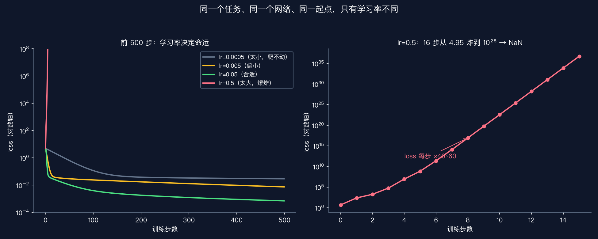
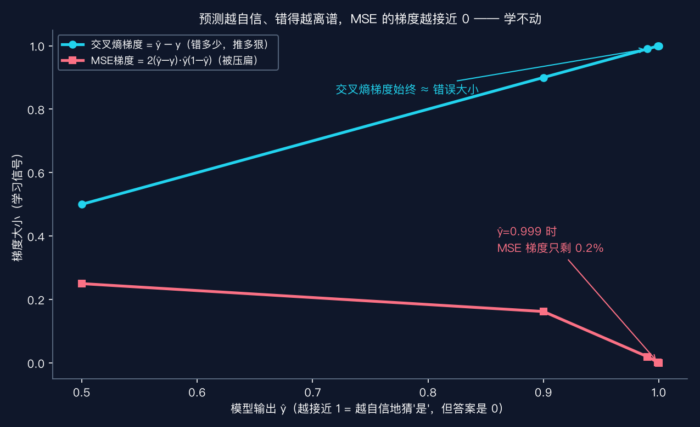
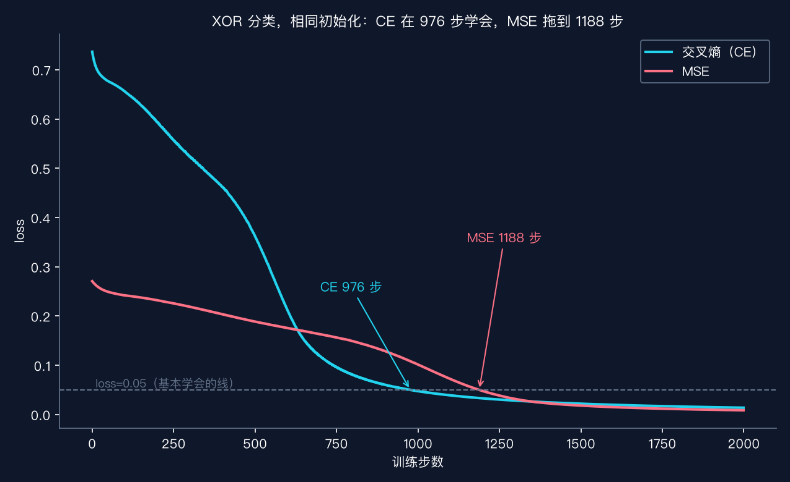

# 08 Loss 与收敛：训练好不好，看这条曲线

> 本节代码：✅ 见 `code/`（08-loss-convergence.py 主实验 + 08-make-charts.py 画图）
>
> 本系列《手搓大模型：从零构建 NanoGPT》的第八课。
> 目标读者：零基础。第 7 课把反向传播拆开了：梯度算出来了，参数也知道往哪调了。但训练到底"成没成"？光看代码跑没跑完不算数。这一课教怎么看体检报告——loss 曲线，以及一个一调错就全盘皆输的旋钮：学习率。

先看一组真实数字。同一个网络（1-32-32-1 的 MLP），同一份数据（拟合 y = sin x），同一个随机起点，唯一区别是学习率：

```
lr=0.0005  2000 步后 loss = 0.0172   ← 走得太慢，还没到谷底
lr=0.005   2000 步后 loss = 0.0013   ← 慢了点，但能到
lr=0.05    2000 步后 loss = 0.0001   ← 稳稳落地
lr=0.5     2000 步后 loss = NaN      ← 第 16 步就爆炸了
```

**loss 是"模型错得多离谱"的总分，训练的全部目标就是把它压下去。** loss 曲线是训练过程的体检报告：陡降说明在学，平台说明卡住，冲天说明出事了。而上面这组数字揭示了一个残酷事实：**学习率差 100 倍，训练命运天差地别**——一个还没走到位，一个已经炸成 NaN（Not a Number，不是数）。

## 先给结论：四句话

- **loss = 模型当前"错得多离谱"的分数。** 训练就是不断降低这个分数。
- **loss 曲线 = 训练的体检报告。** 读它比盯控制台日志有用一万倍。
- **学习率 = 每次下山的步长。** 太小走不动，太大直接滚下山崖（loss 变 NaN）。
- **分类任务用交叉熵，别用 MSE。** 真实实验：交叉熵 976 步学会 XOR，MSE 拖到 1188 步；更狠的是 MSE 在模型"自信但错了"的时候梯度趋近于 0，几乎学不动。

## 动机：没有 loss，训练就瞎了

第 5 课、第 7 课都在说"训练 = 下山 = 沿着梯度反方向走"。但有个问题一直没正面回答：**怎么知道走得对不对？**

想象一个场景：训练脚本跑起来了，一行行日志刷过去。怎么判断模型在变好？看 loss 数字一路变小——这就是唯一可靠的信号。如果 loss 不降反升，哪怕代码跑得再欢，模型也是在往错误方向走。

更实际的问题是调参。训练不收敛，第一件事看什么？**看 loss 曲线**：是太平（学习率太小）、还是炸了（学习率太大）、还是先降后升（过拟合，第 10 课讲）。没有 loss 曲线，就只能瞎猜。这一课把"怎么算 loss、怎么看曲线、怎么调学习率"一次讲完。

## 第一层解剖：loss 到底是什么

loss（损失）是一个数，衡量"模型输出离正确答案有多远"。两个最常用的度量：

**MSE（均方误差，Mean Squared Error）——量"数值差多少"**

```
MSE = 平均( (预测值 − 真实值)² )
```

适合回归任务：预测房价、温度、sin 曲线这种"预测一个数"的问题。平方的作用：一是让正负误差都算成"错"，二是放大大的错误——错 2 个单位和错 1 个单位，代价是 4 倍不是 2 倍。

**交叉熵（Cross Entropy）——量"概率猜得多离谱"**

```
交叉熵 = −平均( y·log(ŷ) + (1−y)·log(1−ŷ) )
```

适合分类任务：预测"是/否"（输出 0~1 的概率）。直觉：真实答案是 1，模型却只给 0.1 的概率，log(0.1) 是很大的负数，取负号后就是很大的 loss。**猜得越自信、错得越离谱，交叉熵惩罚越狠**——这是它的灵魂。

第 4 课讲过熵 = 惊讶度。交叉熵就是"用模型给出的概率分布去描述真实答案时，平均要惊讶多少次"。

## 第二层解剖：loss 曲线怎么读（真实数据）



这张图是本课最值钱的一张。左图是前 500 步的 loss 曲线（对数轴），4 条线对应 4 个学习率：

- **灰色（lr=0.0005）**：下降极其缓慢，2000 步后还在 0.017——不是不学，是步子太小。给够时间也能到，但可能要几万步。
- **黄色（lr=0.005）**：能降，但明显慢半拍。
- **绿色（lr=0.05）**：陡降，100 步就甩开别人，稳稳到 0.0001。这是"教科书曲线"。
- **红色（lr=0.5）**：前几步就冲天而起。右图是它的"爆炸现场"：loss 从 4.95 开始，每步乘以 40~60 倍，16 步就超过 10²⁸，然后变 NaN。

**读曲线的口诀：陡降 = 在学；平缓 = 学得慢；先降后平 = 到了平台；冲天 = 出事了。** 看到冲天曲线，第一反应不是改网络结构，而是把学习率调小一个数量级试试。

## 第三层解剖：为什么分类要用交叉熵（数学直觉）

这一层是全课最反直觉的地方。先记住一个结论：**sigmoid 输出 + MSE 的组合，在模型"自信但错了"时几乎学不动。**

推导只需要第 7 课的梯度知识。交叉熵配 sigmoid 的梯度（第 7 课算过）化简后是：

```
交叉熵梯度 = ŷ − y      ← 错多少，梯度就多大
```

MSE 配 sigmoid 的梯度多乘了一项：

```
MSE梯度 = 2(ŷ − y) · ŷ(1 − ŷ)   ← 多乘的 ŷ(1−ŷ) 是 sigmoid 的斜率
```

ŷ 是模型输出（0~1 之间），y 是真实答案。当模型输出 ŷ 越接近 0 或 1（越自信），ŷ(1−ŷ) 就越接近 0——**MSE 的梯度被压得越小**。看真实数字（答案 y=0）：

| 模型输出 ŷ | 交叉熵梯度 | MSE 梯度 | MSE/CE 比值 |
|---|---|---|---|
| 0.50 | 0.5000 | 0.2500 | 50% |
| 0.90 | 0.9000 | 0.1620 | 18% |
| 0.99 | 0.9900 | 0.0196 | 2% |
| 0.999 | 0.9990 | 0.0020 | 0.2% |
| 0.9999 | 0.9999 | 0.0002 | 0.02% |



**交叉熵永远保持"错多少推多狠"，MSE 却在最需要用力的时候熄火。** 模型刚训练时可能输出 0.999 去猜一个 0 的样本——这是最需要大梯度纠正的时刻，MSE 却只给出 0.2% 的信号。这就是"分类用交叉熵"的底层原因，不是约定俗成，是梯度大小决定的。

## 代码层：最小可运行实验

完整代码在 `code/08-loss-convergence.py`（约 150 行，含 3 个实验）。核心训练循环只有十几行，和第 7 课完全一样：

```python
# 运行命令: ~/projects/main-agent/nanoGPT/.venv/bin/python 08-loss-convergence.py
# 依赖: torch + numpy（venv 已装）
import torch
import numpy as np

torch.manual_seed(42); np.random.seed(42)

# ---------- sin 曲线回归：拟合 y = sin(x)，x 取 [-3, 3] 均匀 60 个点 ----------
xs = torch.linspace(-3, 3, 60).view(-1, 1)
ys = torch.sin(xs)

def train_reg(lr, steps=2000, seed=0):
    """训练 1-32-32-1 的 MLP，返回每一步的 loss。"""
    torch.manual_seed(seed); np.random.seed(seed)
    # 6 个参数：两层隐藏层的权重和偏置（32 个神经元）
    W1 = (torch.randn(1, 32) * 0.5).requires_grad_(); b1 = (torch.randn(32) * 0.5).requires_grad_()
    W2 = (torch.randn(32, 32) * 0.5).requires_grad_(); b2 = (torch.randn(32) * 0.5).requires_grad_()
    W3 = (torch.randn(32, 1) * 0.5).requires_grad_(); b3 = (torch.randn(1) * 0.5).requires_grad_()
    params = [W1, b1, W2, b2, W3, b3]
    hist = []
    for step in range(steps):
        h1 = torch.tanh(xs @ W1 + b1)          # 第一隐藏层：输入经过线性变换 + tanh 激活
        h2 = torch.tanh(h1 @ W2 + b2)          # 第二隐藏层
        out = h2 @ W3 + b3                     # 输出层：回归任务不加激活，直接出数
        loss = torch.nn.functional.mse_loss(out, ys)   # 回归任务用 MSE
        loss.backward()                        # 反向传播：算出所有参数的梯度
        with torch.no_grad():                  # 更新参数时不需要追踪梯度
            for p in params:
                p.data -= lr * p.grad          # 唯一区别就在这个 lr：下山步长
        for p in params:
            p.grad.zero_()                     # 清空梯度，下次重新算
        v = loss.item()
        hist.append(v if np.isfinite(v) else float('nan'))
    return hist

for lr in [0.0005, 0.005, 0.05, 0.5]:
    hist = train_reg(lr)
    last = hist[-1]
    print(f"lr={lr:<7} 最终loss={last if np.isfinite(last) else 'NaN（训练爆炸）'}")
```

整个训练循环和前面课程一模一样：前向 → 算 loss → backward 算梯度 → 参数沿负梯度走 `lr` 步。**唯一变的是 `lr` 这个数**，命运就完全不同。

## 实验层：真实输出

Mac mini 上的真实输出（一字未改）：

```
====================================================================
第 8 课实验 1：学习率对训练的影响 —— sin 曲线回归（2000 步）
====================================================================
lr=0.0005  最终loss=0.017186         NaN步数=0     关键点: {0: 4.9514, 100: 0.115, 300: 0.0332, 600: 0.0276, 1000: 0.0237, 1500: 0.0201, 1999: 0.0172}
lr=0.005   最终loss=0.001273         NaN步数=0     关键点: {0: 4.9514, 100: 0.0237, 300: 0.0128, 600: 0.0057, 1000: 0.0027, 1500: 0.0017, 1999: 0.0013}
lr=0.05    最终loss=0.000088         NaN步数=0     关键点: {0: 4.9514, 100: 0.0039, 300: 0.0012, 600: 0.0006, 1000: 0.0003, 1500: 0.0001, 1999: 0.0001}
lr=0.5     最终loss=NaN（训练爆炸）        NaN步数=1984  关键点: {0: 4.9514, 100: 'NaN', 300: 'NaN', 600: 'NaN', 1000: 'NaN', 1500: 'NaN', 1999: 'NaN'}
```

注意所有曲线从同一个起点出发（step 0 全是 4.9514）——同一起点、同一网络，100 步之内高下立判。

lr=0.5 的"爆炸现场"（完整前 16 步）：

```
step  0: 4.95
step  1: 241.77          ← 第一步就翻了 49 倍
step  2: 1841.19
step  3: 58444.70
step  4: 9,109,223
step  5: 746,313,024
step  6: 251,240,792,064
...
step 15: 5,250,707,979,804,794,039,933,011,793,693,672,192
step 16: NaN             ← 数字太大，float32 装不下了
```

**每步乘以 40~60 倍，16 步从 4.95 炸到 10²⁸ 再变 NaN。** 这就是学习率太大的经典死法：步子太大，一下跨过谷底，冲到对面更陡的坡上，下一脚更大，滚雪球式爆炸。

第二个实验——为什么分类不用 MSE：

```
====================================================================
第 8 课实验 2：sigmoid 输出层 —— 交叉熵 vs MSE 的梯度（y=0）
====================================================================
    模型输出 ŷ        交叉熵梯度 ŷ-y       MSE梯度 2(ŷ-y)ŷ(1-ŷ)    MSE/CE 比值
    0.5000           0.5000                 0.250000       0.5000
    0.9000           0.9000                 0.162000       0.1800
    0.9900           0.9900                 0.019602       0.0198
    0.9990           0.9990                 0.001996       0.0020
    0.9999           0.9999                 0.000200       0.0002
```

第三个实验——同样的 XOR 分类，唯一区别是 loss 函数：

```
====================================================================
第 8 课实验 3：XOR 分类 —— 交叉熵 vs MSE（相同初始化，lr=0.1）
====================================================================
seed=0: CE 在 step 976 loss<0.05 (acc=100%), MSE 在 step 1188 loss<0.05 (acc=100%)
seed=3: CE 在 step 845 loss<0.05 (acc=100%), MSE 在 step 984 loss<0.05 (acc=100%)
seed=6: CE 在 step 982 loss<0.05 (acc=100%), MSE 在 step 1467 loss<0.05 (acc=100%)
```



**交叉熵平均快 20~30% 学会同一个分类任务**，而且这是简单任务；任务越难、类别越多，差距越明显。真实世界里，大模型训练用交叉熵（以及它的变体），不用 MSE，就是这个原因。

## 惊喜时刻

**惊喜 1：全部"调参智慧"浓缩成一个数。** 模型结构没变、数据没变、起点没变，只动 `lr` 一个数：0.05 完美收敛，0.5 直接爆炸。学习率是深度学习里最敏感的一个旋钮——调它的时候，一次只动 10 倍以内的量级，别一次改 100 倍。

**惊喜 2：爆炸只要 16 步。** 4.95 → 241 → 1841 → 5.8 万 → 910 万 → 7.4 亿 → … 学习率太大的死法不是"慢慢变差"，而是指数级滚雪球。看到 loss 曲线冲天，第一件事：把学习率除以 10。

**惊喜 3：MSE 在最需要用力的时候熄火。** 模型输出 0.999（自信地猜"是"）但答案是 0——这是最该狠狠纠正的时刻。交叉熵给出 0.999 的梯度，MSE 只给 0.002，差了 500 倍。**损失函数的选择不是品味问题，是梯度大小决定的。**

**惊喜 4：loss 曲线是"免费"的。** 训练时本来就要算 loss（backward 需要它），顺手记下来画条曲线，成本为零，却能在几秒内看出训练健不健康。**每段训练都应该画 loss 曲线，不画等于闭眼开车。**

## 误区与彩蛋

**误区 1：loss 越小越好，所以一直盯着最终值？**
最终值要看，但更要看**曲线形状**。同是 2000 步 loss=0.001，一条是稳稳下降（健康），一条是先降到 0.0001 再反弹（可能过拟合/学习率太大震荡）。只看最终值会漏掉过程信息。

**误区 2：loss 不降就是模型不行？**
先检查学习率。loss 几乎不动（像灰色曲线那样）通常是学习率太小，不是模型笨。把学习率调大 10 倍试试，往往立刻见效。**调参顺序：先学习率，再网络结构。**

**误区 3：NaN 是 bug，要查代码？**
先查学习率。lr=0.5 那种爆炸产生的 NaN 是训练动力学问题，不是代码 bug。看到 NaN 的第一反应：把学习率除以 10~100 重跑，八成就好了。

**误区 4：MSE 也能训练分类，用哪个无所谓？**
能用和好用是两回事。实验 3 显示 MSE 慢 20~30%，梯度消失分析显示它在关键时刻几乎不学。**分类任务用交叉熵，回归任务用 MSE**——这是经过大量实践检验的分工。

**彩蛋 1：为什么是"交叉"熵？** 第 4 课讲过熵 = 惊讶度。交叉熵 = "用模型预测的分布去编码真实分布，平均要惊讶多少次"。模型预测越接近真实分布，惊讶越少，loss 越低。**训练交叉熵，就是让模型预测的分布一步步贴近真实分布**——第 12 课讲语言模型时，这个视角会直接解释"GPT 在学什么"。

**彩蛋 2：学习率不是固定一个就完了。** 第 9 课会讲优化器：Adam 能自动给每个参数调"有效步长"，还有学习率衰减（warmup + cosine）——训练后期自动把步长调小，避免在谷底来回震荡。nanoGPT 的 train.py 里就有一套完整的调度，第 19 课拆它。

**彩蛋 3：这个"爆炸"现象有个正式名字——梯度爆炸，是深度学习的四大麻烦之一**（另外三个：梯度消失、过拟合、欠拟合，后面都会遇到）。Transformer 用残差连接和 LayerNorm 来对抗它（第 17 课），Adam 优化器也能压住一部分（第 9 课）。现在看到 NaN，就知道病根在哪了。

**彩蛋 4：sin 回归这个任务本身很妙。** 60 个点、两层 32 神经元，2000 步就能把 loss 压到 0.0001——拟合出的曲线肉眼几乎和 sin 重合。**神经网络拟合函数的能力，从这一课开始有直观感受**；第 26 课它会升级成"拟合莎士比亚的字符序列"。

---

下一课，把"下山步长"这件事做得更聪明：固定学习率太笨了，**Adam 优化器**凭什么能自动调节奏、还能压住爆炸？第 9 课《优化器：SGD/Adam/学习率》。

*手搓大模型，第 8 课完成。一条曲线，一个旋钮，看懂训练的全部体检报告。*

---

**本课完整代码与全文已开源到 GitHub（public）：**

https://github.com/flyingcloud-code/learning-nanogpt-from-0-to-1/tree/main/08-loss-convergence

**系列仓库（30 课陆续更新中）：**

https://github.com/flyingcloud-code/learning-nanogpt-from-0-to-1

## 文件说明

```
08-loss-convergence/
├── README.md                  # 本课完整讲解
├── code/
│   ├── 08-loss-convergence.py # 主实验：3 个真实实验（学习率对比 / 梯度消失 / CE vs MSE）
│   └── 08-make-charts.py      # 画图脚本（自动生成数据，开箱即跑）
└── images/
    ├── 08-lr-compare.png      # 学习率对比曲线（真实数据）
    ├── 08-gradient-saturation.png  # sigmoid 饱和区梯度对比（真实数据）
    └── 08-ce-vs-mse.png       # XOR 上 CE vs MSE 收敛对比（真实数据）
```

运行环境：Mac mini（Apple Silicon / MPS）+ PyTorch 2.12.1 + numpy + matplotlib。
