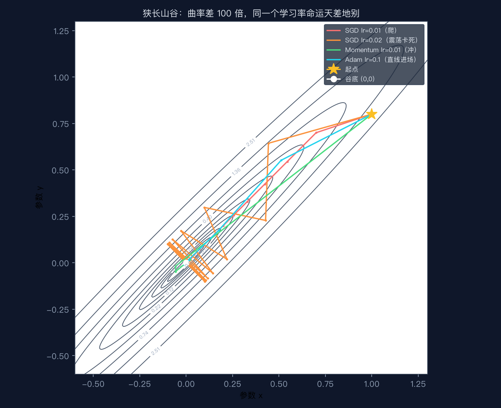
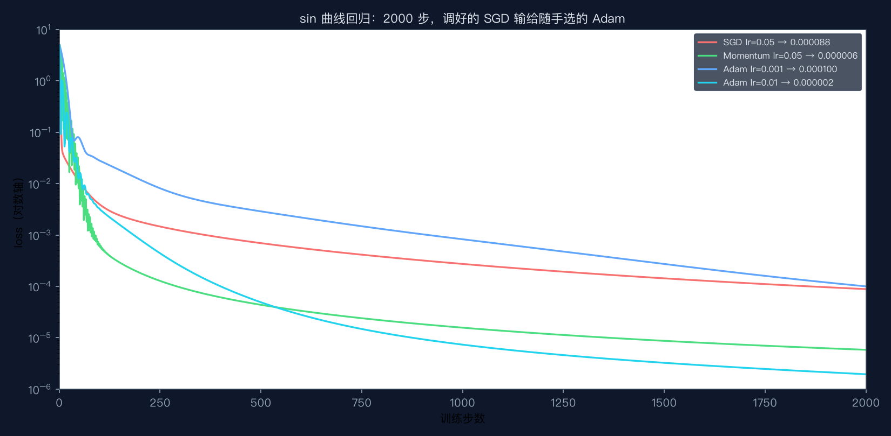

# 手搓大模型 09：优化器：SGD/Adam/学习率——下山这条路，有人走之字有人走直线

> 本节代码：✅ 见 `code/`（09-optimizers.py 主实验 + 09-mini.py 最小演示 + 09-make-charts.py 画图）
>
> 本系列《手搓大模型：从零构建 NanoGPT》的第九课。
> 目标读者：零基础。第 8 课讲了一个残酷事实：学习率差 100 倍，训练命运天差地别。这一课回答一个更扎心的问题：**为什么调好一个学习率还不够？** 答案是：一个学习率，永远服务不了所有参数。

先看一组真实数字。同一个"山谷"（两个方向曲率差 100 倍，数学上叫病态二次型），从同一个起点出发，跑 500 步：

```
SGD      lr=0.01 : loss = 0.000035   位置 = (+0.006, +0.006)   ← 还在半路爬
Momentum lr=0.01 : loss = 0.000000   位置 = (+0.000, +0.000)   ← 已经到谷底
Adam     lr=0.1  : loss = 0.000000   位置 = (-0.000, -0.000)   ← 用 10 倍学习率反而先到
SGD      lr=0.02 : loss = 1.0000     ← 学习率翻倍，不是更快，是永远卡死
SGD      lr=0.03 : loss = 1.1e+12    ← 再大一点，直接爆炸
```

**优化器决定"怎么迈步"：SGD 只看当前脚下，动量记住来路，Adam 给每个方向单独配步长。** 这一课把三种下山策略拆开：先讲为什么一个学习率必然顾此失彼，再手搓动量（一行代码治好震荡），最后手搓 Adam（每个参数自带"自动学习率"，大模型训练的实际标配），全部用真实数据说话。

## 先给结论：四句话

- **SGD 的先天缺陷：一个学习率服务不了两个曲率。** 山谷里缓方向要走大步，陡方向只能走小步，同一个 lr 只能二选一——选小了爬不动，选大了震荡甚至爆炸。
- **动量 = 惯性。** 更新方向从"当前梯度"换成"梯度的时间平均"（速度），同向加速、反向抵消，一行代码同时治好"爬不动"和"之字形震荡"。
- **Adam = 每个参数一个自动学习率。** 它记录每个参数的梯度大小，自己换算步长，所以 0.001 到 0.01 之间随便选都能收敛，把需要人肉精调的 SGD 甩开几十倍。
- **真实世界早就不裸用 SGD 了。** nanoGPT 训练用 AdamW（Adam 的小改动），第 19 课拆 train.py 时会看到完整配置。

## 动机：调学习率这件事，能不能自动化？

第 8 课的结论听起来很绝望：学习率是训练里最敏感的旋钮，大了爆炸、小了爬不动，每次训练都要人肉试。那自然会问：**能不能让模型自己判断"这一步该迈多大"？**

这个问题的答案就是优化器（optimizer）——"优化"这个词在这里专指**怎么用梯度更新参数**这件事。第 5 课到第 8 课用的都是最原始的写法 `p.data -= lr * p.grad`，那叫 SGD（随机梯度下降，Stochastic Gradient Descent）。这一课把它升级成两个真正聪明的版本：动量（Momentum）和 Adam。

先看它们要解决的问题长什么样，再上公式。

## 第一层解剖：三种"下山"哲学

把训练想象成在浓雾里下山：站在山坡上，只能靠脚下测得"哪边最陡"（梯度）来判断方向。三个优化器是三种不同的走法：

| 优化器 | 迈步依据 | 一句话直觉 | 代价 |
|---|---|---|---|
| SGD | 当前这一步的梯度 | 每步都重新看路，走一步算一步 | 陡坡上左右乱晃（震荡），缓坡上半天挪不动 |
| 动量 Momentum | 最近一堆梯度的"平均方向" | 像滚雪球，方向一致的步越滚越快，方向乱变的步互相抵消 | 多记一个"速度"向量，β 要选 |
| Adam | 每个方向自己的梯度大小 | 每个参数发一把自带刻度的尺子，步长自动换算 | 每个参数多记两个数，公式长一截 |

## 第二层解剖：数学细节（每个符号都有直觉）

### SGD：θ ← θ − lr·g

- `θ`（theta）：参数，模型里所有可调的权重。下山时人的位置。
- `g`：梯度，loss 对参数的导数，指向"上升最快"的方向。脚下的最陡方向。
- `lr`：学习率，步长。
- 操作：往梯度的反方向走 lr 步。

第 8 课已经验证过它的两个死法：lr 太小爬不动，lr 太大爆炸。这一课补第三个死法，也是最隐蔽的——**卡死**。见实验 1。

### 动量：v ← β·v + g，然后 θ ← θ − lr·v

- `v`（velocity）：速度，梯度的时间平均。不再是"当前最陡方向"，而是"最近一段路的综合方向"。
- `β`（beta）：记忆衰减率，默认 0.9。旧速度每步打 9 折再叠加新梯度。
- 直觉：**β=0.9 意味着速度大约记住最近 1/(1−β) = 10 步的梯度**。10 步前的梯度对现在的影响只剩 0.9¹⁰ ≈ 35%。

两个真实数字表，说明它为什么能治病（实验 3 的输出）：

**病 1：梯度交替变号（震荡）。** 窄方向的梯度每一步都换个方向：+10、−10、+10、−10……速度会被抵消：

```
步  梯度 g    速度 v=0.9v+g
1   +10.0     +10.00      ← 跟一步
2   -10.0      -1.00      ← 新旧方向打架，速度只剩 1
3   +10.0      +9.10      ← 又被带偏
4   -10.0      -1.81      ← 但振幅明显比裸 SGD 小
5   +10.0      +8.37
6   -10.0      -2.47
```

裸 SGD 每步都被 ±10 甩来甩去；动量把震荡幅度压到了 ±2 左右，而且越压越稳。

**病 2：梯度连续同向（爬不动）。** 缓方向梯度一直是 +10，速度会累积：

```
第 1步: v = +10.00
第 2步: v = +19.00
第 3步: v = +27.10
第 5步: v = +40.95
第10步: v = +65.13
```

方向一致的信号越滚越大，等于自动把步长放大了好几倍。**这就是"惯性"：顺风越跑越快，逆风立刻刹车。**

### Adam：每个参数一把自己的尺子

Adam（全称 Adaptive Moment Estimation，自适应矩估计）在动量之上再进一步，公式四行：

```
m ← β1·m + (1−β1)·g          # 一阶矩：梯度的平均（= 动量，管方向）
v ← β2·v + (1−β2)·g²         # 二阶矩：梯度平方的平均（管"这个参数平时梯度多大"）
m̂ = m / (1 − β1^t)           # 偏差修正
v̂ = v / (1 − β2^t)
θ ← θ − lr · m̂ / (√v̂ + ε)
```

逐个符号的直觉：

- `m`（first moment，一阶矩）：和动量 v 干同样的事，记住方向。β1 默认 0.9。
- `v`（second moment，二阶矩）：记住"梯度大小的平方"的平均。直觉：**这个参数平时被推得有多狠**。β2 默认 0.999，记忆更长，大约 1/(1−0.999) = 1000 步。
- `m̂`、`v̂`：偏差修正。训练最开头，m 和 v 都被 (1−β1)、(1−β2) 压得特别小，直接除会把前几步步长缩小 10 倍。除以 (1−β1^t) 把它拉回正常。
- `√v̂ + ε`：把步长按"梯度大小"归一化，ε=1e-8 只是防除零。
- 合起来：**不管这个参数的梯度是 0.001 还是 1000，Adam 每步移动的量都约等于 lr**。这就是"每个参数一个自动学习率"。

偏差修正有多关键，看真实数字（实验 3，梯度恒为 2.0）：

```
第1步: m=0.2000 → m̂=2.0000, v=0.0040 → v̂=4.0000, 步长=1.0000
第2步: m=0.3800 → m̂=2.0000, v=0.0080 → v̂=4.0000, 步长=1.0000
第3步: m=0.5420 → m̂=2.0000, v=0.0120 → v̂=4.0000, 步长=1.0000
```

没有修正的话，第 1 步会用 m=0.2 去迈步，只有正确值的 1/10；修正后从第一步起步长就稳定在 1.0——**梯度多大都不影响，每步就挪 lr 那么多**。

## 第三层解剖：为什么一个学习率必然顾此失彼

这一层是理解整节课的关键，值得用数学摊开。山谷函数选的是两个方向曲率差 100 倍的旋转椭圆：

```
f(u, v) = 0.5·u² + 50·v²
u = (x+y)/√2,  v = (x−y)/√2
```

展开成 x、y 就是 f = 25.25x² − 49.5xy + 25.25y²。u 方向（山谷的缓坡方向）曲率是 1，v 方向（陡坡方向）曲率是 100——**同样是走一步，v 方向的梯度是 u 方向的 100 倍**。

SGD 用同一个 lr 更新两个方向。在 v 方向上，一步更新后 v 会乘上因子 `1 − 100·lr`（推导：v ← v − lr·100v）：

| lr | v 方向因子 1−100·lr | 结局 |
|---|---|---|
| 0.01 | 0 | v 一步归零，但 u 方向每步只 ×0.99，爬 500 步还在半路 |
| 0.02 | −1 | v 永远震荡不衰减，loss 卡死 |
| 0.03 | −2 | 绝对值大于 1，每步翻倍，直接爆炸 |

真实输出验证了这张表：lr=0.01 爬 500 步 loss 还有 3.5e-5；lr=0.02 跑了 500 步 loss 纹丝不动停在 1.0（v 方向的震荡贡献 50×0.141²≈1.0 永远消不掉）；lr=0.03 第 20 步 loss 已经 1.1e12。

**这是 SGD 的先天结构问题，不是调参技巧能救的**——窄方向逼着 lr ≤ 0.01，缓方向又要求 lr 越大越好，同一个数不可能同时满足。

动量和 Adam 为什么能破局？回到第二层的两张表：动量靠"方向相反的梯度互相抵消"压住 v 方向震荡，靠"同向梯度速度累积"加速 u 方向；Adam 更直接，每个方向除以自己的 √v̂，把 100 倍的曲率差在步长层面抹平。

## 代码层：最小可运行（30 行，手搓三个优化器）

完整实验在 `code/09-optimizers.py`（约 200 行，含 sin 回归和 torch.optim 对拍）。先看一个 30 行的最小版，把三种更新规则放在一起对比，运行命令：

```bash
~/projects/main-agent/nanoGPT/.venv/bin/python 09-mini.py
```

```python
# 依赖: numpy（venv 已装）
import numpy as np

def grad(x, y):            # 山谷的梯度（解析式，手算即可，不用 autograd）
    return np.array([50.5 * x - 49.5 * y, -49.5 * x + 50.5 * y])

def loss(x, y):            # 山谷的 loss：两个方向曲率差 100 倍
    return 25.25 * x * x - 49.5 * x * y + 25.25 * y * y

def run(name, lr, steps=300, beta=0.9):
    pos = np.array([1.0, 0.8])     # 起点
    vel = np.zeros(2)              # 动量速度
    m = np.zeros(2); v = np.zeros(2)   # Adam 的一阶矩、二阶矩
    for t in range(1, steps + 1):
        g = grad(*pos)
        if name == "sgd":                 # 1. 裸 SGD：只看当前梯度
            step = g
        elif name == "momentum":          # 2. 动量：速度 = 0.9×旧速度 + 当前梯度
            vel = beta * vel + g
            step = vel
        else:                             # 3. Adam：每个方向有自己的"自动步长"
            m = 0.9 * m + 0.1 * g         # 一阶矩：梯度的指数平均（方向）
            v = 0.999 * v + 0.001 * g * g # 二阶矩：梯度平方的指数平均（大小）
            m_hat = m / (1 - 0.9 ** t)    # 偏差修正：把前几步被压小的值拉回来
            v_hat = v / (1 - 0.999 ** t)
            step = m_hat / (np.sqrt(v_hat) + 1e-8)   # 归一化：每步约走 lr
        pos = pos - lr * step
    return loss(*pos)

for name, lr in [("sgd", 0.01), ("momentum", 0.01), ("adam", 0.1)]:
    print(f"{name:8s} lr={lr:<4} 300 步后 loss = {run(name, lr):.3e}")
```

注意第 2 行起就是三种优化器的全部区别：SGD 直接拿 g 当步长，动量换成 v，Adam 换成归一化后的 m̂/√v̂。**优化器不过就是"把梯度加工成步长"的几行公式。**

## 实验层：真实输出（Mac mini 实测，一字未改）

### 实验 1：狭长山谷，500 步

```
起点 (1.0, 0.8)，跑 500 步，终点 loss：
  SGD      lr=0.01 : loss = 0.000035   位置 = (+0.006, +0.006)
  Momentum lr=0.01 : loss = 0.000000   位置 = (+0.000, +0.000)
  Adam     lr=0.1  : loss = 0.000000   位置 = (-0.000, -0.000)
  对照：SGD lr=0.02（翻倍）→ 500 步后 loss 仍 = 1.0000（窄方向更新因子 1−100×0.02 = −1，永远震荡，卡死在半路）
  对照：SGD lr=0.03 → 第 20 步 loss = 1.100e+12（因子 −2，真发散）
```



注意红色（SGD 0.01）和绿色（Momentum 0.01）走的其实是同一条线，区别只在**走了多远**；橙色（SGD 0.02）在谷底上方来回横跳，永远下不去；青色（Adam 0.1）用 10 倍学习率却几乎是直线进场。

### 实验 2：sin 曲线回归，2000 步（第 8 课同一个任务）

这次是真实神经网络（1-32-32-1 MLP），三种优化器 + 手搓 Adam 对拍官方：

```
  SGD        lr=0.05  : 最终 loss = 0.000088
  Momentum   lr=0.05  : 最终 loss = 0.000006
  手搓Adam   lr=0.001 : 最终 loss = 0.000100
  手搓Adam   lr=0.01  : 最终 loss = 0.000002
  torch.Adam lr=0.001 : 最终 loss = 0.000100

对拍验证：手搓 Adam 与 torch.optim.Adam 的 loss 曲线最大逐点差 = 2.38e-07
（< 1e-5 即两者逐点一致，说明公式实现正确）
```



读这张图的顺序：红色（SGD 0.05，第 8 课调出来的"好学习率"）2000 步到 0.000088；绿色（动量 0.05）直接 14 倍优势到 0.000006；蓝色（Adam 0.001）随便选的学习率就追平 SGD；青色（Adam 0.01）把调好的 SGD 甩开 44 倍。**同一个任务、同一个网络、同一起点，只换优化器。**

## 惊喜时刻

**惊喜 1：学习率翻倍，SGD 不是更快，是永远到不了。** 0.01 还能爬，0.02 直接卡死，0.03 爆炸——中间没有一个"刚好"的档位。这就是"一个学习率服务两个曲率"的残酷现场：不是调参不努力，是结构上无解。

**惊喜 2：动量治两种病，只改一行。** `vel = 0.9 * vel + g`，把"当前梯度"换成"速度"，窄方向震荡被抵消、缓方向自动加速，两个问题一起解决。公式总共 5 个字符的改动。

**惊喜 3：Adam 对学习率极不敏感。** 0.001 和 0.01 相差 10 倍，两个都能收敛，其中 0.01 还把需要精调的 SGD 甩开 44 倍。**这就是为什么真实训练几乎没人用裸 SGD**——Adam 替人类省掉了最痛苦的调参环节。

**惊喜 4：手搓的 Adam 和 torch 官方逐点一致。** loss 曲线最大差值 2.38e-07（浮点误差级别）。四行公式吃透，写出来的优化器和框架内置版本没有区别。

## 误区与彩蛋

**误区 1：动量只是"走得快一点"？**
快只是表象，更重要的是**压震荡**。交替梯度表里速度从 ±10 被压到 ±2，这才是它在山谷里能走下去的原因。动量同时做两件事：同向加速、异向抵消，缺一不可。

**误区 2：Adam 万能，以后不用管学习率了？**
Adam 只是把"学习率敏感度"降了几个数量级，不是零。lr=0.1 级别照样可能炸（第 8 课 sin 回归上 Adam 0.03 附近已开始不稳）。另外 Adam 收敛到极小值附近后常在小范围震荡，最终精度有时不如精调的 SGD——这就是"Adam 泛化差一点"说法的来源。真实世界用 AdamW（Adam + 解耦的 weight decay，第 10 课讲）缓解一部分。

**误区 3：训练代码里 `optimizer.step()` 是魔法？**
`optimizer.step()` 内部干的就是实验 2 手搓的那四行。PyTorch 的 Adam 和手搓版逐点差 2.38e-07，证明框架只是把公式封装成了 API，没有任何黑魔法。**看懂公式，框架代码就是注释。**

**彩蛋 1：β 就是"记忆时长"旋钮。** β=0.9 记住约 10 步，β=0.99 记住约 100 步。调大 β 等于让优化器"记性更好"，但记性太好会刹不住车（冲过谷底）。

**彩蛋 2：Adam 的"矩"是统计学的矩。** 一阶矩是均值（管方向），二阶矩是方差（管大小）。名字 Adaptive Moment Estimation 就是"自适应地用矩做估计"，一点不玄。

**彩蛋 3：大模型圈实际用的是 AdamW，不是 Adam。** nanoGPT 的 train.py 里 optimizer 配的是 `AdamW`，权重衰减和 Adam 的步长解耦。第 19 课拆 train.py 时，会看到完整的优化器配置 + warmup 学习率调度。

**彩蛋 4：狭长山谷不是人造玩具。** 神经网络里不同参数天生曲率就不同：靠近输出的层梯度大，靠近输入的层梯度小，残差连接两侧也差几个数量级。**真实训练里"一个学习率服务所有参数"的困境，和这个山谷是同构的**——这正是 Adam 能统治大模型训练的原因。

---

下一课，从"怎么下山"切换到"下到哪座山"：模型能背答案和会做新题是两回事。**第 10 课《泛化：过拟合与正则化》**——为什么训练 loss 越低，考试可能越差，以及 dropout、weight decay、早停三件套怎么救。

*手搓大模型，第 9 课完成。三个优化器，一条山谷，看懂下山这件事的全部花样。*

---

**本课完整代码与全文已开源到 GitHub（public）：**

https://github.com/flyingcloud-code/learning-nanogpt-from-0-to-1/tree/main/09-optimizers

**系列仓库（30 课陆续更新中）：**

https://github.com/flyingcloud-code/learning-nanogpt-from-0-to-1
