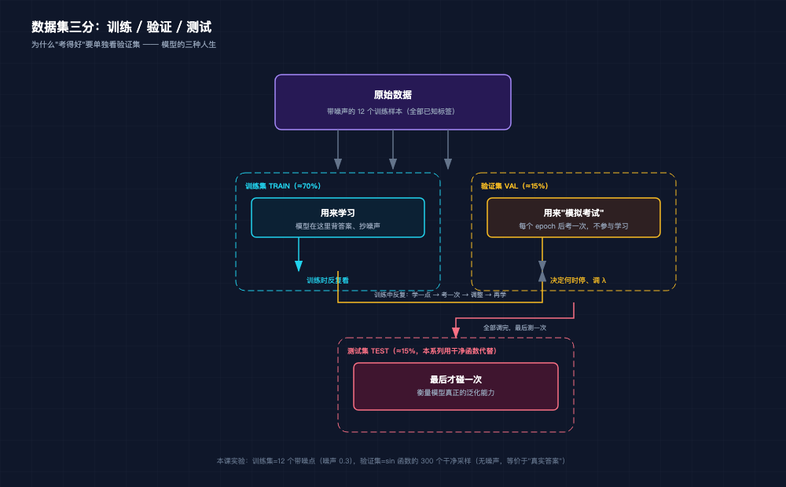
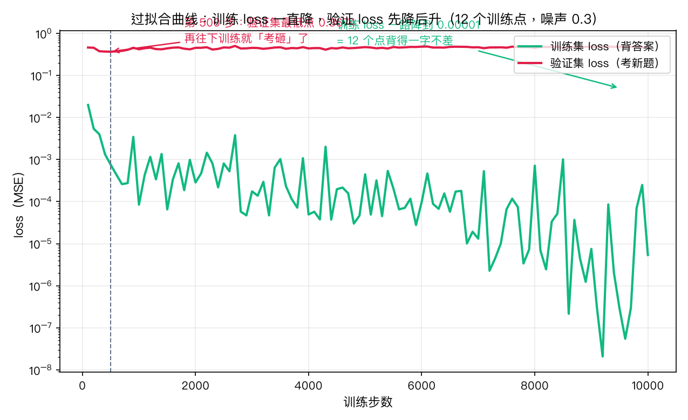
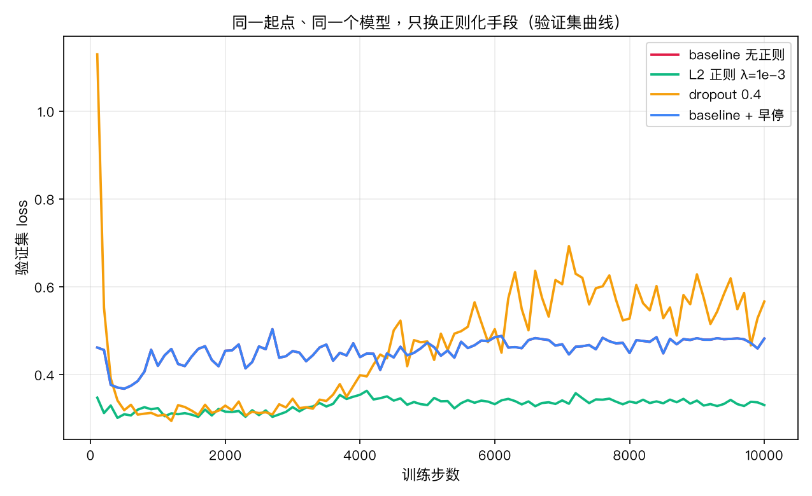
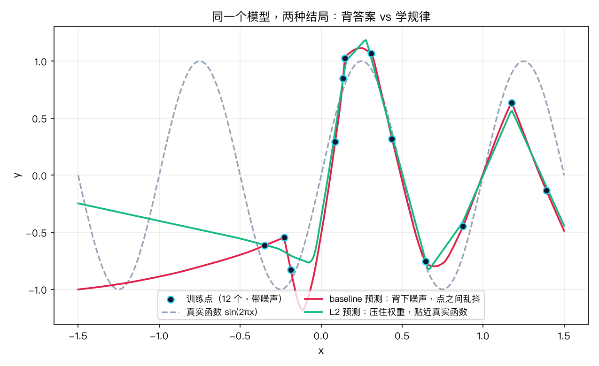
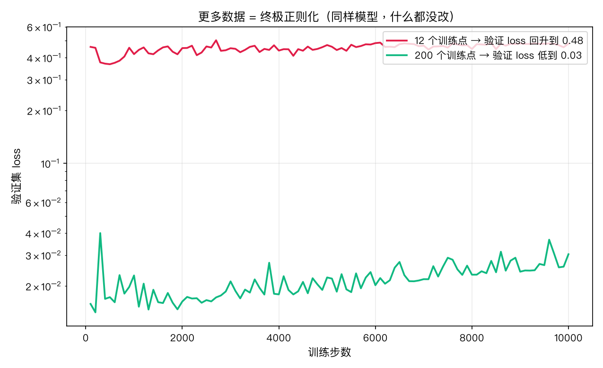

# 手搓大模型 10：泛化：过拟合与正则化——训练 loss 越低，考试可能越差

> 本节代码：✅ 见 `code/`（10-overfit.py 主实验 + 10-mini.py 最小演示 + 10-make-charts.py 画图）
>
> 本系列《手搓大模型：从零构建 NanoGPT》的第十课。
> 目标读者：零基础。第 9 课解决了"怎么下山"，这一课问一个更扎心的问题：**下到哪座山才算赢？** 答案是：训练集上的山底根本不重要，验证集上的表现才算数。

先看一组真实数字。同一个模型（1-512-512-1 的 MLP，26 万参数），在同一份数据上训练 10000 步，最后一步时：

```
训练集 loss = 0.00001   ← 12 个训练点，背得一字不差
验证集 loss = 0.4817    ← 换 300 个新点，考得一塌糊涂
```

训练误差几乎为零，验证误差却高达 0.48——**模型把训练数据里的噪声连锅端背了下来，一到新题就露馅。** 这就是深度学习里最经典、也最反直觉的现象：**过拟合（overfitting）**。

更戏剧化的是，第 500 步时这个模型的验证 loss 明明只有 0.3674，继续训练到 10000 步反而涨到 0.4817。**多练了 9500 步，越练越差。**

## 先给结论：五句话

- **过拟合 = 背答案。** 模型容量太大、数据太少时，它会把训练集连同噪声一起背下来，表现是训练 loss 一路狂降、验证 loss 先降后升。
- **数据集必须三分：train / val / test。** 训练集用来学，验证集用来"模拟考试"，测试集最后才碰。没有验证集，根本看不出模型在背答案。
- **weight decay（权重衰减，L2 正则）把权重往零拉。** 真实实验：权重平方和从 920 压到 35（26 倍），验证 loss 从 0.48 降到 0.33。大权重 = 剧烈的函数形状 = 乱抖。
- **早停是免费午餐。** 在验证 loss 最低点截断训练，本课实验省下 9500 步（95% 的训练时间），效果还更好。
- **更多数据是终极正则化。** 同样模型什么都没改，训练点从 12 个加到 200 个，验证 loss 从 0.48 降到 0.03——16 倍改善，吊打所有正则化技巧。

## 动机：为什么训练得好还会考砸？

从第 5 课到第 9 课，所有实验都在盯着训练 loss：它降了，就觉得模型变好了。但这里有个隐藏的前提——**训练用的数据，和真实世界要处理的数据，不是同一批。**

想象一场考试。训练集就是"平时作业"，模型做作业时，答案就在手边。容量足够大的模型，完全可以不学规律，直接把作业答案背下来：这题选 A、那题选 B，12 道题 12 个答案，一字不差。作业满分。可到了考场，题目全是新的——背答案的学渣当场懵掉，而真正学会规律的人，换什么题都会做。

神经网络比学渣更极端：**它连噪声都背。** 训练点里的每一个随机扰动，在模型眼里都是"规律"。作业上的答案背得越熟（训练 loss 越低），考场上的发挥就越差（验证 loss 越高）。

那怎么知道模型是在"学规律"还是在"背答案"？答案藏在第 8 课讲过的一个细节里：训练时模型看过某些数据，用这些数据算出来的 loss 永远有水分。必须拿**模型没见过的数据**来考它。

## 第一层解剖：数据集三分——模拟考试制度



正规做法是把所有数据切成三份，各有分工：

| 数据集 | 用途 | 比喻 | 参与训练吗 |
|---|---|---|---|
| 训练集 train | 更新参数，让 loss 下降 | 平时作业 | 是，每步都看 |
| 验证集 val | 每隔一段考一次，看泛化能力 | 模拟考试 | **否**，只看不学 |
| 测试集 test | 全部调完之后，最后测一次 | 期末考 | 否，最后才碰 |

验证集是这一课的主角。训练时，每 100 步把模型放到验证集上算一次 loss——模型没见过这些点，算出来的数字才反映真实水平。**这个"模拟考试"的分数有两个用途：判断有没有过拟合，以及决定什么时候停（早停）、正则化系数调多大。**

测试集和验证集的区别值得多说一句：验证集在训练中会被反复看（虽然不更新参数），调参调多了，验证集上也会"背答案"——这就是传说中的"验证集过拟合"。所以真正的终极考试（测试集）留到最后才碰一次。本课的实验里，用 300 个干净采样点当验证集（无噪声，等于"真实答案"），测试集的概念先埋个伏笔，第 10 课之后正式用。

## 第二层解剖：过拟合曲线长什么样



上图是本课实验的真实输出，横轴训练步数，纵轴 loss（对数刻度）。两条曲线讲了一个完整的故事：

- **绿色（训练 loss）**：一路狂降到 0.00001。模型把 12 个训练点背得一字不差——注意这些点本身带噪声，所以"背得一字不差"等于把噪声也记进了脑子。
- **红色（验证 loss）**：先降到第 500 步的 0.3674（这是模型真正学到规律的时刻），然后**掉头回升**，一路涨到 0.4817。

两条线在第 100 步左右就拉开了差距。之后的所有训练，都是在"把作业答案背得更熟"——训练 loss 还在降，但那是假象。**红线的回升，就是过拟合的指纹。** 只要看到验证 loss 掉头向上，就可以下结论：模型开始背答案了。

为什么训练 loss 低、验证 loss 高？因为噪声。训练点的 y 值 = 真实函数 + 随机噪声。模型把噪声背下来之后，在训练点上预测得完美，但在训练点之间，它为了硬穿每一个带噪点，函数形状被拧得弯弯曲曲——一到新点（验证集），这些弯曲就全部变成错误。

## 第三层解剖：三个武器的数学直觉

### 武器 1：weight decay / L2 正则——给权重上把锁

过拟合的函数形状"弯弯曲曲、张牙舞爪"，背后是**权重值太大**。数学上有个直接对应：权重大 → 输出对输入的变化剧烈 → 曲线陡峭乱抖。

对策很朴素：在损失函数里加一个"罚款"，让权重不要长太大：

```
loss = 数据误差(MSE) + λ × ‖w‖²
```

逐个符号的直觉：

- `‖w‖²`：所有权重平方的和。**直观理解就是"模型的复杂度税基"**——权重越大、越多，这个数越大。
- `λ`（lambda）：罚款力度。λ 越大，权重被压得越狠。
- 合起来：模型想降低数据误差，就得把权重放大；但权重一放大，罚款就涨。**最后模型只能找一个折中：误差尽量小，但权重别太嚣张。**

这套数学在统计学里叫**岭回归（ridge regression）**，在神经网络里叫 **weight decay（权重衰减）**——因为优化时它等价于"每一步把权重往零的方向推一点点"。实验里 λ=1e-3 的效果：权重平方和从 920.6 压到 35.3（26 倍），验证 loss 从 0.48 降到 0.33。

λ 不是越大越好。真实实验扫描（同一份数据，同一模型）：λ=1e-3 最好；λ=1e-2 时惩罚过猛，模型连训练集都学不动（欠拟合，验证 loss 反而变差）。**正则化是门平衡的艺术：压得太轻没用，压得太重把规律也压没了。**

### 武器 2：dropout——让模型不能只靠几个"尖子生"

weight decay 管权重大小，dropout 管"依赖关系"。做法粗暴：**训练时每次随机关掉一批神经元**（比如 40%），让它们的输出直接变零。

直觉：如果一个模型总是依赖某几个特定的"尖子生"神经元，尖子生一被关掉，模型就瘫痪——于是训练逼着模型把信息分散到所有神经元上，谁都不能独当一面，容错性就上来了。训练时关掉 40%，测试时全部打开，等于让 60% 能力的多个"子模型"平均投票。

本课实验里 dropout 的表现非常诚实：它单独使用时，验证 loss 最低点（0.2940 @1200 步）确实比 baseline 好，是四种配置里最漂亮的"考试瞬间"；但**训练到底之后，它的验证 loss 反而涨到 0.5661，比什么都不做还差**——因为被随机关掉的神经元逼着其他权重长得更大（权重范数 2011.9，全场最大），后期过拟合反而更猛。这个结果说明：dropout 不是万能药，在小而浅的网络、数据又少时，单独使用效果有限，真实大模型里它通常和 weight decay 一起上，而且网络越深越宽越有效。

### 武器 3：早停——听验证集的话

最省事的正则化：**盯着验证 loss，它开始回升就立刻停。** 本课实验里，baseline 的验证最低点在 500 步，训练到 10000 步反而更差。那为什么不 500 步就停？

这就是早停：训练中每 100 步记录验证 loss，同时保存"验证 loss 最低时"的模型快照（checkpoint）。训练结束后，把参数恢复回那个快照。结果：省下 9500 步，验证 loss 还停留在最好的 0.3674。

早停的本质是**把验证曲线当作教练**——训练到底只是手段，验证集上的表现才是目标。真实训练（包括 nanoGPT）里，checkpoint + 早停是标配，因为没人知道该训练多少步，验证集说了算。

## 代码层：最小可运行（40 行，两行代码治病）

完整实验在 `code/10-overfit.py`（约 200 行，四种配置 + 早停 + 拟合曲线采样）。先看一个 40 行的最小版，把"过拟合 vs 加 L2"的对比放在一起，运行命令：

```bash
~/projects/main-agent/nanoGPT/.venv/bin/python 10-mini.py
```

```python
# 依赖: torch 2.12.1 + numpy（venv 已装）
import numpy as np
import torch
import torch.nn as nn

torch.manual_seed(0)
np.random.seed(0)
LR, STEPS = 1e-3, 3000

# 1. 数据：sin 的 12 个带噪训练点 + 300 个干净验证点
np.random.seed(0)
x_tr = np.random.uniform(-1.5, 1.5, 12).astype(np.float32)
y_tr = (np.sin(2 * np.pi * x_tr) + 0.3 * np.random.randn(12)).astype(np.float32)
x_va = np.linspace(-1.5, 1.5, 300).astype(np.float32)
y_va = np.sin(2 * np.pi * x_va).astype(np.float32)
xt, yt = torch.tensor(x_tr[:, None]), torch.tensor(y_tr[:, None])
xv, yv = torch.tensor(x_va[:, None]), torch.tensor(y_va[:, None])

def run(lam):
    """lam=0 无正则；lam>0 加 L2 惩罚。返回 (train_loss, val_loss, 权重范数)。"""
    torch.manual_seed(42)                    # 固定起点：两种配置从同一个模型出发
    model = nn.Sequential(                    # 大容量 MLP：1-512-512-1（26 万参数）
        nn.Linear(1, 512), nn.ReLU(),
        nn.Linear(512, 512), nn.ReLU(),
        nn.Linear(512, 1))
    opt = torch.optim.Adam(model.parameters(), lr=LR)
    for _ in range(STEPS):
        opt.zero_grad()
        mse = nn.functional.mse_loss(model(xt), yt)
        l2 = sum((p ** 2).sum() for p in model.parameters())  # ① 所有权重平方和
        (mse + lam * l2).backward()          # ② 损失 = 数据误差 + λ×权重平方和
        opt.step()
    with torch.no_grad():
        t = nn.functional.mse_loss(model(xt), yt).item()
        v = nn.functional.mse_loss(model(xv), yv).item()
    w = sum((p ** 2).sum().item() for p in model.parameters())
    return t, v, w

t0, v0, w0 = run(0.0)                        # 无正则
t1, v1, w1 = run(1e-3)                       # L2 正则 λ=1e-3
print(f"无正则   : train={t0:.5f} val={v0:.4f} 权重范数={w0:.1f}  ← 背答案")
print(f"加 L2    : train={t1:.5f} val={v1:.4f} 权重范数={w1:.1f}  ← 学规律")
```

这段代码的全部核心就在第 27、28 两行：`l2 = sum((p ** 2).sum() for p in model.parameters())` 算出所有权重的平方和，然后 `(mse + lam * l2).backward()` 把它加进损失。**这就是整个 weight decay 的全部秘密——两行代码。** 真实框架里的 `weight_decay` 参数、nanoGPT 里的 AdamW，做的都是同一件事的工程化版本。

## 实验层：真实输出（Mac mini 实测，一字未改）

### 实验 1：四种配置，同一起点



```text
配置                    最终train    最终val    val最低    最低步数    权重范数
baseline               0.00001     0.4817     0.3674     500       920.6
l2_1e-3                0.00473     0.3302     0.3010     400        35.3
dropout0.4             0.00438     0.5661     0.2940    1200      2011.9
baseline+earlystop     0.00001     0.4817     0.3674     500       920.6
baseline+earlystop 恢复最优点后: train = 0.00076, val = 0.3674（省下 9500 步）
```

读表顺序：

- **baseline（红线）**：训练 10000 步后 train=0.00001、val=0.4817。训练误差接近零、验证误差惨不忍睹——过拟合的标准像。权重范数 920.6。
- **l2（绿线）**：λ=1e-3 时 train=0.00473（不再完美背答案）、val=0.3302（比 baseline 好 31%）。权重范数被压到 35.3，缩了 26 倍。**曲线从头到尾没有大幅回升——L2 把过拟合按住了一整局。**
- **dropout（橙线）**：val 最低点 0.2940 是四者里最漂亮的，但出现在第 1200 步；继续训练后一路涨到 0.5661，权重范数 2011.9 全场最大。**它给了最好的"考试瞬间"，却没能守住。** 这正是前面说的：dropout 单用在微型任务上，帮了倒忙的后期比不帮还糟。
- **earlystop（蓝点）**：baseline 的 500 步快照，val=0.3674，省下 9500 步。**用 baseline 自己的最优状态，打败了训练到底的 baseline。**

### 实验 2：背答案 vs 学规律，画出来看



把两个模型的预测曲线画在同一个坐标系里：

- 灰色虚线是真实函数 sin(2πx)——也就是"标准答案"。
- 蓝色点是 12 个带噪训练点。
- **红色（baseline）**：穿过每一个训练点（连噪声都精确穿过），但点与点之间疯狂乱抖——它记住的是"这 12 个点的坐标"，不是"正弦规律"。
- **绿色（L2）**：被 λ 罚款压着，不敢用大权重去拧曲线，只能走平滑路线，结果反而贴住了真实函数。

一张图看懂过拟合的本质：**过拟合模型在训练点上完美，在训练点之间胡言乱语。** 验证集恰好都是训练点之间的位置，所以它考砸。

### 实验 3：更多数据 = 终极正则化



最后一个实验，什么技巧都不用，只把训练点从 12 个加到 200 个：

```text
n=12  训练点: train=0.00001 val=0.4817  权重范数= 920.6
n=200 训练点: train=0.05909 val=0.0303  权重范数=7931.7
```

两个细节值得注意。第一，验证 loss 从 0.48 降到 0.03，**16 倍改善**——比前面所有正则化技巧加起来都猛。第二，200 个点那个模型的权重范数（7931.7）反而更大，但验证表现好得多。这说明**权重范数大不等于过拟合，关键是数据量能不能约束住它**——数据多了，模型见过的规律多了，大权重也在为"学规律"服务。

这就是为什么真实世界的团队最怕的不是"模型不够强"，而是"数据不够多"。**所有正则化技巧都是在数据不足时的补救措施。**

## 惊喜时刻

**惊喜 1：训练 loss 0.00001 时，模型其实已经"坏"了。** 从训练角度看它是满分学神，从验证角度看它是垫底学渣。第 5 课以来一直盯着训练 loss 下降就欢呼的习惯，从这一课开始要改——**只看训练 loss 的人，永远不知道自己训练了一个背答案的模型。**

**惊喜 2：两行代码，26 倍权重压缩。** `l2 = sum((p ** 2).sum() ...)` 加 `(mse + lam * l2).backward()`，整个 weight decay 就这两行。权重范数 920→35，验证 loss 0.48→0.33。

**惊喜 3：数据量吊打技巧。** 12 个点 → 200 个点，验证 loss 改善 16 倍，而 dropout/weight decay 的改善都不到 1 倍。**深度学习里最有效的"正则化"，是往数据集里加数据。**

**惊喜 4：早停省了 95% 的训练时间。** 验证集在 500 步时已经是最好的模型，剩下的 9500 步全是白练——甚至越练越差。**训练不是越久越好，验证集说了算。**

**惊喜 5：dropout 给过"全场最佳"却守不住。** 它 1200 步时验证 loss 0.2940 是全场最低，但训练到底后 0.5661 反超所有配置——**一个正则化武器单独上阵，可能比什么都不做更糟。** 正则化不是堆料，要理解每个武器管什么。

## 误区与彩蛋

**误区 1：验证 loss 越低越好？**
对，但有个前提——验证集不能反复"调"太多。训练中不断看验证集、不断调参，调多了验证集也会被"背"下来，这就是验证集过拟合。所以才有测试集的存在：最后碰一次，给个不带水分的分数。真实比赛里，很多人就是在验证集上刷分刷到飞起，一上测试集就现原形。

**误区 2：dropout 是深度学习必备？**
本课实验已经用真实数据回答了：单用 dropout 在小而浅的网络、数据又少时，可能比不用更差。dropout 的强项是"特征冗余"的场景——网络又宽又深、数据量大、每个特征都被多方印证（图像、语言模型都是这种）。它适合"锦上添花"，不适合"雪中送炭"。

**误区 3：weight decay 越大越好？**
实验扫描显示 λ=1e-3 最优，λ=1e-2 就欠拟合了。罚太狠，模型连训练集的规律都不敢用，验证 loss 同样变差。**正则化的本质是平衡，不是压制。**

**误区 4：正则化能替代数据？**
实验 3 是最好的一课：200 个点的裸模型（无任何正则）吊打 12 个点加满正则的模型。数据是源头，正则化只是数据不足时的补丁。

**彩蛋 1：nanoGPT 里怎么配的？** nanoGPT 的 train.py 里：`dropout=0.1`（attention 和 FFN 里都有）、`weight_decay=0.1`（AdamW）、加上验证集上挑最优 checkpoint。第 19 课拆 train.py 时会看到完整配置——这套组合拳就是真实世界的标准答案。

**彩蛋 2："权重范数大 = 坏模型"是错的。** 200 个点的模型范数 7931，比 12 个点的 920 大 8 倍，但泛化好 16 倍。范数要结合数据量看：**数据够多时，大权重是在服务规律；数据不够时，大权重是在背答案。**

**彩蛋 3：早停的"省时间"属性在真实训练里价值连城。** 大模型训练动辄数天，val 曲线早点掉头就能省下几十个小时。Karpathy 的 nanoGPT 训练脚本里，checkpoint 保存和 val 监控是默认配置，原因就在这里。

**彩蛋 4：L2 和 weight decay 在 PyTorch 里不完全是一回事。** 手动加的 `λ·‖w‖²` 是经典 L2（岭回归）；`torch.optim.AdamW` 的 `weight_decay` 是"解耦权重衰减"（decoupled weight decay），两者在 Adam 里数学上略有差异，但在直觉上都是"把权重往零拉"。本课用经典 L2 讲原理，第 19 课看 nanoGPT 时会遇到 AdamW 版本。

---

下一课，从"模型怎么学"切换到"计算机怎么理解词"：一个词不是字母串，而是一个向量。**第 11 课《Embedding：让计算机理解"词"》**——one-hot 的浪费、查表式的词向量、以及为什么"国王 - 男人 + 女人 ≈ 女王"。

*手搓大模型，第 10 课完成。训练 loss 会说谎，验证集不会。*

---

**本课完整代码与全文已开源到 GitHub（public）：**

https://github.com/flyingcloud-code/learning-nanogpt-from-0-to-1/tree/main/10-generalization

**系列仓库（30 课陆续更新中）：**

https://github.com/flyingcloud-code/learning-nanogpt-from-0-to-1
