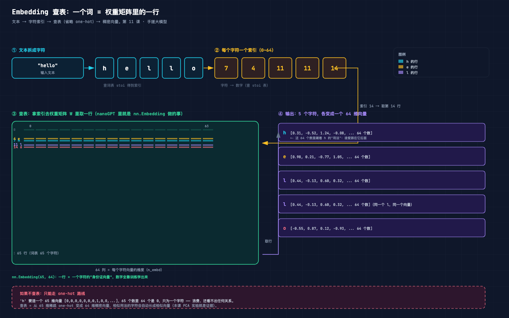
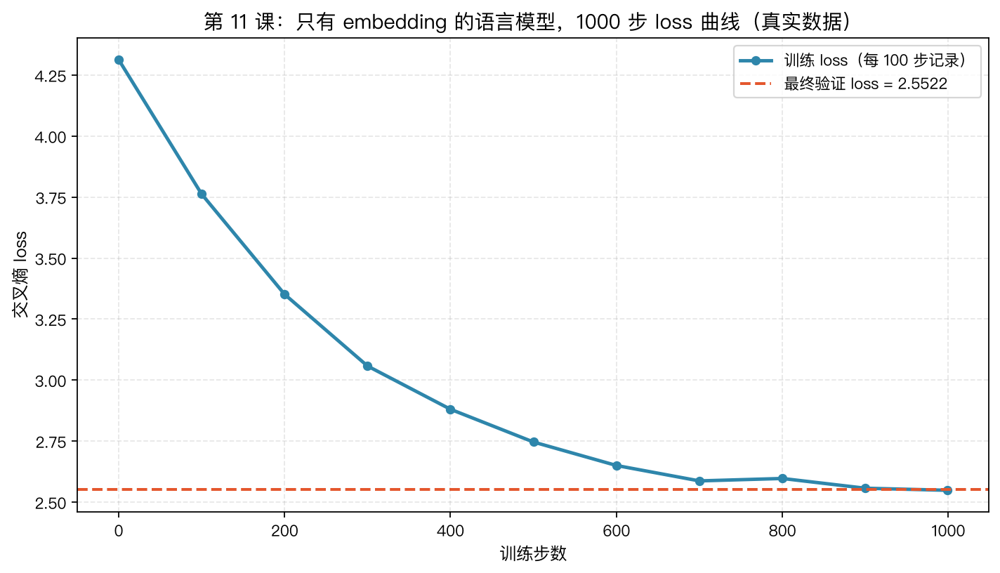
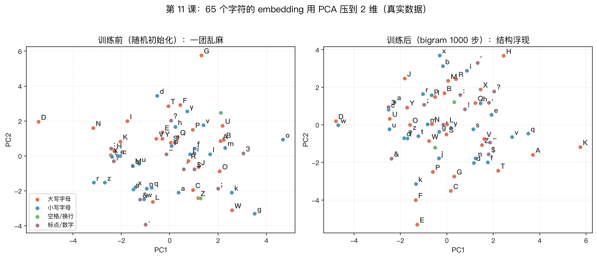
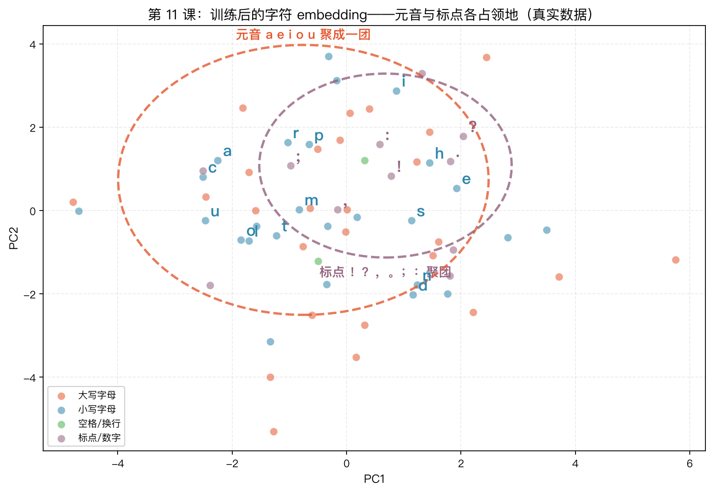

# 手搓大模型 11：Embedding：让计算机理解"词"——65 个字符，每个都变成一行数字

> 本节代码：✅ 见 `code/`（11-mini.py 最小演示 + 11-embedding.py 主实验 + 11-make-charts.py 画图）
>
> 本系列《手搓大模型：从零构建 NanoGPT》的第十一课。
> 目标读者：零基础。第 1-10 课都在处理数字：sin 值、坐标、分类标签。这一课回答一个绕不开的问题：**文本是一串字符，怎么喂给只会做乘法的神经网络？**

先看一组真实数字。本课只训练了一个 8385 参数的模型——没有 attention、没有 transformer，**只有一个查表操作**。训练 1000 步只花了 3 秒，loss 从 4.31 降到 2.55。然后把 65 个字符的向量用 PCA 压到 2 维画出来：

- 元音字母 **a、o、u** 自己聚到了一团；
- 标点符号 **! ? : , .** 扎堆在另一个角落；
- 空格和大写字母的关系也悄悄浮现（空格后面总跟大写，模型记住了）。

**没有任何人告诉模型"元音是一类"。它是自己从文本里长出来的。** 这就是 Embedding——本课的主角。

## 先给结论：五句话

- **词不能直接喂给神经网络。** 矩阵乘法吃的是数字，文本是一串字符，必须先变成数字。
- **one-hot 可以，但浪费到离谱。** 65 个字符的 one-hot 向量，65 个数里 64 个是 0，只为一个字符服务。
- **embedding = 查表。** `nn.Embedding(65, 64)` 本质是一张 65 行 × 64 列的权重表，查表就是"拿索引取一行"。
- **查表在数学上等于 one-hot × 权重矩阵。** 本课实验验证：两条路线的输出**最大差异 0.00e+00**——完全相等，查表只是把浪费的部分省略了。
- **训练后 embedding 自己长出结构。** 相似用法的字符向量会互相靠近（元音聚团、标点聚团），这是本课 PCA 实验的直接证据。

## 动机：没有它行不行？

前 10 课喂给模型的东西长这样：`x = 0.32`、`x = [1.2, -0.5, 0.8]`、标签 `0/1/2`。全是数字。

现在要处理莎士比亚。文本长这样：

```
First Citizen:
Before we proceed any further, hear me speak.
```

一串字符。字符不能直接乘权重矩阵——`'h' × 0.5` 没有意义。

最笨的办法：给每个字符编号，把编号当数字喂进去。比如 `'a'=0, 'b'=1, ..., 'z'=25`。听起来顺理成章，但有个致命问题：**编号自带大小关系**。模型看到 `'a'=0, 'b'=1`，会以为 b 比 a "大一点"；看到 `'a'=0, 'z'=25`，会以为 z 是 a 的 25 倍。这些关系全是人为强加的，文本里根本没有这回事。

那换个思路：不用一个数字表示一个字符，用**一组数字**（一个向量）表示。向量之间没有天然的大小顺序，可以自由设计——相似用法的字符，向量就长得像。这套办法就是 embedding，做这件事的操作叫**查表（lookup）**。

## 第一层解剖：结构长啥样



上图是整课的地图，从左往右读：

| 步骤 | 发生了什么 | 比喻 |
|------|-----------|------|
| ① 文本拆字符 | `"hello"` → `h e l l o` | 把句子拆成最小零件 |
| ② 字符变索引 | `h→7, e→4, l→11, l→11, o→14` | 查一本"字符→编号"的字典（stoi） |
| ③ 索引查表 | 拿索引去权重矩阵 W 里**取一行** | 按座位号去教室找位置 |
| ④ 输出向量 | 每个字符变成 64 个数字 | 每个字符领到一张"身份证" |

关键在第三步：**索引不是作为"数值"参与运算，而是作为"行号"去取数。** `nn.Embedding(65, 64)` 就是一张 65 行（词表大小）× 64 列（向量维度）的权重表：

```
W = 65 行 × 64 列 的矩阵
    第 0 行  → 字符 '\n' 的向量
    第 1 行  → 字符 ' ' 的向量
    第 7 行  → 字符 'h' 的向量
    第 43 行 → 字符 'e' 的向量
    ...
```

**"这一行的 64 个数字，就是这一个字符在模型眼里的全部身份。"**

## 第二层解剖：数据怎么流动

先看 one-hot 路线，再看查表路线，最后看为什么两者数学上相等。

### 路线 A：one-hot（教科书定义，浪费版）

"one-hot"（独热）的意思：一个向量里，只有一位是 1，其余全是 0。字符 `h` 的索引是 7，它的 one-hot 向量就是：

```
索引:  0  1  2  3  4  5  6  7  8  9 ... 64
h  → [ 0  0  0  0  0  0  0  1  0  0 ...  0 ]
```

65 个数，64 个是 0。要表示 5 个字符，就得造 5 个这样的稀疏向量，每个都长达 65。

### 路线 B：查表（实际用的，省事版）

`nn.Embedding` 只有一张 65×64 的权重表。查 `h`（索引 7）= 直接取第 7 行：

```
h → W[7] = [0.31, -0.52, 1.24, -0.08, ...]   ← 64 个数字，一行搞定
```

### 为什么两条路数学上相等？

这是本课第一个"啊哈"。**one-hot 向量乘权重矩阵，得到的就是权重矩阵的对应行**：

```
[0 0 0 0 0 0 0 1 0 ...]  @  W   =  W 的第 7 行
        ↑ 只有第 7 位是 1           ↑ 1 只在第 7 位，所以只会"选中"第 7 行
```

矩阵乘法的规则：结果向量的每一位，是 one-hot 与 W 某一列对应位置相乘再求和。one-hot 里只有第 7 位是 1，所以其余 64 位的贡献全是 0，只剩 W 第 7 行的数字原样通过。

**查表不是 one-hot 的"近似"，而是它的精确等价——只是把 64 个乘 0 的无效计算省掉了。** 本课实验用真实数字验证过，两条路线的输出最大差异是 `0.00e+00`。

## 第三层解剖：数学细节（每个符号的直觉）

### Embedding 矩阵 W

```
W ∈ R^(V × D)
```

- `V` = 词表大小（vocabulary size）。本课实验里是 65（莎士比亚全部字符）。**直觉：字典里有多少个词条。**
- `D` = 向量维度（也叫 n_embd）。本课实验用 64。**直觉：每张"身份证"上填几个格子。**
- `W` 的第 `i` 行，就是索引 `i` 对应字符的向量。**直觉：字典第 i 页上写的地址。**

### 查表操作

```
e_i = W[i]
```

- `i` = 字符索引（0 到 64）。**直觉：页码。**
- `e_i` = 索引 i 的 embedding 向量。**直觉：翻到那一页，把整页抄下来。**
- 注意 `i` 不参与数值计算——它只决定"取哪一行"。

### 训练时的流动

```
字符索引 i → 查表得 e_i → 送进模型 → 预测下一个字符 → 算 loss → 反向传播
                                                        ↓
                                       W[i] 这一行的 64 个数被微调一点点
```

反向传播（第 7 课）会更新 W 的值。**哪个字符爱跟哪个字符一起出现，模型就把它们的行往"相似方向"推。** 这是整个 embedding 的灵魂：相似用法的字符，向量自动靠近。

### PCA：把 64 维压到 2 维

训练完的向量是 64 维的，人眼看不见。PCA（主成分分析）的直觉一句话：**找一个方向，让所有点的投影散得最开（方差最大），这是第一主成分；再找一个与之垂直、散得次开的方向，这是第二主成分。** 用这两个方向当坐标轴，64 维数据就能画到纸上，同时尽量保住点与点的远近关系。

```
PCA 三步：
1. 所有向量减去均值（把原点挪到数据重心）
2. 对中心化后的矩阵做 SVD 分解（把数据旋转到"最分散"的方向）
3. 取前两个方向的投影坐标，画散点图
```

本课代码里手写了这个 PCA（十几行，不依赖任何外部库），后面实验层会展示结果。

## 代码层：最小可运行（30 行看懂查表）

完整实验在 `code/11-embedding.py`。先看 30 行的最小版，把"查表 = one-hot × 权重矩阵"这件事钉死，运行命令：

```bash
~/projects/main-agent/nanoGPT/.venv/bin/python 11-mini.py
```

```python
# 依赖: torch（venv 已装）
import torch
import torch.nn as nn

torch.manual_seed(0)

vocab = ['h', 'e', 'l', 'o']          # 词表 4 个字符
emb = nn.Embedding(4, 3)              # 4x3 权重矩阵：4 行词表 × 3 维向量

with torch.no_grad():
    W = emb.weight.numpy()            # 把权重表取出来看

print("权重矩阵 W = (4 行词表) x (3 维向量)：")
print(W.round(3))

idx = torch.tensor([1])               # 字符 'e' 的索引
vec = emb(idx).detach().numpy()       # 查表：取第 1 行
print("\n查表 emb([1])   =", vec.round(3))

onehot = torch.zeros(1, 4)            # 造 one-hot 向量
onehot[0, 1] = 1.0                    # 只有第 1 位是 1
vec2 = (onehot @ emb.weight).detach().numpy()   # one-hot 乘权重矩阵
print("one-hot 乘权重 =", vec2.round(3))

diff = abs(vec[0] - vec2[0]).max().item()
print(f"\n最大差异 = {diff:.2e}  → 完全相等，查表只是省略了 one-hot 而已")
```

逐行注释都在代码里。跑出来的真实输出：

```text
权重矩阵 W = (4 行词表) x (3 维向量)：
[[ 1.541 -0.293 -2.179]
 [ 0.568 -1.085 -1.399]
 [ 0.403  0.838 -0.719]
 [-0.403 -0.597  0.182]]

查表 emb([1])   = [[ 0.568 -1.085 -1.399]]
one-hot 乘权重 = [[ 0.568 -1.085 -1.399]]

最大差异 = 0.00e+00  → 完全相等，查表只是省略了 one-hot 而已
```

`emb([1])` 取的是权重矩阵第 1 行 `[0.568, -1.085, -1.399]`；`[0,1,0,0] @ W` 算出来也是 `[0.568, -1.085, -1.399]`。**最大差异是 0——不是"差不多"，是严格相等。**

## 代码层：主实验（训练一个只有 embedding 的模型）

最小版证明了"查表是什么"，但还没回答"查出来的向量有没有意义"。主实验 `code/11-embedding.py` 干一件事：训练一个**只有 embedding 的语言模型**，然后看 embedding 长成了什么样。

模型长得极简——nanoGPT 的最原始形态，没有 attention，只看"前一个字符"：

```bash
~/projects/main-agent/nanoGPT/.venv/bin/python 11-embedding.py
```

```python
# 依赖: torch 2.12.1 + numpy（venv 已装）
# 数据: ~/projects/main-agent/nanoGPT/data/shakespeare_char/{train,val}.bin
class BigramEmbeddingModel(nn.Module):
    def __init__(self, vocab_size, n_embd):
        super().__init__()
        self.emb = nn.Embedding(vocab_size, n_embd)   # ① 唯一的"记忆库"
        self.head = nn.Linear(n_embd, vocab_size)     # ② 向量 → 下一个字符的分数
    def forward(self, idx):
        # idx: (B, T) 字符索引 → (B, T, n_embd) → (B, T, vocab)
        return self.head(self.emb(idx))               # ③ 查表 + 一层线性变换

N_EMBD = 64       # 每个字符 64 维
BLOCK = 64        # 每次看 64 个字符的窗口
BATCH = 256       # 每批 256 条序列
STEPS = 1000
model = BigramEmbeddingModel(65, N_EMBD)              # 词表 65，维度 64
opt = torch.optim.AdamW(model.parameters(), lr=3e-4)

for step in range(STEPS):
    x, y = get_batch("train")          # x: 当前字符, y: 下一个字符（监督信号）
    logits = model(x)
    loss = nn.functional.cross_entropy(logits.view(-1, 65), y.view(-1))
    opt.zero_grad()
    loss.backward()                    # 反向传播：更新 emb 和 head
    opt.step()
    if step % 100 == 0:
        print(f"step {step:4d}  loss {loss.item():.4f}")
```

这个模型一共 `65×64 + 64×65 = 8385` 个参数，其中 **embedding 表占 4160 个（一半）**。训练目标：看到当前字符，猜下一个字符。猜得越准，embedding 表就被调得越"懂"字符之间的共现规律。

## 实验层：真实输出（Mac mini 实测，一字未改）

### 实验 1：训练 3 秒，loss 4.31 → 2.55



```text
step    0  loss 4.3135
step  100  loss 3.7626
step  200  loss 3.3517
step  300  loss 3.0577
step  400  loss 2.8804
step  500  loss 2.7462
step  600  loss 2.6501
step  700  loss 2.5869
step  800  loss 2.5968
step  900  loss 2.5569
step  999  loss 2.5484
最终  train loss = 2.5404  val loss = 2.5522
```

几个细节：
- 1000 步只花了 **3 秒**——因为没有 attention 那套复杂运算，整个模型就是"查表 + 一个线性层"。
- loss 4.31 → 2.55：一个只会查表的模型，真的从莎士比亚文本里学到了东西（随机猜是 ln(65)≈4.17，训练后明显低于它）。
- train 2.5404 / val 2.5522，几乎不差：模型很小，没有过拟合（第 10 课的知识用上了）。

### 实验 2：训练前 vs 训练后，PCA 一图看清



左图是**随机初始化**的 embedding（还没训练），65 个字符在 PCA 平面里挤成一团，没有任何规律——因为向量全是随机数。

右图是**训练 1000 步后**的 embedding。不需要仔细看就能发现：**点散开了，颜色分层了。** 红色（大写字母）沉在下方，蓝色（小写字母）和绿色（空格）浮在上方，紫色（标点）聚在右上。模型没看过任何"语法规则"，它只是反复做"猜下一个字符"这一件事，就自己总结出了规律：

- **大写字母只在句首出现**（后面永远跟小写字母），所以它们沉在专属区域；
- **空格和标点都是"停顿"**，后面都爱跟大写字母，所以它们挤在一起。

### 实验 3：元音聚团、标点扎堆——embedding 自己长出了"词性"



这张图把重点字符放大，并画了两个圈：

- **红圈：元音 a、e、i、o、u。** 它们散落在图中间偏上的位置，彼此靠近。为什么？因为元音在英语里的"行为"高度相似——它们互相组合、跟在同样的辅音后面、承担类似的发音角色。模型在预测下一个字符时反复遇到这种相似性，就把它们的向量往一起推。
- **紫圈：标点 ! ? : , . ;。** 它们扎堆在右上。因为标点的行为也高度相似——永远出现在词与词的间隙，后面永远跟空格或大写。

**这是本课最大的啊哈：没有任何人给模型标注"a 和 o 都是元音"，它自己从 100 万字符的统计里把元音"挖"了出来。**

再补一个数字层面的证据——用余弦相似度（衡量两个向量方向是否一致，1 表示完全同向）找最近邻，真实输出：

```text
与 'a' 最近的字符(余弦): [('o', 0.295), ('J', 0.294), ('u', 0.242), ('s', 0.216), ('m', 0.158)]
与 'e' 最近的字符(余弦): [('r', 0.257), (',', 0.245), ('m', 0.245), ('$', 0.172), ('!', 0.162)]
与 ':' 最近的字符(余弦): [('x', 0.267), ('!', 0.26), ('?', 0.198), ('G', 0.172), ('-', 0.152)]
```

- `a` 的邻居里有 `o` 和 `u`——**元音扎堆**（`o` 相似度最高 0.295）；
- `:` 的邻居里有 `!` 和 `?`——**标点扎堆**；
- `e` 的邻居里有 `r`——英语里 `er` 组合极高频，模型记住了这个"搭档"。

这些数字不高（0.2-0.3），因为它只是个 8385 参数的玩具模型，但**方向完全正确**：相似用法的字符，向量就是靠近。

## 惊喜时刻

**惊喜 1：查表 = one-hot 矩阵乘法，误差精确为 0。** 不是近似，是严格相等。one-hot 路线要造 65 维向量、做 65 次乘法（64 次乘 0），查表路线直接取一行——**结果一样，省掉 64/65 的无效计算。**

**惊喜 2：3 秒、8385 个参数，模型自己学会了"元音是一类"。** 没有词典、没有语法书、没有人工标注，只靠"猜下一个字符"这一个任务，embedding 表里就长出了元音聚团、标点扎堆的结构。

**惊喜 3：它记住了"空格后面跟大写"。** PCA 图里空格和标点挤在一起，大写字母沉在下方——这是莎士比亚文本里"每句开头大写"的统计规律，模型通过 embedding 的空间位置记录了下来。

**惊喜 4：同一个字符，永远拿到同一个向量。** `"hello"` 里两个 `l`，查表得到完全相同的向量（真实输出里两行一模一样）。这是 embedding 的特性：**字符的身份固定，但它在句子里的位置信息完全丢失了**——"la"里的 l 和 "ll"里的 l 在模型眼里没区别。这个"缺陷"恰恰是后面 attention（第 14 课）要补上的洞。

## 误区与彩蛋

**误区 1：embedding 是"查词典找词义"？**
不是。embedding 表里存的是**用法档案**，不是字典释义。模型根本不"知道" `a` 是元音——它只知道 `a` 出现的上下文里，经常伴随着某些其他字符。所谓"意义"，是训练时从共现统计里挤出来的副产品。

**误区 2：embedding 维度越大越好？**
不一定。维度（n_embd）是超参数，要跟数据量匹配：数据少、维度高，embedding 表容易过拟合（第 10 课的知识）；数据多、维度不够，表达力受限。本课玩具模型用 64 维；真实 nanoGPT 用 384 维（字符级）或 768 维（GPT-2 小号）。

**误区 3：随机初始化的 embedding 不能训练？**
可以，而且常见。本课实验就是从随机初始化开始训的——训练前 PCA 是一团乱麻，训练后结构浮现。embedding 表不需要任何预训练初始化，它是模型参数，随训练一起被优化。

**误区 4：one-hot 和 embedding 是两种东西？**
数学上完全等价（实验验证误差 0.00e+00），只是实现效率不同。one-hot 是"定义版"，embedding 查表是"工程版"。理解这一点，后面读 nanoGPT 源码时不会懵。

**彩蛋 1：embedding 丢了位置信息，这是 attention 的伏笔。** 同一个 `l` 不管在哪个位置都是同一行向量。真实 GPT 怎么处理？给每个位置也配一张 embedding 表（position embedding），token 向量 + 位置向量相加。这是第 17 课《Transformer 块》的内容，本课先埋个种子。

**彩蛋 2：embedding 表占了 nanoGPT 参数的近三分之一。** 10.65M 参数里，token embedding 65×384 + position embedding 1024×384 ≈ 418K……等等，这里有个小坑：nanoGPT 的 `vocab_size=65, block_size=1024` 时，两张 embedding 表加起来约 418K，占比约 4%。占比多少取决于词表大小和序列长度，第 18 课拆 model.py 时一起算。

**彩蛋 3："国王 - 男人 + 女人 ≈ 女王"在字符级做不出来，但方向是对的。** 经典词向量里著名的类比关系（国王的向量减去男人的向量，加上女人的向量，得到接近女王的向量）需要**语义级**的词表（一个 token 是一个词）和海量语料。本课字符级玩具只有 65 个 token，做不出词义类比——但它证明了同一件事：**向量空间里的"距离"和"方向"承载了语言的结构**。第 20 课手搓 BPE 后，词表从字符升级成词块，再回头看这个类比会清晰得多。

**彩蛋 4：stoi 字典只做"字符→编号"，反过来的 itos 做"编号→字符"。** 本课实验读的 `meta.pkl` 里就存着这两张表。训练时用 stoi 把文本变成索引喂模型，生成时用 itos 把模型吐出的索引变回字符。第 12 课讲 next token prediction 时会反复用到。

---

下一课，正式把"语言模型"立起来：模型到底在预测什么、训练目标怎么设计、以及"困惑度"为什么是语言模型的体温计。**第 12 课《语言模型：next token prediction》**——embedding 把字符变成了数字，接下来该让数字学会"接话"了。

*手搓大模型，第 11 课完成。一个查表操作，就是语言模型理解世界的第一块砖。*

---

**本课完整代码与全文已开源到 GitHub（public）：**

https://github.com/flyingcloud-code/learning-nanogpt-from-0-to-1/tree/main/11-embedding

**系列仓库（30 课陆续更新中）：**

https://github.com/flyingcloud-code/learning-nanogpt-from-0-to-1
