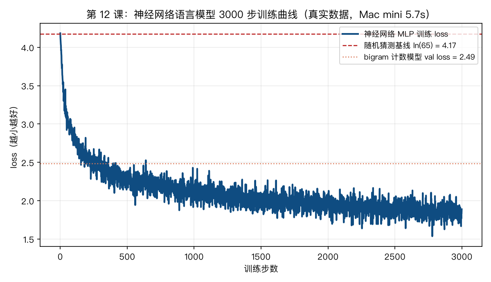
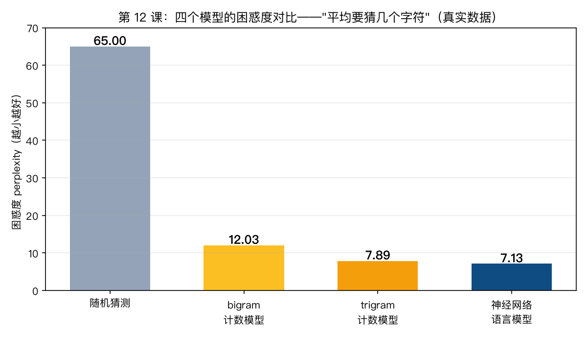

# 手搓大模型 12：语言模型：next token prediction——GPT 的全部秘密，就是"接话"

> 本节代码：✅ 见 `code/`（12-ngram.py 数数版 + 12-neural-lm.py 神经网络版 + 12-make-charts.py 画图）
>
> 本系列《手搓大模型：从零构建 NanoGPT》的第十二课。
> 目标读者：零基础。前 11 课把零件备齐了：张量（第 2 课）、梯度（第 7 课）、损失（第 8 课）、embedding（第 11 课）。这一课回答系列里最核心的一个问题：**模型到底在学什么？**

先摆一组真实数字（Mac mini 实测，一字未改）：

- **随机猜测**：65 个字符里瞎猜，困惑度 = 65；
- **bigram 计数模型**（纯数数，零训练）：困惑度 12.03——但如果不做平滑，验证集 loss 直接是 **inf**（无穷大）；
- **trigram 计数模型**（多记一位）：困惑度 7.89——可它记的 65³ = 27 万种组合里，**95.9% 在训练集里一次都没出现过**；
- **神经网络语言模型**（本课主角，15 万参数）：困惑度 **7.13**，而且它"接话"接出了这个：

```text
ROMEO:
To be, or not to be, willing, ...
MENENIUS:
And the camy brother be bolther, ...
```

**只看前 8 个字符，一个 152,193 参数的 MLP，训练 5.8 秒，就学会了"角色名 + 冒号 + 台词"的莎士比亚格式。** 它没有词典，没有语法书，唯一的任务是：猜下一个字符。

这就是本课的全部秘密：**GPT 不是什么神秘的东西，它就是一个"接话机器"——每走一步，猜下一个 token 是什么。**

## 先给结论：五句话

- **语言模型 = 预测下一个 token 的概率分布。** 给它一串文本，它输出"下一个字符是 a 的概率 0.01、是 e 的概率 0.52……"。
- **训练目标只有一条：让真实下一个 token 的概率尽量高。** 等价于最小化交叉熵 loss（第 8 课）。
- **n-gram 计数模型是最朴素的语言模型**：数一数"字符 i 后面跟过哪些字符"，用频率当概率。零训练，纯统计。
- **n-gram 有个致命伤：数据稀疏。** 词表一大、窗口一长，绝大多数组合根本没见过，概率算出来是 0，loss 直接爆炸成 inf。
- **神经网络解决了稀疏问题**：参数共享让它"见过类似情况就能举一反三"，困惑度一路从 65 压到 7.13。

## 动机：没有它行不行？

先问一个最基本的问题：模型训练的时候，到底在拟合什么？

第 8 课讲过 loss，第 11 课训过一个"查表模型"——它的训练目标就是：看到当前字符，猜下一个字符。但那一课的重点是 embedding 长什么样，没有正面回答：**"猜下一个字符"为什么是万能任务？**

答案是：**几乎所有语言任务都可以改写成"猜下一个字符"。**

- 续写：`"To be, or not to b"` → 猜下一个是 `e`；
- 完形填空：`"The cat ___ on the mat"` → 猜下一个是 `sat`；
- 翻译、摘要、问答：把"问题 + 已有回答"拼成一段，让模型继续往下接。

语言是有顺序的。**只要能以极高质量预测"下一个"，就等于学会了语言的规律。** 这一课把这条主线立起来：先看最朴素的"数数版"语言模型长什么样、它死在哪儿，再看神经网络怎么活下来，最后引入"困惑度"这把体温计。

## 第一层解剖：结构长啥样


上图是本课的地图，从左往右读：

| 步骤 | 发生了什么 | 比喻 |
|------|-----------|------|
| ① 输入 | `"To be or "` 8 个字符，各变成索引 | 把一句话拆成 8 张"身份证"（第 11 课） |
| ② 查表 | 每个索引取出一个 64 维向量 | 8 张身份证拼成一叠 |
| ③ 过网络 | 8×64 维 → MLP → 65 个分数 | 给 65 个候选字符各打一个分 |
| ④ softmax | 分数变概率，全部加起来 = 1 | 65 个候选人按分数分蛋糕 |
| ⑤ 训练目标 | 真实下一个字符的概率越高越好 | 谁是真答案，就把谁的蛋糕切大 |

关键在 ⑤：**训练时我们手里有"标准答案"**（真实文本里紧跟的那个字符），所以 loss 可以算：真实答案的概率越高，loss 越低。**生成时没有标准答案**，就从概率分布里抽一个字符，接上去，再继续猜下一个。训练和生成，共用同一个"猜下一个"的循环——只是训练时有答案可对，生成时只能自己赌。

## 第二层解剖：n-gram——最朴素的语言模型，也是第一个"啊哈"

在动手训练神经网络之前，先看一个更笨的办法：**不训练，直接数数。**

莎士比亚训练集有 100 万个字符。数一遍：字符 `h` 后面跟的是 `e` 多少次？跟的是 `i` 多少次？把 65×65 个"字符对"全部数一遍，归一化成概率——这就是 **bigram（二元语法）计数模型**：

```text
P(下一个 = j | 当前 = i) = 字符对 (i, j) 出现的次数 / 字符 i 出现的总次数
```

翻译成人话：**"h 后面 20% 是 e、8% 是 i、2% 是空格……"** 就这么一张 65×65 的统计表，直接当语言模型用。零训练、零参数更新，纯数数。

### 啊哈 1：不平滑，验证集 loss 直接是 inf

真实输出（本课 `code/12-ngram.py`）：

```text
bigram 计数模型（4225 个格子，零训练）
  不做平滑: train loss = 2.4519   val loss = inf   val perplexity = inf
  加 0.01 平滑: train loss = 2.4519   val loss = 2.4875   val perplexity = 12.03
```

训练集里 loss 只有 2.45，看起来很"会"；一到验证集，**loss 变成无穷大**。为什么？

因为验证集里有训练集没出现过的字符对。比如训练集里 `Q` 后面从来不是 `z`，可验证集偏偏出现了一次。模型给出的概率是 0，而 `-log(0) = +∞`——一个没见过的组合，直接把整个验证集 loss 打成 inf。

**这就是数据稀疏（data sparsity）：有限的文本，装不下所有可能的组合。** 65 个字符的两两组合才 4225 种，已经漏了；要是词表变成 5 万个词、窗口变成 8 个词，组合数是天文数字，数数法必死无疑。

补丁办法叫**平滑（smoothing）**：每个格子先加 0.01，假装所有组合都"见过一点点"。加了平滑，val loss 恢复正常（2.49），但这是"假装"，治标不治本。

### 啊哈 2：trigram 一看上下文，95.9% 的组合没出现过

窗口加长一位：看前 2 个字符猜第 3 个（trigram，三元语法）。真实输出：

```text
trigram 计数：共 11,228 种组合出现过，占总空间 274,625 的 4.088%
  → 剩下 95.912% 的组合在训练集里一次都没出现

trigram 计数模型（含 +0.01 平滑）
  train loss = 1.9039   val loss = 2.0658   val perplexity = 7.89
```

窗口只加了一位，组合空间立刻从 4225 膨胀到 274,625，**训练集只覆盖了 4.1%**。95.9% 的组合全靠平滑的 +0.01 在"撑场子"——那不是学到的知识，是注水。

**n-gram 的死结：窗口越长越"懂"，但数据越稀疏；窗口越短数据越密，但越"瞎"。** 想要记住"ROMEO:"这种长依赖，数数法永远做不到。

## 第三层解剖：神经网络怎么活下来

神经网络的解法很朴素：**不数每一种具体组合，而是学一个"组合 → 分数"的函数。**

函数的好处是：**没见过的输入，也能给输出。** 比如模型从没在训练集里见过 `"Qz"` 这个字符对，但只要它见过 `"Qu"`、`"Qa"` 之类的对，embedding 表（第 11 课）会把 `z` 和 `u` 的向量放在相似的位置——于是 `"Qz"` 也能得到一个"说得过去"的概率，而不是 0。

参数共享（第 6 课 MLP 的知识）让模型能**举一反三**：65 个字符的 embedding 向量是共享的，见过 `u` 的用法，就自动迁移到跟 `u` 相似的 `z` 上。这是 n-gram 计数模型给不了的能力。

本课实验的网络结构（比第 11 课多了一层、窗口更长）：

```text
8 个字符索引 → Embedding(65, 64) → 拼成 8×64=512 维
→ Linear(512, 256) → Tanh → Linear(256, 65) → 65 个分数 → softmax → 概率
```

**输入：前 8 个字符；输出：第 9 个字符的 65 个概率。** 就这么多。没有 attention、没有 transformer，一个两层 MLP。

### 训练目标：让真实下一个字符的概率最高

每个训练样本长得像这样：

```text
输入 x = [T, o, ' ', b, e, ' ', o, r]    （前 8 个字符的索引）
标签 y = [e]                              （真实第 9 个字符）

模型输出 65 个概率，其中 P(e) = 0.52
loss = -log P(e) = -log 0.52 = 0.65       （交叉熵，第 8 课）
```

**loss 的直觉：真实答案的概率越接近 1，loss 越接近 0；越离谱，loss 越大。** 反向传播（第 7 课）把这份"失望"传回网络，把 embedding 和两个 Linear 层的参数各调一点点。3000 步之后，模型就从"瞎猜"变成"会接话"。

### 困惑度（perplexity）：语言模型的体温计

训练完怎么量化"这模型多会接话"？直接看 loss 不够直观。于是定义一个更人性化的指标：

```text
perplexity = exp(loss)
```

**直觉：困惑度 = "平均每次猜下一个字符，模型心里有几个备选答案"。**

- 随机瞎猜 65 个字符，困惑度 = 65（平均 65 选 1，一点信息都没有）；
- bigram 计数：困惑度 12.03——模型"心里"平均只剩 12 个候选了；
- trigram：7.89——候选缩到不到 8 个；
- 神经网络：7.13——**最优**，平均 7 个候选里挑一个，常常一挑就对。

困惑度是**指数级**的：loss 降 0.3，困惑度大约降 26%。所以"loss 从 4.17 到 1.96"听起来平淡，翻译成困惑度是"从 65 选 1 变成 7 选 1"——**能力差了一个数量级。** 后面第 25 课评估 GPT 时会再用到它。

## 代码层：最小可运行（两个版本，都能直接跑）

### 版本一：数数版（15 行核心，零训练）

完整代码 `code/12-ngram.py`，运行命令：

```bash
~/projects/main-agent/nanoGPT/.venv/bin/python 12-ngram.py
```

```python
# 依赖: numpy（venv 已装）
import os, pickle, numpy as np

DATA = os.path.expanduser("~/projects/main-agent/nanoGPT/data/shakespeare_char")
train = np.fromfile(os.path.join(DATA, "train.bin"), dtype=np.uint16).astype(np.int64)
with open(os.path.join(DATA, "meta.pkl"), "rb") as f:
    meta = pickle.load(f)
itos = meta["itos"]          # 索引 → 字符
V = meta["vocab_size"]       # 词表大小 = 65

# ① 数数：N[i][j] = 字符 i 后面跟着字符 j 的次数
N = np.zeros((V, V))
for a, b in zip(train[:-1], train[1:]):
    N[a, b] += 1

# ② 归一化成概率：P(下一个=j | 当前=i)
P = N / (N.sum(axis=1, keepdims=True) + 1e-8)

# ③ 生成：从换行符开始，反复按 P 抽下一个字符
rng = np.random.default_rng(0)
out, cur = [], meta["stoi"]["\n"]     # stoi: 字符 → 索引
for _ in range(400):
    out.append(cur)
    cur = int(rng.choice(V, p=P[cur]))
print("".join(itos[i] for i in out))
```

逐行看：

- `np.fromfile(..., dtype=np.uint16)`：把 100 万字符的二进制索引序列读进内存（第 2 课的张量知识）；
- `N = np.zeros((V, V))`：65×65 的计数表，`N[i][j]` 记"i 后面跟 j"的次数；
- `zip(train[:-1], train[1:])`：把所有相邻字符对 (a, b) 拿出来——这就是全部"训练"；
- `P = N / N.sum(axis=1, keepdims=True)`：每一行归一化，变成条件概率；
- `rng.choice(V, p=P[cur])`：当前字符是 cur，就按它的概率分布抽一个"下一个"。

**这 15 行就是完整的语言模型。** 它的所有"知识"就是一张 4225 格的统计表。

### 版本二：神经网络版（核心片段）

完整代码 `code/12-neural-lm.py`，运行命令：

```bash
~/projects/main-agent/nanoGPT/.venv/bin/python 12-neural-lm.py
```

```python
# 依赖: torch 2.12.1 + numpy（venv 已装）
import torch, torch.nn as nn

BLOCK = 8          # 每次看前 8 个字符
BATCH = 256        # 每批 256 条样本
STEPS = 3000

def get_batch(split):
    data = train_t if split == "train" else val_t   # 索引序列
    ix = torch.randint(len(data) - BLOCK - 1, (BATCH,))
    x = torch.stack([data[i:i + BLOCK] for i in ix])   # (B, 8) 前 8 个
    y = torch.stack([data[i + BLOCK] for i in ix])     # (B,)   第 9 个
    return x, y

class NextTokenMLP(nn.Module):
    def __init__(self, vocab_size, block, n_embd, hidden):
        super().__init__()
        self.emb = nn.Embedding(vocab_size, n_embd)   # 字符 → 64 维向量
        self.net = nn.Sequential(                     # 两层 MLP
            nn.Linear(block * n_embd, hidden),        # 8 个字符拼起来 → 256 维
            nn.Tanh(),                                # 激活函数（第 6 课）
            nn.Linear(hidden, vocab_size),            # 256 维 → 65 个候选分数
        )
    def forward(self, idx):
        e = self.emb(idx)                             # (B, 8, 64)
        return self.net(e.view(e.shape[0], -1))       # (B, 65) 每个候选的分数

model = NextTokenMLP(65, BLOCK, 64, 256)              # 152,193 个参数
opt = torch.optim.AdamW(model.parameters(), lr=3e-4)

for step in range(STEPS):
    x, y = get_batch("train")
    logits = model(x)
    loss = nn.functional.cross_entropy(logits, y)     # 训练目标：真实下一个字符分数最高
    opt.zero_grad(); loss.backward(); opt.step()      # 反向传播 + 更新（第 7、9 课）
    if step % 300 == 0:
        print(f"step {step:4d}  loss {loss.item():.4f}")
```

逐行看：

- `get_batch`：随机抽 256 个位置，每个位置取 8 个字符当输入、第 9 个当答案——**同一个文本，每个位置都是样本**，所以 100 万字符能挤出近百万条样本；
- `nn.Embedding(65, 64)`：第 11 课的主角，65 行 × 64 列的查表；
- `e.view(B, -1)`：把 8 个 64 维向量首尾相接成 512 维长向量；
- `cross_entropy(logits, y)`：内部自动做 softmax，然后算 `-log P(真实答案)`——正是第 8 课的交叉熵。

**训练循环只有 4 行**：拿一批 → 算 loss → 反向传播 → 更新参数。这个循环从第 5 课一路用到第 30 课，nanoGPT 的 train.py 里也是这 4 步。

## 实验层：真实输出（Mac mini 实测，一字未改）

### 实验 1：3000 步，loss 4.18 → 1.89，只要 5.8 秒



```text
神经网络语言模型参数量: 152,193
step    0  loss 4.1840
step  300  loss 2.3800
step  600  loss 2.2703
step  900  loss 1.9965
step 1200  loss 2.0233
step 1500  loss 1.9493
step 1800  loss 1.9329
step 2100  loss 2.0487
step 2400  loss 1.8380
step 2700  loss 1.8246

训练用时 5.8s
最终 train loss = 1.8885  val loss = 1.9638
val perplexity  = 7.13
```

几个细节：

- 起点 4.18 ≈ 随机基线的 ln(65) = 4.17——**模型一开始就是瞎猜，没有任何预置知识**；
- 前 300 步掉得最猛（4.18 → 2.38），后面慢慢磨——**先学大规律（字母频率、常见组合），再抠细节**；
- train 1.89 / val 1.96，只差 0.07——15 万参数对 100 万字符的数据来说很小，没有过拟合（第 10 课的知识）；
- **5.8 秒。** 因为这就是个两层 MLP，没有 attention 那套复杂运算。

### 实验 2：四个模型困惑度对比——从 65 选 1 到 7 选 1



```text
随机猜测基线:   loss = 4.1744   perplexity = 65
bigram 平滑:    val loss = 2.4875   perplexity = 12.03
trigram 平滑:   val loss = 2.0658   perplexity = 7.89
神经网络:       val loss = 1.9638   perplexity = 7.13
```

**神经网络只比 trigram 好一点点（7.13 vs 7.89）？** 是的，因为玩具任务的"天花板"就在那儿——字符级 8 窗口，能学的规律有限。但注意两者的本质差异：

- trigram 的 7.89 是**注水**出来的——它 95.9% 的组合没见过，全靠 +0.01 平滑兜底；
- 神经网络的 7.13 是**学出来**的——它没见过的组合也能给出合理概率，靠的是 embedding 向量之间的相似性迁移。

**后面换更长窗口、加 attention（第 14-17 课），神经网络会把 trigram 甩开十万八千里；而 n-gram 在窗口大于 3 时就该爆炸了。**

### 实验 3：生成对比——数数 vs 神经网络

bigram 计数模型生成（每步只看前 1 个字符）：

```text
NE ETornetl
V:

Whan ashe:'thend se!
Wine, ges o tilo g is LI ar; by arththelyoounerdent stt two; tle tr, it sh s
Ths t gethalof finor:
Thuliou, w ter h pent t hedve!
Windy busitroue rl hore me y,
```

**满屏乱码。** 它只记住了"字母的相邻关系"，完全没抓住词和句子结构——因为它的视野只有 1 个字符。

trigram 计数模型生成（每步看前 2 个字符）：

```text
Theato me;
Fore to the loo in of at antay istripent?
At tor try woul: wello; ked
Why the wilet aingen, thy mot it thich reiver heave frot youstestis bromerech,
```

**开始像"词"了**（"The"、"Fore to the"），但词内部还在乱拼——2 个字符的视野抓不住完整的词形。

神经网络生成（看前 8 个字符，真实输出）：

```text
ROMEO:
How my have oo rice?,
That would 'riccess,
Theneed the alsalithn stall, in theil.

MENENIUS:
And the camy brother be bolther, you bust tangey:
And me mant.
And not ot ry lads thrent a kears atch:
To have old comands.
```

```text
To be, or not to be, willing, fpingeapiris be the ravomifhere
the kee the will not rosplotes, Is
And the fightrean, is it though.
```

**结构全对了：角色名 + 冒号 + 台词、句首大写、`To be, or not to be` 原句起头。** 词内部还是拼错（"camy"、"bolther"），因为 8 字符窗口装不下整个单词——但这个"骨架感"已经说明：模型真的学到了莎士比亚的**格式规律**。

## 惊喜时刻

**惊喜 1：一个 15 万参数的两层 MLP，训练 5.8 秒，记住了"MENENIUS:"是台词的开头。** 没人教它"角色名后面要跟冒号"，它只是反复做"猜下一个字符"，就从 100 万字符里把格式规律挖了出来。

**惊喜 2：n-gram 的崩溃方式是 loss = inf。** 不是"效果差"，是数学上的直接爆掉——遇到没见过的组合，概率是 0，log(0) 是无穷大。**这一下就说明白了为什么"数数"这条路走不通。**

**惊喜 3：困惑度 = "心里平均有几个备选"。** loss 从 4.17 到 1.96 看不出什么，一换算成困惑度（65 → 7.13）立刻震撼：**模型从"65 选 1"进步到"7 选 1"，能力差了一个数量级。**

**惊喜 4：训练和生成是同一个循环。** 训练：看前 8 个，对照真实第 9 个，调参数；生成：看前 8 个，从概率里抽一个，接上去，再看新的前 8 个。**区别只有一句：训练时有答案可对，生成时只能自己赌。** GPT 的"智能"就建立在这个循环上。

## 误区与彩蛋

**误区 1：语言模型是"生成"出来的？**
不是。语言模型**只会一件事：给一串文本打分**（每个位置下一个 token 的概率）。"生成"是把打分循环用起来：从概率分布里抽一个字符，拼回去，再打分，再抽。**先有打分，后有生成。**

**误区 2：困惑度越低越好？**
训练集上越低越好，但验证集上低到一定程度就该警惕——低过头可能是过拟合（第 10 课）。而且**困惑度低 ≠ 生成质量好**：困惑度衡量的是"平均预测准不准"，不衡量"这句话有没有意义"。真实 GPT 评测还要看人工打分、任务完成率，第 25 课细说。

**误区 3：n-gram 已经淘汰了？**
作为主模型淘汰了，但**思想活着**：BPE 分词（第 13、20 课）就是按"共现频率"合并字符对，跟 bigram 数数同宗同源；一些轻量应用（输入法、纠错）至今还在用 n-gram。**理解 n-gram 的稀疏问题，才理解神经网络的价值。**

**彩蛋 1：第 11 课的"查表模型"其实就是 bigram 神经网络版。** 它只看前 1 个字符（相当于窗口=1 的 MLP），val loss 2.55；本课窗口拉长到 8，val loss 降到 1.96。**窗口就是记忆，越长越懂上下文**——但窗口越长，参数越多、越难训，于是 attention（第 14 课）登场：用"相关性"代替"固定窗口"，想记多长记多长。

**彩蛋 2：这个 MLP 其实是个"伪 Transformer 胚胎"。** `Embedding → 拼长 → MLP` 和 GPT 的前几层（第 17 课）只差 attention 和位置编码。**把"拼长"换成 attention，把"固定窗口"换成"全序列加权"，就是 GPT 了。** 后面 10 课，就是把这层窗户纸捅破的过程。

**彩蛋 3：数字 7.13 是"字符级"的成绩。** 真实 GPT 用 BPE 词块（一个 token 是半个词），困惑度通常是几十——但那是 5 万词表下的几十，跟字符级的 7.13 不能直接比。**困惑度只能在"同词表、同任务"的模型之间比**，跨模型比数字没有意义。

---

下一课，处理语言模型的"输入"问题：字符是最小单位，但"th"、"ing"、"Romeo" 这种常用组合明明该打包处理。**第 13 课《Tokenizer：BPE 原理》**——用本课学到的"共现频率"思想，把字符拼成词块，让模型视野更宽。

*手搓大模型，第 12 课完成。预测下一个 token——语言模型唯一的任务，也是全部魔法的起点。*

---

**本课完整代码与全文已开源到 GitHub（public）：**

https://github.com/flyingcloud-code/learning-nanogpt-from-0-to-1/tree/main/12-next-token

**系列仓库（30 课陆续更新中）：**

https://github.com/flyingcloud-code/learning-nanogpt-from-0-to-1
