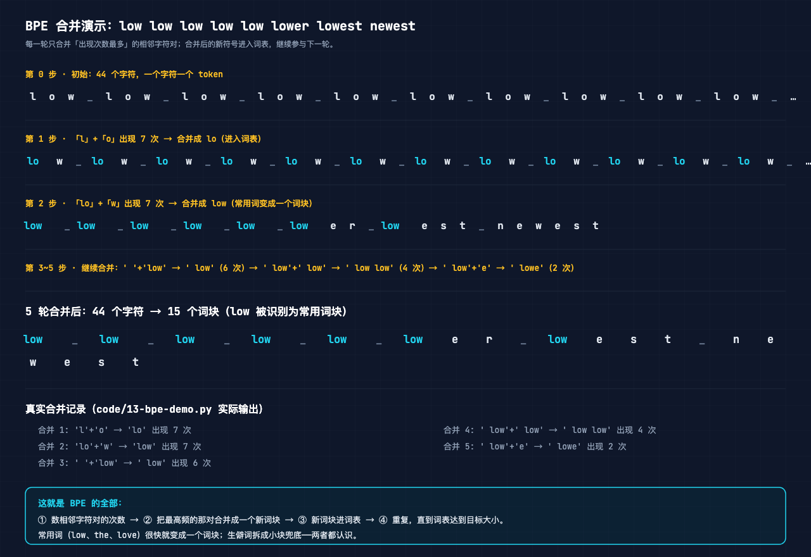
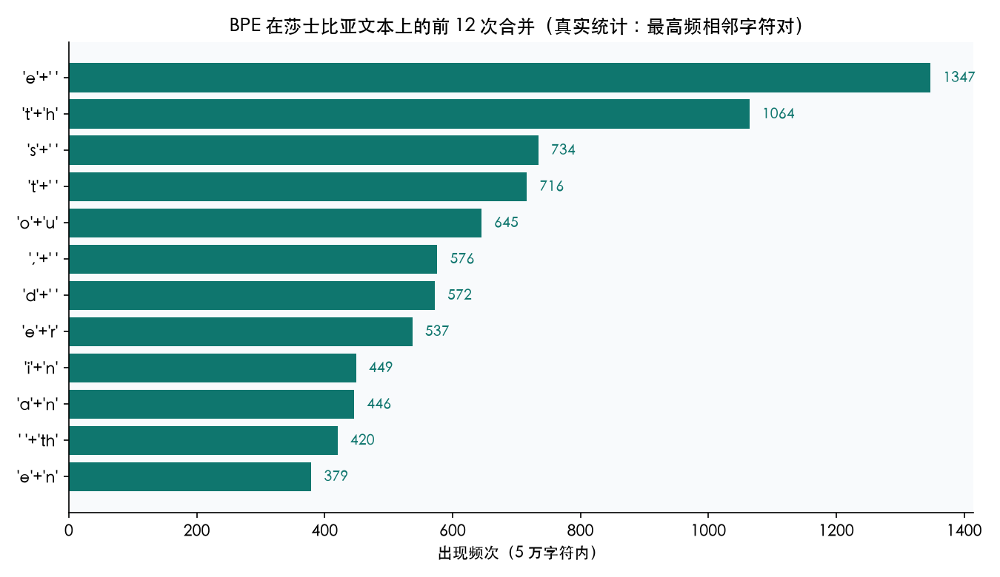
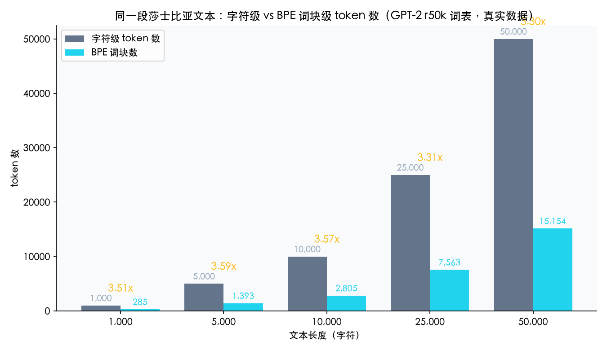

# 第 13 课：Tokenizer：BPE 原理

> 本节代码：✅ 见 `code/`（13-bpe-demo.py 实验 + 13-make-charts.py 画图）

本系列《手搓大模型：从零构建 NanoGPT》的第十三课。目标读者：零基础。前 12 课里，模型一直把文字当成"字符"来读：一个字符一个编号。这一课回答：真实 GPT 为什么不这么干？它读文字的"眼睛"长什么样？

先摆一组真实数字（Mac mini 实测，一字未改）：

- **同一段 5 万字符的莎士比亚文本**：字符级分词 = 50,000 个 token；GPT-2 用的 BPE 分词 = **15,154 个 token**，压缩 **3.3 倍**；
- **`low`、`the`、`love`**：在 GPT-2 词表里是**三个独立的 token**，模型一眼看到整个词；
- **`Juliet`**：被切成 `Jul` + `iet` 两块；**`unhappiness`** 被切成 `un` + `h` + `appiness` 三块——生僻词拆开兜底，常见词打包加速。

**GPT 不读字符，也不读词，它读"词块"（token）。这套"怎么切"的规则，就是分词器（Tokenizer）。今天讲 GPT-2 用的那个：BPE（Byte Pair Encoding，字节对编码）。**

## 先给结论：四句话

- **BPE 是一套"合并规则"**：反复统计相邻字符对谁出现最多，把最多的那对合并成一个新词块，直到词表够大。
- **常用词变成一个大词块，生僻词拆成小块**：`low` 一个 token，`unhappiness` 三个 token——两头都认识。
- **词表大小 = 初始字符数 + 合并次数**：GPT-2 从 256 个基础字符出发，合并约 5 万次，得到 50,257 个词块。
- **BPE 不只是压缩**：它改变的是模型"一次能看多远"。字符级看 8 个字符才够一个单词，BPE 一个 token 就是半个词甚至整个词。

## 动机：没有它行不行？

前 12 课一直在用字符级分词：把 65 个字符（字母 + 标点 + 换行）编成 0~64 的编号，模型每次看 8 个字符，猜第 9 个。够教学，但有三个问题：

1. **太浪费**。"莎士比亚"这个词要 4 个字符、4 个 token。模型每次"呼吸"（处理一个 token）都在看碎片，视野被切得很碎。
2. **记不住长依赖**。第 12 课生成的文本里，单词内部拼错（"camy"、"bolther"），就是因为 8 个字符的窗口装不下一个完整单词。
3. **反过来，词级又太极端**。英文有几十万个词，生僻词在语料里出现一两次，根本学不到向量；词表大了，最后那个 softmax 层（65 万个输出）也贵得离谱。

**要的是中间态：常用组合打包成一个 token，生僻内容拆成小块兜底。** BPE 就是这个折中方案——它不靠人工定规则，靠数据自己长出来。

## 第一层解剖：BPE 合并过程——一条 44 字符的文本，5 轮变成 15 个词块

经典例子（GPT-2 论文原例）：文本 `low low low low low lower lowest newest`，一共 44 个字符。BPE 的训练过程：



每一轮只做一件事：

| 轮次 | 最高频相邻对 | 出现次数 | 合并结果 |
|------|-------------|---------|---------|
| 1 | `l` + `o` | 7 | 7 个 `lo` 诞生 |
| 2 | `lo` + `w` | 7 | 7 个 `low` 诞生——**这个词从此是一个 token** |
| 3 | `␣` + `low` | 6 | ` low`（带空格）诞生 |
| 4 | ` low` + ` low` | 4 | ` low low` 诞生 |
| 5 | ` low` + `e` | 2 | ` lowe` 诞生 |

注意合并 2 之后：`low` 一共出现 7 次（5 个单独的 low + lower 里的 low + lowest 里的 low），频率最高，所以它先被"提拔"成词块。**模型看到的不是 l-o-w 三个字母，而是 low 一整块。**

合并 3 开始带上空格：`␣low`。这是 BPE 的聪明之处——**词块带上前导空格，模型就分得清"词的开头"**。`love` 和 ` love` 是两个不同的 token，前者可能出现在词中间（如 beloved），后者只出现在词首。

## 第二层解剖：真实数据上的 BPE——莎士比亚 5 万字符，前 12 次合并全是"高频小组合"

光看玩具例子不过瘾。把 BPE 跑到莎士比亚的真实文本上（前 5 万字符，真实统计）：



前 12 次合并依次是：

```text
合并  1: 'e' + ' '   频次 1347    → "e " 先被合并
合并  2: 't' + 'h'   频次 1064    → th（英语里最常见的双字母）
合并  3: 's' + ' '   频次  734
合并  4: 't' + ' '   频次  716
合并  5: 'o' + 'u'   频次  645    → ou
合并  6: ',' + ' '   频次  576
合并  7: 'd' + ' '   频次  572
合并  8: 'e' + 'r'   频次  537    → er
合并  9: 'i' + 'n'   频次  449    → in
合并 10: 'a' + 'n'   频次  446    → an
合并 11: ' ' + 'th'  频次  420    → " th"
合并 12: 'e' + 'n'   频次  379    → en
```

两个发现：

- **最优先合并的是"字符 + 空格"**：`e `、`s `、`t ` 排在最前。因为英语文本里，单词末尾字母 + 空格出现频率极高。BPE 先学会的是"词的边界"。
- **双字母组合（th、ou、er、in、an）很快抱团**：这些是英语里最常一起出现的字母。继续合并下去，`the`、`and`、`ing` 这种完整常见词会逐个诞生，然后是常见词的变形。

**BPE 学出来的词表，就是这份数据的"高频块排行榜"。** 数据换一门语言，词表就换一套——不需要任何人工语言学知识。

## 第三层解剖：数学细节——只需要"数数"和"排序"

BPE 的数学，比前面任何一课都简单。整个算法只有两个操作：

```text
① 统计：数出所有相邻 token 对 (a, b) 各出现多少次
② 合并：找到出现次数最多的一对，合并成一个新 token，放进词表
③ 重复 ①②，直到词表达到目标大小
```

逐条翻译：

- **相邻 token 对**：把当前序列看成 token 列表，每两个挨着的 token 算一对。`low low` 里就有 `l-o`、`o-w`、`w-␣`、`␣-l`…… 一共 N-1 对；
- **出现次数**：直接数。这就是第 12 课 bigram 计数模型干过的事——**BPE 和 n-gram 数数，用的是同一套思想**；
- **合并**：把序列里所有 `l-o` 都替换成新 token `lo`，重新数一遍；
- **目标词表**：GPT-2 设 50,257（256 个基础字节 + 约 5 万次合并）。词表定多大，就合并多少次。

没有矩阵、没有导数、没有反向传播。**BPE 是整个系列里唯一一个完全不需要训练、纯靠统计的组件。** 这也是为什么它通常被看作"模型的输入预处理"，而不是模型的一部分。

## 代码层：最小可运行（核心 20 行）

下面这个函数就是完整 BPE 训练循环，约 20 行。完整程序在 `code/13-bpe-demo.py`，运行命令：

```bash
~/projects/main-agent/nanoGPT/.venv/bin/python 13-bpe-demo.py
```

```python
# 依赖: tiktoken（venv 已装）
from collections import Counter

def train_simple_bpe(tokens, num_merges):
    """最简 BPE：反复找最高频相邻对，合并成一个新词块。"""
    cur = tokens[:]          # 初始：一个字符一个 token
    for _ in range(num_merges):
        pairs = Counter(zip(cur, cur[1:]))      # ① 数相邻对
        (a, b), cnt = pairs.most_common(1)[0]   # ② 最高频的那对
        new_tok = a + b                         # 合并成新词块
        new_cur, i = [], 0
        while i < len(cur):                     # ③ 全序列替换
            if i + 1 < len(cur) and cur[i] == a and cur[i+1] == b:
                new_cur.append(new_tok); i += 2
            else:
                new_cur.append(cur[i]); i += 1
        cur = new_cur
    return cur
```

逐行看：

- `Counter(zip(cur, cur[1:]))`：把序列错位一对，`zip` 出来就是所有相邻对，Counter 数次数——一行完成"统计"；
- `pairs.most_common(1)[0]`：挑出现最多的那对 `(a, b)`；
- `new_tok = a + b`：字符串拼接就是"合并"；
- `while` 循环：把序列里所有紧挨着的 `a, b` 都替换成新词块。

**整个训练就是这三步的循环。** 真实 tiktoken 库的 BPE 会加词尾标记、用字节代替字符、用哈希表加速，但骨架一模一样。

## 实验层：真实输出（Mac mini 实测，一字未改）

### 实验 1：同一段文本，字符 vs BPE 的 token 数



```text
同一段 5 万字符：
  字符级 token 数 = 50,000
  BPE 词块数     = 15,154
  压缩比 = 3.30x
```

**模型处理 token 的预算不变，词块越大，一次能"看见"的文本越多。** 5 万字符在字符级下要 5 万步，BPE 只要 1.5 万步——同样步数，BPE 模型读过的文本是字符级的两倍还多。这就是压缩的价值。

### 实验 2：GPT-2 真实词表怎么切这些词

```text
'Romeo'      -> ['R', 'ome', 'o']
'Juliet'     -> ['Jul', 'iet']
'love'       -> ['love']
'the'        -> ['the']
' Shakespeare' -> [' Shakespeare']
'low'        -> ['low']
'lowest'     -> ['low', 'est']
'hello'      -> ['hello']
' world'     -> [' world']
'unhappiness' -> ['un', 'h', 'appiness']
'incredibly' -> ['inc', 'redibly']
'tokenization' -> ['token', 'ization']
```

观察：

- **`love`、`the`、`hello` 整个词是一个 token**——高频词打包；
- **`lowest` 切成 `low` + `est`**：词根 + 词缀。模型学会了"low 的形容词最高级就是 low + est"这种规律；
- **`unhappiness` 切 `un` + `h` + `appiness`**：中间的 `h` 单独成块有点怪，但这是数据统计的结果——`unh` 在 GPT-2 训练语料里不够高频，所以没被合并；
- **` Shakespeare` 前面带空格**：token 里包含空格，模型能区分"词首的 Shakespeare"和"词中间的 Shakespeare"。

### 实验 3：词表怎么"长"出来（数字验证）

从 256 个基础字节出发，每合并一次词表 +1。GPT-2 合并约 5 万次，词表 = 256 + 50001 = 50,257。**词表大小是训练前定死的超参数，不是学出来的。** 换个大词表（GPT-4 用 100,277 个，Claude 用 200,019 个），模型记忆的"常见块"更多，但每个 token 的 embedding 表也更大、训练更贵。

## 惊喜时刻

**惊喜 1：BPE 不需要训练。** 没有梯度、没有 loss、没有反向传播。整个算法就是"数数 + 合并"重复几万次。**它是这个系列里唯一一个"零学习"的组件，却是真实 GPT 必备的输入层。**

**惊喜 2：BPE 学出来的词表，跟语言学家的直觉对上了。** 没人告诉它"th 是常见组合""est 是最高级后缀"，它纯靠统计就自动合并出了这些结构。**数据自己会长出规律，不需要人来定义规则。**

**惊喜 3：压缩 3.3 倍 = 视野 3.3 倍。** 同样 8 个 token 的上下文窗口，字符级只能看 8 个字母（不到两个词），BPE 能看 8 个词块（近 3 个词）。第 12 课那个"窗口就是记忆"的结论，在 BPE 下直接升级：**词块越大，同样的窗口记住越多。**

## 误区与彩蛋

**误区 1：token 就是词？**
不是。token 是"词块"（subword），可能是整个词、半个词、词根词缀，甚至单个字符。**一个 token 的长度不固定，由它在语料里的频率决定。** 高频词一个 token，生僻词拆成两三个。

**误区 2：BPE 会损失信息？**
不会。**BPE 是可逆的**：词块序列能无歧义地还原成原文本（因为合并规则是确定的）。它做的只是"换一种更紧凑的表示"，不是压缩后丢细节。

**误区 3：中文怎么分词？**
中文没有空格，词边界不明显。**现代 tokenizer 的做法是：先把文本按 UTF-8 编码成字节（byte），再在字节上跑 BPE。** 这样任何语言都能统一处理，且不会出现"词表里没有的生僻字"。GPT-2 的 r50k 就是这么干的，所以它能处理中文（效果一般但能跑）。这也是 GPT-4 词表更大的原因之一：字节级 BPE 需要更多空间容纳各语言的高频块。

**彩蛋 1：BPE 和 n-gram 是同宗同源。** 第 12 课的 bigram 计数模型统计"字符 i 后面跟 j 的次数"，BPE 统计"相邻对 (a,b) 出现的次数"——**统计的对象一模一样**，只是一个用统计结果做概率，一个用统计结果做合并。理解了 n-gram，BPE 就只是"把高频对焊死"。

**彩蛋 2：GPT-2 论文里，BPE 最初是为了解决"词表太大"提出的。** 但后来发现它顺带解决了 OOV（out-of-vocabulary，词表外单词）问题：任何生僻词都能用现有词块拼出来，模型永远不会遇到"不认识的字符"。

**彩蛋 3：一个 token 的"定价"是多少？** 真实世界的 API 按 token 收费。一个英文单词大约 1.3 个 token，1000 个 token 大约 750 个英文单词。**理解了 BPE，就理解了为什么"Token"是 AI 世界的货币单位——它是模型处理信息的基本粒子。**

---

下一课，进入系列的重头戏：**第 14 课《Attention 直觉》**——GPT 真正区别于前面所有 MLP 的地方。"找相关词、加权求和"，一个想法让模型想记多长记多长。

*手搓大模型，第 13 课完成。分词器是模型的"眼睛"，BPE 是这套眼睛的制造工艺——数数、合并、重复，数据自己长出词表。*
