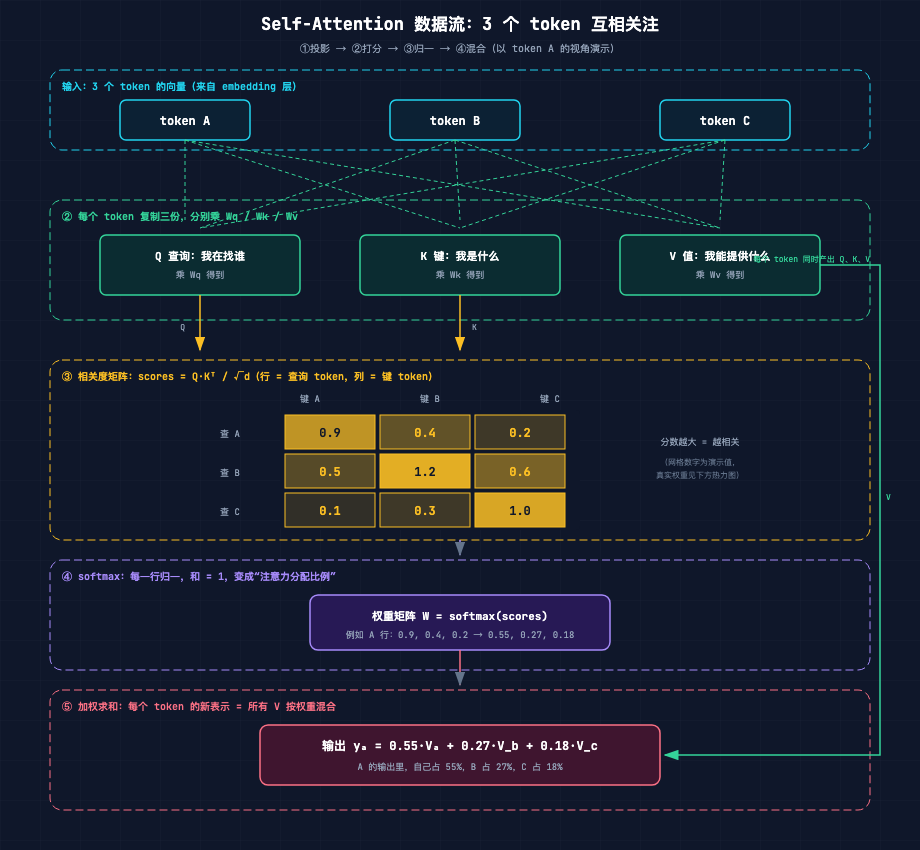
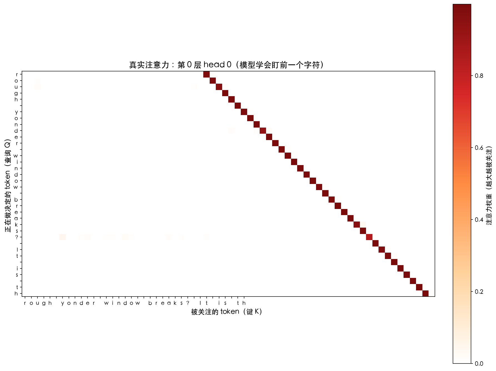
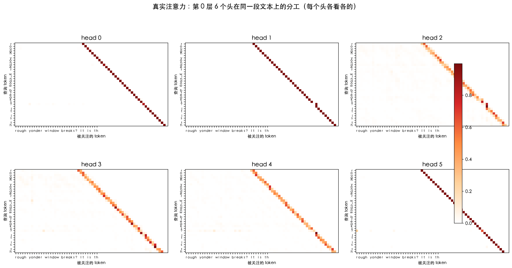
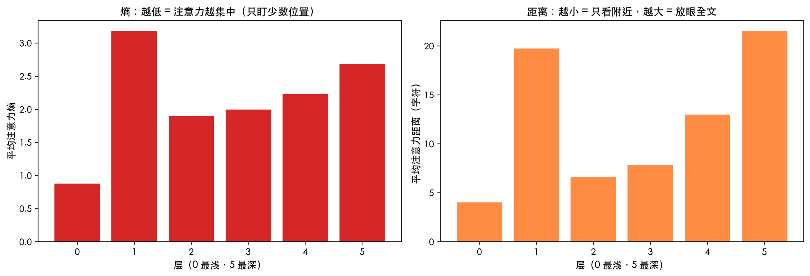

# 第 14 课：Attention 直觉

> 本节代码：✅ 见 `code/`（14-attention-demo.py 最小演示 + 14-attention-probe.py 真实模型探测 + 14-make-heatmaps.py 热力图）
>
> 本系列《手搓大模型：从零构建 NanoGPT》的第十四课。
> 目标读者：零基础。前 13 课把模型从 0 搭到了 MLP：固定窗口、固定权重、把 8 个字符喂进去猜第 9 个。这一课讲 GPT 真正区别于老模型的那个发明：**Attention（注意力）**。

先摆一组真实数字（Mac mini 实测，一字未改）：

- 在同一个莎士比亚语料上，第 12 课那个 15 万参数的 MLP，验证集困惑度 **7.13**；今天这个 10.65M 参数的 GPT（只训练了 1000 步），验证集困惑度 **4.58**；
- 把模型的注意力权重画成热力图，**第 0 层第 0 个头的注意力，99% 落在"前一个字符"上**——没人教它，它自己学会了"盯住前一个字符"这种 bigram 规律；
- 浅层（第 0 层）每个 token 平均只看 4 个字符以内的邻居；**深层（第 5 层）平均能看到 21 个字符开外**——层数越深，视野越远。

**Attention 的核心思想只有一句大白话：读句子的时候，每个词自己决定"谁跟我最相关"，然后按相关度把别的词的信息加权混合进自己的表示里。** 前 13 课的模型是"死记"（窗口固定、规则写死），Attention 是"活看"（每个位置动态决定看谁）。

## 先给结论：四句话

- **Attention = 加权求和**：每个 token 的输出，是所有 token 的"值"按权重混合出来的结果；权重由"相关性"决定。
- **相关性 = 查询 × 键的点积**：每个 token 同时扮演两个角色——"我在找谁"（查询 Q）和"我是什么"（键 K），点积算出来的数字就是相关度。
- **softmax 把相关度变成比例**：分数归一化，加起来等于 1，这才好做加权。
- **全部公式就 4 行代码**：`Q = X@Wq; K = X@Wk; V = X@Wv; out = softmax(Q@K.T/√d) @ V`。这是整个 GPT 的心脏，一节课能装下。

## 动机：没有它行不行？

第 12 课那个 MLP 有个硬伤，读者可能还记得：**它的上下文窗口是 8 个字符，想记多长记多长是做不到的。**

具体说，MLP 是这样干活的：把最近 8 个字符拼成一个向量，乘一组固定权重，猜下一个字符。问题有两个：

1. **窗口固定，装不下长依赖**。莎士比亚里"ROMEO"出现在第 3 个字符，""JULIET"出现在第 40 个字符——8 个字符的窗口永远看不到这种远距离关系。MLP 想用固定大小的窗口记住所有规律，就像让人只允许看眼前 8 个字来猜整段台词，猜不准是必然的。
2. **权重固定，不会"挑重点"**。MLP 对 8 个位置一视同仁：位置 1 的字符和位置 8 的字符，在模型眼里权重是写死的（embedding 之后是固定的拼接/加权）。可真实文本里，预测下一个字符时，有些位置就是比别的更重要。

**Attention 的答案：把"看谁"这件事从写死变成算出来。** 每个 token 自己算一组权重，决定把目光投向哪里。窗口不再是 8，而是"整段文本，按需取用"。

## 第一层解剖：结构长啥样（一张数据流图）

Attention 的完整数据流，四步走完：**投影 → 打分 → 归一 → 混合**。



从左往右读这张图：

- **输入**：3 个 token 的向量（来自 embedding 层，第 11 课讲过：一个字符 = 一行数字）；
- **① 投影**：每个 token 复制三份，分别乘三个矩阵 Wq / Wk / Wv，得到三个新向量——**Q（查询）、K（键）、V（值）**；
- **② 打分**：把"查询"和"键"两两做点积，得到一张相关度矩阵。行是"正在做决定的 token"，列是"被关注的 token"，格子里的数字越大，代表这俩越相关；
- **③ 归一**：softmax 把每一行的分数变成比例，加起来等于 1；
- **④ 混合**：用比例去加权所有 token 的"值"，得到每个 token 的新表示。

**输出里"自己"占多少、"别人"占多少，完全由相关度决定。** 这就是 Attention 的全部结构——没有循环、没有复杂的门控，一个矩阵乘法加一个归一化。

## 第二层解剖：数据怎么流动（Q/K/V 到底在干嘛）

Q/K/V 三个角色是初学者最容易卡住的地方，用图书馆打个比方：

- **Q（Query，查询）**：等于在问"我该找哪本书？"——每个 token 用 Q 表达自己"想找什么"；
- **K（Key，键）**：等于书架上的书名标签——每个 token 用 K 表达"我是谁、我有什么内容"；
- **V（Value，值）**：等于书的内容本身——一旦确认"这本书相关"，就把它的内容拿出来用。

匹配过程：拿着"查询"（我想找什么）去比对所有"键"（每本书的标签），点积分数高 = 标签匹配 = 这本书相关；然后按相关度把"值"（书的内容）加权混合。

一个关键直觉：**Q 和 K 是"用来算权重的"，V 是"真正被搬运的信息"。** 权重算完，Q 和 K 就完成了使命；最后进入下一个模块的是 V 的加权和。

数据流再简化成一句话：**每个 token 问一圈"谁跟我相关"，然后把相关者的信息按比例吸收进来。**

## 第三层解剖：数学细节（每个符号的直觉）

公式就一行（加上 softmax 一行），拆开看：

```
scores = Q @ Kᵀ / √d      # 相关度打分
weights = softmax(scores)  # 归一成比例
out = weights @ V          # 加权求和
```

逐个符号讲：

- **Q（形状 T×d）**：T 个 token，每个 d 维的查询向量。第 i 行是"token i 在找什么"；
- **K（形状 T×d）**：同样 T×d，第 j 行是"token j 是什么"；
- **Q @ Kᵀ（形状 T×T）**：矩阵乘法。第 i 行第 j 列 = Q[i] 和 K[j] 的点积。**点积 = 两个向量方向有多一致**（第 3 课讲过：方向越一致，点积越大）。所以这张表第 (i,j) 格 = "token i 觉得 token j 有多相关"；
- **除以 √d**：d 是向量维度。为什么除？因为维度越大，点积的数值越容易变大（一堆正数相加），除以 √d 把分数拉回稳定区间，softmax 才不会过早饱和。**这一步是"防数值爆炸"的安全带**，直觉记住这个就行；
- **softmax（按行做）**：每一行的分数变成正数且加起来 = 1。这样每行就是一个"注意力分配比例"——token i 把 55% 的目光给 token A、27% 给 B、18% 给 C；
- **weights @ V（形状 T×d）**：加权求和。第 i 行 = 所有 V[j] 按 weights[i][j] 加权混合。**每个 token 的新表示 = 一场按相关度调度的"信息合流"**。

回到第 0 课说过的那个全景：模型一次处理一整段文本，每个 token 在每一层都做一次这样的"互相关注+混合"，层数越深，视野越远。

## 代码层：最小可运行（全部公式就 4 行）

下面这个程序是完整的 self-attention：没有 torch，没有训练，一个 numpy 函数看懂核心。完整程序在 `code/14-attention-demo.py`，运行命令：

```bash
~/projects/main-agent/nanoGPT/.venv/bin/python 14-attention-demo.py
```

```python
# 依赖: numpy（venv 已装）
import numpy as np

# 输入：3 个 token，每个 4 维向量（真实模型里来自 embedding 层）
X = np.array([
    [1.0, 0.0, 0.0, 0.0],   # token 0
    [0.0, 1.0, 0.0, 0.0],   # token 1
    [0.0, 0.0, 1.0, 0.0],   # token 2
])
T, d = X.shape              # T=3 个 token，每个 d=4 维

# 三个可学习矩阵（真实模型里训练出来，这里随手给固定值演示）
rng = np.random.default_rng(42)
Wq = rng.normal(0, 1, (d, d))
Wk = rng.normal(0, 1, (d, d))
Wv = rng.normal(0, 1, (d, d))

# ── self-attention 的全部公式，就这 4 行 ──
Q = X @ Wq                     # 查询：我想找谁？
K = X @ Wk                     # 键：我是什么？
V = X @ Wv                     # 值：我能提供什么？
scores = Q @ K.T / np.sqrt(d)  # 相关度打分
weights = np.exp(scores - scores.max(axis=-1, keepdims=True))
weights = weights / weights.sum(axis=-1, keepdims=True)  # softmax 归一
out = weights @ V              # 加权求和 → 每个 token 的新表示
```

逐行看：

- `X @ Wq` / `X @ Wk` / `X @ Wv`：三个矩阵乘法，把每个 token 变成查询/键/值三个角色。**矩阵乘法 = 批量做映射**（第 3 课结论），一次算完所有 token；
- `Q @ K.T / np.sqrt(d)`：相关度矩阵。Q 的每一行和 K 的每一列做点积，得到一个 T×T 的分数表；
- `np.exp(...)` 那两行：手写 softmax。先减去每行最大值（数值稳定性），再取指数、按行归一——**每行变成加起来等于 1 的比例**；
- `weights @ V`：加权求和。第 i 行输出 = 所有 V 按第 i 行的比例混合。

**这段代码跑出来的每一行输出，都是"3 个 token 信息的加权混合"**——权重由相关度决定，相关度由数据训练出来。GPT 的注意力就是这么回事，只是维度更大、头更多、层数更深。

## 实验层：真实输出（Mac mini 实测，一字未改）

### 实验 1：一个"前一个字符"头——模型自己学会了 bigram

把训练好的 GPT（6 层 6 头、1000 步、val loss 1.52）的注意力权重抓出来画成热力图。**第 0 层第 0 个头的热力图长这样**（横轴是被关注的字符，纵轴是正在做决定的字符，颜色越深权重越大）：



热力图上能看到一条明显的"副对角线"：**每个字符几乎只关注它的前一个字符**。统计结果是：在这段文本 95 个"做决定"的字符里，**99% 的字符把注意力全部给了前一个字符**（比如 `t` 看 ` `、`h` 看 `t`、`e` 看 `h`……权重 0.97~1.00）。

这背后是莎士比亚语料里最朴素的规律：**"前一个字符是谁，直接决定下一个字符的分布"**（`h` 后面大概率是元音，`q` 后面几乎一定是 `u`）。模型发现这条规律后，专门安排一个头去实现它——**没人告诉它"要盯着前一个字符看"，它是从数据里自己长出来的。**

### 实验 2：同一个层，6 个头各看各的

把第 0 层全部 6 个头的热力图并排摆出来：



6 个头的关注模式明显不同：有的盯前 1 个字符，有的盯前 2-3 个，有的更分散。**多头 = 多视角**：一个层同时用 6 双"眼睛"看同一段文本，每双眼睛找一种规律。这正是第 16 课要细讲的"多头注意力"的雏形。

### 实验 3：浅层看局部，深层看全局

把每一层所有头的平均"注意力距离"（被关注位置离当前多远）和平均"注意力熵"（熵越低 = 越集中）画出来：



| 层 | 平均熵（越低越集中） | 平均距离（字符） |
|----|--------------------|-----------------|
| 0 | 0.88 | 4.0 |
| 1 | 3.18 | 19.8 |
| 2 | 1.90 | 6.6 |
| 3 | 2.00 | 7.9 |
| 4 | 2.23 | 13.0 |
| 5 | 2.69 | 21.5 |

两个真实发现：

- **第 0 层注意力高度集中（熵 0.88）**，平均只看 4 个字符以内——它在做"局部语法"（谁跟谁挨得近）；
- **第 1 层和第 5 层注意力分散（熵 3.18 / 2.69）、视野很远（19.8 / 21.5 字符）**——它们在看"全局结构"。**模型的分工是自组织的：浅层处理局部，深层处理全局。**

### 实验 4：Attention 到底帮了多少——困惑度 7.13 → 4.58

第 12 课的 MLP（15.2 万参数）验证集困惑度 7.13。今天的 GPT 只训练了 1000 步，验证集 loss 1.5218，困惑度 = e^1.5218 = **4.58**。

困惑度可以粗略理解成"模型每次猜下一个字符时的平均候选数"：MLP 平均要在 7 个候选里猜，GPT 只要在 4.6 个里猜。**同一个语料、同样 1000 步量级，光靠"能动态挑重点看"这一个改变，预测就准了一大截。**

顺便展示这个模型的生成能力（temperature=0.8，种子"ROMEO: But "）：

```text
ROMEO: But why there is better: the part
As noise the venom off the whi
```

拼写比第 12 课的 MLP 规整多了——**"the"、"part"、"venom"这些词都是完整拼出来的**，因为注意力让每个字符能"看见"足够长的上下文。

## 惊喜时刻

**惊喜 1：整个注意力机制，公式只有 4 行。** 没有循环、没有复杂结构，就是"矩阵乘法 + softmax + 矩阵乘法"。第 14 课讲完，GPT 的心脏已经装进读者口袋里了。

**惊喜 2：模型自己学会了"盯前一个字符"。** 99% 的注意力落点验证了一件事：**注意力模式不是人设计的，是数据长出来的。** 训练只给了模型"预测下一个字符"这一个目标，它自己安排一个头去当 bigram 探测器。

**惊喜 3：浅层看局部、深层看全局，也是自己长出来的。** 没有任何代码规定"第 0 层看 4 个字符、第 5 层看 21 个字符"，但训练结束后统计结果就是这样。**深度带来的不只是"多几层"，而是"看得更远"。**

## 误区与彩蛋

**误区 1：Attention 是"模型在思考该看哪"？**
不是玄学。**Attention 只是一组可学习的加权求和**，权重由矩阵乘法 + softmax 算出。它没有"理解"文本，只是在统计意义上学会了"哪些位置组合起来有助于预测下一个字符"。

**误区 2：Q/K/V 是三个不同的向量？**
不是。**每个 token 的同一个向量，乘三个不同的矩阵，变成三个向量**。Q/K/V 是从同一个 x 投影出来的三个视角，不是三份独立数据。

**误区 3：注意力权重 = 可解释性？**
要小心。**注意力权重高不代表"模型真的在依赖它"**。研究早发现，把高权重位置遮掉，模型照样能预测。热力图是观察窗口，不是因果证据——这一点在 2026 年的今天依然是活跃的讨论话题。

**误区 4：为什么除以 √d？**
直觉上，**维度 d 越大，点积数值天然越大**（d 个正数相加）。不缩放的话，分数一大，softmax 直接饱和成"非 0 即 1"，梯度消失，学不动。除以 √d 是让分数保持在 softmax 的"敏感区"。

**彩蛋 1：Attention 最初来自机器翻译。** 2017 年《Attention Is All You Need》这篇论文提出 Transformer，初衷是让翻译模型在"看源语言哪个词"时能动态聚焦——结果这个机制一路火成了整个大模型时代的地基。

**彩蛋 2：注意力图里最漂亮的结构，往往在"角色名"附近。** 真实 GPT 里常能看到"某个人名出现后，后续字符的注意力会往人名方向聚拢"——这是模型在把"当前内容"和"谁在说话"关联起来。第 26 课训练完整莎士比亚模型时，可以专门抓这个彩蛋看。

**彩蛋 3：困惑度 4.58 是什么水平？** GPT-2 在更大的语料上能做到困惑度个位数甚至更低，但 4.58 已经足够让模型拼对单词、生成像样的句子。**"能接话"和"接得像"之间，差的就是 Attention 这种动态视野。**

---

下一课，进入 Attention 的零件层：**第 15 课《QKV 详解》**——三个矩阵怎么来的、2 个词的手算全过程、为什么点积能当"相关度"用。把今天的直觉，变成手里的数字。

*手搓大模型，第 14 课完成。Attention 的全部秘密：投影、打分、归一、混合——四个动作，一行公式，模型从此学会"挑重点看"。*

---

**本课完整代码与全文已开源到 GitHub（public）：**

https://github.com/flyingcloud-code/learning-nanogpt-from-0-to-1/tree/main/14-attention

**系列仓库（30 课陆续更新中）：**

https://github.com/flyingcloud-code/learning-nanogpt-from-0-to-1
