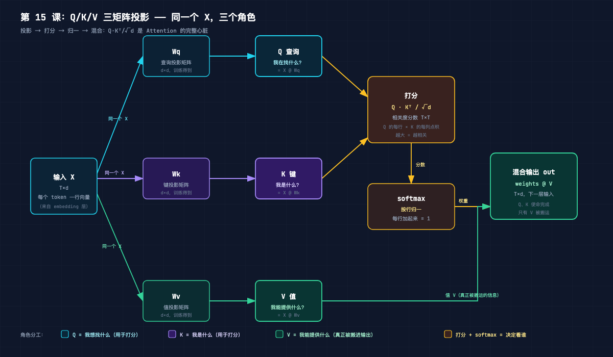
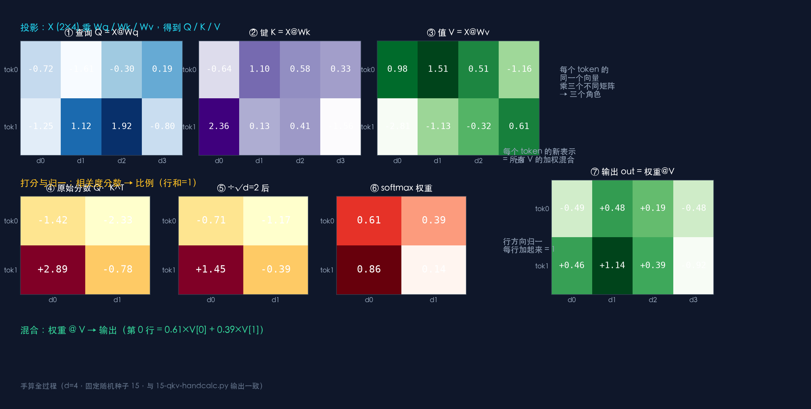
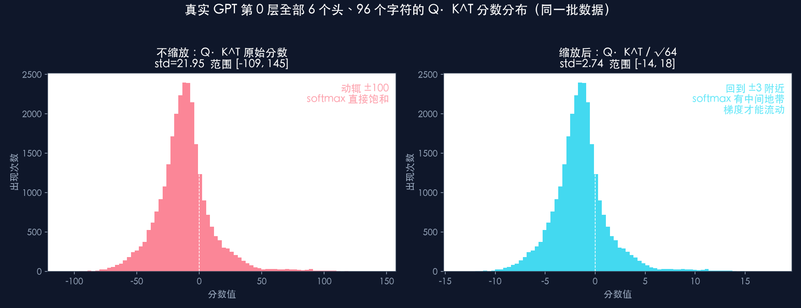
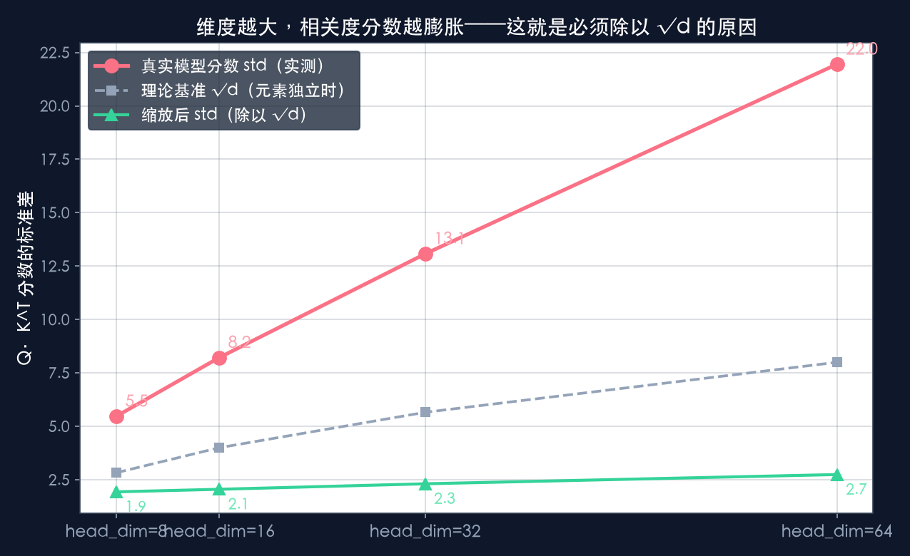

# 第 15 课：QKV 详解

> 本节代码：✅ 见 `code/`（15-qkv-handcalc.py 两个词手算全过程 + 15-qkv-probe.py 真实模型 Q/K/V 探测 + 15-make-charts.py 图表）
>
> 本系列《手搓大模型：从零构建 NanoGPT》的第十五课。
> 目标读者：零基础。第 14 课讲了 Attention 的四步：**投影 → 打分 → 归一 → 混合**。这一课把第一步"投影"拆开，看看 Q/K/V 三个矩阵到底在干什么，为什么一定要三个，以及那个神秘的 `√d` 是从哪来的。

先摆一组真实数字（Mac mini 实测，一字未改）：

- 在这个训练了 1000 步的 GPT 里（6 层 6 头，head 维度 64），**Q·Kᵀ 的原始分数最大能到 144.66**，标准差 21.95；
- 除以 √64 = 8 之后，**标准差降到 2.74**，分数回到 ±3 附近；
- 同一个 token 的同一批分数，**不缩放时 softmax 把 100% 的权重压给一个位置（权重 1.0000），其余全部归零**；缩放后，最大权重只有 0.57，其他位置还留着梯度；
- 把 head 维度从 8 一路加到 64，分数标准差从 5.47 涨到 21.95——**维度越大，分数越膨胀，这就是必须除以 √d 的真实原因**。

**QKV 的核心思想只有一句大白话：每个 token 的同一个向量，乘三个不同的矩阵，变成三个角色——Q 负责问"我在找什么"，K 负责答"我是什么"，V 负责给"我能提供的内容"。** 打分只用 Q 和 K，真正被搬进输出的只有 V。

## 先给结论：四句话

- **Q = X @ Wq，K = X @ Wk，V = X @ Wv**：三个矩阵乘法，把一个向量变成三个角色；
- **Q·Kᵀ 的每个格子 = 一个相关性分数**：第 i 行的查询和第 j 行的键做点积，就是"token i 觉得 token j 有多相关"；
- **除以 √d 是防 softmax 饱和的安全带**：维度越大点积越膨胀，不缩放的话 softmax 直接"二选一"，模型学不动；
- **Q 和 K 用完即弃，只有 V 被加权混合进输出**。

## 动机：为什么一定要三个矩阵？

第 14 课把 Attention 拆成四步：投影、打分、归一、混合。当时只说"每个 token 复制三份，分别乘 Wq / Wk / Wv"，这里有个读者一定会问的问题：**为什么要三份？一份不行吗？**

想想打分这一步在干什么：让 token i 和 token j 比较，看它们相不相关。比较一个"角色"不够，因为"我要找的东西"和"我是谁"是两回事。拿图书馆打比方：

- 查询 Q 等于读者想找的书名关键词——"我要找讲神经网络的";
- 键 K 等于书脊上的标签——"这本书是讲文艺复兴的";
- 值和标签是两回事——**一本书可以叫《神经网络》，内容却是讲文艺复兴时期艺术家的传记**（标签和内容不必一致，这正是值 V 存在的理由）。

如果只有一个矩阵，每个 token 只有一个向量，这个向量既要当"我想找什么"又要当"我是什么"，还要当"我能提供什么"——三个用途挤在一个向量里，打分就乱套了。**三个矩阵的本质，是给同一个信息开三个独立出口**，让模型在训练中自由决定"该用什么视角看谁"。

一个矩阵行不行？理论上可以用一个矩阵，但表达能力差得多：**模型需要"查询"和"键"长得不一样才能算得出复杂相关关系**（比如"代词 it"的查询要专门去匹配"最近的名词"的键）。三个独立矩阵让模型想怎么错位就怎么错位——这是 Attention 灵活性的来源之一。

## 第一层解剖：结构长啥样（一张数据流图）

完整数据流是：**投影 → 打分 → 归一 → 混合**，这张图把每一步画全了：



从左往右读：

- **输入 X**（T×d）：T 个 token，每个 d 维向量，来自 embedding 层（第 11 课讲过：一个字符 = 一行数字）；
- **投影**：同一个 X 复制三份，分别乘 Wq / Wk / Wv（都是 d×d 的可学习矩阵），得到 Q、K、V——**同一份输入，三个角色**；
- **打分**：Q 和 K 进打分盒，算出 T×T 的相关度分数矩阵 Q·Kᵀ / √d；
- **归一**：softmax 按行把分数变成加起来等于 1 的比例；
- **混合**：比例（权重）和 V 一起进混合盒，输出 out = weights @ V。

注意最后一步：**进混合盒的是 V，不是 Q 也不是 K**。Q 和 K 的使命在打分结束就完成了。

## 第二层解剖：2 个词手算一遍（每个数字都是真的）

下面这组数字来自 `15-qkv-handcalc.py`（固定随机种子，一字未改）。用 2 个 token、每个 4 维，把整个流程算一遍：



过程拆开看：

**① 投影**：X 是 2×4，乘上三个 4×4 的矩阵，得到三个 2×4 的矩阵：

- Q = [[-0.72, -1.61, -0.30, 0.19], [-1.25, 1.12, 1.92, -0.80]]
- K = [[-0.64, 1.10, 0.58, 0.33], [2.36, 0.13, 0.41, -1.56]]
- V = [[0.98, 1.51, 0.51, -1.16], [-2.81, -1.13, -0.32, 0.61]]

**② 打分**：Q 的每一行和 K 的每一行做点积：

- score(0→0) = Q[0]·K[0] = **-1.42**，score(0→1) = Q[0]·K[1] = **-2.33**
- score(1→0) = Q[1]·K[0] = **2.89**，score(1→1) = Q[1]·K[1] = **-0.78**

token 1 觉得 token 0 很相关（2.89），token 0 却觉得谁都不太相关（都是负数）——**"谁看谁"在数学上就是不对称的**。

**③ 归一**：除以 √4 = 2，再按行 softmax：

- 第 0 行权重 = [0.61, 0.39]，第 1 行权重 = [0.86, 0.14]

token 1 把 86% 的目光给了 token 0，token 0 则 61% 看自己、39% 看 token 1。

**④ 混合**：out[0] = 0.61 × V[0] + 0.39 × V[1] = [-0.49, 0.48, 0.19, -0.48]。**一个 token 的新表示 = 所有 V 的加权混合，权重由相关度决定**——这一步就是 Attention 的全部秘密。

## 第三层解剖：数学细节（每个符号的直觉）

### 点积 = 方向一致度

Q·Kᵀ 的第 (i, j) 格是 Q[i] 和 K[j] 的点积。第 3 课讲过：**两个向量方向越一致，点积越大**。把"方向"翻译成人话——Q[i] 在"想找的方向"上和 K[j] 的"内容方向"对得越齐，分数越高。

但注意：点积不只是方向，**它还包含长度**。q_i · k_j = |q_i| × |k_j| × cos(夹角)。向量越长，点积越大。所以分数高有两种可能：方向很对，或者向量本身很长。模型在训练中会自己权衡——**它想让"相关性"体现在哪，就把哪边的长度调大**。这也是为什么 Q/K/V 要三个矩阵：长度和方向都可以分别学。

### 为什么是 Q·Kᵀ 而不是别的

Q 是 T×d，K 是 T×d，K 转置后是 d×T，两个一乘得到 T×T。**一行一行看：Q 的第 i 行和 K 的每一列做点积，正好是"token i 和所有 token 的相关度"**。矩阵乘法就是批量算点积，一行全算完。

### 除以 √d：从真实数据看为什么

这是本课最重要的一个"啊哈时刻"。先看直觉：一个 d 维向量的点积，是把 d 个数加起来。**维度越大，加起来的数越多，数值天然越膨胀**。如果 q 和 k 的每个元素大致在 ±1 附近随机，那么点积的标准差大约就是 √d（这是概率论里"独立随机变量和的方差"直接推出来的，不用背，看趋势就行）。head 维度是 64，√64 = 8——**分数天然会被放大 8 倍左右**。

光说没用，直接看真实模型的数字。从训练好的 GPT 里抓出第 0 层 6 个头的真实 Q、K（96 个字符，全部可见位置的分数）：

| 头 | 不缩放：mean | std | min | max | 缩放后：mean | std | min | max |
|----|-------------|-----|-----|-----|-------------|-----|-----|-----|
| 0 | -12.34 | 26.81 | -85.50 | 108.13 | -1.54 | 3.35 | -10.69 | 13.52 |
| 1 | -16.06 | 29.41 | -108.61 | 144.66 | -2.01 | 3.68 | -13.58 | 18.08 |
| 2 | -8.64 | 10.95 | -39.27 | 50.38 | -1.08 | 1.37 | -4.91 | 6.30 |
| 3 | -13.57 | 14.34 | -55.84 | 54.40 | -1.70 | 1.79 | -6.98 | 6.80 |
| 4 | -8.42 | 13.61 | -45.59 | 59.01 | -1.05 | 1.70 | -5.70 | 7.38 |
| 5 | -12.65 | 27.45 | -94.36 | 109.99 | -1.58 | 3.43 | -11.79 | 13.75 |

合并统计：**不缩放时标准差 21.95，最大 144.66；除以 8 之后标准差 2.74**。看分布更直观：



左边那堆分数动辄 ±100，softmax 一吃下去，几乎必然变成一个 1 和一堆 0——**这就是饱和**。饱和的后果是：权重变成"非此即彼"，梯度消失，模型学不动。右边缩放后分数回到 ±3 附近，softmax 才有"中间地带"，每个位置都保留一点梯度，模型才能慢慢调。

再做一个维度实验，用真实 Q/K 的前 8、16、32、64 维各算一遍分数：



| head_dim | √head_dim | 分数 std（不缩放） | 缩放后 std |
|----------|-----------|-------------------|-----------|
| 8 | 2.83 | 5.47 | 1.93 |
| 16 | 4.00 | 8.22 | 2.05 |
| 32 | 5.66 | 13.07 | 2.31 |
| 64 | 8.00 | 21.95 | 2.74 |

**分数膨胀的速度接近 √d，缩放因子也取 √d，两边的增长抵消了。** 这不是拍脑袋定的数，是让"分数规模不随维度漂移"的自然选择。

## 代码层：最小可运行（手算 + 真实探测）

### 代码 1：两个词手算（`15-qkv-handcalc.py`）

运行命令：

```bash
~/projects/main-agent/nanoGPT/.venv/bin/python 15-qkv-handcalc.py
```

核心代码（完整程序见 `code/15-qkv-handcalc.py`）：

```python
# 依赖: numpy（venv 已装）
import numpy as np

# 输入：2 个 token，每个 4 维向量（真实模型里来自 embedding 层）
X = np.array([
    [0.8, 0.2, -0.5, 0.1],   # token 0
    [0.3, -0.7, 0.9, 0.4],   # token 1
])
T, d = X.shape               # T=2 个 token，每个 d=4 维

# 三个可学习矩阵（真实模型里训练出来，这里固定种子保证数字可复现）
rng = np.random.default_rng(15)
Wq = rng.normal(0, 1, (d, d))
Wk = rng.normal(0, 1, (d, d))
Wv = rng.normal(0, 1, (d, d))

# ── QKV 的全部公式，就这 4 行 ──
Q = X @ Wq                    # 查询：我在找什么？
K = X @ Wk                    # 键：我是什么？
V = X @ Wv                    # 值：我能提供什么？
scores = Q @ K.T / np.sqrt(d) # 相关度打分（除以 √d 防膨胀）
weights = np.exp(scores - scores.max(axis=-1, keepdims=True))
weights = weights / weights.sum(axis=-1, keepdims=True)  # softmax 归一
out = weights @ V             # 加权求和 → 每个 token 的新表示
```

逐行看：

- `X @ Wq` / `X @ Wk` / `X @ Wv`：三个矩阵乘法，**一次算完所有 token**（第 3 课结论：矩阵乘法 = 批量映射）；
- `Q @ K.T`：Q 每行和 K 每列做点积，得到 T×T 分数表；
- `np.sqrt(d)`：除以 √d——维度是 4 就除以 2；
- softmax 两行：先减每行最大值（数值稳定），再取指数、按行归一——**每行变成加起来等于 1 的比例**；
- `weights @ V`：加权求和。

### 代码 2：真实模型探测（`15-qkv-probe.py`）

运行命令：

```bash
~/projects/main-agent/nanoGPT/.venv/bin/python 15-qkv-probe.py
```

核心思路：把训练好的 GPT（`out-shakespeare-char/ckpt.pt`）第 0 层 attention 的 forward 临时换成手写路径（flash attention 抓不到中间量），把真实的 q、k 扣下来，再分别算缩放前后的分数统计：

```python
# 抓真实 Q/K（第 0 层，一段莎士比亚文本，T=96）
q, k, v = self.c_attn(x).split(self.n_embd, dim=2)   # nanoGPT 一行拆出 QKV
q = q.view(B, T, n_head, head_dim).transpose(1, 2)   # 拆成 6 个头
k = k.view(B, T, n_head, head_dim).transpose(1, 2)

scores_raw = einsum("hij,hkj->hik", q, k)            # 不缩放：Q·Kᵀ
scores_scaled = scores_raw / math.sqrt(head_dim)     # 缩放后：Q·Kᵀ/√64
```

注意这行 `self.c_attn(x).split(self.n_embd, dim=2)`——**nanoGPT 里 Wq/Wk/Wv 不是三个独立矩阵，而是拼在一个大矩阵 c_attn 里（维度 3×d），一行 split 就切成 Q/K/V 三段**。这是代码层面的一个小彩蛋。

## 实验层：真实输出（Mac mini 实测，一字未改）

### 实验 1：不缩放时，softmax 已经"没得选"了

把第 0 层 head 0 第 95 个 token（句号 `.`）看前面 96 个位置的真实分数拿出来，分别喂给 softmax（不缩放 vs 缩放），结果差别触目惊心（节选）：

| 位置 | 字符 | 原始分数 | 不缩放权重 | 缩放权重 |
|------|------|----------|-----------|----------|
| 0 | R | 69.97 | 0.0000 | 0.0062 |
| 5 | : | 88.20 | 0.0000 | 0.0607 |
| 9 | t | 76.44 | 0.0000 | 0.0140 |
| 54 | k | 44.42 | 0.0000 | 0.0003 |
| 63 | (空格) | 60.03 | 0.0000 | 0.0018 |
| 85 | i | 65.13 | 0.0000 | 0.0034 |
| 94 | n | 90.69 | 0.0000 | 0.0828 |
| 95 | . | 60.24 | 0.0000 | 0.0018 |

不缩放那一列：**全部是 0.0000，权重被唯一一个最高分位置 100% 拿走（1.0000）**。缩放后：最大权重 0.5667，其他位置还有 0.001~0.08 的尾巴——**这些尾巴就是梯度，是模型继续学习的通道**。没有尾巴，训练就死了。

### 实验 2：Q/K 向量真实长什么样

真实 Q 向量元素标准差 = 1.22，K 向量 = 1.29（LayerNorm 之后大致在 ±1 附近）。这解释了为什么 64 维点积的膨胀倍数接近 √64 = 8：**元素规模没变，是维度在放大分数**。

### 实验 3：顺带验证一下——模型真的在学"角色分工"

前面维度实验已经证明分数膨胀随 √d 走。更深一层：训练结束后，不同 head 的 Q/K 会分化出不同风格（第 14 课的热力图里已经看到有的头盯前一个字符、有的看全局）。**Q/K/V 三个矩阵学到的不是"三份重复信息"，而是三个互补的视角**——这正是第 16 课"多头"要展开的伏笔。

## 惊喜时刻

**惊喜 1：真实模型里 Q·Kᵀ 的分数能到 144。** 如果不除以 √64，softmax 早就把权重压成 0 和 1，训练直接报废。**"除以 √d"不是一个可有可无的细节，是让模型活下来的安全带**——而且缩放因子 √64 = 8 和 head 维度 64 是同一组数字，这不是巧合，是设计。

**惊喜 2：Q/K/V 是同一个向量的三个视角，不是三份数据。** 第 14 课说"每个 token 复制三份"，这一课把它讲透了：复制的是同一份 X，乘的是三个不同矩阵，得到的是三个角色。**一个 token 在一次 Attention 里同时是"提问者""被问者"和"信息提供者"**——这也是为什么 Attention 能这么紧凑：所有角色都从一个向量里变出来。

**惊喜 3：打分是不对称的。** 手算表格里 token 1 给 token 0 打了 2.89 分，token 0 给 token 1 只打了 -2.33 分——**"谁觉得谁相关"不需要互相认可**。语言里到处都是这种不对称（"我"指代它自己时，别的词不需要回应），模型天然学会了这一点。

## 误区与彩蛋

**误区 1：Q/K/V 是三个不同的向量？**
不是。**每个 token 的同一个向量，乘三个不同的矩阵，变成三个向量**。Q/K/V 是从同一个 x 投影出来的三个视角——就像同一张身份证照片，在公安系统里是"查询键"，在门禁系统里是"身份证明"，打印出来又是"头像"。

**误区 2：点积分数 = 余弦相似度？**
不完全。**点积 = 余弦相似度 × 两个向量的长度**。方向对但向量短，分数照样不高；向量长但方向偏，分数也可能高。模型把"相关性"放在方向还是长度里，是训练自己决定的。**理解成"带权重的方向一致度"更准确**。

**误区 3：除以 √d 是别人拍脑袋定的？**
不是。它的来源是：如果 q、k 的元素独立且标准差为 1，那么 d 维点积的标准差约等于 √d。**除以 √d 让分数规模不随维度漂移**——上面的真实数据（5.47 → 21.95 随维度涨，缩放后稳定在 2 附近）就是现场证据。

**误区 4：所有 head 的 Q/K 长得一样？**
不是。第 14 课热力图已经显示 6 个头关注模式完全不同——**每个头通过自己的 Wq/Wk/Wv 学会了一种"看世界的方式"**。有的头专盯前一个字符，有的头找角色名，有的头看全局。Q/K/V 的"角色感"是每个头各自长出来的。

**彩蛋 1：nanoGPT 的 Wq/Wk/Wv 其实是一个大矩阵。** `self.c_attn = nn.Linear(n_embd, 3*n_embd)`，前向时 `q, k, v = self.c_attn(x).split(n_embd, dim=2)` 一行切开。**代码把三个矩阵拼在一起，是为了让 GPU 一次算完三次投影**——工程细节，不影响概念。

**彩蛋 2：为什么叫 Query / Key / Value？** 这套命名借了数据库和缓存系统的词：查缓存时拿 Query 去匹配 Key，命中了取 Value。**Attention 本质上就是一次"软查找"**——拿查询去匹配所有键，按匹配度取值的加权平均。

**彩蛋 3：softmax 前先减每行最大值不是"额外技巧"，是防溢出。** `exp(144)` 在 float32 里直接爆掉（inf），减去最大值后最大指数变成 exp(0)=1，安全。**手写 softmax 的人都会加这一行，因为它真的会崩**。

---

下一课，把 Attention 从"单个"升级成"一群"：**第 16 课《因果掩码 + 多头》**——为什么模型只能看左边不能看右边，6 个头又是怎么在同一层里分工合作的。

*手搓大模型，第 15 课完成。QKV 的全部秘密：同一个向量乘三个矩阵，变成三个角色；Q·Kᵀ 打分，softmax 归一，只有 V 被搬运。还有那个救命的安全带——除以 √d。*

---

**本课完整代码与全文已开源到 GitHub（public）：**

https://github.com/flyingcloud-code/learning-nanogpt-from-0-to-1/tree/main/15-qkv

**系列仓库（30 课陆续更新中）：**

https://github.com/flyingcloud-code/learning-nanogpt-from-0-to-1
