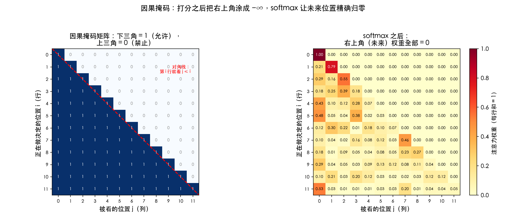
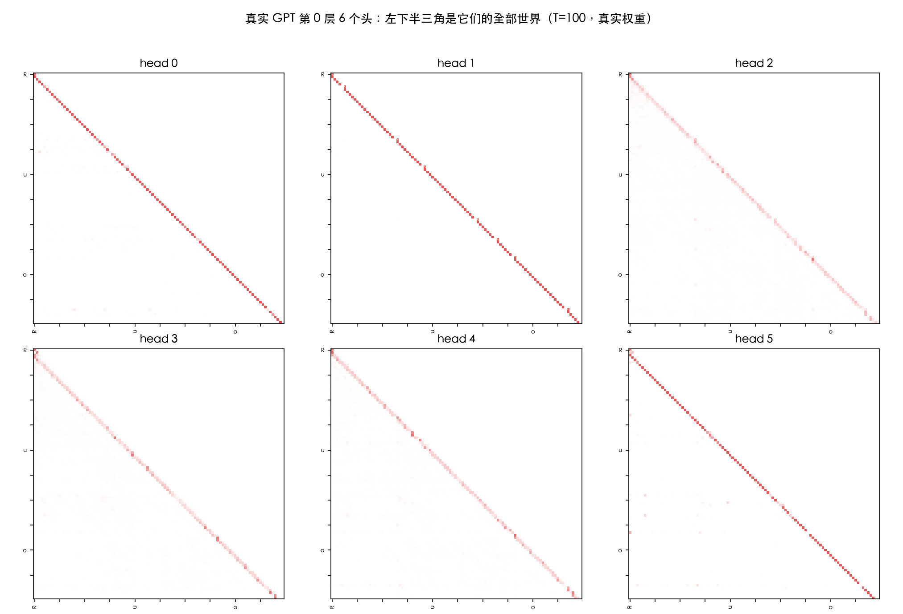
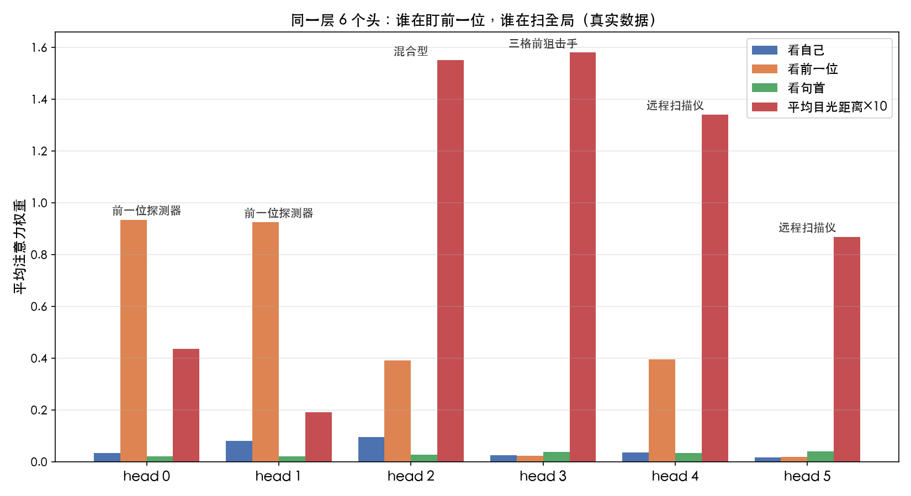
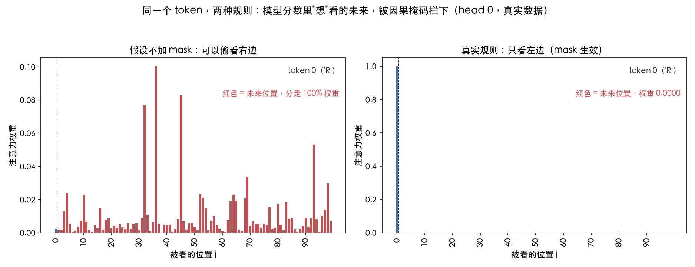

# 第 16 课：因果掩码 + 多头

> 本节代码：✅ 见 `code/`（16-causal-mask.py 因果掩码最小演示 + 16-multihead-probe.py 真实模型多头探测 + 16-make-charts.py 图表）
>
> 本系列《手搓大模型：从零构建 NanoGPT》的第十六课。
> 目标读者：零基础。第 14、15 课把 Attention 的四步（投影 → 打分 → 归一 → 混合）和 Q/K/V 讲透了，但一直留着一个问题：**打分矩阵是 T×T 全矩阵，模型岂不是能看到"未来的词"？** 这一课回答这个问题，再顺手解开另一个谜：为什么每个 Transformer 块里要放 6 个头，而不是 1 个。

先摆一组真实数字（Mac mini 实测，一字未改）：

- 在这个训练了 1000 步的 GPT 里（6 层 6 头），把第 0 层 6 个头的注意力权重全部检查一遍：**未来位置（j > i）的权重，4950 个格子全部精确等于 0**——不是"接近 0"，是精确的 0；
- 6 个头在同一层里自发分化出了完全不同的分工：**头 0 和头 1 是"前一位探测器"**（平均 93% 的注意力落在紧挨着的前一个字符上），**头 3 是"三格前狙击手"**（66% 的 token 它最关注 3 格前的那个字符，几乎不看自己），**头 4 和头 5 是"远程扫描仪"**（目光最远能扫到 67、73 个字符开外）；
- 做个"摘掉 mask"的平行实验：把因果掩码临时拿掉再算 softmax，**头 2、3、4 平均会把 40% 以上的注意力分给"未来位置"**——模型分数里其实"想"看右边，是 mask 硬生生把它按住的。

**这一课的核心思想只有一句大白话：GPT 预测下一个字符时只能看左边——不是因为它"不想"看右边，而是因为预测时右边的字符根本还不存在；实现这个"只看左边"的规则，代码里只有一行。** 至于多头，就像 6 个人同时读同一段话，一个人盯前一个词，一个人盯句首，一个人扫全局——最后把 6 份笔记拼起来，比任何一个人的都全。

## 先给结论：四句话

- **因果掩码 = 打分之后，把右上角全部填成 −∞**：softmax 一吃，未来位置的权重变成精确的 0。整个"只看左边"的规则，一行代码写完；
- **mask 必须是 −∞，不能是 0**：softmax 里 exp(0) = 1，填 0 的话未来位置照样分到权重，掩码就失效了；
- **多头 = 同一个输入，并行算 6 组 QKV**：每组（一个头）独立打分、独立混合，输出拼起来再过一次线性层。6 个头 = 6 种"看世界的方式"；
- **训练和推理用的是同一个 mask**：生成的时候，每生成一个新字符，它就多了一行可以看的历史——mask 的形状跟着文本长度自动长。

## 动机：没有它行不行？

第 15 课算过打分矩阵 Q·Kᵀ：T 个 token 两两打分，得到 T×T 的方阵。第 i 行第 j 列是"token i 觉得 token j 有多相关"——**注意，这个矩阵没有任何方向限制**：token 3 可以给 token 100（未来的词）打高分，token 100 也可以回头看 token 3。

问题来了：**GPT 是怎么训练的？** 第 12 课讲过：把一段文本喂进去，让模型预测"下一个字符"。对位置 i 来说，正确答案是 i+1 的字符——**训练时，i+1 之后的所有字符（i+2、i+3……）是明明白白摆在模型面前的**。如果打分矩阵不设防，位置 i 的注意力可以直接偷看位置 i+2、i+3，把"未来答案"抄进自己的表示里。

那训练就变成开卷考试了：模型不需要学会预测，只需要学会抄。loss 会掉得飞快，但一上场推理（真正生成时，未来还不存在）就原形毕露。

**因果掩码就是这场考试的"闭卷规则"：谁都不许看右边。** 每个位置的注意力，只能分配给它自己和它左边的位置。这个规则不来自任何数学推导，来自一个很朴素的现实：**预测未来的时候，未来还没发生。**

## 第一层解剖：mask 矩阵长什么样（一张图看懂）

掩码规则落到矩阵上，就是一张"下三角"：第 i 行第 j 列，j ≤ i 标 1（允许看），j > i 标 0（禁止看）。



左图是掩码矩阵本身：**下三角全 1，上三角全 0，对角线是分界线**。第 0 行只有一个 1（第一个字符只能看自己），第 4 行有五个 1（第五个字符能看 0~4 全部历史）——**越靠后的位置，能看的历史越长**。

右图是加完 mask 再过 softmax 的效果：**右上角整片是 0**，每一行的权重只落在"左边+自己"上面。注意每行加起来仍然等于 1（softmax 归一），只不过允许分配的位置被砍掉了一半。

## 第二层解剖：mask 加在哪个环节（数据流）

第 14 课的 Attention 四步：投影 → 打分 → 归一 → 混合。mask 加在哪？

**打分之后、归一之前。**

```
scores = Q @ Kᵀ / √d      # ① 打分：T×T 全矩阵，不分左右
scores = mask(scores)      # ② 因果掩码：右上角填 −∞   ← 就插在这里
weights = softmax(scores)  # ③ 归一：未来位置权重 = 0
out = weights @ V          # ④ 混合：只搬左边+自己的信息
```

为什么必须在这个位置？两个原因：

1. **必须在 softmax 之前**。softmax 是"把整行分数变成加起来等于 1 的比例"，它分不清"这个分数是左边还是右边来的"。要在比例里消灭未来位置，就得在进 softmax 之前就把它们的分数弄成"不可能赢"的数——−∞。
2. **必须在打分之后**。Q·Kᵀ 打分的目的是算相关性，模型需要"算过"才知道哪些位置相关。mask 只是事后宣布"右边那半张表作废"，不影响打分本身的计算。

一句话：**先让模型自由地算一遍相关性，再告诉它右边的都不许用。**

## 第三层解剖：数学细节（每个符号的直觉）

### 为什么填 −∞ 而不是 0？

这是本课第一个"啊哈时刻"。直觉上，"不许看右边"最容易想到的实现是：把未来的分数改成 0。

试一下：softmax 的一行里，如果未来位置分数是 0，那么 exp(0) = 1——**它照样参与归一化，照样分到权重**。0 在 softmax 的世界里不是"没有"，是"中等水平"。填 0 等于没填。

只有 −∞ 才能做到"绝对没有"：**exp(−∞) = 0**。位置分数是 −∞，进 softmax 后权重精确等于 0，连参与归一化的资格都没有（0 不贡献分子，也不贡献分母）。这就是为什么代码里用的是 `float('-inf')`，不是 `0.0`。

### 为什么是"下三角"而不是别的形状

掩码矩阵的形状直接由"预测任务"决定。预测第 i+1 个字符时，能用的信息是 0~i 这 i+1 个位置——**所以第 i 行允许 j ≤ i**，形成一个左下三角。如果任务是"预测中间被挖掉的词"（像完形填空），那掩码就会变成别的形状（前后都能看，只挡住被挖的位置）——那叫 BERT 式双向注意力，是另一条技术路线，本系列后面不展开，知道有这回事就行。

### 多头：6 组 QKV 并行算，最后拼起来

第 15 课讲的是一个头。多头就是把同一个 X 复制成 6 份（严格说是一份 X 乘 6 组不同的 Wq/Wk/Wv），并行算 6 遍 Attention，得到 6 个输出：

```
head_h = softmax(Q_h @ K_hᵀ / √d + mask) @ V_h    # 第 h 个头，h = 0..5
out = concat(head_0, ..., head_5) @ W_o            # 6 个头的输出拼起来，再过一次线性层
```

逐个符号讲：

- **Q_h / K_h / V_h**：第 h 组的查询/键/值，形状是 (T, 64)。6 组就是 6 套 64 维的投影矩阵，**参数完全独立**——所以 6 个头可以学出 6 种完全不同的关注模式；
- **√d 里的 d = 64**：6 个头把 384 维的 embedding 切成 6 段，每段 64 维。这样多头没有增加计算量：6 个头 × 64 维 = 384 维，和 1 个头算 384 维一样多；
- **concat 后再乘 W_o**：6 个头各算各的之后，拼成 (T, 384) 的矩阵，再过一次输出投影 W_o。**这一步让模型可以自由混合 6 个头的结论**——比如"前一位探测器"说前一个字符重要、"远程扫描仪"说 40 格前的那个词重要，最终听谁的，由 W_o 学。

## 代码层：最小可运行（因果掩码就 6 行）

### 代码 1：因果掩码最小演示（`16-causal-mask.py`）

运行命令：

```bash
~/projects/main-agent/nanoGPT/.venv/bin/python 16-causal-mask.py
```

核心代码（完整程序见 `code/16-causal-mask.py`）：

```python
# 依赖: numpy（venv 已装）
import numpy as np

T = 5
# 1. 掩码矩阵：下三角 1，上三角 0 —— 第 i 行能看 j <= i
mask = np.tril(np.ones((T, T), dtype=float))

# 2. 打分（真实模型里来自 Q·Kᵀ/√d），故意让"未来"也有高分
rng = np.random.default_rng(16)
scores = rng.normal(0, 1, (T, T))
scores[0, 3] = 4.0    # 故意：token 0 很想看 token 3（未来！）

# 3. 加 mask：把禁止区换成 -inf（不是 0！）
masked = np.where(mask.astype(bool), scores, -np.inf)

# 4. softmax：exp(-inf) = 0，未来位置权重精确归零
def softmax_row(v):
    e = np.exp(v - v.max())
    return e / e.sum()

weights = np.stack([softmax_row(masked[i]) for i in range(T)])
```

逐行看：

- `np.tril(np.ones((T, T)))`：生成下三角 0/1 矩阵——**这就是 nanoGPT 里那一行 `torch.tril(torch.ones(block_size, block_size))` 的 numpy 版**；
- `np.where(允许, scores, -np.inf)`：允许的位置保留原分数，禁止的位置替换成 −∞。**因果掩码的全部逻辑，就这一行**；
- `softmax_row`：减最大值防溢出（第 15 课彩蛋提过，exp(144) 会爆），然后取指数、按行归一；
- 效果：scores[0,3] = 4.0 本来是全场最高分，**加 mask 后权重变成 0**——"模型可以想，但不能看"。

### 代码 2：真实模型多头探测（`16-multihead-probe.py`）

运行命令：

```bash
~/projects/main-agent/nanoGPT/.venv/bin/python 16-multihead-probe.py
```

核心思路：把训练好的 GPT 第 0 层 attention 的 forward 换成手写路径（flash attention 抓不到中间量），把 6 个头的真实注意力权重扣下来，逐项检查：

```python
# 抓第 0 层 6 个头在 100 个真实字符上的注意力权重
att = att_raw.masked_fill(self.bias[:, :, :Tt, :Tt] == 0, float("-inf"))
att_soft = F.softmax(att, dim=-1)   # (6, T, T)：6 个头 × 100×100 权重表
```

注意这行 `self.bias[:, :, :Tt, :Tt] == 0`——**nanoGPT 的掩码是注册成 buffer 的固定下三角矩阵，推理时文本长度 Tt 小于 block_size，就截取左上角 Tt×Tt 的小块**。这是"掩码跟着文本长度自动长"的实现细节。

## 实验层：真实输出（Mac mini 实测，一字未改）

### 实验 1：因果掩码真的生效了吗？

对第 0 层 6 个头，把 100×100 权重表里所有"未来位置"（j > i，一共 4950 个格子）全部检查一遍：

| 头 | 未来位置最大权重 | 精确等于 0 的格子 |
|----|----------------|-------------------|
| 0 | 0.00e+00 | 4950 / 4950 |
| 1 | 0.00e+00 | 4950 / 4950 |
| 2 | 0.00e+00 | 4950 / 4950 |
| 3 | 0.00e+00 | 4950 / 4950 |
| 4 | 0.00e+00 | 4950 / 4950 |
| 5 | 0.00e+00 | 4950 / 4950 |

**全部精确为 0**。不是 1e-8 那种浮点噪声，是干净的 0.00——因为 −∞ 经过 exp 之后，权重就是数学上精确的 0。每行权重之和也全部等于 1（softmax 归一，一分不多一分不少）。**只看左边，这条规则在这个模型的 6 万个注意力格子里，一条都没破。**

把 6 个头的完整权重表画出来，能直观看到那个"左下三角"：



每一张子图里，右上角（未来区域）都是纯白（= 0），亮色全部挤在左下三角。**6 张图共享同一个"只准看左边"的边界，但亮色分布完全不同**——这就是多头的第一个证据。

### 实验 2：6 个头各看各的（量化证据）

把每个头的关注习惯量化成四个指标：平均看自己的权重、平均看前一位的权重、平均看句首的权重、平均目光距离（往左看多远）：

| 头 | 看自己 | 看前一位 | 看句首 | 平均目光距离 | 最常见的一瞥 | 最左看过 |
|----|--------|----------|--------|--------------|--------------|----------|
| 0 | 0.034 | **0.935** | 0.022 | 0.04 | 前一位（97%） | -2 格 |
| 1 | 0.081 | **0.925** | 0.020 | 0.02 | 前一位（92%） | -1 格 |
| 2 | 0.096 | 0.392 | 0.028 | 0.16 | 前一位（75%） | -2 格 |
| 3 | 0.025 | 0.024 | 0.038 | 0.16 | **三格前（66%）** | -3 格 |
| 4 | 0.037 | 0.395 | 0.034 | 0.13 | 前一位（51%） | **-67 格** |
| 5 | 0.016 | 0.018 | 0.040 | 0.09 | 前两位（95%） | **-73 格** |



读这张表：

- **头 0、1**：平均 93% 的注意力落在"紧挨着的前一个字符"上，97% 的 token 它们最关注的就是前一位——**这是 bigram 探测器**。莎士比亚字符级的最大规律就是"某个字符后面常跟另一个字符"，这两个头专门抓这个；
- **头 3**：66% 的 token 它最关注 3 格前的位置，几乎不看自己（只有 2.5%）——**它在抓"三连字符"级别的模式**，比如常见的 `the`、`ing` 这种拼写规律；
- **头 4、5**：目光最远能扫到 67、73 个字符开外——**它们是远程扫描仪**，负责捕捉跨句子的长距离信息（比如前面的角色名、句首的标点模式）。

**没人给头 3 派活让它盯三格前，也没人安排头 5 去扫 70 格**——6 组独立参数在训练中各自找到了自己的生态位。这就是多头的全部意义：与其让一个头"既要盯局部又要看全局"，不如给 6 个头自由，让它们自然分工。

### 实验 3：摘掉 mask 的平行世界（模型其实"想"看右边）

最后一个实验最有意思：**把 mask 临时摘掉，用同一批真实分数重新 softmax**，看未来位置会分走多少权重：

| 头 | 平均分给"未来"的权重 |
|----|---------------------|
| 0 | 0.199（20%） |
| 1 | 0.124（12%） |
| 2 | **0.443（44%）** |
| 3 | **0.440（44%）** |
| 4 | **0.403（40%）** |
| 5 | 0.194（19%） |

**头 2、3、4 平均会把 40% 以上的注意力分给未来位置**——它们的 Q/K 在训练中确实学出了"跟未来相关"的分数（虽然训练时这些位置被 mask 挡住、梯度根本没流过它们，但分数分布里依然残留着这种倾向）。是因果掩码把这些"偷看"全部压成了 0。

挑一个具体的 token 看（第 0 层 head 0，文本开头的 `R`——ROMEO 的开头）：



- 左图（假设不加 mask）：这个 `R` 对未来位置的总注意力高达 **100%**——它几乎完全不想看自己（因为自己是文本开头，信息量约等于零），全部目光都想投向未来的字符；
- 右图（真实规则）：mask 生效后，未来位置权重精确 = 0，`R` 只能被迫把 100% 的注意力留给自己（它是第 0 行，左边没有任何历史）。

**"模型可以想，但不能看"**——这句话在这一课有了实锤：模型的分数里明明有"想偷看未来"的冲动，因果掩码像一堵墙，把冲动全部拦在 softmax 之外。

## 惊喜时刻

**惊喜 1：整个"只看左边"规则，代码就 3 行。** 一行生成掩码矩阵（`tril`），一行填 −∞（`masked_fill`），一行 softmax。没有复杂的条件分支，没有"位置循环"——矩阵运算一把梭。GPT 的核心机制之一，简单到让人怀疑是不是漏了什么。

**惊喜 2：6 个头在同一个模型里自发分化成不同职业。** 前一位探测器、三格前狙击手、远程扫描仪——这些分工没有任何人设计，纯粹是 6 组独立参数在梯度下降中各自找到的生态位。**多头注意力不是"让模型更聪明"的锦上添花，是让模型同时拥有"显微镜"和"望远镜"的必需品。**

**惊喜 3：模型其实"想"偷看未来，只是被规则按住。** 摘掉 mask 的平行实验里，头 2/3/4 平均 40%+ 的注意力想分给未来——训练时梯度从未流过这些格子，但分数的"冲动"还在。因果掩码不是模型学出来的，是写死的规则，**它和模型本身是两个东西**：一个负责"能看什么"，一个负责"看了怎么用"。

## 误区与彩蛋

**误区 1：mask 是把未来的分数设成 0？**
不是。**填 0 等于没填**——softmax 里 exp(0) = 1，未来位置照样分到权重。必须填 −∞，让 exp(−∞) = 0，未来位置才真正归零。这是初学者最容易踩的坑。

**误区 2：mask 加在 softmax 之后？**
不是。**mask 必须在打分之后、softmax 之前**。softmax 是"整行归一"，它分不清分数来自左边还是右边；只有在进 softmax 前把右边全部变成 −∞，归一化之后右边才整片是 0。

**误区 3：多头 = 6 个不同的模型？**
不是。**同一个输入、同一个掩码、同一个 softmax 公式，只是 6 组独立的投影矩阵（Wq/Wk/Wv）**，并行算出 6 份结果，最后拼起来过 W_o。参数总量和"1 个大头"一样（6×64 = 384 维），计算量也没变——多出来的只是"6 种视角"。

**误区 4：训练时不能看右边，推理时是不是可以？**
不可以，**训练和推理用同一个 mask**。推理生成时，模型每产出一个新字符，就把它接到输入末尾，下一轮它"能看的历史"多了一个——mask 的形状跟着文本长度自动截取（`[:T, :T]`）。规则从头到尾没变过。

**彩蛋 1：nanoGPT 的掩码是注册成 buffer 的固定矩阵。** `self.register_buffer("bias", torch.tril(torch.ones(block_size, block_size)))`——掩码不是算出来的，是生成时一次性做好的常量，训练时它不参与梯度更新。**掩码是规则，不是参数。**

**彩蛋 2：flash attention 里那个 `is_causal=True` 就是同一个东西。** 现代 GPU 上 `torch.nn.functional.scaled_dot_product_attention` 用一个布尔开关就把因果掩码做掉了，连 −∞ 都不用显式填——**"只看左边"这个概念如此重要，以至于 PyTorch 为它专门开了后门。**

**彩蛋 3：为什么 GPT 是"decoder-only"。** 模型只有解码器（decoder），没有编码器（encoder）——**因为因果掩码只允许从左往右看，这正好匹配"生成"这个动作**。反过来，BERT 那种"完形填空"模型需要看右边，就只能用双向注意力。**模型的架构形状，是由任务决定的。**

**彩蛋 4：真实模型里"看句首"的比例都很低（2%~4%），但没一个是 0。** 句首字符（比如文本开头的 `R`）是整段文本的"锚点"，任何位置都留了一点点注意力给它——**这是语言模型学会的"段落感"**：知道自己在哪一段话里，比知道眼前这个词重要得多。

---

下一课，把 Attention 装进完整的 Transformer 块：**第 17 课《Transformer 块》**——LayerNorm、残差连接、前馈网络、位置编码，四件套怎么拼成 GPT 的基本积木。

*手搓大模型，第 16 课完成。因果掩码：打分后把右上角填 −∞，softmax 让未来位置精确归零——"只看左边"的规则只有 3 行代码。多头：6 个头自发分化成前一位探测器、三格前狙击手和远程扫描仪。*

---

**本课完整代码与全文已开源到 GitHub（public）：**

https://github.com/flyingcloud-code/learning-nanogpt-from-0-to-1/tree/main/16-causal-multihead

**系列仓库（30 课陆续更新中）：**

https://github.com/flyingcloud-code/learning-nanogpt-from-0-to-1
