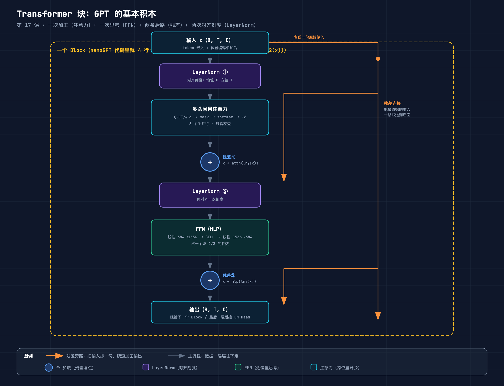
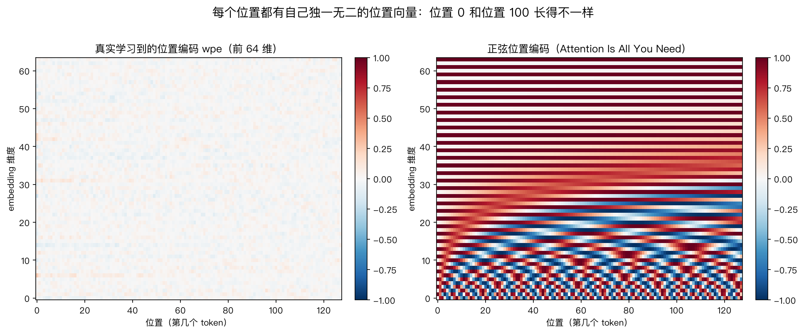
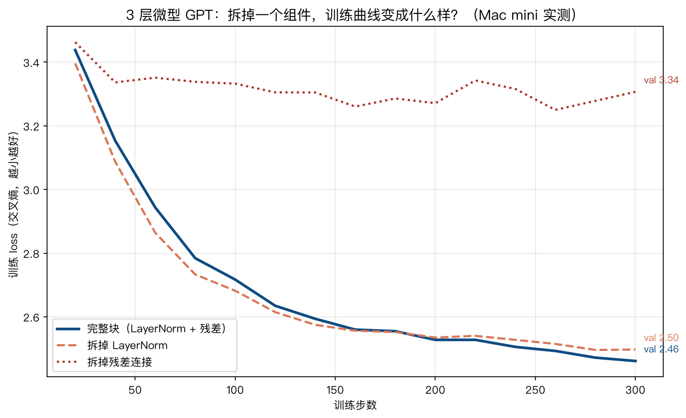

# 手搓大模型 17：Transformer 块——开会、干活、留后路，4 件套怎么拼出 GPT 的积木

> 本节代码：✅ 见 `code/`（17-block.py 手搓 Block 与 nanoGPT 对拍 + 17-ablation.py 消融实验 + 17-make-charts.py 图表）
>
> 本系列《手搓大模型：从零构建 NanoGPT》的第十七课。
> 目标读者：零基础。第 14、15、16 课把注意力拆成了四步（投影 → 打分 → 归一 → 混合），讲了 Q/K/V 和因果掩码。但注意力只是"一块零件"——GPT 的每一层，是把注意力装进一个叫 **Transformer 块** 的"车间"里才真正工作的。这一课把这个车间整个拆开。

先摆一组真实数字（Mac mini 实测，一字未改）：

- **一个 Transformer 块的全部核心逻辑，只有 4 行代码**：`x = x + attn(ln_1(x)); x = x + mlp(ln_2(x))`——nanoGPT 的 model.py 里，Block 类的 forward 函数就这两行；
- 手搓的 Block 和 nanoGPT 官方 Block 对拍：**1,774,464 个参数一个不差，前向输出最大差异 7.15e-07，反向梯度最大差异 1.46e-10**（浮点精度级别，可视为完全一致）；
- 一个块里的参数，**FFN（前馈网络）占了 66.6%，注意力只占 33.3%，LayerNorm 只有 0.09%**——"干活"的部分比"开会"的部分贵一倍；
- 消融实验（3 层微型 GPT 各训 300 步）：完整块 val loss **2.4621**，拆掉 LayerNorm **2.5043**，**拆掉残差连接直接卡在 3.31 训不动**。

**这一课的核心思想只有一句大白话：GPT 的每一层是一个"先开会、再干活"的车间——注意力是开会（词与词交换信息），FFN 是干活（每个词自己想明白），残差是后路（原始信息永远有备份），LayerNorm 是对齐刻度（别让数值越传越乱）。** 四件套拼在一起，才成了可以一层一层往上叠的积木。

## 先给结论：四句话

- **一个块 = 两次加工 + 两条残差 + 两个 LayerNorm**：先 `LayerNorm → 注意力 → 加回原输入`，再 `LayerNorm → FFN → 加回原输入`；
- **残差不是优化技巧，是必需品**：把残差拆掉，3 层模型的 loss 卡在 3.3 下不去——没有它，深层网络根本训不动；
- **LayerNorm 只占参数 0.09%，但缺了它模型就差一截**：它不增加多少计算，却让每一层都从"整齐的刻度"开始；
- **FFN 占了块参数的三分之二**：注意力负责"和谁交流"，FFN 负责"消化吸收"，后者的成本是前者的两倍。

## 动机：没有它行不行？

第 14 课到 16 课讲了完整的因果多头注意力：输入一堆 token，输出一堆"看过上下文之后"的新表示。听起来已经很强了。但直接拿注意力去堆 GPT，会撞上两个问题：

**问题一：注意力只会"开会"，不会"干活"。** 注意力做的事情本质上是"把别的词的信息按相关性加权搬过来"。信息搬过来之后呢？需要有个地方把这些信息真正消化——提取模式、做非线性变换、决定"这些信息对预测下一个词有什么用"。注意力没有这个能力，它的输出还是词的线性组合。FFN 就是干这个的：每个词独立地把自己的一整条表示"重新想一遍"。

**问题二：一层层叠起来，数值会失控。** 一个注意力输出经过 softmax 加权求和，数值范围还算可控；但真实模型里，每经过一层线性变换，输出分布的方差就会变一次。叠 6 层、12 层之后，有的维度涨到天上，有的维度缩到 0——梯度要么爆炸要么消失，训练直接崩。LayerNorm 和残差连接就是为治这个病来的。

一句话：**注意力解决"看哪里"，FFN 解决"怎么想"，LayerNorm 和残差解决"怎么叠得深"**。四件套缺一个，车间就开不了工。

## 第一层解剖：块的结构长什么样（一张图看懂）



从这张图读三件事：

1. **数据从上往下走**：输入 x（token 嵌入 + 位置编码相加后的结果）→ LayerNorm① → 多头因果注意力 → ⊕ 加回原输入 → LayerNorm② → FFN → ⊕ 加回原输入 → 输出；
2. **右边那条橙色竖线是残差旁路**：入口处把原始输入"备份一份"，绕到每个 ⊕ 处加回去。所以注意力算完、FFN 算完，结果都不是"覆盖"，而是"在原始数据上做增量"；
3. **两个 LayerNorm 一前一后**：注意力之前对齐一次刻度，FFN 之前再对齐一次。这样无论上一层输出长什么样，这一层都从"均值 0 方差 1"开始。

## 第二层解剖：数据怎么流动（流程）

把上图翻译成代码，就是 nanoGPT 里 Block 的 forward 的全部内容：

```
x = x + attn(ln_1(x))    # 第一段：对齐刻度 → 开会（注意力）→ 加回原输入
x = x + mlp(ln_2(x))     # 第二段：对齐刻度 → 干活（FFN）→ 加回原输入
return x                 # 输出和输入形状一模一样：(B, T, C)
```

**形状不变，是块能无限堆叠的前提**。输入是 (B, T, C)——B 个句子，每句 T 个 token，每个 token 一个 C 维向量——经过一个块，出来还是 (B, T, C)。正因为形状不变，GPT 才能把 6 个、12 个、甚至 48 个块一个接一个串起来，像流水线上的一排车间。

数据流的三步走：

1. **进车间先对齐刻度**（LayerNorm）：每个 token 的 C 维向量，减均值、除标准差，变成"标准身材"再开工；
2. **第一次加工：开会**（注意力）：T 个 token 互相看，把相关信息搬到自己身上——这是"横向"的信息交流（跨词）；
3. **第二次加工：干活**（FFN）：每个 token 独立地对自己做非线性变换——这是"纵向"的自我消化（不跨词）。

每次加工之后，都通过残差把"加工结果"和"原来的自己"加起来：**新信息是增量，不是替代**。

## 第三层解剖：数学细节（每个符号的直觉）

### 1. LayerNorm：给每个向量"对齐刻度"

对一个 token 的向量 x（384 维），LayerNorm 做三件事：

```
mean = 均值(x)              # 一个数：这一维向量的平均水平
std  = 标准差(x)            # 一个数：这一维向量的波动幅度
x' = (x - mean) / sqrt(std² + ε)   # 每个分量减去均值、除以标准差
out = weight * x' + bias    # 再乘上可学习的缩放、加上可学习的平移
```

逐个符号讲：

- **mean / std**：对每个 token 单独算的。384 个数，先求平均，再求波动。做完 `(x - mean) / std` 之后，这个向量变成"均值 0、方差 1"的标准身材——不管上一层把它放大到 5 还是缩小到 0.1，进来都是一样的尺度；
- **ε（读 epsilon，约 1e-5）**：防止除以 0 的小数。万一某个向量所有分量都一样（std = 0），除下去就爆了，加个 ε 保命；
- **weight / bias**：归一化之后还要"学"回来的自由度。如果模型发现某个维度就应该大一点，就调大对应的 weight。**归一化是"对齐刻度"，weight/bias 是"刻度对齐之后再微调"**；
- 注意：**LayerNorm 是对每个 token 独立做的**（按最后一维），不是对整个 batch 做——这是它和 BatchNorm 的关键区别，后面彩蛋再提。

### 2. 残差连接：x + f(x) 的"后悔药"

残差就一个加法：`out = x + f(x)`，其中 f 是注意力或 FFN。

直觉：**f 不需要学会"完整的答案"，只需要学会"在 x 的基础上改多少"**。这像改作文：与其从白纸写一篇新作文，不如在原稿上批注"这里加个例子、那里删一句"。模型要学的东西一下子变少了——大多数时候，一个 token 的表示本来就不需要大改。

更重要的事发生在反向传播。第 7 课讲过：梯度是逐层相乘传回去的。没有残差时，梯度要穿过 f 的每一层矩阵乘法，每穿一层就缩小一次，12 层下来梯度基本归零——**梯度消失**。有了 `x + f(x)`，梯度有一条"高速公路"直接抄近道传回输入（因为 x 对 x 的导数是 1，走残差这条路梯度不缩水）。**残差是深层网络的"保命通道"**，这个下面实验部分会看到真实证据。

### 3. FFN：先放大 4 倍想，再缩回来

```
hidden = Linear(384 → 1536)(x)   # 放大 4 倍
hidden = GELU(hidden)            # 非线性激活
out    = Linear(1536 → 384)(hidden)  # 缩回原维度
```

直觉：**注意力是"横向"的——词和词交流；FFN 是"纵向"的——每个词自己想明白**。注意力搬过来的信息揉在一起，FFN 负责"消化"：把 384 维的表示展开到 1536 维（相当于从 4 个角度重新审视），过非线性激活（让模型能表达弯弯绕绕的关系），再压缩回 384 维交给下一层。

为什么是 4 倍？**经验值**。GPT-2、GPT-3 论文里用的都是 4 倍，绝大多数 Transformer 模型沿用这个比例。4 不是数学推导出来的，是"试出来好用"。参数大头也在这里：c_fc 和 c_proj 两个矩阵，各 384×1536 和 1536×384，加起来正好是注意力的两倍。

### 4. 位置编码：告诉模型"这是第几个词"

第 11 课讲过词嵌入：每个词查表得到一个向量。但"我爱你"和"你爱我"用的是完全相同的三个词向量——**如果不加位置信息，模型眼里这两句话一模一样**。位置编码就是给每个位置也发一个专属向量：

```
x = token_embedding(token) + position_embedding(pos)
```

- **wpe 的形状是 (block_size, n_embd)**：256 个位置，每个位置一个 384 维向量，也是查表（第 18 课讲 GPT 全景时会看到 `nn.Embedding(block_size, n_embd)` 这一行）；
- 位置 0 的向量 + 词嵌入，位置 1 的向量 + 词嵌入……**每个位置的"签名"不同，模型就能区分顺序**。

这些位置向量长什么样？直接从训练好的模型里把 wpe 抠出来看（真实权重）：



左图是 1000 步训练后模型学到的 wpe 前 64 维：**没有两个位置长得一样**——热力图从上到下每一条"横纹"的明暗模式都不同。数字证据：位置 10 和位置 200 的余弦相似度只有 **-0.1762**（几乎不相关），而位置 10 和紧挨着的位置 11 的余弦相似度是 **0.5012**（相邻位置有些相关）。模型确实给每个位置分配了不同的向量。

右图是《Attention Is All You Need》论文里的正弦公式版：一个固定公式生成的位置向量，不需要训练。两种思路各有利弊：**学习式**（GPT 用这个）让模型自己决定位置怎么编码；**正弦式**（早期 Transformer 用）不需要训练、且理论上能外推到更长的序列。GPT 系列用学习式，因为"让数据说话"通常更好用。

## 代码层：手搓一个完整 Block（逐行注释）

下面这段是 `code/17-block.py` 的核心，从头到尾不用任何现成 Transformer API，纯手搓。完整可运行程序见 `code/17-block.py`。

运行命令：

```bash
~/projects/main-agent/nanoGPT/.venv/bin/python 17-block.py
```

```python
# 依赖: torch（venv 已装）
import math
import torch
import torch.nn as nn
import torch.nn.functional as F

# 1. 手搓 LayerNorm：归一化 + 可学习的缩放平移
class MyLayerNorm(nn.Module):
    def __init__(self, ndim, eps=1e-5):
        super().__init__()
        self.weight = nn.Parameter(torch.ones(ndim))   # 可学习的缩放
        self.bias = nn.Parameter(torch.zeros(ndim))    # 可学习的平移
        self.eps = eps

    def forward(self, x):
        mean = x.mean(dim=-1, keepdim=True)            # 每个 token 自己的均值
        var = x.var(dim=-1, keepdim=True, unbiased=False)  # 方差
        x_norm = (x - mean) / torch.sqrt(var + self.eps)   # 标准身材
        return self.weight * x_norm + self.bias            # 微调回来

# 2. 手搓因果多头注意力（第 14/15/16 课的三件套，装进一个类）
class MyCausalSelfAttention(nn.Module):
    def __init__(self, ndim, n_head, block_size):
        super().__init__()
        self.n_head = n_head
        self.head_dim = ndim // n_head
        self.c_attn = nn.Linear(ndim, 3 * ndim)        # 一份输入 → Q/K/V 三份
        self.c_proj = nn.Linear(ndim, ndim)            # 输出投影
        self.register_buffer("mask", torch.tril(       # 因果掩码（第 16 课主角）
            torch.ones(block_size, block_size)).view(1, 1, block_size, block_size))

    def forward(self, x):
        B, T, C = x.size()
        q, k, v = self.c_attn(x).split(C, dim=2)       # 投影出 Q/K/V
        q = q.view(B, T, self.n_head, self.head_dim).transpose(1, 2)
        k = k.view(B, T, self.n_head, self.head_dim).transpose(1, 2)
        v = v.view(B, T, self.n_head, self.head_dim).transpose(1, 2)
        att = (q @ k.transpose(-2, -1)) / math.sqrt(self.head_dim)  # 打分
        att = att.masked_fill(self.mask[:, :, :T, :T] == 0, float("-inf"))  # mask
        att = F.softmax(att, dim=-1)                   # 归一
        y = att @ v                                    # 混合
        y = y.transpose(1, 2).contiguous().view(B, T, C)
        return self.c_proj(y)                          # 输出投影

# 3. 手搓 FFN：放大 4 倍 → GELU → 缩回
class MyMLP(nn.Module):
    def __init__(self, ndim):
        super().__init__()
        self.c_fc = nn.Linear(ndim, 4 * ndim)          # 384 → 1536
        self.gelu = nn.GELU()
        self.c_proj = nn.Linear(4 * ndim, ndim)        # 1536 → 384

    def forward(self, x):
        return self.c_proj(self.gelu(self.c_fc(x)))

# 4. 手搓完整 Block：nanoGPT 的 Block 全部逻辑就下面 4 行
class MyBlock(nn.Module):
    def __init__(self, ndim, n_head, block_size):
        super().__init__()
        self.ln_1 = MyLayerNorm(ndim)
        self.attn = MyCausalSelfAttention(ndim, n_head, block_size)
        self.ln_2 = MyLayerNorm(ndim)
        self.mlp = MyMLP(ndim)

    def forward(self, x):
        x = x + self.attn(self.ln_1(x))    # 第一段：对齐 → 开会 → 留后路
        x = x + self.mlp(self.ln_2(x))     # 第二段：对齐 → 干活 → 留后路
        return x
```

逐行看几个关键点：

- **`nn.Parameter(torch.ones(ndim))`**：LayerNorm 的 weight 初始化为 1（不缩放），bias 初始化为 0（不平移）——**一开始 LayerNorm 就是"恒等"的**，让模型从"没归一化"的状态平滑过渡；
- **`self.c_attn(x).split(C, dim=2)`**：一次线性变换出 3 份（3×384 维），切三刀成 Q/K/V。nanoGPT 也是这么做的，比分别算三个矩阵更快；
- **`self.register_buffer("mask", ...)`**：掩码注册成 buffer，跟着模型走但不参与梯度更新（第 16 课彩蛋讲过，掩码是规则不是参数）；
- **`x = x + ...`**：两条残差。整个 Block 的"架构智慧"就藏在这两个加号里。

## 实验层：真实输出（Mac mini 实测，一字未改）

### 实验 1：手搓 Block 和官方 Block 数值等价吗？

把 nanoGPT `model.py` 的 Block 实例化，把手搓版的参数逐项复制成官方版的参数，喂完全相同的输入，比较输出和梯度：

| 对比项 | 手搓版 | 官方版 | 最大差异 |
|--------|--------|--------|----------|
| 参数量 | 1,774,464 | 1,774,464 | 完全一致 ✅ |
| 前向输出 | (2, 32, 384) | (2, 32, 384) | 7.15e-07 ✅ |
| 反向梯度 | 同一输入 | 同一输入 | 1.46e-10 ✅ |

7.15e-07 级别的差异来自 softmax 和矩阵乘法的浮点运算顺序不同（官方用 flash attention，手搓用显式掩码），**在数值上可以视为同一个函数**。手搓版不是"神似"，是"同一回事"。

顺带把参数构成打印出来——一个块的钱都花在哪：

| 组件 | 参数量 | 占比 |
|------|--------|------|
| attn.c_attn（QKV 投影） | 442,368 + 1,152 | 25.0% |
| attn.c_proj（输出投影） | 147,456 + 384 | 8.3% |
| mlp.c_fc（放大） | 589,824 + 1,536 | 33.3% |
| mlp.c_proj（缩回） | 589,824 + 384 | 33.3% |
| ln_1 + ln_2（两个 LayerNorm） | 384×4 | 0.09% |
| **合计** | **1,774,464** | **100%** |

**FFN 66.6% vs 注意力 33.3% vs LayerNorm 0.09%**——干活比开会贵一倍，而 LayerNorm 几乎免费。这就是为什么所有模型都舍得放 LayerNorm：性价比太高了。

### 实验 2：拆掉 LayerNorm / 残差，会怎样？（消融实验）

最有说服力的实验：同一个微型 GPT（3 层块，128 维，4 头），用完全相同的初始化和数据，分别训练三个版本——完整块、拆掉 LayerNorm（换成恒等）、拆掉残差（去掉两个加号）。各训 300 步：

| 版本 | 最终 train loss | 最终 val loss |
|------|-----------------|---------------|
| 完整块（LayerNorm + 残差） | 2.4613 | **2.4621** |
| 拆掉 LayerNorm | 2.4972 | 2.5043 |
| 拆掉残差连接 | 3.3066 | **3.3433** |



读这张图：

- **拆掉残差（红色虚线）**：loss 从第 40 步开始就卡在 3.3 附近，后面 260 步几乎原地抖动，最终 val 3.34——**训练基本失败**。3 层模型而已，没有残差梯度就传不下去；
- **拆掉 LayerNorm（橙色虚线）**：能降，但全程比完整块高，最后 val 2.50 vs 2.46——**能学，但学得慢、学得差**；
- **完整块（蓝色实线）**：一路最低，val 2.46。

**这就是残差"保命通道"和 LayerNorm"对齐刻度"的真实证据**。不是论文里的抽象结论，是 Mac mini 上跑出来的三条曲线。

### 实验 3：位置向量真的"各不相同"吗？

从训练 1000 步的模型里抠出 wpe 权重（256×384），随机挑几对位置算余弦相似度（1 表示方向完全相同，0 表示不相关，-1 表示方向相反）：

| 位置对 | 余弦相似度 | 含义 |
|--------|-----------|------|
| 位置 10 vs 位置 11（相邻） | 0.5012 | 有些相关：相邻位置的"签名"不能差太远 |
| 位置 10 vs 位置 200（相距很远） | -0.1762 | 几乎不相关：相隔很远的位置是完全不同的向量 |

**每个位置都有自己独一无二的向量签名**。模型看到"你"在第 3 位和第 50 位，是两回事——这正是它能理解语序的起点。

## 惊喜时刻

**惊喜 1：一个 Block 的全部核心逻辑只有 4 行代码。** 不开玩笑：`x = x + attn(ln_1(x)); x = x + mlp(ln_2(x))`。注意力、FFN、LayerNorm、残差这四件套，拼装起来的代码比组件本身的代码短得多。GPT 的每一层——无论是 1.2 亿参数的 GPT-2 还是 1750 亿参数的 GPT-3——**都是这一个 4 行的块，复制 N 份串起来**。整个现代语言模型的引擎，本质是一个反复执行的 4 行车间。

**惊喜 2：FFN 才是块里的"花钱大户"。** 注意力名气最大，但一个块 2/3 的参数在 FFN 里。注意力负责"和谁交流"（计算密集但参数少），FFN 负责"消化吸收"（参数密集）。下次看到"Transformer = 注意力"的说法，可以补充一句：还有一半以上的参数在干活。

**惊喜 3：拆掉残差，3 层模型就训不动。** 很多教程把残差说成"加速收敛的技巧"，像是可选项。真实实验打脸：没有残差的 3 层模型，loss 卡在 3.3，训 300 步纹丝不动。**残差不是锦上添花，是深度的入场券。**

## 误区与彩蛋

**误区 1：LayerNorm 是让数据"变正态分布"？**
不是。它只是把均值调到 0、方差调到 1，**分布的形状（偏了、胖了）完全不变**。它做的事更像"对齐刻度尺"，不是"整形"。真正有用的地方在于：不管上一层输出的数值范围是什么，这一层都能从同一个起点开始学。

**误区 2：残差是防止过拟合的？**
不是。残差的主要作用是**让深层网络可训练**（对抗梯度消失），不是泛化。消融实验里拆掉残差，train loss 本身都降不下去——这跟过拟合没关系，是根本学不动。

**误区 3：FFN 在处理"词与词的关系"？**
不是。FFN 对每个 token 独立处理，**完全不跨词**——同一个向量在所有位置上做同样的变换。词与词的关系是注意力的活儿；FFN 只负责"单个词自己怎么想"。

**误区 4：LayerNorm 和 BatchNorm 差不多？**
差很多。BatchNorm 对"整个 batch 的同一个维度"做归一化（跨样本），训练时还要维护全局统计量；**LayerNorm 对"单个样本的整个向量"做归一化（跨特征）**，不需要 batch 统计。对语言模型来说序列长度经常变，LayerNorm 不依赖 batch，所以是标配。

**彩蛋 1：nanoGPT 用的是"Pre-LN"结构。** 注意力/FFN 之前放 LayerNorm（pre-LN），而不是原始 Transformer 论文里的"之后放"（post-LN）。别小看这个顺序：**pre-LN 让梯度更稳，深层模型更好训练**，现在的主流模型几乎都用 pre-LN。nanoGPT 里 `x = x + attn(self.ln_1(x))`——LN 在 attn 前面。

**彩蛋 2：残差投影有"特殊待遇"的初始化。** nanoGPT 的 `_init_weights` 里有一行：所有 `c_proj.weight` 用 `0.02 / sqrt(2 * n_layer)` 初始化，比普通层小。直觉：层数越深，残差里累积的"增量"越多，每个增量的初始幅度就得越小，**12 个块的模型起步才不至于震荡**。GPT-2 论文里的小细节，nanoGPT 一行都没落下。

**彩蛋 3：位置编码是"学习式"的，GPT 不用正弦公式。** 原始 Transformer 论文用固定正弦公式（因为当时没有"让模型自己学位置"的把握），GPT 系列直接用 `nn.Embedding(block_size, n_embd)` 查表——**让模型自己决定每个位置长什么样**。第 18 课读 model.py 的时候会看到这一行，现在可以先记住：位置编码也是查表，跟词嵌入是同一个机制。

---

下一课，把 6 个块串起来看全貌：**第 18 课《GPT 全景：读 model.py》**——token 嵌入、位置嵌入、12 个块、LM Head，整个 GPT 的 forward 流程，和"为什么参数量是 10.65M"。

*手搓大模型，第 17 课完成。Transformer 块 = 开会（注意力）+ 干活（FFN）+ 留后路（残差）+ 对齐刻度（LayerNorm），核心逻辑 4 行代码；FFN 占参数 2/3；拆掉残差 3 层模型训不动，val loss 从 2.46 掉到 3.34。*

---

**本课完整代码与全文已开源到 GitHub（public）：**

https://github.com/flyingcloud-code/learning-nanogpt-from-0-to-1/tree/main/17-transformer-block

**系列仓库（30 课陆续更新中）：**

https://github.com/flyingcloud-code/learning-nanogpt-from-0-to-1
