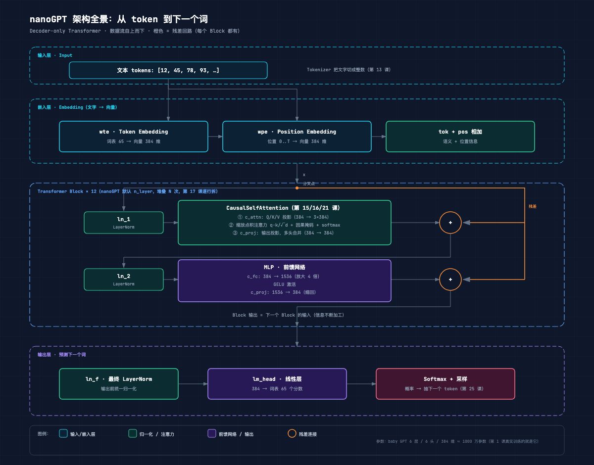
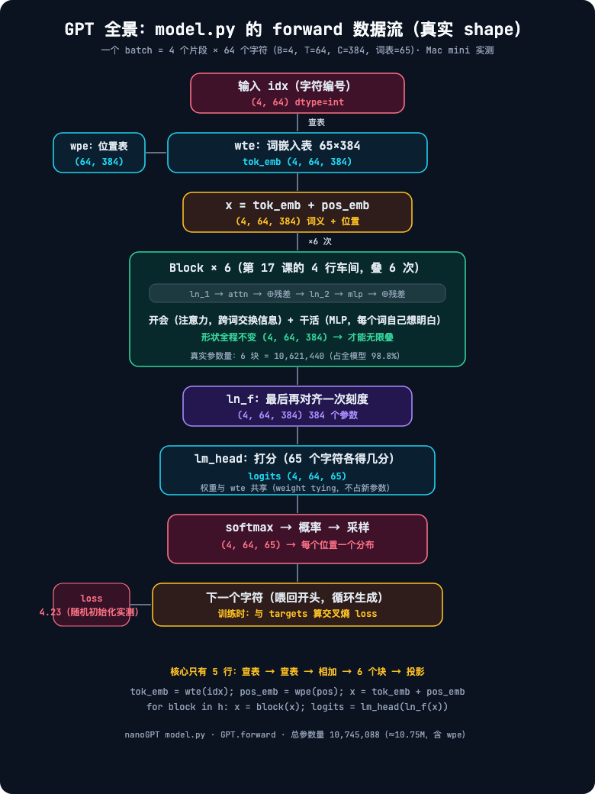
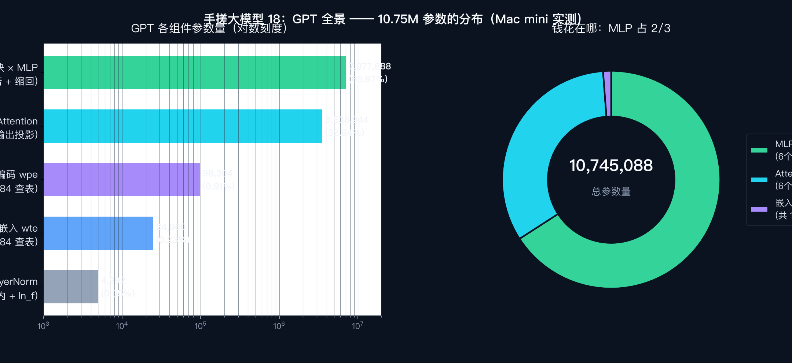

# 手搓大模型 18：GPT 全景——读 model.py，整个 GPT 只有 5 块积木

> 本节代码：✅ 见 `code/`（18-gpt-panorama.py 一个脚本跑完：参数量明细、forward 形状流、真实生成 demo）
>
> 本系列《手搓大模型：从零构建 NanoGPT》的第十八课。
> 目标读者：零基础。前 17 课把零件攒齐了：词嵌入（11 课）、注意力与 QKV（14/15 课）、因果掩码与多头（16 课）、Transformer 块（17 课）。今天做一件事：把 nanoGPT 的 `model.py` 从头到尾读一遍，看这些零件怎么拼成一台能说话的机器。

先摆一组真实数字（Mac mini 实测，一字未改）：

- **整个 GPT 的 forward 核心只有 5 行代码**：查表 → 查表 → 相加 → 6 个块 → 打分。nanoGPT 的 `model.py` 里 `GPT.forward` 就是这 5 行；
- **总参数量 10,745,088（≈10.75M）**，其中 **98.8% 藏在 6 个 Transformer 块里**；块里又是 MLP 占大头（65.9%）；
- **开头查的词表，就是结尾打分的那个矩阵**——`wte.weight is lm_head.weight` 返回 `True`，两个"看起来不同的层"其实是同一份权重（weight tying）；
- 随机初始化的模型在真实莎士比亚 batch 上 loss = **4.2322**（理论下限 ln(65)≈4.17）；训练 1000 步的 checkpoint 能续写出莎士比亚腔的句子。

**这一课的核心思想只有一句大白话：GPT 是一条"查表进、查表出"的流水线——字符先查词表变成向量，向量穿过 6 个块（开会+干活）不断自我加工，最后再查一次表变成对 65 个字符的打分。整台机器的全部结构，就是 wte、wpe、blocks、ln_f、lm_head 这 5 块积木。**

## 先给结论：四句话

- **GPT = 5 块积木**：词嵌入表（wte）+ 位置编码表（wpe）+ 6 个块（h）+ 最终归一化（ln_f）+ 输出打分（lm_head）；
- **数据流全程形状不变**：进块之前是 (B, T, 384)，出块之后还是 (B, T, 384)——正因为形状不变，块才能叠 6 层、12 层、48 层；
- **参数量的大头不在"入口出口"，在中间**：6 个块占了全模型 98.8% 的参数，其中 MLP 又占了块内 2/3；
- **输出层和输入层共享同一份权重**：预测"下一个字符"用的矩阵，和开头把字符变成向量的矩阵是同一个对象。

## 动机：零件都懂了，整台机器长什么样？

第 11 课懂了 embedding（字符→向量），第 14-16 课懂了注意力（词与词交换信息），第 17 课懂了块（开会+干活+残差+归一化）。但一直缺一张"整机图"：

- 这些零件按什么顺序组装？
- 一个字符从进模型到出模型，中间经过了哪些层、形状怎么变？
- 常说"GPT-2 有 124M 参数"，这个数字是怎么从配置算出来的？

今天不写新代码，**读 nanoGPT 的 `model.py`（330 行）**。读完之后，前 17 课的所有零件会在脑子里拼成一台完整的机器。这也是第 19-26 课"手搓完整 GPT"的预习：先看官方实现长什么样，再动手自己拼。

## 第一层解剖：结构——5 块积木（一张图看懂）



`model.py` 里 `GPT.__init__` 用一段 `ModuleDict` 定义了全部结构，原文就这几行：

```python
self.transformer = nn.ModuleDict(dict(
    wte  = nn.Embedding(config.vocab_size, config.n_embd),   # ① 词嵌入表
    wpe  = nn.Embedding(config.block_size, config.n_embd),   # ② 位置编码表
    drop = nn.Dropout(config.dropout),                        # ③ 入口 dropout
    h    = nn.ModuleList([Block(config) for _ in range(config.n_layer)]),  # ④ 6 个块
    ln_f = LayerNorm(config.n_embd, bias=config.bias),       # ⑤ 最终归一化
))
self.lm_head = nn.Linear(config.n_embd, config.vocab_size, bias=False)  # ⑥ 输出打分
```

逐块解释（每个符号的直觉）：

| 积木 | 形状 | 干什么 |
|------|------|--------|
| `wte`（word token embedding） | 65×384 | 字符查表变向量：字符 13 → 第 13 行的 384 维向量 |
| `wpe`（word position embedding） | 256×384 | 位置查表变向量：位置 0-255 各有专属向量，告诉模型"这是第几个词" |
| `h`（blocks） | 6 个 Block | 每个块 = 开会（注意力）+ 干活（MLP）+ 残差 + 归一化（第 17 课） |
| `ln_f`（final layer norm） | 384 | 输出前最后一次对齐刻度 |
| `lm_head`（language model head） | 65×384 | 把 384 维向量打分成 65 个字符各自的分数 |

注意几个直觉点：

- **`vocab_size = 65`**：本系列用字符级词表，莎士比亚全集只出现 65 种字符（含换行和空格）。65 就是"模型认识的单词表大小"——对每个位置，模型要回答"下一个字符是这 65 个里的哪一个"；
- **`block_size = 256`**：模型最多看 256 个字符的上下文。wpe 表有 256 行，就是因为最多有 256 个位置；
- **`nn.ModuleList` 不是 `nn.ModuleDict` 的普通 list**：它让 PyTorch 知道"这 6 个块里也有参数"，这样 `model.parameters()` 才能把块里的权重都统计进来；
- **`bias=False`**：本系列配置里所有 Linear 和 LayerNorm 都不要偏置项——参数更少、和 checkpoint 一致。偏置项在 GPT 里作用很小（这是 nanoGPT 作者实测的结论）。

## 第二层解剖：数据怎么流动（流程图 + 真实形状）

`GPT.forward` 的全部内容，去掉注释就 5 行：

```python
tok_emb = self.transformer.wte(idx)                        # ① 字符查词表
pos_emb = self.transformer.wpe(pos)                        # ② 位置查位置表
x = self.transformer.drop(tok_emb + pos_emb)               # ③ 词义+位置，相加
for block in self.transformer.h:                           # ④ 6 个块依次加工
    x = block(x)
logits = self.lm_head(self.transformer.ln_f(x))            # ⑤ 对齐刻度，打分
```



拿真实 batch 喂进去，每一步的形状是这样变的（B=4 个片段，每段 T=64 个字符，C=384 维）：

| 步骤 | 代码 | 形状 | 直觉 |
|------|------|------|------|
| 输入 | `idx` | (4, 64) | 4 个片段，每段 64 个字符编号 |
| ① 查词表 | `wte(idx)` | (4, 64, 384) | 每个字符变成 384 维向量：字符 13 → 第 13 行 |
| ② 查位置表 | `wpe(pos)` | (64, 384) | 位置向量只有一维序列长度，自动广播到 4 个片段 |
| ③ 相加 | `tok_emb + pos_emb` | (4, 64, 384) | 词义和位置揉进同一个向量 |
| ④ 6 个块 | `block(x)` ×6 | (4, 64, 384) | 每层都在"看上下文 + 自己想"，形状纹丝不动 |
| ⑤ 打分 | `lm_head(ln_f(x))` | (4, 64, 65) | 每个位置对 65 个字符各打一个分 |

三个容易忽略的直觉点：

- **pos_emb 形状是 (64, 384) 而不是 (4, 64, 384)**：位置向量对所有片段是一样的——第 3 个位置在第 1 段和第 4 段里是同一个向量。PyTorch 广播自动把它"复制"到每个片段上；
- **块的数量和形状无关**：一个块输出 (4, 64, 384)，6 个块串起来还是 (4, 64, 384)。所以把 `n_layer` 从 6 改成 12 只是"流水线加长"，不需要改任何其他代码；
- **最后一步从 (4, 64, 384) 变 (4, 64, 65)**：384 维的"浓缩理解"被 lm_head 投影到 65 维，每个维度对应一个字符的分数。分数再经 softmax（第 14 课）变成概率，采样出下一个字符（第 25 课细讲）。

## 第三层解剖：参数的钱花在哪（真实统计）

一个 10.75M 参数的模型，每一分钱花在哪？直接从实例化后的模型里统计（真实输出）：



| 组件 | 参数量 | 占比 |
|------|--------|------|
| 6 个块 × MLP（放大 4 倍 + 缩回） | 7,077,888 | 65.87% |
| 6 个块 × Attention（QKV 投影 + 输出投影） | 3,538,944 | 32.94% |
| wpe 位置编码表 256×384 | 98,304 | 0.91% |
| wte 词嵌入表 65×384 | 24,960 | 0.23% |
| 6 个块内 LayerNorm + ln_f | 4,992 | 0.05% |
| lm_head 输出投影 | 0（与 wte 共享） | 0% |
| **合计** | **10,745,088** | **100%** |

手动验算一遍一个块的参数（第 17 课的公式）：

- **注意力**：`c_attn` 是 384×1152（一份输入投影成 Q/K/V 三份）= 442,368；`c_proj` 是 384×384 = 147,456；合计 **589,824**；
- **MLP**：`c_fc` 是 384×1536 = 589,824；`c_proj` 是 1536×384 = 589,824；合计 **1,179,648**；
- **LayerNorm**：ln_1 和 ln_2 各 384 个 weight（bias=False 没有 bias）= 768；
- 一个块 = 589,824 + 1,179,648 + 768 = 1,770,240；6 个块 = **10,621,440**，占全模型 98.8%。

**结论：所谓"大模型"，钱几乎全花在中间的块上；入口出口（两个查表 + 归一化）加起来不到 1.2%。** 这也解释了为什么堆层数（n_layer）是扩大模型最直接的方式。

### 两个口径：10.75M 还是 10.65M？

nanoGPT 的 `get_num_params()` 默认把位置编码 wpe 扣掉再报告，所以：

```python
model.get_num_params()          # 10,646,784 → "10.65M"（扣掉 wpe 的口径）
sum(p.numel() for p in model.parameters())  # 10,745,088 → "10.75M"（含 wpe）
```

系列大纲里说的"10.65M 参数"就是前者——位置编码不参与"知识存储"（它只是告诉模型位置），所以统计可学习知识量时把它去掉。两种口径都对，看场合用。**GPT-2 说的 124M 也是这个口径**。

### weight tying：为什么开头和结尾是同一份权重？

`model.py` 第 138 行只有一行：

```python
self.transformer.wte.weight = self.lm_head.weight  # 词嵌入权重直接赋给输出层
```

验证（真实输出）：

```
model.transformer.wte.weight is model.lm_head.weight → True
```

直觉：**模型最后要预测"下一个字符是谁"，最自然的依据之一就是"这个字符长什么样"——也就是它在词嵌入表里的向量。** 让输出层直接复用词嵌入矩阵，相当于"预测打分"和"字符表示"共用同一本词典。好处有两个：

1. **省参数**：65×384 = 24,960 个参数只存一份；
2. **语义一致**：字符 13 的"样子"（嵌入向量）和"被预测的分数"始终联动，训练更稳。

GPT-2 论文验证过这个技巧（weight tying）不伤效果还省显存，nanoGPT 默认开着。

## 代码层：18-gpt-panorama.py（一个脚本读完整台机器）

下面的脚本加载 nanoGPT 的 `model.py`（一行不改），实例化本系列的 baby GPT，然后依次回答三个问题：参数量多少、forward 形状怎么变、训练过的模型能不能生成文本。完整程序见 `code/18-gpt-panorama.py`。

运行命令：

```bash
~/projects/main-agent/nanoGPT/.venv/bin/python 18-gpt-panorama.py
```

```python
# 依赖: torch 2.12.1（venv 已装）+ nanoGPT 仓库（model.py / data/shakespeare_char）
import os, sys, pickle, importlib.util
import torch

NANOGPT = os.path.expanduser("~/projects/main-agent/nanoGPT")

# 用 importlib 把 nanoGPT 的 model.py 当作模块加载，不改它一行
spec = importlib.util.spec_from_file_location("nanogpt_model", os.path.join(NANOGPT, "model.py"))
mod = importlib.util.module_from_spec(spec)
sys.modules["nanogpt_model"] = mod
spec.loader.exec_module(mod)
GPT, GPTConfig = mod.GPT, mod.GPTConfig

torch.manual_seed(1337)
device = "mps" if torch.backends.mps.is_available() else "cpu"

# 系列标准配置：6 层 / 6 头 / 384 维 / 256 上下文 / 65 字符词表
config = GPTConfig(vocab_size=65, block_size=256, n_layer=6, n_head=6,
                   n_embd=384, dropout=0.2, bias=False)
model = GPT(config)          # 打印 "number of parameters: 10.65M"
model.to(device)

# ① 参数量：按组件名统计每一块的参数
def count(prefix):
    return sum(p.numel() for (pn, p) in model.named_parameters() if pn.startswith(prefix))

wte   = count("transformer.wte")                      # 词嵌入表
wpe   = count("transformer.wpe")                      # 位置编码表
attn  = sum(count(f"transformer.h.{i}.attn") for i in range(6))   # 6 个块的注意力
mlp   = sum(count(f"transformer.h.{i}.mlp")   for i in range(6))  # 6 个块的 MLP
ln_blk= sum(count(f"transformer.h.{i}.ln_1") + count(f"transformer.h.{i}.ln_2") for i in range(6))
total = sum(p.numel() for p in model.parameters())
# ……打印表格（真实输出见下方"实验层"）……

# ② weight tying 验证：是不是同一个对象
print(model.transformer.wte.weight is model.lm_head.weight)   # True

# ③ forward 形状流：从 train.bin 取真实字符，逐层打印形状
import numpy as np
train = np.memmap(os.path.join(NANOGPT, "data/shakespeare_char/train.bin"),
                  dtype=np.uint16, mode="r")
B, T = 4, 64
raw = train[: B * (T + 1)].astype(np.int64)
batch   = torch.from_numpy(raw).view(B, T + 1)[:, :-1].to(device)   # 输入
targets = torch.from_numpy(raw).view(B, T + 1)[:, 1:].to(device)    # 目标（每个位置的下一个字符）
model.eval()
with torch.no_grad():
    x = batch
    tok_emb = model.transformer.wte(x)                 # (4, 64, 384)
    pos = torch.arange(0, T, dtype=torch.long, device=device)
    pos_emb = model.transformer.wpe(pos)               # (64, 384)
    x = model.transformer.drop(tok_emb + pos_emb)      # (4, 64, 384)
    for block in model.transformer.h:                  # 6 个块，形状不变
        x = block(x)
    x = model.transformer.ln_f(x)                      # (4, 64, 384)
    logits = model.lm_head(x)                          # (4, 64, 65)
    loss = torch.nn.functional.cross_entropy(
        logits.view(-1, logits.size(-1)), targets.view(-1))
    print(f"loss = {loss.item():.4f}")                 # 随机初始化 ≈ 4.23

# ④ 加载训练 1000 步的 checkpoint，真的生成一段文本
ckpt = torch.load(os.path.join(NANOGPT, "out-shakespeare-char/ckpt.pt"),
                  map_location=device, weights_only=False)
model.load_state_dict(ckpt["model"])
model.eval()
with open(os.path.join(NANOGPT, "data/shakespeare_char/meta.pkl"), "rb") as f:
    meta = pickle.load(f)
itos = meta["itos"]                                    # {编号: 字符}
seed_text = "First Citizen:\nBefore we proceed any further, hear me speak.\n"
seed_ids = [meta["stoi"][ch] for ch in seed_text]      # 字符 → 编号
idx = torch.tensor([seed_ids], dtype=torch.long, device=device)
out = model.generate(idx, max_new_tokens=250, temperature=0.8, top_k=40)
print("".join(itos[int(i)] for i in out[0].tolist()))  # 编号 → 字符
```

逐行看几个关键点：

- **`importlib.util.spec_from_file_location`**：不把 model.py 复制进项目，直接按路径加载。这样"读源码"和"用源码"是一份文件，永远同步；
- **`count(prefix)`**：`named_parameters()` 返回每个参数带名字（如 `transformer.h.3.mlp.c_fc.weight`），按前缀累加就能精确统计任意组件的参数量；
- **`loss.view(-1, 65)`**：交叉熵要求"每个样本一行"。把 (4, 64, 65) 拍平成 256 行、每行 65 个分数，和 256 个目标字符一一对应；
- **`weights_only=False`**：torch 2.12.1 加载旧 checkpoint 需要这个参数（2.13.0 的 torch.save bug 与此有关，见第 2 课）；
- **`model.generate(...)`**：nanoGPT 自带的采样循环——把生成的字符接回输入，再喂给模型，循环 250 次（temperature/top_k 第 25 课细讲）。

## 实验层：真实输出（Mac mini 实测，一字未改）

### 实验 1：参数量明细

```
number of parameters: 10.65M

===== 1. 参数量：整个 GPT 的每一分钱花在哪 =====
parameters() 实际统计到的参数总数: 10,745,088
get_num_params()（扣掉位置编码的计数口径）: 10,646,784

组件                                              参数量       占比
--------------------------------------------------------------
transformer.wte 词嵌入表 65x384                   24,960    0.23%
transformer.wpe 位置编码表 256x384                 98,304    0.91%
6 个块 × attn（QKV 投影+输出投影）                3,538,944   32.94%
6 个块 × mlp（放大4倍+缩回）                      7,077,888   65.87%
6 个块 × ln_1/ln_2（LayerNorm）                    4,608    0.04%
transformer.ln_f 最终 LayerNorm                      384    0.00%
lm_head 输出投影（与 wte 共享权重）                       0    0.00%
--------------------------------------------------------------
合计（共享权重只算一次）                          10,745,088  100.00%
```

### 实验 2：weight tying 验证

```
model.transformer.wte.weight is model.lm_head.weight → True
wte.weight 形状: (65, 384)，lm_head.weight 形状: (65, 384)
结论：词嵌入矩阵被输出层复用——最后预测字符用的，就是开头的查表。
```

### 实验 3：forward 形状流 + 随机初始化 loss

```
===== 3. forward 数据流：每一步的形状（真实 batch） =====
输入 idx:        (4, 64)  (B=4 个片段 × T=64 个字符)
目标 targets:    (4, 64)  (每个位置的下一个字符)
wte 查表后:       (4, 64, 384)  (每个字符变成 384 维向量)
wpe 查表后:       (64, 384)  (位置向量，自动广播到每个样本)
相加+dropout 后:  (4, 64, 384)  (语义=词义+位置)
穿过 6 个块后:    (4, 64, 384)  (形状一点没变——这是块能无限叠的原因)
最终 LayerNorm:   (4, 64, 384)
lm_head 输出:     (4, 64, 65)  (每个位置对 65 个字符各打一个分)
交叉熵 loss:      4.2322  (随机初始化的真实值，约等于 ln(65)=4.17 附近)
```

**loss 为什么 ≈ 4.23？** 随机初始化时模型对 65 个字符"一视同仁"，每个字符概率约 1/65，交叉熵 = ln(65) ≈ 4.174。实测 4.2322 比理论下限高一点点，说明初始化的打分还有轻微偏差。**任何一个没训练过的 GPT，loss 都该在这个数附近——这是判断模型是否正常的"出厂自检值"**（第 8 课细讲过 loss 的读法）。

### 实验 4：训练 1000 步的模型，真的生成文本

```
加载完成，训练步数 iter_num = 1000，best_val_loss = 1.5218

----- 生成结果（种子 + 模型续写 250 个字符） -----
First Citizen:
Before we proceed any further, hear me speak.
This in his souls better for Romeo some,
That art may she with runs his lips words,
Cridious to him, poor such as the famity
Of their ruises, and to see them of his mother's hands,
That the violent and study hast to visit their suits.
Fair Lord of Ma
```

拼写并不全对，但**单词、标点、台词分行、甚至"市民发言"的格式都学会了**——这就是一个 10.65M 参数、只在 1MB 莎士比亚文本上训练 1000 步的模型。整条流水线：查表 → 6 个块 → 打分 → 采样，真的能产出像模像样的英文。

### 实验 5：把配置放大，验证"参数量公式"（真实实例化）

同一个 `GPT` 类，只改配置，参数量会怎么涨？真实实例化三个模型：

| 配置（层/头/维/词表/上下文） | 实测参数量 | 常见说法 |
|------|------|------|
| baby：6/6/384/65/256 | 10.65M | — |
| gpt2：12/12/768/50257/1024 | 123.65M | 124M |
| gpt2-medium：24/16/1024/50257/1024 | 353.77M | 350M |

**注意 124M 是四舍五入的说法，精确值是 123.65M。** 模型类没变，只是 `n_layer`、`n_embd`、`vocab_size` 变大——这就是"缩放"（第 29 课讲 Scaling Law 的引子）：同一段代码，改几个数字，就是另一个规模的模型。

## 惊喜时刻

**惊喜 1：整个 GPT 的 forward 只有 5 行。** 不是夸张——`wte(idx)` → `wpe(pos)` → 相加 → 6 个块循环 → `lm_head(ln_f(x))`。前 17 课学的所有东西：embedding、注意力、QKV、掩码、多头、LayerNorm、残差、MLP，全部装进这 5 行里。GPT-3 有 1750 亿参数，forward 也还是这 5 行，只是块数从 6 变成 96。

**惊喜 2：98.8% 的参数在中间的块里，入口出口加起来不到 1.2%。** 两个查表（wte + wpe）加所有 LayerNorm，一共只有 128,256 个参数，而 6 个块有 10,621,440 个。所谓"大模型"，钱几乎全花在"开会和干活"上——查表只是出入口。

**惊喜 3：开头查的表，就是结尾打分的表。** `wte.weight is lm_head.weight → True`。同一个矩阵，进模型时当"字符词典"，出模型时当"预测打分器"。一次学习，两处受益。

**惊喜 4：1000 步、10.65M 参数、1MB 文本，就能产出莎士比亚腔。** 生成的文本不完美，但"这是一段英文台词"这件事本身已经成立。从第 1 课的"一次对话背后发生了什么"，到这里，整条流水线已经真实跑通。

## 误区与彩蛋

**误区 1：model.py 有 330 行，所以 GPT 很复杂？**
330 行里，`GPT` 类真正的结构定义约 15 行、forward 约 10 行，其余大部分是工具函数：`from_pretrained`（从 HuggingFace 加载 GPT-2 权重，约 50 行）、`configure_optimizers`（优化器分组，约 25 行）、`estimate_mfu`（算力利用率估算，约 15 行）、`generate`（采样循环，约 25 行）、`crop_block_size`（模型裁剪）。**核心结构 5 块积木，核心 forward 5 行**，其他都是"周边服务"。

**误区 2：embedding 层参数少，所以不重要？**
参数少不等于不重要。wte 只有 24,960 个参数，但它定义了"每个字符长什么样"——这是模型理解语言的起点。而且由于 weight tying，这份权重在输出端又被用了一次：**字符的"样子"同时决定它被预测的分数**。一个参数出现在两个关键位置。

**误区 3："124M 参数的 GPT-2"是精确数字？**
不是。实测 `get_num_params()` = 123,653,376 ≈ 123.65M，"124M"是论文和社区用的近似说法。GPT-2 的四个规格 124M/350M/774M/1558M 都是四舍五入后的标签，精确值分别是 123.65M / 353.77M / 773.89M / 1557.75M 量级。看到这种数字，先当"量级标签"理解。

**彩蛋 1：推理时只算最后一个位置的 logits。**
`forward` 里有一个推理期小优化：有 targets（训练）时对全部 T 个位置算 logits；没有 targets（生成）时只算最后一个位置 `lm_head(x[:, [-1], :])`——因为生成只需要"下一个字符"的分数。256 个位置只算 1 个，省了 256 倍的计算量。nanoGPT 用 `x[:, [-1], :]`（列表索引）而不是 `x[:, -1, :]`，是为了保住时间维，输出 (B, 1, 65) 而不是 (B, 65)。

**彩蛋 2：位置编码表只有 256 行，超过 256 个字符怎么办？**
`block_size` 是硬上限：`forward` 开头有一句断言 `t <= block_size`。序列超过 256，要么裁剪（`crop_block_size` 或生成时 `idx[:, -block_size:]` 只留最后 256 个），要么换更大的模型。GPT-2 是 1024，GPT-3 是 2048——**"上下文长度"就是位置编码表的行数**，这个直觉以后读论文都用得上。

**彩蛋 3：初始化里藏着"深度保险"。**
`_init_weights` 里，所有 `c_proj.weight`（块的输出投影）用 `0.02 / sqrt(2 * n_layer)` 初始化，比普通层小。层数越深，残差里累积的增量越多，每个增量的初始幅度就得越小——12 层的模型起步才不震荡。第 17 课彩蛋提过，读源码时注意这一行：`std=0.02/math.sqrt(2 * config.n_layer)`。

---

下一课，把训练循环也读一遍：**第 19 课《项目骨架：配置/数据/训练循环》**——`train.py` 里的 get_batch、AdamW、学习率调度，以及"模型怎么从 4.23 一路降到 1.52"。

*手搓大模型，第 18 课完成。GPT = 5 块积木（wte、wpe、blocks、ln_f、lm_head），forward 核心 5 行；10.75M 参数里 98.8% 在 6 个块中，MLP 占 2/3；weight tying 让输出层和词嵌入共享同一份权重；随机初始化 loss 4.23 ≈ ln(65)，1000 步 checkpoint 已能续写莎士比亚腔。*

---

**本课完整代码与全文已开源到 GitHub（public）：**

https://github.com/flyingcloud-code/learning-nanogpt-from-0-to-1/tree/main/18-model-py

**系列仓库（30 课陆续更新中）：**

https://github.com/flyingcloud-code/learning-nanogpt-from-0-to-1
