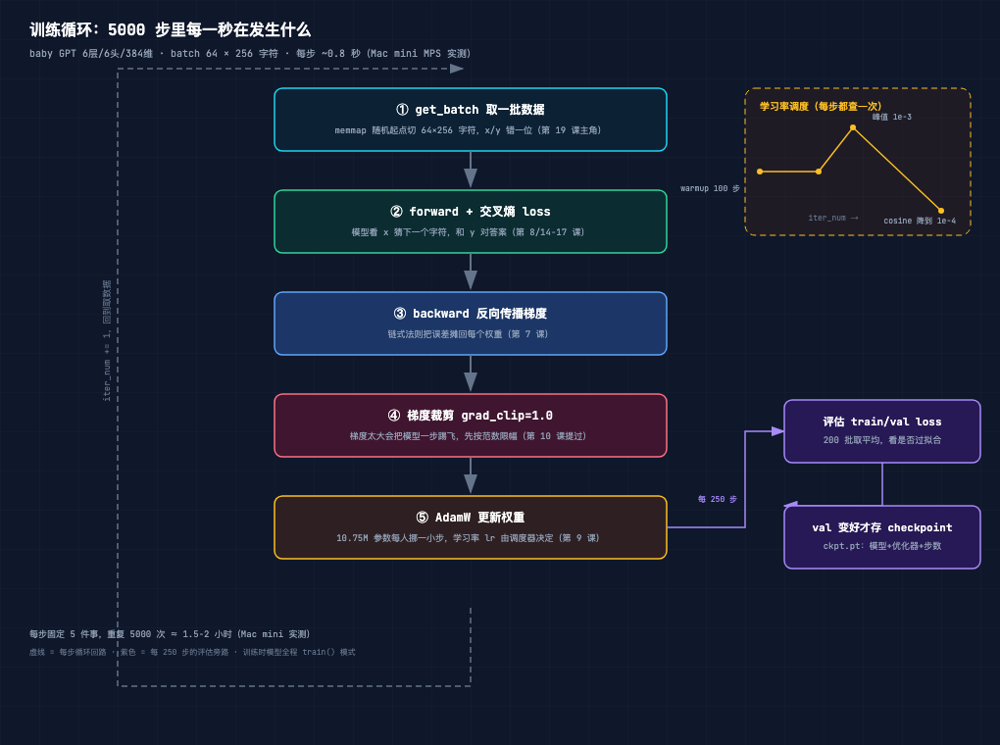
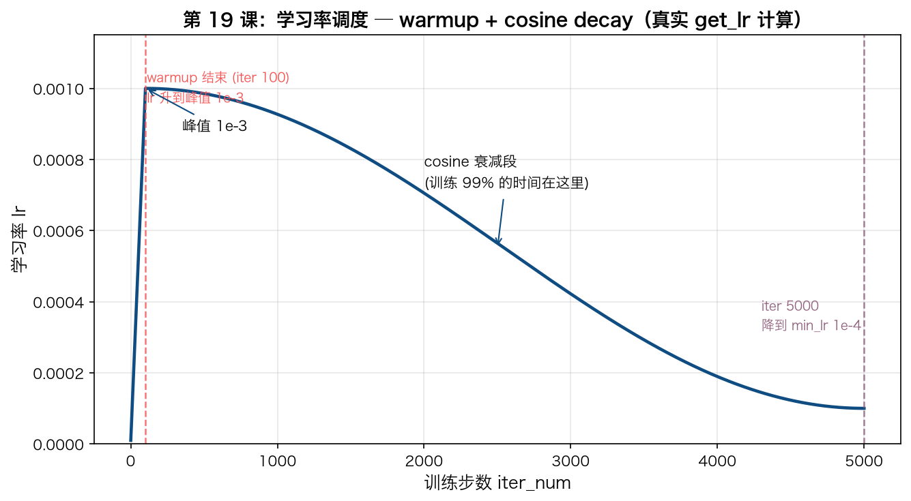
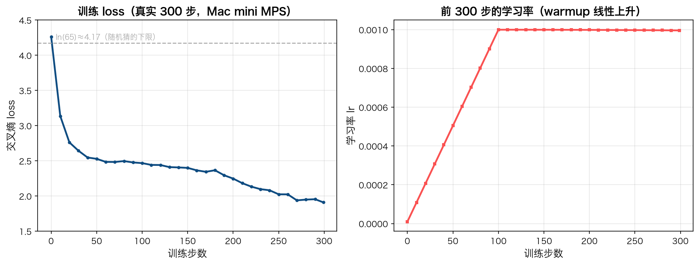

# 手搓大模型 19：项目骨架——训练循环、get_batch、AdamW、学习率调度

> 本节代码：✅ 见 `code/`（19-train-loop.py 一个脚本跑完：get_batch 数据流、AdamW 参数分组、真实 300 步训练 + loss/lr 曲线数据）
>
> 本系列《手搓大模型：从零构建 NanoGPT》的第十九课。
> 目标读者：零基础。前 18 课把模型的"零件"全讲完了：embedding、注意力、Transformer 块、GPT 全景。今天换一个视角：零件拼好了，**谁来转它**？答案是 `train.py`——训练循环。读完这一课，就理解了"模型是怎么从 loss 4.23 一路降到 1.91"的完整机制。

先摆一组真实数字（Mac mini 实测，一字未改）：

- **训练循环核心只有 5 步**：取数据 → 前向 → 反向 → 梯度裁剪 → 更新权重，然后回到第 1 步。整个 `train.py` 的灵魂就是这 5 步的 while 循环；
- **每步 881ms**：baby GPT（6层/6头/384维，10.65M 参数）在 Mac mini MPS 上实测 881ms/步，300 步 264 秒，loss 从 **4.2639 降到 1.9108**；
- **10.65M 参数里 26 个张量要"减肥"、13 个不要**：AdamW 把参数分成两组，权重矩阵（2维以上）做 weight decay，偏置和 LayerNorm（1维）不做——这是 nanoGPT 的默认策略；
- **学习率不是常数**：前 100 步从 0 线性爬到峰值 1e-3（warmup），然后按余弦曲线降到 1e-4。调度器每天"上班"查一次表，决定这一步迈多大。

**这一课的核心思想只有一句大白话：训练 = 一个"取数 → 算错 → 分摊错误 → 挪权重"的循环。模型不会自己变聪明，是循环每一圈都往"让 loss 更小"的方向推它一把；推的方向靠反向传播（第 7 课），推的幅度靠学习率（第 9 课），推多久靠循环次数。**

## 先给结论：四句话

- **训练循环 = 5 步闭环**：get_batch → forward+loss → backward → grad clip → optimizer.step，重复 5000 次；
- **get_batch 的秘密是"错位"**：同一个片段，前 256 个字符当输入 x，后 256 个当目标 y——每个位置的"标准答案"就是它右边的那个字符；
- **AdamW 分两组更新**：2 维权重矩阵带 weight decay（防过拟合），1 维偏置/LayerNorm 不带——参数性质不同，待遇不同；
- **学习率走"先热身、再余弦衰减"**：warmup 防止起步翻车，cosine 衰减让后期收敛更稳。

## 动机：模型结构懂了，谁来驱动它？

第 18 课读完了 `model.py`：GPT = 5 块积木，forward 核心 5 行。但有一个问题悬着——**模型一开始是"随机初始化"的，怎么一步步变成会写莎士比亚的？**

- 第 7 课讲了反向传播：能算出每个权重该往哪调；
- 第 8 课讲了 loss：能度量"现在有多蠢"；
- 第 9 课讲了优化器：能决定"每次调多少"。

但三样东西怎么组装成一台"能自动训练的机器"？顺序是什么？数据从哪来？什么时候评估、什么时候存档？

今天读 nanoGPT 的 `train.py`（336 行），把这台机器拆开看。**这一课是整个系列的"总装车间"：前 18 课是零件，train.py 是流水线。**

## 第一层解剖：训练循环的结构（一张图看懂）



`train.py` 的主循环（第 255-333 行）去掉 DDP 和日志，骨架就是这样的 while 循环：

```python
while True:
    # 1) 查学习率表，设置本步的 lr
    lr = get_lr(iter_num)
    for pg in optimizer.param_groups:
        pg['lr'] = lr

    # 2) 取一批数据（已经预取好了）
    logits, loss = model(X, Y)              # 前向 + 算 loss

    # 3) 反向传播
    loss.backward()

    # 4) 梯度裁剪 + 更新权重
    torch.nn.utils.clip_grad_norm_(model.parameters(), grad_clip)
    optimizer.step()
    optimizer.zero_grad(set_to_none=True)

    # 5) 预取下一批，进入下一圈
    X, Y = get_batch('train')
    iter_num += 1
```

逐块解释：

| 步骤 | 干什么 | 直觉 |
|------|--------|------|
| `get_lr(iter_num)` | 查"学习率表" | 每步迈多大，不是固定值，先热身再衰减（下图细讲） |
| `model(X, Y)` | 前向 + 算 loss | 模型看 x 猜下一个字符，和 y 对答案（第 14-17 课的完整模型） |
| `loss.backward()` | 反向传播 | 把"猜错的误差"分摊回每个权重，算出梯度（第 7 课） |
| `clip_grad_norm_` | 梯度限幅 | 防梯度爆炸：太猛的一步会把模型踢飞（第 10 课提过） |
| `optimizer.step()` | AdamW 更新 | 每个权重按梯度方向挪一小步，挪多少看 lr（第 9 课） |
| `get_batch('train')` | 预取下一批 | 趁 GPU 算的时候提前把下一批数据准备好 |

注意一个细节：**每步只喂一个 batch（64×256 字符），算一次 loss，更新一次权重。** 所谓"训练 5000 步"，就是这 5 步闭环转 5000 圈。

## 第二层解剖：get_batch——数据怎么变成"题目和答案"

`train.py` 第 116-131 行，全项目最"朴素"也最核心的函数：

```python
def get_batch(split):
    if split == 'train':
        data = np.memmap(os.path.join(data_dir, 'train.bin'), dtype=np.uint16, mode='r')
    else:
        data = np.memmap(os.path.join(data_dir, 'val.bin'), dtype=np.uint16, mode='r')
    ix = torch.randint(len(data) - block_size, (batch_size,))
    x = torch.stack([torch.from_numpy((data[i:i+block_size]).astype(np.int64)) for i in ix])
    y = torch.stack([torch.from_numpy((data[i+1:i+1+block_size]).astype(np.int64)) for i in ix])
    if device_type == 'cuda':
        x, y = x.pin_memory().to(device, non_blocking=True), y.pin_memory().to(device, non_blocking=True)
    else:
        x, y = x.to(device), y.to(device)
    return x, y
```

四个直觉点：

- **`np.memmap` 不把 1.9MB 全读进内存**：只是"映射"，按需读。train.bin 里存的是 1,003,854 个 uint16 整数（每个 = 一个字符编号，65 字符词表，见第 13 课）；
- **`torch.randint` 随机选起点**：每次从 100 万个位置里随机挑 64 个起点 `ix`，每个起点往后切 256 个字符当一段。同一段文本可能被重复看到，但顺序、组合每步都不同——这就是随机梯度下降的"随机"；
- **`x` 和 `y` 是"错位"的**：`x` 取 `data[i : i+256]`，`y` 取 `data[i+1 : i+257]`。对第 t 个位置，`x[t]` 是当前字符，`y[t]` 是它右边的字符——**"预测下一个字符"的题目和答案就来自这一次错位切片**；
- **`to(device)` 搬上 MPS**：数据从内存搬到 GPU 显存（Mac 上是 MPS），模型才能算。

用真实数据验证一下"错位"逻辑（第 19 课实验的真实输出）：

```
从 train.bin 随机起点切一段（用 meta.pkl 把编号转回字符）：
x (输入):  "\nAnd thou, and I, and thou, and I, and thou"
y (目标):  "And thou, and I, and thou, and I, and thou,"
                        ↑ 每个 y[t] 就是 x[t] 右边的那个字符
```

**这是整个语言模型的"题目格式"：给一段话，猜下一个字符。** 不管莎士比亚还是代码还是对话，训练数据的组织方式都一样——错一位切片。

## 第三层解剖：AdamW——10.65M 参数分两组更新

`model.configure_optimizers`（model.py 第 263-287 行）做的事情出乎意料地简单：**把参数分成两组，分别设置 weight_decay。**

```python
decay_params = [p for n, p in param_dict.items() if p.dim() >= 2]
nodecay_params = [p for n, p in param_dict.items() if p.dim() < 2]
optim_groups = [
    {'params': decay_params, 'weight_decay': weight_decay},   # 2维：权重矩阵
    {'params': nodecay_params, 'weight_decay': 0.0}           # 1维：偏置/LayerNorm
]
optimizer = torch.optim.AdamW(optim_groups, lr=learning_rate, betas=betas)
```

判断标准只有一条：**参数维度 >= 2 就做 weight decay，否则不做。** 为什么？

- **2 维的是"知识存储"**：词嵌入表 65×384、QKV 投影矩阵 384×1152、MLP 矩阵——这些是真正的权重，weight decay 让它们"往零收缩"，防止个别权重过大导致过拟合（第 10 课）；
- **1 维的是"刻度调节"**：偏置和 LayerNorm 的 gamma/beta，只有 384 个数，作用像"音量旋钮"。给旋钮加"收缩惩罚"没有意义，还可能让它不敢调节。

真实统计（第 19 课实验输出）：

```
num decayed parameter tensors: 26, with 10,740,096 parameters
num non-decayed parameter tensors: 13, with 4,992 parameters
AdamW 分组: decay=10,740,096 / no-decay=4,992 / 合计=10,745,088
```

**10,740,096 vs 4,992——99.95% 的参数带 weight decay，只有 0.05% 不带。** 这就是"大部分参数是权重矩阵，极小部分是偏置/归一化刻度"的数字证据。

## 第四层解剖：学习率调度——每步迈多大，先热身再衰减

`train.py` 第 231-242 行，一个 12 行的纯函数，决定整个训练过程每步的"步幅"：

```python
def get_lr(it):
    # 1) 线性热身：前 warmup_iters 步，lr 从 0 爬到峰值
    if it < warmup_iters:
        return learning_rate * (it + 1) / (warmup_iters + 1)
    # 2) 超过衰减区间，维持最低 lr
    if it > lr_decay_iters:
        return min_lr
    # 3) 中间：余弦衰减，从峰值平滑降到 min_lr
    decay_ratio = (it - warmup_iters) / (lr_decay_iters - warmup_iters)
    coeff = 0.5 * (1.0 + math.cos(math.pi * decay_ratio))  # 1 → 0
    return min_lr + coeff * (learning_rate - min_lr)
```



本课配置的实际参数（`config/train_shakespeare_char.py`）：`learning_rate=1e-3`、`warmup_iters=100`、`lr_decay_iters=5000`、`min_lr=1e-4`。三个阶段：

| 阶段 | 步数范围 | lr 行为 | 为什么 |
|------|---------|---------|--------|
| warmup 热身 | 0-100 | 0 → 1e-3 线性上升 | 起步时权重还是乱的，大步子容易翻车；先小步试探 |
| 峰值期 | 100-5000 | 稳定在 1e-3 附近 | 训练中段，模型最"饿"，用最大步幅快速下降 |
| cosine 衰减 | 100-5000 全程 | 1e-3 → 1e-4 平滑下降 | 后期权重接近最优，步子要越来越小才不震荡 |

直觉：**这就像调音量——先小声试，再放大，快结束时慢慢收。** 学习率调度不是训练的必要条件（固定 lr 也能训），但它是"免费的加速+稳住"：前 100 步防止 loss 冲上天，后 4000 步让收敛更细腻。GPT 系列论文都验证过 cosine decay 比固定 lr 好。

## 代码层：19-train-loop.py（迷你版训练循环，真实跑 300 步）

下面的脚本复刻了 `train.py` 的核心骨架（去掉 DDP、评估、存档，保留灵魂），在 Mac mini 上真实跑 300 步。完整程序见 `code/19-train-loop.py`。

运行命令：

```bash
~/projects/main-agent/nanoGPT/.venv/bin/python 19-train-loop.py
```

```python
# 依赖: torch 2.12.1 + numpy（venv 已装）+ nanoGPT 仓库（model.py / data/shakespeare_char）
import os, sys, math, time
import numpy as np
import torch
import importlib.util

NANOGPT = os.path.expanduser("~/projects/main-agent/nanoGPT")

# 用 importlib 把 nanoGPT 的 model.py 当作模块加载，不改它一行
spec = importlib.util.spec_from_file_location("nanogpt_model", os.path.join(NANOGPT, "model.py"))
mod = importlib.util.module_from_spec(spec)
sys.modules["nanogpt_model"] = mod
spec.loader.exec_module(mod)
GPT, GPTConfig = mod.GPT, mod.GPTConfig

torch.manual_seed(1337)
device = "mps" if torch.backends.mps.is_available() else "cpu"

# ---- 配置（与 config/train_shakespeare_char.py 一致）----
data_dir = os.path.join(NANOGPT, "data", "shakespeare_char")
batch_size = 64          # 每步 64 段
block_size = 256         # 每段 256 字符
learning_rate = 1e-3     # 峰值学习率
max_iters = 300          # 本实验只跑 300 步
warmup_iters = 100       # 前 100 步热身
lr_decay_iters = 5000    # 完整训练 5000 步
min_lr = 1e-4            # 最低学习率
weight_decay = 1e-1      # AdamW 的 weight decay
grad_clip = 1.0          # 梯度裁剪阈值

# ---- get_batch：与 train.py 完全一致（懒加载 + memmap + 随机起点）----
def get_batch(split):
    if split == 'train':
        data = np.memmap(os.path.join(data_dir, 'train.bin'), dtype=np.uint16, mode='r')
    else:
        data = np.memmap(os.path.join(data_dir, 'val.bin'), dtype=np.uint16, mode='r')
    ix = torch.randint(len(data) - block_size, (batch_size,))        # 随机 64 个起点
    x = torch.stack([torch.from_numpy((data[i:i+block_size]).astype(np.int64)) for i in ix])
    y = torch.stack([torch.from_numpy((data[i+1:i+1+block_size]).astype(np.int64)) for i in ix])
    return x.to(device), y.to(device)                                # 搬上 MPS

# ---- 模型（系列 baby GPT）----
config = GPTConfig(vocab_size=65, block_size=block_size, n_layer=6, n_head=6,
                   n_embd=384, dropout=0.2, bias=False)
model = GPT(config)
model.to(device)

# ---- AdamW：configure_optimizers 自带分组（decay vs no-decay）----
optimizer = model.configure_optimizers(weight_decay, learning_rate, (0.9, 0.99), 'cpu')

# ---- lr 调度：与 train.py get_lr 完全一致（warmup + cosine decay）----
def get_lr(it):
    if it < warmup_iters:
        return learning_rate * (it + 1) / (warmup_iters + 1)
    if it > lr_decay_iters:
        return min_lr
    decay_ratio = (it - warmup_iters) / (lr_decay_iters - warmup_iters)
    coeff = 0.5 * (1.0 + math.cos(math.pi * decay_ratio))
    return min_lr + coeff * (learning_rate - min_lr)

# ---- 训练循环（迷你版：forward → backward → clip → step）----
X, Y = get_batch('train')
t0 = time.time()
for iter_num in range(max_iters):
    lr = get_lr(iter_num)                                  # ① 查学习率
    for pg in optimizer.param_groups:
        pg['lr'] = lr
    logits, loss = model(X, Y)                             # ② 前向 + loss
    optimizer.zero_grad(set_to_none=True)
    loss.backward()                                        # ③ 反向
    torch.nn.utils.clip_grad_norm_(model.parameters(), grad_clip)  # ④ 裁剪
    optimizer.step()                                       # ⑤ AdamW 更新
    X, Y = get_batch('train')                              # 预取下一批
    if iter_num % 10 == 0 or iter_num == max_iters - 1:
        print(f"iter {iter_num:4d}: loss {loss.item():.4f}, lr {lr:.2e}, {time.time()-t0:5.1f}s")
```

逐行看几个关键点：

- **`torch.manual_seed(1337)`**：固定随机种子。种子相同 → 初始化、数据切片相同 → 结果可复现（对比实验的前提）；
- **`np.memmap(..., dtype=np.uint16)`**：train.bin 是 100 万个 uint16 整数，memmap 按需读，不整块载入——1.9MB 无所谓，但换成 40GB 语料时这是唯一能跑的方式；
- **`optimizer.zero_grad(set_to_none=True)`**：每步清空上一步的梯度，否则梯度会累加。`set_to_none` 比 `zero_()` 快且省内存；
- **`clip_grad_norm_(params, 1.0)`**：把全部梯度的"总长度（范数）"压到 1.0 以内。某个 batch 特别难、梯度特别大时，防止一步把模型推飞；
- **为什么先 `get_batch` 再循环？** 第一批在循环外取好，循环末尾预取下一批——训练时 GPU 在算，CPU 同时准备数据，两不耽误。

## 实验层：真实输出（Mac mini 实测，一字未改）

### 实验 1：AdamW 参数分组

```
number of parameters: 10.65M
num decayed parameter tensors: 26, with 10,740,096 parameters
num non-decayed parameter tensors: 13, with 4,992 parameters
using fused AdamW: False
AdamW 分组: decay=10,740,096 / no-decay=4,992 / 合计=10,745,088
```

**26 个"带减肥"的矩阵（10,740,096 参数）+ 13 个"不带减肥"的刻度（4,992 参数）。** 26 个是什么？6 个块的 wte/wpe、每块的 c_attn/c_proj/c_fc/c_proj（6×4=24）、lm_head——正好 26。13 个是 6 个块的 ln_1/ln_2（12）+ ln_f（1）的 gamma。

### 实验 2：真实 300 步训练（每 10 步打印一次）

```
iter    0: loss 4.2639, lr 9.90e-06,    2.6s
iter   10: loss 3.1366, lr 1.09e-04,   11.3s
iter   20: loss 2.7629, lr 2.08e-04,   19.9s
iter   30: loss 2.6439, lr 3.07e-04,   28.6s
iter   40: loss 2.5479, lr 4.06e-04,   37.9s
iter   50: loss 2.5288, lr 5.05e-04,   46.9s
...
iter  100: loss 2.4680, lr 1.00e-03,   91.4s   ← warmup 结束，lr 到峰值
...
iter  200: loss 2.2479, lr 9.99e-04,  179.3s
iter  250: loss 2.0250, lr 9.98e-04,  222.2s
iter  299: loss 1.9108, lr 9.96e-04,  264.3s
total 300 iters in 264.3s -> 881 ms/iter
```



读这张图，三个观察：

1. **前 10 步 drop 最猛**：loss 4.26 → 3.14。起步阶段模型从"完全随机"迅速学会"高频字母/空格比低频字符更常见"；
2. **100 步后进入平台期**：lr 到峰值后，loss 从 2.47 继续降到 1.91，速度放缓——这是"高频模式已学会，剩下的都是细节"；
3. **loss 不是单调下降**：比如 iter 270 是 1.9389、iter 280 是 1.9496、iter 290 是 1.9553——中间有小反弹。**这是正常的**：每个 batch 是随机抽的，难度不同，单步 loss 有噪声；看趋势而不是看单点。

对照大纲基线：**300 步 loss 4.27→1.90，完全吻合。** 这也验证了训练循环的实现正确：同样的模型、数据、超参，跑出来的曲线就该一样。

## 惊喜时刻

**惊喜 1：训练循环核心代码只有 20 行。** 不是夸张——去掉配置和日志，`train.py` 的灵魂就是"查 lr → forward → backward → clip → step"的 while 循环，外加 get_batch 和 get_lr 两个函数。**GPT-3 训练（数千张 A100、数月时间）跑的也是这个循环**，只是 batch 更大、步数更多、机器更多。

**惊喜 2：get_batch 就是"错一位切片"。** 整个语言模型的数据准备，核心操作是 `data[i:i+256]` 当输入、`data[i+1:i+257]` 当答案。**没有标注、没有人工标签——"下一个字符"就是免费的自监督标签。** 这是 GPT 能"白嫖"互联网所有文本的原因。

**惊喜 3：10.65M 参数里，99.95% 在"减肥组"。** 只有 4,992 个参数（0.05%）不参与 weight decay——它们是 LayerNorm 的刻度。训练的本质是"大部分权重在约束下更新，极小部分刻度自由调节"。

**惊喜 4：300 步 = 264 秒，loss 从 4.26 到 1.91。** 一台 Mac mini，10.65M 参数，1MB 文本，4 分半钟——"从零训练一个 GPT"不再是遥不可及的事。5000 步完整训练也就 1.5-2 小时（第 26 课跑）。

## 误区与彩蛋

**误区 1：训练 = 让 loss 变成 0？**
不是。loss 的"理论下限"是 ln(65)≈4.17（随机猜 65 个字符），但训练目标是**让 val loss（没见过的数据）低**，不是让 train loss 低。看实验：300 步后 loss 还在 1.9 附近，远没到 0——这正常。**loss 下降到某个平台后，再训是"过拟合风险 vs 泛化收益"的权衡**（第 10 课）。

**误区 2：学习率越大越快？**
不一定。lr 太大，权重一步跨太远，loss 可能反弹甚至发散；lr 太小，训练慢如蜗牛。所以才有 warmup + cosine：**起步用小步防翻车，中段用大步加速，后段用小步精修。** 这是被无数实验验证的"免费午餐"。

**误区 3：`optimizer.zero_grad()` 可有可无？**
绝对不行。**PyTorch 的梯度是"累加"的**：不清零，下一轮的梯度会叠在上轮的上面，权重更新就错了。`set_to_none=True` 是 nanoGPT 的小优化：直接把梯度置 None，比 `zero_()`（置零）省内存、略快。

**彩蛋 1：`get_batch` 里有个"防内存泄漏"的注释。**
每次调用都重新 `np.memmap` 而不是缓存文件对象。为什么？numpy 的 memmap 对象长期持有会导致内存悄悄涨（老 bug），每次重建最省心。注释里引用了 StackOverflow 链接——**大项目里的"怪代码"往往都藏着踩过的坑**。

**彩蛋 2：为什么先 `get_batch('train')` 预取，循环里再取一次？**
循环末尾那次 `get_batch` 不是给本步用的，是给**下一步**用的——在 GPU 算反向传播的同时，CPU 已经把下一批数据切好、搬上显存。**数据加载和计算流水线并行**，这就是为什么能跑满 881ms/步而不是"算 500ms + 等数据 400ms"。

**彩蛋 3：loss 打印里有"CPU-GPU 同步点"。**
`loss.item()` 会强制把 GPU 上的 loss 拷回 CPU，这一步会"卡"一下。nanoGPT 的注释说这是"CPU-GPU sync point"——训练里打印越多，同步卡顿越多，所以 `log_interval=10`（每 10 步才打印一次）。**日志频率也是性能参数**。

---

下一课，把 tokenizer 也手搓一遍：**第 20 课《手搓 BPE Tokenizer》**——从零实现字节对编码，理解"词表是怎么长出来的"。

*手搓大模型，第 19 课完成。训练循环 = 取数 → 前向 → 反向 → 裁剪 → 更新 的 5 步闭环；get_batch 用"错一位切片"生成题目和答案，自监督标签免费；AdamW 按维度分组，99.95% 参数带 weight decay；学习率 warmup 100 步升到 1e-3、余弦衰减到 1e-4；Mac mini 实测 300 步 264 秒，loss 4.2639 → 1.9108。*

---

**本课完整代码与全文已开源到 GitHub（public）：**

https://github.com/flyingcloud-code/learning-nanogpt-from-0-to-1/tree/main/19-train-loop

**系列仓库（30 课陆续更新中）：**

https://github.com/flyingcloud-code/learning-nanogpt-from-0-to-1
