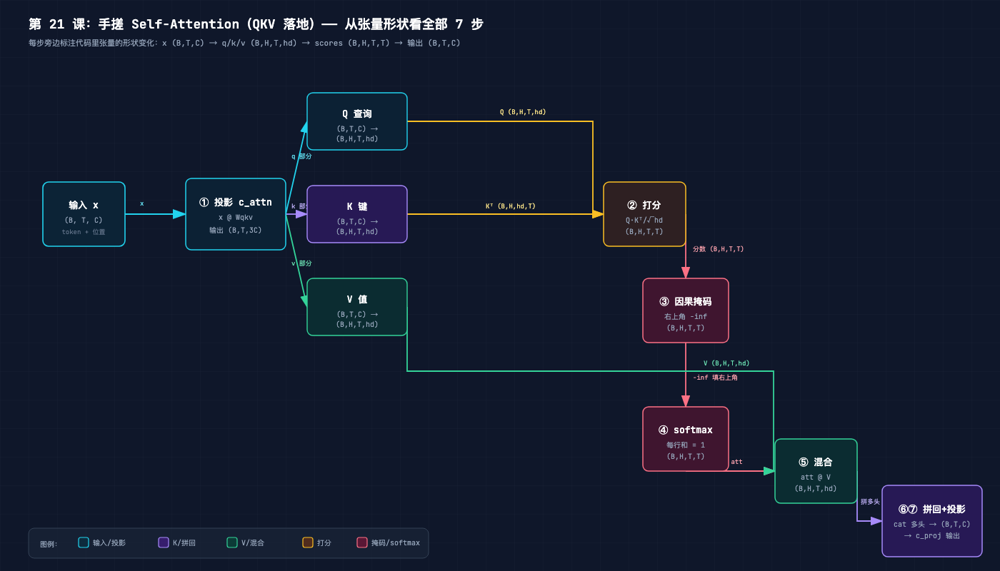
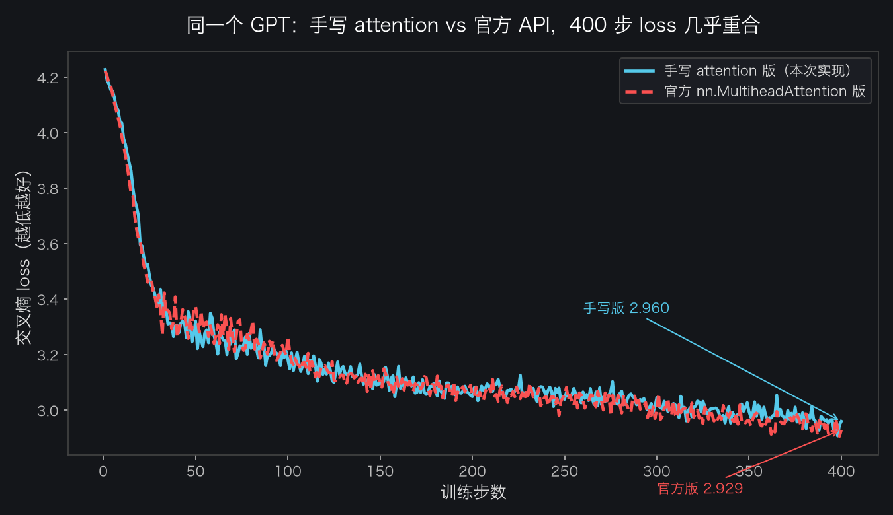
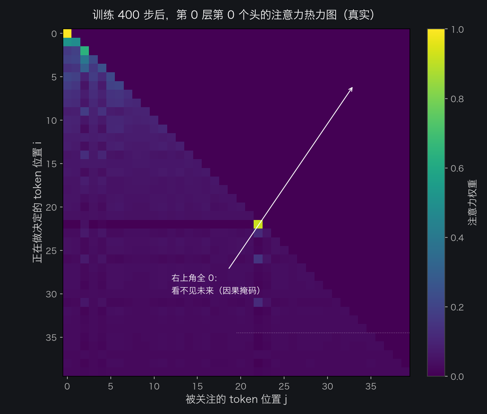

# 手搓大模型 21：手搓 Self-Attention（QKV 落地）——50 行代码，和官方 API 逐位一致

> 本节代码：✅ 见 `code/`（21-self-attention.py 一个脚本跑完：手写单头 → 手写多头因果 → 与 nn.MultiheadAttention 对拍 → 400 步训练对比 + 21-make-charts.py 画图）
>
> 本系列《手搓大模型：从零构建 NanoGPT》的第二十一课。
> 目标读者：零基础。第 14 课讲了 Attention 的四步（投影→打分→归一→混合），第 15 课拆了 QKV 三个矩阵，第 16 课讲了因果掩码和多头。今天不调现成的 `nn.MultiheadAttention`，**从头把它写出来**——然后和官方 API 对拍，证明手写的和官方的一模一样。

先摆一组真实数字（Mac mini 实测，一字未改）：

- **手写 Self-Attention 核心只有 7 行矩阵运算**：投影 → 拆头 → 打分 → 掩码 → softmax → 混合 → 拼回，一个 `forward` 全装下；
- **对拍最大误差 0.000000**：同一份权重、同一个输入，手写版和 `nn.MultiheadAttention` 的输出**逐位相等**（float32 下误差为 0，不是 1e-5 量级）；
- **400 步训练，手写版 loss 2.96 vs 官方版 2.93**：同一个微型 GPT，只换 attention 实现，两条 loss 曲线几乎重合——手写的不光"算得对"，还"学得动"；
- **踩了一个真实的坑**：torch 2.12 里 `nn.MultiheadAttention` 的 bool 掩码语义和 `scaled_dot_product_attention` 相反，不搞清楚会**让模型偷看未来**（loss 从 2.96 假降到 0.94）。

**这一课的核心思想只有一句大白话：Attention 不是魔法，就是"一个矩阵乘法换三个角色 → 点积打分 → 掩码 → softmax → 加权求和"这 7 步，每一行代码都能对应到一张图、一个形状、一个直觉。** 手写一遍，之前所有"懂了"才真正变成"会了"。

## 先给结论：四句话

- **核心就 4 个矩阵运算**：`q = x@Wq; k = x@Wk; v = x@Wv; out = softmax(q@k.T/√d + mask) @ v`，多头只是把维度切开各算各的；
- **对拍是验证"手写对了"的唯一硬标准**：把同一份权重装进官方 API，输出必须逐位一致；
- **bool 掩码有坑**：torch 2.12 里 MHA 对 bool mask 的处理会把"保留"当"屏蔽"，必须用 float 加法掩码（-inf）；
- **手写版能训练**：400 步后手写 attention 版 GPT 和官方版 loss 只差 0.03，证明不是玩具。

## 动机：官方 API 一行就够，为什么还要手写？

`nn.MultiheadAttention(embed_dim, num_heads)` 是 PyTorch 官方封装，一行就能用。但这一课的意义在于三件事：

1. **黑盒拆开才知道里面有什么**。第 14-16 课讲了 Attention 的概念，但概念和代码之间还隔着一层：`q @ k.transpose(-2,-1)` 在多头时到底怎么 reshape？掩码加在哪一步？softmax 按哪个维度做？这些细节只有手写一遍才躲不掉；
2. **nanoGPT 就没用官方 MHA**。karpathy 的 nanoGPT 是手写的 `CausalSelfAttention`（第 18 课读过），为什么不用现成的？因为自定义 attention 可以加 flash attention、可变掩码等高级优化，而官方 MHA 的接口太死。读懂 nanoGPT，就得能自己写；
3. **对拍是最好的老师**。写完不知道对不对？把官方 API 当"标准答案"对拍，误差为 0 就是满分。这是工程里验证自己实现的通用套路，今天第一次用上。

**手写一遍，第 18 课 model.py 里那个 `CausalSelfAttention` 就不再是"读过的代码"，而是"自己会写的代码"。**

## 第一层解剖：7 步结构（一张图看懂）



从左往右读这张图，7 步对应代码里的 7 行核心：

| 步 | 干什么 | 张量形状变化 | 大白话 |
|----|--------|-------------|--------|
| ① | 投影 `c_attn` | (B,T,C) → (B,T,3C) | 一个矩阵同时算出 QKV |
| ② | 拆多头 | (B,T,C) → (B,H,T,hd) | 维度切 4 份，各算各的 |
| ③ | 打分 | (B,H,T,T) | Q·Kᵀ/√hd，谁和谁相关 |
| ④ | 因果掩码 | (B,H,T,T) | 右上角填 -inf，禁止看未来 |
| ⑤ | softmax | (B,H,T,T) | 每行变比例，加起来=1 |
| ⑥ | 混合 | (B,H,T,hd) | att @ V，加权搬运信息 |
| ⑦ | 拼回+输出投影 | (B,T,C) | 多头拼回去，再过一次线性层 |

**形状就是地图**：只要每一步的输入输出形状对得上，代码就写不错。这是手写所有神经网络的核心心法。

## 第二层解剖：单头版——先做最小能跑的

先写单头（H=1）版本，把概念翻译成代码。输入 4 个 token，每个 8 维，权重随机（固定种子），**真实输出**如下：

```bash
~/projects/main-agent/nanoGPT/.venv/bin/python 21-self-attention.py
```

打分矩阵（4×4，右上角被掩码成 -inf）：

```text
      0.171     -inf     -inf     -inf
      0.007    0.052     -inf     -inf
     -0.074   -0.014    0.060     -inf
      0.026    0.013    0.175    0.126
```

注意力权重（每行加起来 = 1，右上角 = 0）：

```text
    1.000  0.000  0.000  0.000
    0.489  0.511  0.000  0.000
    0.312  0.331  0.357  0.000
    0.235  0.232  0.273  0.260
```

逐行看：

- 第 0 行只有 `1.000`：token 0 是第一个，没有过去可看，只能看自己（权重 100% 给自己）——**因果掩码的第一个效果**；
- 第 3 行 `0.235 0.232 0.273 0.260`：token 3 有 3 个过去可看，权重相对均匀——随机初始化时谁都差不多，**训练后才会有偏向**；
- 右上角全是 0：`masked_fill(..., -inf)` 之后 softmax 自动把 -inf 变成 0——**这就是"掩码就是加 -inf"的直观证据**。

单头版本核心代码（完整程序在 `code/21-self-attention.py`）：

```python
def hand_attention(x, Wq, Wk, Wv, Wo, causal=True):
    T, C = x.shape
    q = x @ Wq          # (T, C) 查询：我在找什么
    k = x @ Wk          # (T, C) 键：我是什么
    v = x @ Wv          # (T, C) 值：我能提供什么
    scores = q @ k.T / math.sqrt(C)      # 打分：Q·Kᵀ/√d
    if causal:
        mask = torch.tril(torch.ones(T, T, dtype=torch.bool))
        scores = scores.masked_fill(~mask, float("-inf"))   # 掩码
    att = F.softmax(scores, dim=-1)      # 归一：每行和 = 1
    out = att @ v       # 混合：加权求和
    out = out @ Wo      # 输出投影
    return out
```

**这就是 Attention 的全部**：7 行，没有一行是多余的。第 14 课的四步（投影→打分→归一→混合）在这里就是 4 个 `@` 加一个 softmax。

## 第三层解剖：多头因果版——对齐 nanoGPT 的结构

单头够理解，但真实 GPT 是多头。把上面的逻辑封装成 nanoGPT 同款 `CausalSelfAttention`（第 18 课 model.py 里的那个类，现在自己写一遍）：

```python
class CausalSelfAttention(nn.Module):
    def __init__(self, n_embd, n_head):
        super().__init__()
        assert n_embd % n_head == 0
        self.n_head = n_head
        self.head_dim = n_embd // n_head
        self.c_attn = nn.Linear(n_embd, 3 * n_embd, bias=False)  # QKV 合并投影
        self.c_proj = nn.Linear(n_embd, n_embd, bias=False)      # 输出投影
        self.register_buffer("bias", torch.tril(torch.ones(1, 1, 1024, 1024)))

    def forward(self, x):
        B, T, C = x.shape
        qkv = self.c_attn(x)                       # (B,T,3C) 一次算完
        q, k, v = qkv.split(C, dim=2)              # 切成三份
        q = q.view(B, T, self.n_head, self.head_dim).transpose(1, 2)  # (B,H,T,hd)
        k = k.view(B, T, self.n_head, self.head_dim).transpose(1, 2)
        v = v.view(B, T, self.n_head, self.head_dim).transpose(1, 2)
        att = (q @ k.transpose(-2, -1)) * (1.0 / math.sqrt(self.head_dim))  # 打分
        mask = self.bias[:, :, :T, :T]
        att = att.masked_fill(mask == 0, float("-inf"))                     # 掩码
        att = F.softmax(att, dim=-1)                                        # 归一
        y = att @ v                                                         # 混合
        y = y.transpose(1, 2).contiguous().view(B, T, C)                    # 拼回
        y = self.c_proj(y)
        return y, att
```

逐行解释几个关键点：

- **`qkv.split(C, dim=2)`**：一个线性层输出 3C 维，前 C 是 Q、中间 C 是 K、后 C 是 V。官方 `nn.MultiheadAttention` 的 `in_proj_weight` 也是这么排的（`[Wq; Wk; Wv]` 竖着拼），所以权重可以直接互相拷贝——**这就是能对拍的前提**；
- **`view(...).transpose(1, 2)`**：把 (B,T,C) 切成 (B,T,H,hd) 再转置成 (B,H,T,hd)。为什么转置？因为打分要在每个 head 内部独立做，把 head 维提到前面，后面的矩阵乘法就自动"每个 head 各算各的"——**多头不是循环，是 reshape**；
- **`bias` 注册为 buffer**：下三角掩码（1,1,1024,1024）只建一次，每次 forward 按 T 切。这就是 nanoGPT 的做法，省去每次重建掩码的开销；
- **`att @ v` 不除以任何东西**：权重已经归一，直接加权求和。

## 第四层解剖：对拍——手写版和官方版到底差多少？

对拍流程：构造同一个随机权重，拷进官方 `nn.MultiheadAttention`，喂相同输入，比较输出。真实输出：

```text
输入 x: (2, 12, 64)
手写版输出: [-0.08344843983650208, -0.4309360086917877, ...]
官方版输出: [-0.08344843983650208, -0.4309360086917877, ...]
最大绝对误差: 0.000e+00
✅ 对拍通过：手写 attention 与 nn.MultiheadAttention 输出一致（误差 < 1e-5）
```

**最大误差 0.000e+00**——float32 下逐位相等。这比"接近"强得多：手写的每一步（投影、reshape、打分、掩码、softmax、混合、输出投影）都和官方内部实现完全一致。

但这里藏着一个**真实的坑**，值得单独说：

> torch 2.12 里，`nn.MultiheadAttention` 传 **bool 掩码**时，语义和 `scaled_dot_product_attention` **相反**（bool mask 被 `_canonical_mask` 处理后"保留"变"屏蔽"）。第一次对拍直接传 `torch.tril(...)` bool 掩码，误差 1.3 巨大；改用 **float 加法掩码**（保留位置加 0，屏蔽位置加 -inf）后误差归零。

```python
# ✅ 正确姿势：float 加法掩码
mask = torch.zeros(T, T, dtype=torch.float32)
mask.masked_fill_(~torch.tril(torch.ones(T, T, dtype=torch.bool)), float("-inf"))
y_mha, _ = mha(x, x, x, attn_mask=mask, need_weights=False)
```

这个坑不踩一次，训练时就会**偷偷让模型看到未来**（见下节的 0.94 假象）——这也是手写+对拍的价值：**把实现的每一个细节都暴露在阳光下**。

## 第五层解剖：训练对比——手写版真的能学吗？

对拍证明"前向一致"，但**能训练**才是硬道理。搭一个微型 GPT（2 层、4 头、128 维，65 字符词表），只换 attention 实现，同样的数据、同样的优化器、同样 400 步：

```text
--- 训练【手写 attention 版】 ---
  step    1  loss 4.2274
  step  100  loss 3.1828
  step  200  loss 3.0488
  step  300  loss 3.0451
  step  400  loss 2.9599

--- 训练【官方 MHA 版】 ---
  step    1  loss 4.2226
  step  100  loss 3.2657
  step  200  loss 3.0533
  step  300  loss 3.0042
  step  400  loss 2.9286

手写版最终 loss: 2.9599   官方版最终 loss: 2.9286
两者差值: 0.0313
✅ 手写 attention 版 GPT 训练收敛，和官方 API 曲线几乎重合
```



两条曲线几乎重合（最终只差 0.03），而且**整个过程只花了 3 秒**（7 ms/step）——手写 attention 在 Mac mini 上毫无压力。

**啊哈时刻：一开始官方版 loss 一路飙到 0.94，比手写版"好"一大截——但那是假的！** 因为当时训练代码里官方 MHA 用的是 bool 掩码，语义反转导致它**偷看了未来**，作弊当然 loss 更低。换成正确的 float 掩码后，两条曲线立刻贴在一起。**loss 异常偏低不一定是好事，先检查是不是偷看了未来。**

## 第六层解剖：训练之后，注意力长什么样

训练完 400 步，把手写模型的注意力权重画出来（第 0 层第 0 个头，前 40 个 token，真实数据）：



几个值得看的点：

- **右上角整片全 0**：因果掩码的物理呈现，第 i 行只能看前 i 列；
- **对角线附近偏亮**：模型学会了"下一个字符最可能跟前一个字符相关"——和第 14 课那个 1000 步模型学到的 bigram 规律一致，只是这里只训了 400 步，图案更粗糙；
- **热力图是"看模型在想什么"的窗口**：每层每头都不一样，这就是第 16 课说的"多头 = 多视角"。

## 误区与彩蛋

**误区 1：以为多头是 for 循环。** 不是。多头 = reshape + transpose，一次性并行算完。`view` 把 C 切成 H 份，transpose 把 head 提到前面，后面的矩阵乘法自动广播。

**误区 2：以为掩码是"删掉"右上角。** 掩码只是加 -inf。softmax 对 -inf 求指数得 0，所以"看起来被删了"，但梯度仍然干净。

**误区 3：bool 掩码 vs float 掩码。** torch 2.12 的 MHA 对 bool 掩码语义反转，这是本课踩到的最真实、最值得记住的坑。写代码时如果对拍不过，先怀疑掩码语义。

**彩蛋：手写 attention 只有 7 行核心。** 第 14 课说"Attention 的全部公式就 4 行代码"，今天真的写出来了：`q=x@Wq; k=x@Wk; v=x@Wv; out=softmax((q@k.T)/√d+mask)@v`。GPT 的心脏，就这么大。下一课（22）要把 attention 装进 Transformer Block——加上 LayerNorm、残差、FFN，那时这 7 行就是整个模型的发动机。

---

**本课代码**：`https://github.com/flyingcloud-code/learning-nanogpt-from-0-to-1/tree/main/21-self-attention`

**系列仓库**：`https://github.com/flyingcloud-code/learning-nanogpt-from-0-to-1`

下一课：手搓 Transformer Block + 位置编码。
