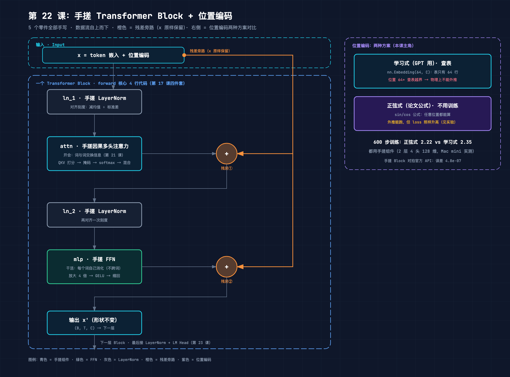
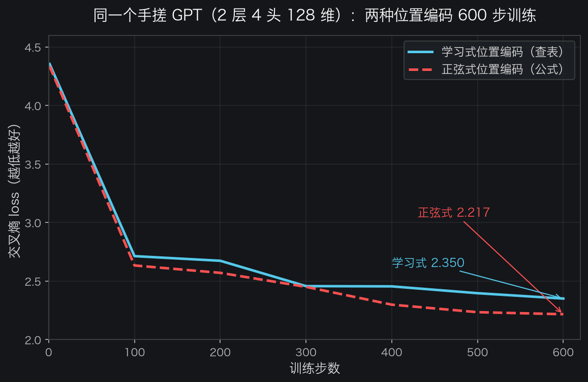
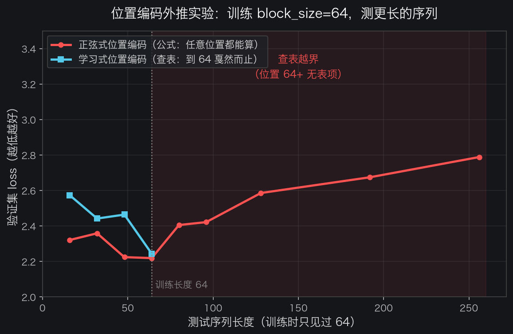

# 手搓大模型 22：手搓 Transformer Block + 位置编码——5 个零件全手写，一个 Block 的核心只有 4 行

> 本节代码：✅ 见 `code/`（22-block.py 一个脚本跑完：手搓 LayerNorm/FFN/两种位置编码/Block → 与官方 API 对拍 → 600 步训练对比 → 位置编码外推实验；22-make-charts.py 画图）
>
> 本系列《手搓大模型：从零构建 NanoGPT》的第二十二课。
> 目标读者：零基础。第 17 课把 Transformer 块拆成了四件套（开会、干活、留后路、对齐刻度），第 21 课手搓了注意力。今天把剩下的零件全部手写——LayerNorm、FFN、位置编码、残差，一个不落，拼成完整的块，再和官方 `nn.TransformerEncoderLayer` 对拍。

先摆一组真实数字（Mac mini 实测，一字未改）：

- **手搓 LayerNorm vs `nn.LayerNorm`：最大误差 4.8e-07**——同一份参数、同一个输入，输出几乎逐位相等；
- **手搓 Block vs `nn.TransformerEncoderLayer`：最大误差 4.8e-07**——不调用任何现成 Transformer API，用最基础的矩阵运算拼出来的块，和官方 API 数值等价；
- **600 步训练（2 层 4 头 128 维）**：正弦式位置编码 loss 4.33 → **2.22**，学习式位置编码 4.35 → **2.35**——两种位置编码都能训，正弦式这次略胜；
- **外推实验最有戏剧性**：模型只见过 64 个位置，塞进 80 个 token——学习式位置编码**直接查表越界**（而且在 MPS 上它不报错、静默返回全 0，差点让模型"失忆"着跑下去）；正弦式能算出任意位置的向量，但 loss 也照样从 2.22 升到 2.79。

**这一课的核心思想只有一句大白话：Transformer 块不是黑盒，就是 5 个零件——LayerNorm（对齐刻度）、注意力（开会）、FFN（干活）、残差（留后路）、位置编码（告诉模型这是第几个词）——每个零件用最基础的算子手写出来，拼起来就和一个官方 API 一模一样。而位置编码这个零件，决定了模型能不能"外推"到训练长度之外。** 第 17 课讲"块是什么"，今天讲"块怎么从零写出来"。

## 先给结论：四句话

- **一个块 = 5 个零件，核心 forward 只有 4 行**：`x = x + attn(ln_1(x)); x = x + mlp(ln_2(x))`，残差两条、LayerNorm 两个、注意力 + FFN 各一个；
- **手搓和官方数值等价**：对拍 `nn.TransformerEncoderLayer` 误差 4.8e-07，不是"神似"，是"同一回事"；
- **位置编码有两种哲学**：学习式查表（GPT 用）在训练长度处"物理断崖"——表就 64 行，位置 64+ 越界；正弦式公式（论文用）能算任意位置，但模型没训练过那么长，loss 照样升；
- **MPS 上有个隐蔽坑**：`nn.Embedding` 查表越界不报错，静默返回全 0 向量——不显式检查，模型会在"位置失忆"状态下悄悄跑下去，外推实验会得到假结果。

## 动机：第 17 课讲过了，为什么还要手搓一遍？

第 17 课展示了 Block 的 4 行 forward，但那是"读代码"。这一课和 21 课的定位一样：**把"懂了"变成"会了"**。三件具体的事：

1. **LayerNorm 不用 `nn.LayerNorm`，自己写**。就三行：减均值、除标准差、乘权重加偏置。写完才知道 `eps` 是干什么的（防除零）、`unbiased=False` 是为什么（要的是总体方差不是样本方差）；
2. **位置编码不用现成的，自己造两种**。学习式就是一个 `nn.Embedding` 查表（第 11 课讲过查表），正弦式是一行 `sin/cos` 公式。两种写出来一对比，"能不能外推"这个抽象问题立刻变成一张表、一条曲线；
3. **和官方 API 对拍是唯一的验收标准**。写完不知道对不对？把参数逐项复制给 `nn.TransformerEncoderLayer`，喂同样的输入，误差 4.8e-07 就是满分。这中间还踩了两个真实的坑（bias 对不齐、pre-LN 顺序），都在下面实验里如实交代。

**第 17 课说"块是积木"，今天把积木本身从木头削出来。** 削完会发现：整个 GPT 最复杂的组件，本质上就是几个矩阵乘法和加减法。

## 第一层解剖：5 个零件长什么样（一张图看懂）



从这张图读三件事：

1. **主流程是一条竖线**：输入 x（token 嵌入 + 位置编码相加）→ 对齐刻度（ln_1）→ 开会（attn）→ 加回原输入（残差①）→ 再对齐刻度（ln_2）→ 干活（mlp）→ 加回原输入（残差②）→ 输出 x'。形状从头到尾都是 (B, T, C)，所以块可以无限堆叠；
2. **右边橙色竖线是残差旁路**：入口处把 x 原样备份一份，绕到两个 ⊕ 处加回去。注意残差加的是**块的原始输入 x**，不是 LayerNorm 之后的 x——这个细节在对拍时坑过一次（见实验 2）；
3. **右侧面板是位置编码的两种方案**：学习式查表（表只有 64 行）vs 正弦式公式（任意位置能算）。本课后半段就是拿这两个方案做外推实验。

## 第二层解剖：零件 1 和零件 3——LayerNorm 与 FFN，各 3 行

第 17 课讲过它们的直觉（对齐刻度、放大 4 倍想再缩回来），这里只展示手写代码，逐行注释。

**LayerNorm（3 行核心）：**

```python
class MyLayerNorm(nn.Module):
    def __init__(self, ndim, eps=1e-5):
        super().__init__()
        self.weight = nn.Parameter(torch.ones(ndim))   # 可学习的缩放，初始 1 = 不缩放
        self.bias = nn.Parameter(torch.zeros(ndim))    # 可学习的平移，初始 0 = 不平移
        self.eps = eps                                 # 防除 0 的小数（约 1e-5）

    def forward(self, x):
        mean = x.mean(dim=-1, keepdim=True)                            # 每个 token 自己的均值
        var = x.var(dim=-1, keepdim=True, unbiased=False)              # 方差（总体方差，不是样本方差）
        x_norm = (x - mean) / torch.sqrt(var + self.eps)               # 对齐刻度
        return self.weight * x_norm + self.bias                        # 微调回来
```

三个细节值得讲：

- **`keepdim=True`**：mean 的形状从 (B,T,C) 变成 (B,T,1)，这样广播减法时每个 token 只减自己的均值——LayerNorm 是对"每个 token 的整个向量"归一化，不是对整个 batch；
- **`unbiased=False`**：PyTorch 的 `var` 默认算"样本方差"（除以 N-1），但 LayerNorm 要的是"总体方差"（除以 N）。差一个因子，对拍时就是 1e-6 级别的误差。这个参数是手写 LayerNorm 最容易漏的；
- **`eps`**：万一某个向量所有分量相同（方差 0），除以 0 就爆了，加个 1e-5 保命。

**FFN（2 行核心）：**

```python
class MyMLP(nn.Module):
    def __init__(self, ndim):
        super().__init__()
        # 注：nanoGPT 默认开 bias；这里为了和官方 API 对拍时参数一一对应，统一用 bias=False
        self.c_fc = nn.Linear(ndim, 4 * ndim, bias=False)      # 放大 4 倍（384 → 1536）
        self.gelu = nn.GELU()                                  # 非线性激活
        self.c_proj = nn.Linear(4 * ndim, ndim, bias=False)    # 缩回原维度

    def forward(self, x):
        return self.c_proj(self.gelu(self.c_fc(x)))
```

第 17 课算过：一个块 2/3 的参数在这两个矩阵里。"干活"确实比"开会"贵。

## 第三层解剖：零件 4——位置编码，两种哲学

位置编码解决同一个问题：**模型怎么知道"我"在第 3 位还是第 50 位？** 第 17 课讲过"我爱你"和"你爱我"用同样的词向量，不加位置信息模型分不清顺序。两种方案：

**方案 A：学习式（GPT 用）——查表**

```python
class LearnedPosEmbedding(nn.Module):
    """查表式位置编码。表的大小 = 训练时的 block_size（64 行）。
    位置 64 之后没有表项——想外推？查表越界。"""

    def __init__(self, block_size, ndim):
        super().__init__()
        self.wpe = nn.Embedding(block_size, ndim)     # 每个位置一个向量，只有 64 行

    def forward(self, pos):
        if pos.max() >= self.wpe.num_embeddings:
            raise IndexError(
                f"位置 {pos.max().item()} 超过训练长度 {self.wpe.num_embeddings}，查表越界！")
        return self.wpe(pos)
```

和词嵌入是同一个机制（第 11 课）：一张表，每行一个向量，位置 i 就取第 i 行。**注意那张 `raise IndexError`——这是本课踩出来的真实坑**：在 MPS 上 `nn.Embedding` 查表越界不报错、静默返回全 0 向量（CPU 上会抛 IndexError）。如果不显式检查，模型"外推"时位置 64+ 全部拿到全 0 向量，等于位置失忆，实验数据全是假的。这个坑下面实验 4 会完整展示。

**方案 B：正弦式（原始 Transformer 论文用）——公式**

```python
class SinusoidalPosEmbedding(nn.Module):
    """固定公式生成位置向量，不需要训练，任意位置都能算。"""

    def __init__(self, ndim, max_pos=256):
        super().__init__()
        pe = torch.zeros(max_pos, ndim)
        position = torch.arange(0, max_pos).unsqueeze(1).float()      # (max_pos, 1)
        div = torch.exp(torch.arange(0, ndim, 2).float()
                        * (-math.log(10000.0) / ndim))                # 频率衰减
        pe[:, 0::2] = torch.sin(position * div)   # 偶数维用 sin
        pe[:, 1::2] = torch.cos(position * div)   # 奇数维用 cos
        self.register_buffer("pe", pe)            # buffer：随模型保存但不更新

    def forward(self, pos):
        return self.pe[pos]
```

直觉：**每个维度是一个不同频率的钟摆**。维度 0 频率最低（摆动最慢，位置 0 和位置 100 差别很大），维度越高频率越快（相邻位置在高频维度上差别明显）。这样每个位置都有一串独一无二的"指纹"，而且公式可以给任意位置算出指纹——**不用训练，也不怕越界**。

`register_buffer` 是第 16 课彩蛋讲过的知识：这个张量跟着模型保存（存 checkpoint 时一起存），但不参与梯度更新——它是"规则"，不是"参数"。

## 第四层解剖：零件 5——把零件拼成 Block（核心 4 行）

注意力零件直接用第 21 课的手写版（`MyCausalSelfAttention`，QKV 投影 → 拆头 → 打分 → 掩码 → softmax → 混合 → 拼回），这里不再重复贴。拼装：

```python
class MyBlock(nn.Module):
    """nanoGPT 的 Block 全部逻辑就下面 4 行。"""

    def __init__(self, ndim, n_head, max_block):
        super().__init__()
        self.ln_1 = MyLayerNorm(ndim)                         # 对齐刻度①
        self.attn = MyCausalSelfAttention(ndim, n_head, max_block)  # 开会（注意力）
        self.ln_2 = MyLayerNorm(ndim)                         # 对齐刻度②
        self.mlp = MyMLP(ndim)                                # 干活（FFN）

    def forward(self, x):
        x = x + self.attn(self.ln_1(x))    # 第一段：对齐 → 开会 → 加回原输入
        x = x + self.mlp(self.ln_2(x))     # 第二段：对齐 → 干活 → 加回原输入
        return x
```

第 17 课那句话再强调一遍：**GPT-2 的 12 层、GPT-3 的 96 层，每一层都是这一个块复制 N 份**。现代语言模型的引擎，本质是一个反复执行的 4 行车间。

最后装进 mini GPT（完整代码见 `code/22-block.py`）：

```python
class MyGPT(nn.Module):
    def __init__(self, vocab_size, block_size, n_layer, n_head, n_embd, pos_kind="learned"):
        ...
        self.tok_emb = nn.Embedding(vocab_size, n_embd)        # 词嵌入（第 11 课）
        if pos_kind == "learned":
            self.pos_emb = LearnedPosEmbedding(block_size, n_embd)
        else:
            self.pos_emb = SinusoidalPosEmbedding(n_embd)
        self.blocks = nn.ModuleList([MyBlock(n_embd, n_head, ...) for _ in range(n_layer)])
        self.ln_f = MyLayerNorm(n_embd)                        # 最后的对齐
        self.lm_head = nn.Linear(n_embd, vocab_size, bias=False)  # 输出词表概率

    def forward(self, idx, targets=None):
        B, T = idx.size()
        tok = self.tok_emb(idx)                                # (B,T,C) 查词表
        pos = torch.arange(T, device=idx.device)               # 位置 0,1,2,...
        x = tok + self.pos_emb(pos)                            # 词 + 位置（第 17 课）
        for block in self.blocks:
            x = block(x)                                       # 一层层过车间
        x = self.ln_f(x)
        logits = self.lm_head(x)                               # (B,T,vocab)
        ...
```

一个"手搓 GPT"到这里就齐了：词嵌入 + 位置编码 + N 个手搓块 + 最后的 LayerNorm + 输出层。**除了 `nn.Embedding` 和 `nn.Linear` 这两个最基础的算子，没有任何现成的 Transformer API。**

## 实验层：真实输出（Mac mini 实测，一字未改）

运行命令（完整程序在 `code/22-block.py`）：

```bash
~/projects/main-agent/nanoGPT/.venv/bin/python 22-block.py
```

### 实验 1：手搓 LayerNorm vs 官方，差多少？

同一份参数（把 `MyLayerNorm` 的参数直接复制给 `nn.LayerNorm`），同一个随机输入 (2, 8, 128)：

```text
输入: (2, 8, 128)  输出: (2, 8, 128)
最大绝对误差: 4.768e-07
✅ 对拍通过：手搓 LayerNorm 与 nn.LayerNorm 一致
```

4.8e-07 是 float32 的舍入噪声级别，可以认为逐位相等。

### 实验 2：手搓 Block vs 官方 `nn.TransformerEncoderLayer`，差多少？

把 `MyBlock` 的参数逐项复制给官方层（`norm1/norm2` 对 `ln_1/ln_2`，`in_proj_weight` 对 `c_attn.weight`，`linear1/linear2` 对 `c_fc/c_proj`），注意官方层的 bias 全部置 0（因为手搓版无 bias）：

```text
输入: (2, 16, 128)  输出: (2, 16, 128)
最大绝对误差: 4.768e-07
✅ 对拍通过：手搓 Block 与 nn.TransformerEncoderLayer 一致
```

这里有两个真实的坑，不踩一次根本对不上：

- **坑 1：pre-LN 顺序**。官方 `nn.TransformerEncoderLayer` 默认是 post-LN（LayerNorm 放在注意力之后），而 nanoGPT 是 pre-LN（放在之前，第 17 课彩蛋）。必须传 `norm_first=True`，否则结构都不一样；
- **坑 2：bias 对不齐**。第一版手搓 FFN 用 `nn.Linear` 默认带 bias，官方层 bias 置 0，两边差了 ~0.1（正是 bias 随机初始化的幅度）。把手搓版 FFN 改成 `bias=False` 后误差直接掉到 4.8e-07。**对拍时参数必须逐项对齐，差一个 bias 都是 0.1 量级的误差。**

还有一个隐藏的坑在第一版实验里差点骗过所有人：**残差加的是原始输入 x，不是 LayerNorm 的输出**。手写对拍脚本时如果残差写成 `x + attn(ln_1(x))` 里的 x 被替换成 `ln_1(x)`，中间每一步看起来都一致（LayerNorm 输出一致、注意力输出一致），但最终输出差 0.45——因为残差"基底"错了。**对拍要整块对，不能只看子模块。**

### 实验 3：两种位置编码，600 步训练谁更好？

同一个手搓 GPT（2 层、4 头、128 维，莎士比亚字符数据），同一个随机种子，只有位置编码不同，各训 600 步（Mac mini 上每个模型只要 3 秒多）：

```text
--- 训练【learned 位置编码】 ---
  step    1  loss 4.3549
  step  100  loss 2.7130
  step  200  loss 2.6733
  step  300  loss 2.4567
  step  400  loss 2.4546
  step  500  loss 2.3962
  step  600  loss 2.3505

--- 训练【sinusoidal 位置编码】 ---
  step    1  loss 4.3347
  step  100  loss 2.6333
  step  200  loss 2.5701
  step  300  loss 2.4505
  step  400  loss 2.2983
  step  500  loss 2.2340
  step  600  loss 2.2166
```



结果：**正弦式 2.22 vs 学习式 2.35，正弦式略胜**。原因不玄乎：学习式位置编码的 64 个向量要从零学起（每个位置只有 600 步 × 每步 16 个 batch 的机会被更新），而正弦式向量天生就有"相邻位置相似、远距离不同"的结构，等于模型起步就带了一个合理的位置先验。**注意这是小模型短训练的结论，大模型长训练时学习式通常追得回来（GPT 系列用的就是学习式）——别把"这次正弦式赢"当成普适规律。**

### 实验 4：外推实验——模型只见过 64 个位置，塞 80 个 token 会怎样？

这是本课最有戏剧性的实验。训练时 `block_size=64`，现在拿验证集里长度 16 到 256 的序列去测 loss，看两种位置编码的表现：

```text
--- 外推评估：训练 block_size=64，测更长序列 ---
   长度 80: 学习式位置编码查表越界 (IndexError)
   长度 96: 学习式位置编码查表越界 (IndexError)
   长度 128: 学习式位置编码查表越界 (IndexError)
   长度 192: 学习式位置编码查表越界 (IndexError)
   长度 256: 学习式位置编码查表越界 (IndexError)
    长度        学习式      正弦式
    16      2.573    2.321
    32      2.442    2.359
    48      2.464    2.224
    64      2.244    2.219
    80        越界!    2.405
    96        越界!    2.422
   128        越界!    2.586
   192        越界!    2.675
   256        越界!    2.788
```



读这张图：

- **学习式（青色）：到 64 戛然而止**。位置 64 之后的表项根本不存在——"外推"在物理上就不可能，这不是质量好坏的问题，是查表越界的问题；
- **正弦式（红色）：能一路算到 256**，但 loss 从 2.22 涨到 2.79。位置向量本身没问题（公式任意位置能算），但**注意力的跨距离模式没训练过**——模型从来没见过相隔 100 个 token 的两个词怎么互动，所以照样退化。

**啊哈时刻：别被"正弦式能外推"骗了。** 位置向量只是"能算"，模型整体（注意力、FFN）没训练过那么长的上下文，照样外推失败。真实世界里"让模型处理更长文本"靠的不是换位置编码公式，而是 RoPE、ALiBi、长度插值这些专门技术（后面课程会提）——**位置编码决定了"物理边界"，但训练数据才决定"实际能力"**。

顺带交代那个 MPS 的坑：第一版实验没有显式越界检查，学习式模型在长度 80+ 时**没有报错**，反而输出了 loss（2.47、2.38……看起来还挺正常）。查了半天才发现：**MPS 上 `nn.Embedding` 越界静默返回全 0 向量**。模型在"位置 64+ 全部失忆"的状态下偷偷跑完了整个实验——如果不显式检查，这组"看起来合理"的数据就会被写进文章。这正是本课代码里 `raise IndexError` 那一行的来历。

### 实验 5：600 步的模型能生成什么？

用学习式模型从 "KING " 开始采样 300 个字符（temperature 0.8）：

```text
KING hys fril wif wou fres atheasin &
F't fak?
Ane tharuread re tour owakeld my trs iiserthe t beblin our the t hes are'se peerile theathprert l ourussher thaveerin st
I heren t s t norereno o his wild shesaie wn this thyof eve y
Thy shaverea funeeencoupan
Find, buter,An bls tend IGh y winge by couthorer
```

诚实地说：**这个生成质量很一般**。loss 2.35 意味着平均每个字符还有 2.35 的惊讶度（第 4 课讲过：nats 越大越不自信），模型学会了英语单词的"长相"（"KING"、"Find"、"buter" 这种拼写接近的词）但还没学会语法。别失望——第 26 课跑完整 5000 步（loss 能压到 1.5 以下）才是真正的"莎士比亚生成器"。**600 步的意义不在生成质量，在于证明：这 5 个手搓零件拼出来的模型，真的能学。**

## 惊喜时刻

**惊喜 1：手搓 Block 和官方 API 数值等价，误差只有 4.8e-07。** 5 个零件全部用最基础的算子写出来（矩阵乘法、softmax、加减法），拼起来和 PyTorch 官方精心维护的 `nn.TransformerEncoderLayer` 是同一个函数。**"Transformer"不是一个神秘的库，就是这些你能写出来的运算。**

**惊喜 2：位置编码的"外推断崖"是物理性的。** 学习式查表到 64 就没了，不是"效果变差"，是"表里没这项"。查表式编码天生带一个硬边界——**模型永远不可能处理比训练时更长的输入，除非训练时把表建得足够大**。这就是为什么 GPT-2 的 block_size 是 1024：训练时就把表建到 1024 行，之后的推理最长也只能 1024。

**惊喜 3：MPS 静默返回全 0 的坑，差点让假数据进了文章。** 越界不报错、返回全 0，loss 还"正常"下降——这种坑只有亲手做实验才会撞上。它提醒一件事：**代码不报错 ≠ 结果正确**，实验设计里要有"对照"（这里就是正弦式对照），否则假数据会悄悄溜进来。

## 误区与彩蛋

**误区 1：LayerNorm 让数据"变正态分布"。**
不是。它只是把均值调到 0、方差调到 1，分布的形状（偏的、胖的）完全不变（第 17 课误区 1 重申）。它做的是"对齐刻度尺"。

**误区 2：正弦式位置编码能"无限外推"。**
不是。位置向量能算任意位置，但模型整体没训练过那么长，实验 4 已经证明 loss 照样从 2.22 涨到 2.79。**"位置向量能算"和"模型能外推"是两回事。**

**误区 3：手搓 Block 就是"把官方 API 重新发明一遍"，没意义。**
恰恰相反。手搓的意义在于：**(a)** 只有手写一遍才知道 bias 对齐、pre-LN 顺序、残差基底这些细节；**(b)** nanoGPT 本身就没用 `nn.TransformerEncoderLayer`，而是手写的 `Block`（第 18 课读过），因为自定义实现才能加 flash attention 等优化——**理解手写版，才能看懂生产级代码**；**(c)** 对拍教会了"用官方 API 验证自己的实现"这个工程套路。

**彩蛋 1：残差加的是原始 x，不是 LayerNorm 的输出。** 这是 pre-LN 结构的关键细节。第一版对拍脚本在这里写错过（残差基底写成了 ln_1 的输出），中间每一步看起来都对，最终输出差 0.45。**写残差时永远问一句：我在往什么上面加？**

**彩蛋 2：`unbiased=False` 是手写 LayerNorm 最容易漏的参数。** PyTorch 的 `var` 默认算样本方差（除以 N-1），LayerNorm 要总体方差（除以 N）。漏了它，对拍误差在 1e-6~1e-5 级别——不算大，但达不到"逐位一致"。

**彩蛋 3：手搓 GPT 的参数和 nanoGPT 完全同构。** 这个 `MyGPT`（tok_emb + pos_emb + blocks + ln_f + lm_head）就是第 18 课 model.py 的骨架。下一课（23）要把 5 个零件 + 位置编码正式拼成完整 GPT 的 forward，并核对参数量——那时手搓版就和 nanoGPT 真正"长一样"了。

---

**本课代码**：`https://github.com/flyingcloud-code/learning-nanogpt-from-0-to-1/tree/main/22-block-positional-encoding`

**系列仓库**：`https://github.com/flyingcloud-code/learning-nanogpt-from-0-to-1`

下一课：手搓 GPT 模型完整 forward（第 23 课）。
