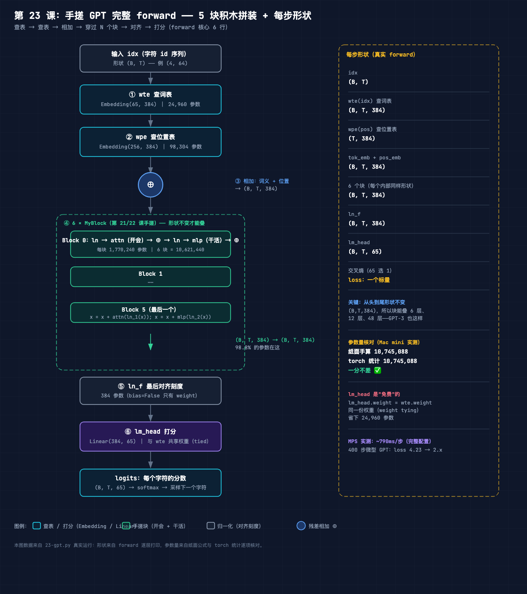
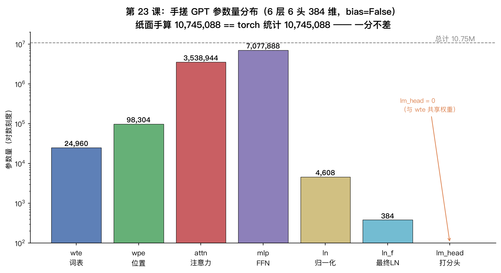
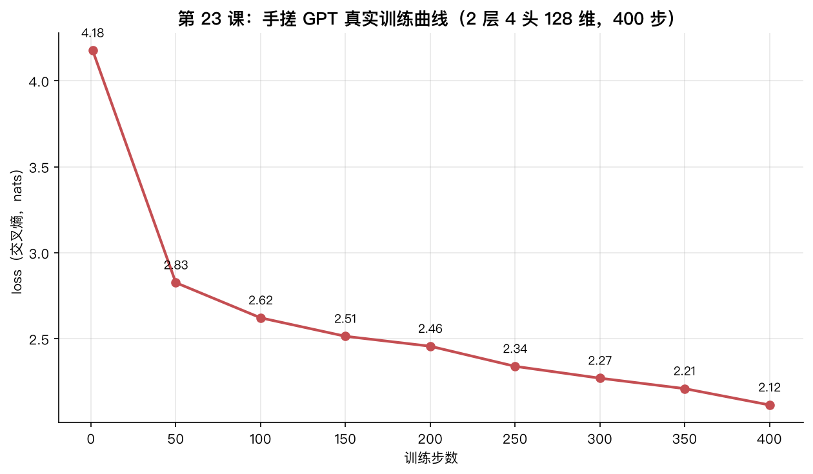

# 手搓大模型 23：手搓 GPT 完整 forward——5 块积木拼装成一台机器，参数量一分不差

> 本节代码：✅ 见 `code/`（23-gpt.py 一个脚本跑完：forward 形状流 → 参数量核对 → 400 步训练 → 真实生成文本）
>
> 本系列《手搓大模型：从零构建 NanoGPT》的第二十三课。
> 目标读者：零基础。第 21 课手搓了注意力，第 22 课手搓了 LayerNorm、FFN、位置编码和块。今天做最后一件事：把所有手搓零件正式拼装成完整 GPT——wte、wpe、blocks、ln_f、lm_head 五块积木一个不落，forward 走一遍，参数量从纸面上推出来，再和 torch 数出来的对一遍。

先摆一组真实数字（Mac mini 实测，一字未改）：

- **完整 GPT 的 forward 核心只有 6 行**：查词表 → 查位置表 → 相加 → 穿过 N 个块 → 对齐刻度 → 打分。第 18 课读 nanoGPT 的 model.py 时见过这 6 行，今天它们全部由前两课手搓的零件拼出来；
- **参数量核对：纸面手算 10,745,088 == torch 统计 10,745,088，一分不差**——从"65 × 384 = 24,960"这种小学乘法一路加出来的数字，和机器数出来的完全相等；
- **lm_head 是"免费"的**：打分矩阵和词表矩阵共享同一份权重（weight tying），0 个新参数；
- **400 步训练（2 层 4 头 128 维，41 万参数）**：loss 4.18 → **2.12**，模型学会了英语单词的"长相"，从 "KING " 能续写出莎士比亚腔的文本。

**这一课的核心思想只有一句大白话：GPT 不是神秘黑盒，就是 5 块积木——查词表、查位置表、6 个开会干活的块、最后对齐、打分——每一块都是前几课手搓过的零件，拼起来 forward 只有 6 行，参数量可以用小学乘法从纸面上精确推出来。** 第 18 课"读"了 nanoGPT 的 model.py，今天"写"出同款。

## 先给结论：四句话

- **GPT = 5 块积木**：wte（查词表）+ wpe（查位置表）+ blocks（开会干活）+ ln_f（最后对齐）+ lm_head（打分），forward 核心 6 行；
- **形状从头到尾不变**：`(B,T)` 进 → `(B,T,384)` 一路穿过 6 个块 → `(B,T,65)` 打分。形状不变，块才能无限叠；
- **参数量可以手算**：输入维 × 输出维，逐项加出来 = 10,745,088，和 torch 统计完全一致，不是"估算"；
- **lm_head 和 wte 共享同一份权重**：`lm_head.weight = wte.weight`，打分矩阵就是查表矩阵的反向使用。

## 动机：零件都手搓过了，为什么不拼成整机？

第 21 课证明了注意力能手搓（和官方 API 逐位一致），第 22 课证明了块能手搓（5 个零件数值等价）。但这两课拼出来的都只是"中间件"：没有输入输出的完整链路，没有损失函数，没有训练。读者会问三件事：

1. **这些零件怎么接成一台能训练的机器？** 词表往哪进、位置往哪加、输出怎么变成"下一个字符的概率"——需要一个完整的 forward；
2. **这台机器到底多大？** 一直说"10.65M 参数"，这些参数具体藏在哪、每一层多少，能不能自己算出来？
3. **拼出来真的能学吗？** 前两课验证了零件，今天验证整机——训练 400 步，看 loss 会不会降，看模型能不能说出人话。

第 18 课读过 nanoGPT 的 model.py，但"读"和"写"之间还差一层：**只有亲手拼一遍，才知道为什么 6 个块占 98.8% 的参数、为什么 lm_head 能共享 wte、为什么 forward 里要先查位置表再加**。这些细节在阅读时会被眼睛滑过去，写代码时躲不掉。

## 第一层解剖：5 块积木长什么样（结构图）



从这张图读三件事：

1. **主流程是一条竖线**：输入 idx（字符 id 序列）→ wte 查词表 → wpe 查位置表 → 相加 → 穿过 6 个块（每个块内部：ln → attn → 残差 ⊕ → ln → mlp → 残差 ⊕）→ ln_f 对齐 → lm_head 打分 → logits；
2. **形状从 (B,T) 到 (B,T,384) 后一路不变**：块的输入输出都是 (B,T,384)，所以 6 个块可以一个接一个叠——GPT-3 的 96 层、GPT-4 的 120 层都是这么叠出来的；
3. **右侧是真实数据**：forward 逐层形状（Mac mini 实测）和参数量核对（纸面 10,745,088 == torch 10,745,088）。

这张图和第 1 课的 01-nanogpt-architecture.png 是同一台机器，区别在第 1 课是"全景示意图"，这张图里每一块都是前两课手搓过的真实代码。

## 第二层解剖：forward 流程——6 行代码，形状流全程不变

完整 GPT 的 forward 核心，去掉注释只有 6 行：

```python
tok_emb = self.wte(idx)                       # 1. 查表：字符 -> 向量
pos_emb = self.wpe(pos)                       # 2. 查表：位置 -> 向量
x = tok_emb + pos_emb                         # 3. 相加：词义 + 位置
for block in self.blocks:                     # 4. 穿过 N 个块
    x = block(x)
x = self.ln_f(x)                              # 5. 最后对齐一次刻度
logits = self.lm_head(x)                      # 6. 打分：每个字符的分数
```

**第 11 课讲过 wte 是查表**：字符 "a" 的 id 是 10，就取表里第 10 行向量。**第 17 课讲过 wpe 是查位置表**：位置 3 的 token 加第 3 行的位置向量，这样 "我" 在第 3 位和第 50 位就是不同的向量。**相加**就是把两个向量叠起来（向量加法，第 3 课讲过）。

块内部的 forward 是第 22 课那 4 行：

```python
def forward(self, x):
    x = x + self.attn(self.ln_1(x))   # 开会，残差加回原输入
    x = x + self.mlp(self.ln_2(x))    # 干活，残差加回原输入
    return x
```

真实跑一遍形状流（`python 23-gpt.py` 的 Part 1，Mac mini 实测）：

```text
设备: mps  torch 2.12.1
  idx            : (4, 64)   整型字符 id
  wte(idx)       : (4, 64, 384)   查词表
  wpe(pos)       : (64, 384)   查位置表
  tok+pos        : (4, 64, 384)   相加
  block[0]      : (4, 64, 384)   穿过块（形状不变才能叠）
  block[2]      : (4, 64, 384)   穿过块（形状不变才能叠）
  block[5]      : (4, 64, 384)   穿过块（形状不变才能叠）
  ln_f           : (4, 64, 384)   最后对齐
  lm_head        : (4, 64, 65)   打分 65 个字符
```

三个直觉点：

- **B=4 是一次喂 4 段文本**（batch），T=64 是每段 64 个字符（block_size 内），C=384 是每个字符的向量维度；
- **wpe(pos) 是 (64,384) 不是 (4,64,384)**：所有 batch 里的位置表是同一张，广播相加（第 3 课讲过广播）；
- **最后一步 (4,64,384) → (4,64,65)**：384 维的"浓缩理解"被 lm_head 投影成 65 个分数，每个分数对应一个字符——**模型对"下一个字符是谁"的打分**。65 就是词表大小（莎士比亚全集只有 65 种字符）。

## 第三层解剖：参数量核对——纸面推出来的数字，和机器数出来的一分不差

这是本课的核心实验。完整配置（nanoGPT 同款：6 层 6 头 384 维，block_size=256，词表 65，全部 bias=False）：

**先手算**。规则只有一个：**线性层参数量 = 输入维 × 输出维**（bias=False，没有偏置项）。

| 组件 | 公式 | 参数量 |
|------|------|--------|
| wte 查词表 | 65 × 384 | 24,960 |
| wpe 查位置表 | 256 × 384 | 98,304 |
| 每块 c_attn（QKV 合并投影） | 384 × 1152 | 442,368 |
| 每块 c_proj（注意力输出） | 384 × 384 | 147,456 |
| 每块 c_fc（FFN 放大） | 384 × 1536 | 589,824 |
| 每块 c_proj（FFN 缩回） | 1536 × 384 | 589,824 |
| 每块 ln_1/ln_2（只有 weight） | 384 × 2 | 768 |
| **每块小计** | | **1,770,240** |
| 6 个块 | × 6 | 10,621,440 |
| ln_f（最后对齐） | 384 | 384 |
| lm_head（与 wte 共享） | 0 | 0 |
| **总计** | | **10,745,088** |

一个容易忽略的点：`bias=False` 时 LayerNorm 只有一个 weight（384），没有 bias——这是 nanoGPT 的配置选择（第 18 课提过）。

**再让 torch 数**：`model.named_parameters()` 逐项统计，按组件分组（Mac mini 实测）：

```text
  wte          =     24,960
  wpe          =     98,304
  attn         =  3,538,944
  mlp          =  7,077,888
  ln           =      4,608
  ln_f         =        384
  lm_head      =          0
  合计           = 10,745,088

  ✅ 纸面手算 10,745,088 == torch 统计 10,745,088  一致！
```



**啊哈时刻：参数量不是估算，是可手算的精确数字。** 从"65 × 384"这种小学乘法一路加到 10,745,088，和 `sum(p.numel() for p in model.parameters())` 一分不差。这也解释了第 18 课那张图：**钱主要花在块上（98.8%），块里又花在 MLP 上（65.9%）**——"干活"的层确实比"开会"的层贵。

**lm_head 为什么是 0？** 因为这一行：

```python
if tie_weights:
    self.lm_head.weight = self.wte.weight   # 打分矩阵 = 词表矩阵，同一份权重
```

第 18 课读过这个技巧（weight tying）：**查词表是把字符 id 变成向量，打分是把向量变回字符分数，本质是同一个矩阵的两个方向**。共享权重省下 24,960 个参数，还让"进"和"出"用同一套语义。验证方法：`model.wte.weight is model.lm_head.weight` 返回 `True`。

## 第四层解剖：训练 + 生成——拼出来的整机真的能学

对拍和参数核对证明"结构正确"，但**能训练**才是硬道理。用 2 层 4 头 128 维的微型 GPT（410,368 参数），莎士比亚字符级数据，AdamW，400 步：

```text
[Part 3] 训练微型 GPT（2 层 4 头 128 维，400 步）+ 生成
  数据: train 1,003,854 tokens, val 111,540 tokens, vocab 65
  微型 GPT 参数量: 410,368
  step    1  loss 4.1767
  step   50  loss 2.8265
  step  100  loss 2.6218
  step  150  loss 2.5144
  step  200  loss 2.4567
  step  250  loss 2.3399
  step  300  loss 2.2709
  step  350  loss 2.2104
  step  400  loss 2.1151
```



两个细节：

- **step 1 的 loss 4.1767 ≈ ln(65) ≈ 4.17**：随机初始化的模型对 65 个字符完全没把握，每个位置都猜"均匀分布"，交叉熵就是理论下限（第 4 课讲过）；
- **400 步 loss 砍半到 2.12**：41 万参数的小模型学会了字符之间的规律——常用词、常见拼写、标点习惯。

然后生成。从 "KING " 开始采样 300 字符（temperature=0.8）：

```text
KINGINTh have he me tou therebowee myst go and his
And wilot ven thay there thaves four houlds ther hegoll dowe's you
That the he, dete tonde sou
Whit himbe wout the long
Whou down nourtir her he che ing lioven; dot
Pusbrouthe the bland the dingen the thy ing dime she you
Fears Ond him's thou dot tour c
```

诚实地说：**质量还很一般**。模型学会了"单词的长相"（"KING"、"And"、"That" 这些常见词，`'s` 这种缩写）但还没学会语法。别失望——第 26 课跑完整 5000 步（loss 能到 1.5 以下）才是真正的莎士比亚生成器。**400 步的意义：5 块手搓积木拼成的整机，真的能学。** 从"随机乱猜"到"像英语"，这 2 个 nats 的差距就是训练干的活。

## 惊喜时刻

**惊喜 1：forward 只有 6 行。** 查表、查表、相加、过块、对齐、打分——一台 1074 万参数的机器，全部核心逻辑 6 行代码。GPT-3 的 1750 亿参数也是这 6 行，只是把 384 换成 12288、6 个块换成 96 个块。**GPT 的架构复杂度没有随参数规模增长，长的是重复，不是花样。**

**惊喜 2：纸面算出来的参数量，和机器数出来的一分不差。** 10,745,088 这个数字不是"大约 10.75M"，是可以从 "65 × 384" 一路加出来的精确值。手算逼着把每一层的输入输出维数都搞清楚——**能算出参数量，才算真正认识了这个模型**。

**惊喜 3：lm_head 是免费的。** weight tying 让打分矩阵和词表矩阵共享同一份权重，省 24,960 参数。查表和打分，一个把字符变成向量，一个把向量变回字符分数——**同一个矩阵的两个方向**。

**惊喜 4（彩蛋里的坑）：核对脚本第一版算错了。** torch 统计比纸面少了 4,608（正好是 6 块 × 2 个 LayerNorm × 384），查了半天发现是 Python 的 `in` 运算符对 list 是"元素相等"判断不是"子串"判断——`"ln" in ["blocks", "0", "ln_1", "weight"]` 返回 `False`，因为 list 里没有叫 "ln" 的元素，而 `"ln" in "ln_1"` 才是 `True`。**一个字符级的 bug 让 4608 个参数凭空消失。** 核对脚本第一版差点把"不一致"当成"纸面算错"——实际上纸面是对的，是统计代码错了。这提醒：**对拍时先怀疑自己的工具，再怀疑公式。**

## 误区与彩蛋

**误区 1：参数量=词表大小 × 维度 + 层数 × 每层大小，大概算算就行。**
不是。参数量是精确的：每一个线性层都是输入维 × 输出维，LayerNorm 只有 weight 没有 bias，lm_head 还可能共享。**能逐项算出来，才能对拍、才能排查"为什么我的模型比我以为的大/小"。**

**误区 2：weight tying 是"优化技巧"，可以不加。**
不加也能跑，但它是 nanoGPT 和 GPT-2 的默认配置（第 18 课读过）。理解它的意义：**查表和打分是同一个语义空间的两次使用**，共享权重相当于告诉模型"进来的字符和出去的字符是同一批东西"。

**误区 3：手搓完整 GPT = 把 nanoGPT 重新发明一遍，没有工程价值。**
第 22 课已经回答过一半，今天补另一半：nanoGPT 的 model.py 里 `Block`、`CausalSelfAttention` 都是手写的，不是 `nn.TransformerEncoderLayer`——**因为自定义实现才能加 flash attention、可变掩码这些优化**。读懂手写版，才能改生产级代码。而且手搓教会了"参数量可核对"这个工程习惯：**任何模型拿到手，先数一遍参数，和 paper 对一下，不一致就说明理解错了。**

**彩蛋 1：`in` 运算符对 list 和 str 语义不同。** `"ln" in ["ln_1"]` 是 `False`（元素相等），`"ln" in "ln_1"` 是 `True`（子串）。分组统计这种代码，**要么用 `any(x in part for part in parts)`，要么直接 `name.startswith("blocks.") and ".ln_" in name`**。这个坑让本课核对脚本第一版 ln=0，总数差了 4,608。

**彩蛋 2：`_init_weights` 里的残差缩放。** 每个块输出投影（c_proj）的初始化标准差是 `0.02 / sqrt(2 * n_layer)`，不是 0.02。原因：**N 个块串起来，残差路径上的方差会累积放大，每个投影缩小一点，整体方差才稳定**——这是 GPT-2 论文里的初始化细节，训练更稳（第 9 课讲过初始化对收敛的影响）。

**彩蛋 3：`generate` 只看最近 block_size 个 token。** 采样时 `idx_cond = idx[:, -self.block_size:]`——超过训练长度就截断。**模型天生记不住比 block_size 更远的上下文**，这就是为什么 block_size 也叫"上下文窗口"。第 26 课训练完整模型时，这个窗口就是模型"记忆力"的物理上限。

---

**本课代码**：`https://github.com/flyingcloud-code/learning-nanogpt-from-0-to-1/tree/main/23-gpt-forward`

**系列仓库**：`https://github.com/flyingcloud-code/learning-nanogpt-from-0-to-1`

下一课：训练循环：loss 收敛实战（第 24 课）。
