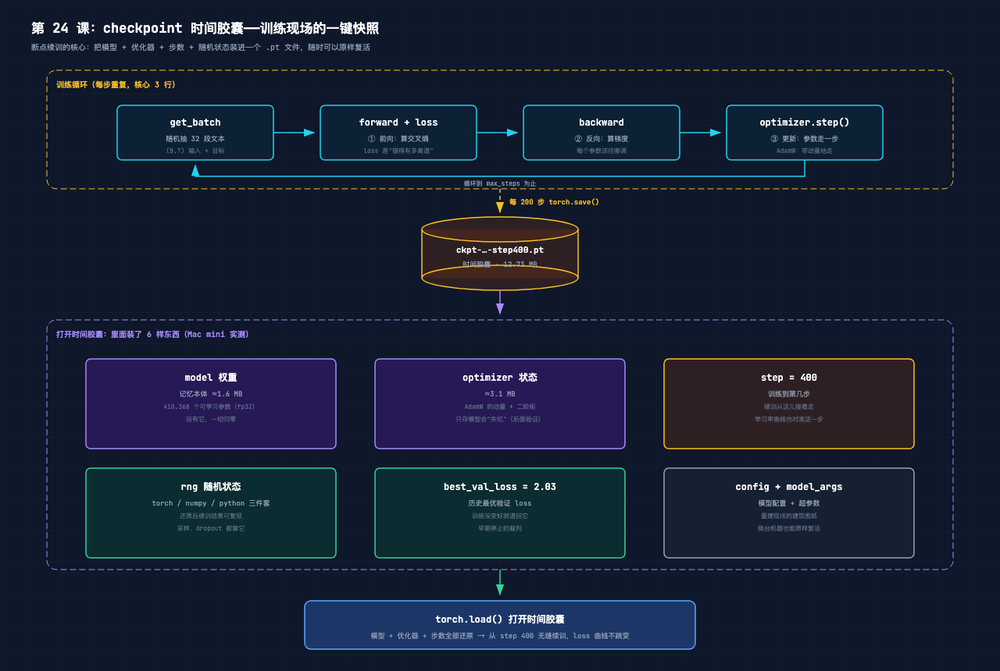
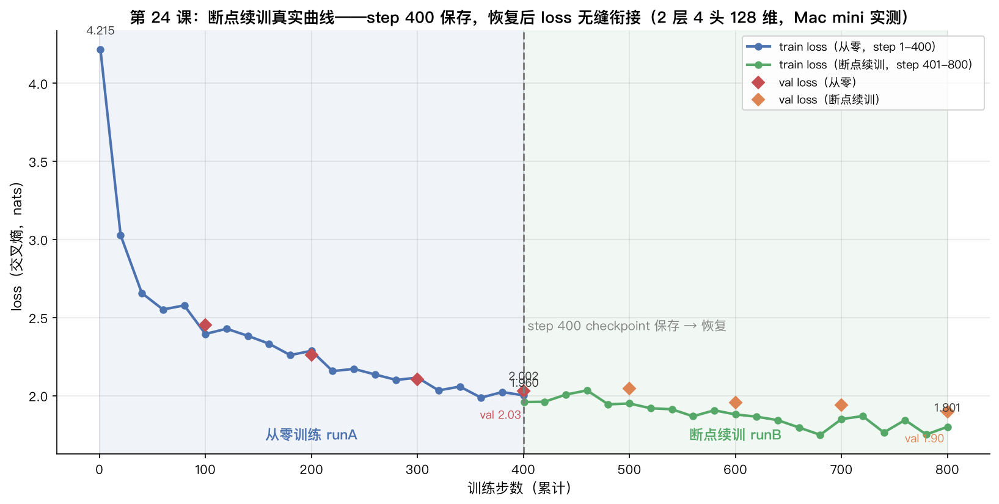
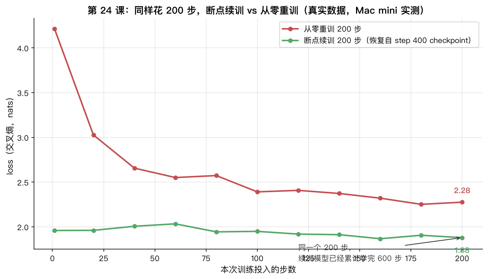

# 手搓大模型 24：训练循环——loss 收敛实战，断点续训让曲线无缝衔接

> 本节代码：✅ 见 `code/`（24-train.py 一个脚本跑完：训练循环 → checkpoint 保存/恢复 → 真实 loss 曲线 → 生成文本）
>
> 本系列《手搓大模型：从零构建 NanoGPT》的第二十四课。
> 目标读者：零基础。第 23 课把 GPT 的 5 块积木拼成了整机，第 19 课搭过项目骨架。今天做训练里最实用的一件事：把训练循环跑顺，把 loss 曲线读明白，再把训练现场整个打包——断点续训。

先摆一组真实数字（Mac mini 实测，一字未改）：

- **训练循环的核心只有 3 行**：`forward` 算 loss → `backward` 算梯度 → `optimizer.step()` 更新参数，外面套一个 while 循环反复转；
- **400 步从零训练**：loss 4.21 → 2.00（val 2.03）。第 400 步把现场存进 checkpoint（**12.73 MB**），从它恢复后续训 400 步——恢复后第一步 loss **1.9598**，和保存前一步的 2.0024 无缝衔接，800 步时降到 **1.80**（val 1.90）；
- **同样花 200 步**：从零重训 loss 2.28，断点续训 loss 1.88——**checkpoint 真的记住了模型学过的东西**；
- **checkpoint 里有 8.4 MB 是"假参数"**：两个 1024×1024 的注意力掩码常数矩阵，不是可学习参数，也被装进了时间胶囊（nanoGPT 同款行为）。

**这一课的核心思想一句大白话：训练 = 一个 while 循环反复做三件事（算错多少 → 错往哪传 → 参数走一步）；断点续训 = 定期把"现场"整个打包存盘，随时原样复活。** 第 19 课见过训练循环的骨架，今天把它拆开看每一行在干什么，再把 checkpoint 这个"时间胶囊"打开看个透。

## 先给结论：四句话

- **训练循环 3 行核心**：`loss = model(x, y)` → `loss.backward()` → `optimizer.step()`，转几百上千次，loss 就一路往下掉；
- **loss 是训练的仪表盘**：1 步的 loss ≈ ln(65) ≈ 4.17（随机乱猜），val loss 不再降就该停；
- **checkpoint = 时间胶囊**：模型权重 + 优化器状态 + 步数 + 随机状态 + 配置，一个 .pt 文件全装下（实测 12.73 MB）；
- **断点续训曲线无缝衔接**：恢复后第一步 loss 和保存前一步几乎贴在一起；只恢复模型不恢复优化器，loss 会先跳高再慢慢找回状态。

## 动机：模型会了，训练怎么管？

第 23 课证明了手搓 GPT 能学：400 步 loss 从 4.18 掉到 2.12。但那是"一把梭"式的训练——开跑就不能停，一中断就得从头再来。真实世界里有三个绕不开的问题：

1. **训练要跑几小时甚至几天，机器一断电、一合盖，全白干？** 大模型训练动不动几十万步，谁也没法一口气跑完；
2. **怎么知道模型在变好还是在原地打转？** 光看生成文本太主观，需要 loss 这条客观曲线；
3. **训练到一半想换个学习率、想对比两个实验、想挑历史最优，怎么办？** 没有存档，一切都是"进行时"，没法回退。

这三个问题的答案指向同一个东西：**checkpoint（检查点）**——定期把训练现场打包存盘。今天把训练循环本身解剖一遍，再打开 checkpoint 这个时间胶囊，用三个真实实验把"保存-恢复-续训"整条链路跑通。

## 第一层解剖：训练循环长什么样——3 行核心 + 1 个 while

第 19 课看过 nanoGPT 的 train.py 骨架，今天把循环本身拆到最细。训练循环的全部核心，去掉注释只有 3 行：

```python
logits, loss = model(x, y)      # ① 前向：拿一批数据算"错得有多离谱"
loss.backward()                 # ② 反向：把错误反推成每个参数的梯度
optimizer.step()                # ③ 更新：所有参数沿梯度方向走一小步
```

外面套一个 while，转 `max_steps` 次：

```python
step = 0
while step < max_steps:
    step += 1
    x, y = get_batch(...)       # 随机抽 32 段文本（第 19 课讲过）
    logits, loss = model(x, y)  # ①
    optimizer.zero_grad()       # 清掉上一步的梯度
    loss.backward()             # ②
    optimizer.step()            # ③
```

三个直觉点：

- **① 前向**：第 7 课讲过，模型把 (B,T) 的字符序列变成 (B,T,65) 的分数，交叉熵（第 4 课）算出"预测和真实下一个字符差多少"——一个数，叫 loss；
- **② 反向**：第 7 课手推过，链式法则把"总错误"分摊回每个参数，每个参数得到一个梯度（该往哪调、调多少）；
- **③ 更新**：第 9 课讲过 AdamW——不是简单"沿梯度走"，而是带动量、带自适应步长地走，走得更稳更快。

**啊哈时刻：整个"训练"在代码层面就是这么朴素。** 没有魔法，没有隐藏步骤——一台 1074 万参数的机器（第 23 课），训练它的核心逻辑就是这 3 行 + 1 个 while。GPT-3 训练 1750 亿参数，循环体里也是这 3 行，只是每步的计算量大了 17 万倍。

循环里还有三件"配套"的事：**学习率调度**（第 19 课讲过 warmup + 余弦衰减，让参数先小步试探再大步冲刺最后收尾）、**梯度裁剪**（`clip_grad_norm_`，防止某一步梯度爆炸把参数冲出天际）、**定期评估**（在 val 集上算 loss，看模型有没有过拟合，第 10 课讲过）。

## 第二层解剖：loss 曲线怎么读——仪表盘的三条铁律

训练循环每转一次，就产生一个 loss。把 loss 按步数画出来，就是本课的主图。先讲读法，再看真实数据。

**第一条铁律：第 1 步的 loss 应该在 ln(词表大小) 附近。** 随机初始化的模型对下一个字符完全没把握，每个位置都"均匀乱猜"，猜 65 个字符的交叉熵就是 ln(65) ≈ 4.17。如果第一步 loss 偏离这个值太多（比如 8 或者 0.1），说明数据管道或模型初始化有问题——**这是训练开始前 30 秒就该做的体检**。

**第二条铁律：train loss 应该平滑下降，val loss 是老板。** train loss 反映"背题能力"，val loss 反映"真本事"（第 10 课讲过过拟合）。val loss 开始回升、train loss 还在降，就是过拟合的信号，该停了。

**第三条铁律：曲线最后会"躺平"。** loss 不可能降到 0——莎士比亚文本本身有不确定性，模型永远猜不全。训练的目标是让曲线在合理的地方躺平，不是无限下降。本课 800 步的小模型，val loss 1.90 就是它的"地板"附近（第 26 课用完整配置能压到 1.5 以下）。

## 第三层解剖：checkpoint 时间胶囊——训练现场的一键快照

训练循环会跑，但机器会断电、人会合盖、实验要对比。所以每训练一段，就把"现场"整个打包：`torch.save(ckpt, path)`。



时间胶囊里装了 6 样东西，每一件都有用途：

| 组件 | 实测大小 | 干什么用 |
|------|---------|---------|
| model 权重 | ≈1.6 MB | 记忆本体：410,368 个可学习参数（fp32） |
| attn 掩码缓冲 | ≈8.4 MB | 两个 1024×1024 的常数三角形矩阵（不是参数！见误区 3） |
| optimizer 状态 | ≈3.1 MB | AdamW 的动量 + 二阶矩（第 9 课），恢复训练必需 |
| step | 几字节 | 训练到第几步，学习率曲线要对准它 |
| rng 随机状态 | 几 KB | torch / numpy / python 三件套，续训结果可复现 |
| config + model_args | 几 KB | 模型配置 + 超参数，换台机器也能重建现场 |

**啊哈时刻：只存模型权重是不够的。** optimizer 状态（动量、二阶矩）是 AdamW 的"跑步记忆"——它知道每个参数过去往哪个方向跑过、跑得多快。丢掉它，恢复训练时 AdamW 就"失忆"了，前几步会像新手一样乱闯。第四层解剖的实验 3 会亲眼看到这个现象。

## 第四层解剖：断点续训实验——三条真实曲线

现在做本课的核心实验。微型 GPT（2 层 4 头 128 维，410,368 参数，和第 23 课同款），莎士比亚字符级数据，AdamW + warmup + 余弦衰减。三个实验串成一条完整链路：

- **实验 1（runA）**：从零训练 400 步，每 200 步存一个 checkpoint；
- **实验 2（runB）**：从第 400 步的 checkpoint 恢复，续训 400 步——看曲线是否无缝衔接；
- **实验 3（对比）**：从零重训 200 步 vs 续训 200 步，看"记忆"差多少；另跑一个"只恢复模型、不恢复优化器"的对照组。

### 实验 1 + 2：保存 → 恢复 → 续训，曲线无缝衔接



从这张图读三件事：

1. **从零阶段（蓝，step 1-400）**：loss 从 4.2148 一路降到 2.0024，val loss 同步降到 2.03——41 万参数的小模型在学英语的"长相"；
2. **保存/恢复点（灰虚线，step 400）**：`ckpt-runA-step400.pt` 存盘，然后 runB 从它恢复；
3. **续训阶段（绿，step 401-800）**：恢复后第一步 loss **1.9598**，比保存前一步的 2.0024 还低一点——曲线完全没有跳变，像没中断过一样继续往下走，800 步时 train loss 1.80、val loss 1.90。

**这就是断点续训的验收标准：恢复后的第一步 loss，必须和保存前最后一步几乎相等。** 如果恢复后 loss 突然暴涨，说明 checkpoint 里缺了东西（大概率是优化器状态）。

### 实验 3a：同样花 200 步，续训 vs 从零



跑两个各 200 步的训练：一个从零开始（红），一个从 step 400 的 checkpoint 恢复（绿）。**花同样的算力、同样的时间，结果差一大截：**

- 从零重训 200 步：loss **2.28**；
- 断点续训 200 步：loss **1.88**——因为恢复的模型已经累计学完了 600 步的内容（400 步存档 + 200 步续训）。

**啊哈时刻：checkpoint 不是"备份"，是"记忆的搬运工"。** 从零重训要重新学一遍"KING 后面常跟空格、I 后面常跟 am"，续训直接接着往下学。1 小时的训练被中断了，恢复后续训 20 分钟，效果顶得上从头重训 40 分钟——**省下的不是时间，是已经学会的东西**。

### 实验 3b：只恢复模型、不恢复优化器，会怎样？

这是对照组：从 step 400 的 checkpoint 里**只取出模型权重**，配一个全新的 AdamW，再训 100 步：

```text
已加载模型权重（step 400 的 checkpoint），但 optimizer 是全新的
  step    1  loss 1.9364
  step   10  loss 2.3966   ← loss 不降反升！
  step   20  loss 2.1809
  step   50  loss 2.1538
  step  100  loss 1.9965
```

对比正常续训（runB）同时刻的表现：step 10（绝对 step 410）loss 1.9615，step 100（绝对 step 500）loss 1.9503。

**现象很清楚：只恢复模型，前几步 loss 从 1.94 跳到 2.40——优化器"失忆"了。** 全新 AdamW 的动量、二阶矩都是 0，它把已经学得很好的参数当新参数处理，第一步就迈了不该迈的步子，之后花了几十步才重新"热身"回来。**结论：断点续训必须模型 + 优化器一起恢复**，这也是为什么 nanoGPT 的 checkpoint 里两个都要存。

## 代码层：24-train.py——训练循环 + checkpoint，一个脚本跑完

完整代码在 `code/24-train.py`（自包含，只依赖 torch/numpy，venv 已装），三个命令对应三个实验：

```bash
# 实验 1：从零训练 400 步，每 200 步存 checkpoint
python 24-train.py --max-steps 400 --ckpt-every 200 --tag runA --seed 1337

# 实验 2：从 step 400 的 checkpoint 恢复，续训 400 步
python 24-train.py --resume ckpts/ckpt-runA-step400.pt --max-steps 400 --tag runB

# 实验 3a：从零重训 200 步（和 runB 的前 200 步对比）
python 24-train.py --max-steps 200 --tag fresh200 --seed 1337
```

模型复用第 23 课手搓的 `MyGPT`（抽到 `_24_gpt.py` 共享），今天的新代码是训练循环三件套。逐行拆：

**① 学习率调度——warmup 爬坡 + 余弦衰减（nanoGPT 同款）：**

```python
def get_lr(step, max_steps, warmup, max_lr, min_lr):
    if step < warmup:
        return max_lr * (step + 1) / warmup          # 前 50 步：线性爬坡
    if step > max_steps:
        return min_lr
    progress = (step - warmup) / (max_steps - warmup)  # 0 -> 1
    coef = 0.5 * (1.0 + math.cos(math.pi * progress))  # 1 -> 0 余弦
    return min_lr + coef * (max_lr - min_lr)           # 最高 3e-3 -> 最低 3e-4
```

为什么热身：第 9 课讲过，训练一开始参数是乱的，大步子容易踩空，先小步走 50 步让 AdamW 攒够动量，再放开跑。为什么余弦衰减：后期 loss 在"地板"附近震荡，步长太大来回弹，逐步收窄让参数稳稳落进谷底。真实日志里能看到 lr 从 1.20e-4 爬到 2.99e-3 再一路降到 3.00e-4。

**② checkpoint 保存——时间胶囊打包：**

```python
def save_checkpoint(path, model, optimizer, step, cfg, best_val_loss):
    ckpt = {
        "model": model.state_dict(),                     # 模型权重（记忆本体）
        "optimizer": optimizer.state_dict(),             # 优化器状态（动量/二阶矩）
        "model_args": { ... },                           # 重建模型所需配置
        "step": step,                                    # 训练到第几步
        "best_val_loss": best_val_loss,                  # 历史最优（早期停止用）
        "config": cfg,                                   # 超参数
        "rng_torch": torch.random.get_rng_state(),       # 随机状态三件套
        "rng_numpy": np.random.get_state(),
        "rng_python": random.getstate(),
    }
    torch.save(ckpt, path)
```

**③ checkpoint 加载——打开时间胶囊：**

```python
ckpt = torch.load(path, map_location=DEVICE, weights_only=False)
model = MyGPT(**ckpt["model_args"]).to(DEVICE)
model.load_state_dict(ckpt["model"])            # 还原权重
start_step = ckpt["step"]                        # 从保存的步数接着走
optimizer = torch.optim.AdamW(model.parameters(), lr=3e-3, weight_decay=0.1)
optimizer.load_state_dict(ckpt["optimizer"])     # 还原优化器（关键！）
# 还原随机状态，续训结果可复现
torch.random.set_rng_state(ckpt["rng_torch"].cpu())
np.random.set_state(ckpt["rng_numpy"])
random.setstate(ckpt["rng_python"])
```

**④ 训练循环主体——3 行核心 + 配套：**

```python
while step < total_steps:
    step += 1
    x, y = get_batch(train, val, model.block_size, batch_size, DEVICE, "train")
    lr = get_lr(step, total_steps, warmup, max_lr, min_lr)   # 每步更新学习率
    for g in optimizer.param_groups:
        g["lr"] = lr

    logits, loss = model(x, y)          # ① 前向
    optimizer.zero_grad(set_to_none=True)
    loss.backward()                     # ② 反向
    torch.nn.utils.clip_grad_norm_(model.parameters(), 1.0)  # 梯度裁剪
    optimizer.step()                    # ③ 更新

    if step % ckpt_every == 0:          # 定期打包现场
        save_checkpoint(..., model, optimizer, step, ...)
```

`zero_grad(set_to_none=True)` 是 PyTorch 官方推荐的清梯度姿势（比 `zero_grad()` 省内存）；`clip_grad_norm_(..., 1.0)` 把整组梯度的长度限制在 1 以内，防止某一步梯度爆炸。

## 实验层：真实运行输出

### 实验 1 输出（runA，从零 400 步）

```text
设备: mps  torch 2.12.1
数据: train 1,003,854 tokens, val 111,540 tokens, vocab 65
新建模型: {'vocab_size': 65, 'block_size': 64, 'n_layer': 2, 'n_head': 4, 'n_embd': 128}  参数量 410,368
训练: step 1 -> 400（本次 400 步）
  step     1  loss 4.2148  lr 1.20e-04  (0.5s)
  step   100  loss 2.3952  lr 2.87e-03  val 2.4508
  step   200  loss 2.2875  lr 1.95e-03  val 2.2610
  step   300  loss 2.1160  lr 8.08e-04  val 2.1048
  step   400  loss 2.0024  lr 3.00e-04  val 2.0319
  [ckpt] step 400 已保存 -> ckpts/ckpt-runA-step400.pt (12.73 MB)
```

### 实验 2 输出（runB，从 step 400 恢复续训 400 步）

```text
恢复 checkpoint: ckpts/ckpt-runA-step400.pt
  从 step 400 继续，历史 best_val_loss=2.0319
训练: step 401 -> 800（本次 400 步）
  step   401  loss 1.9598  lr 1.79e-03  (0.3s)
  step   500  loss 1.9503  lr 1.23e-03  val 2.0444
  step   600  loss 1.8802  lr 7.47e-04  val 1.9575
  step   700  loss 1.8501  lr 4.17e-04  val 1.9389
  step   800  loss 1.8008  lr 3.00e-04  val 1.8972
  [ckpt] step 800 已保存 -> ckpts/ckpt-runB-step800.pt (12.73 MB)
```

注意 step 401 的 lr 是 1.79e-3——**学习率曲线也恢复到了第 401 步该有的位置**（warmup 结束后的余弦段），不是从头重新热身。这也是 step 必须存进 checkpoint 的原因。

### 生成：800 步模型 + "加载即生成"演示

800 步模型从 "KING" 采样 300 字符（temperature=0.8）：

```text
KING RICHARD:
The as sunt thee, of thi so$-
Lood! and may she I consst mise with woull,
In and the brek-ppoosh sway soment mant and in in mus band
SaY Cromer:
For but he faites shall flom all and me not but Eeart,
That for the and fruice.

CLAULIUS:
O, and they a shall and it wish could an see:
These th
```

比第 23 课 400 步的模型更"像英语"了（出现了 KING RICHARD、CLAULIUS 这样的角色名和舞台提示），但语法还远没到能读的程度——第 26 课跑完整 5000 步才是真正的莎士比亚生成器。

**加载即生成演示**：打开 step 400 的时间胶囊，一步不训直接生成：

```text
已加载 step 400 的 checkpoint，一步不训，直接生成：
ThO tor sabe olld wom low ard mBeand your pomon'e steent ther
In and the make not hason: prow By heresem,
Bothr cour us a fegce to rempery our the theirth dikent;
Pecon thou cour the our if by seage
Que'd for stake f
```

**啊哈时刻：checkpoint 就是模型本身。** 打开它、加载权重、直接生成——不需要任何训练，400 步学到的东西全在文件里。这也解释了为什么大模型训练时 checkpoint 管理是门学问：模型越大，时间胶囊越贵（GPT-2 的 1.24 亿参数模型，光模型权重就 500 MB，优化器状态再翻一倍多）。

## 误区与彩蛋

**误区 1：checkpoint = 保存模型权重，`torch.save(model.state_dict())` 就够了。**
不够。权重只是记忆本体，AdamW 的动量/二阶矩是"跑步记忆"。实验 3b 亲眼看到：只恢复权重，loss 从 1.94 跳到 2.40，几十步才缓回来。**断点续训的标准姿势：模型 + 优化器 + step + rng 一起存。**

**误区 2：断点续训 = 从 checkpoint 继续，效果肯定和没中断一样。**
在"模型 + 优化器都恢复"的前提下成立，但有一个隐藏条件：**学习率曲线要对准 step**。如果恢复后把 lr 当第 1 步重新热身，等于用大学习率猛踹一个已经训练好的模型，效果同样会崩。runB 日志里 lr 恢复到 1.79e-3（第 401 步该有的值），而不是 1.20e-4（第 1 步的值），这是刻意为之。

**误区 3：checkpoint 里全是"有用的参数"。**
实测 12.73 MB 的 checkpoint，约 8.4 MB 是**注意力掩码缓冲**——两个 1024×1024 的常数三角形矩阵（第 16 课讲过 causal mask）。它们是 `register_buffer` 注册的**缓冲区（buffer），不是可学习参数**，但默认也会被 `state_dict()` 打包带走。nanoGPT 和 GPT-2 源码同款行为，所以真实大模型的 checkpoint 里也躺着几 MB 到几十 MB 的"死重"。**修法：注册缓冲区时加 `persistent=False`**（`register_buffer("bias", mask, persistent=False)`），掩码照常用、checkpoint 里不存。一个小改动，省 8 MB。

**误区 4：loss 曲线必须一路下降才算训练成功。**
看本课真实数据：step 80（2.5782）比 step 60（2.5519）还高，step 120 又跌回 2.43——**单步 loss 上下跳动是正常的**（每步抽的 32 段文本不一样，batch 不同）。判断训练是否健康要看趋势（平滑后的方向）和 val loss，不是盯单步。所以日志每 20 步记一次，画曲线看整体。

**彩蛋 1：`torch.save` 在 torch 2.13.0 是坏的——本系列强制 2.12.1 的原因。**
本系列环境基线（第 2 课）踩过：torch 2.13.0 里执行 `torch.save` 直接抛 `ModuleNotFoundError: torch.utils.serialization`。**断点续训这个功能本身，在 2.13.0 上根本跑不起来。** 今天这课是 checkpoint 的主场，再次提醒：装 PyTorch 认准 `torch==2.12.1`。

**彩蛋 2：step 1 的 loss 4.2148 ≈ ln(65) ≈ 4.17，是免费的体检。**
第一次跑训练，先看 step 1 的 loss 在不在 ln(词表大小) 附近。本课实测 4.2148，和第 4 课的理论值 4.17 几乎重合——说明数据管道、模型初始化都没问题。如果差得远（比如 8 或者 0.5），先别急着调学习率，回去查数据对齐。

**彩蛋 3：12.73 MB 的时间胶囊，装下了 800 步的全部学习成果。**
模型 410,368 参数（1.6 MB）+ 优化器（3.1 MB）+ 掩码缓冲（8.4 MB）+ 零零碎碎 = 12.73 MB。这个数字对比一下：第 26 课的完整模型 10.75M 参数（第 23 课核对过），checkpoint 会到几百 MB；GPT-3 的 1750 亿参数，单份 checkpoint 按 TB 计。**"训练"的本质，就是把几 TB 的算力烧成几百 MB 的权重，再用 checkpoint 把这个成果小心翼翼地保管起来。**

---

**本课代码**：`https://github.com/flyingcloud-code/learning-nanogpt-from-0-to-1/tree/main/24-convergence-practice`

**系列仓库**：`https://github.com/flyingcloud-code/learning-nanogpt-from-0-to-1`

下一课：生成与评估——temperature / top-k / top-p / perplexity（第 25 课）。
