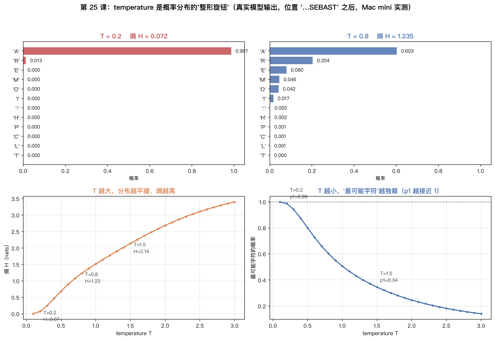
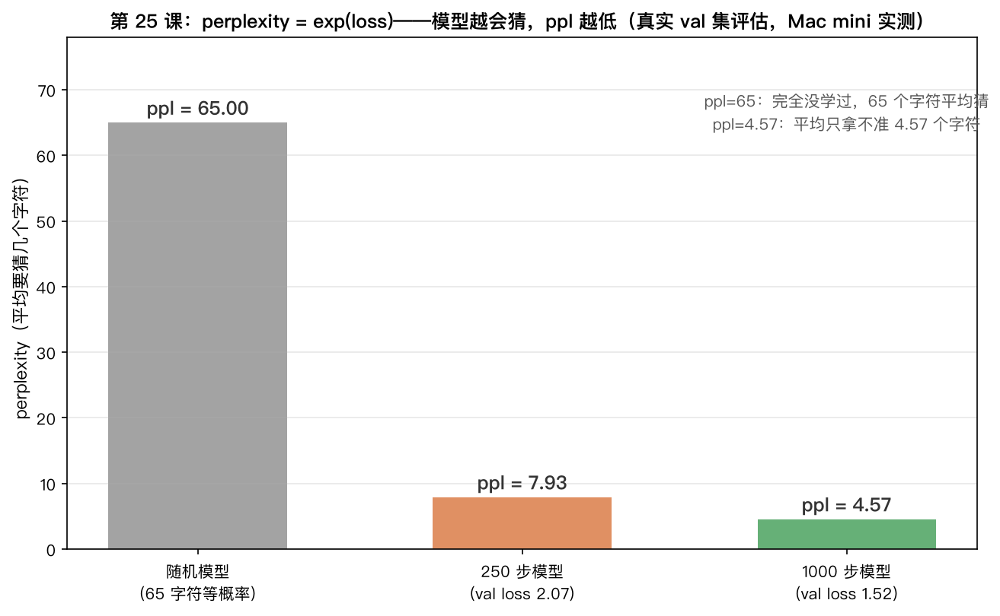

# 手搓大模型 25：生成与评估——三个旋钮一个仪表盘，同一台模型拧出三种人格

> 本节代码：✅ 见 `code/`（25-generate.py：temperature / top-k / top-p 采样三件套 + perplexity 评估，加载 1000 步 checkpoint 直接玩）

本系列《手搓大模型：从零构建 NanoGPT》的第二十五课。
目标读者：零基础。第 24 课把训练循环跑顺、checkpoint 时间胶囊存好，第 23 课组装了 1074 万参数的完整 GPT。今天做训练之后的两件事：让模型开口说话（生成），给模型打分（评估）。

先摆一组真实数字（Mac mini 实测，一字未改）：

- **同一个模型、同一个 prompt、同一个随机种子，只拧一个旋钮（temperature），生成三种人格**：T=0.2 是安全复读机（`What says thou wilt not see the senators?`），T=0.8 是正经剧作家（`Then I, my daughter and scarce and show`），T=1.5 是疯诗人（`My Lord, till my dareful bros', from Relish to march!`）；
- **在一个真实歧义位置（`'…SEBAST'` 之后）**：T=0.2 时模型给字符 `'A'`（SEBASTIAN 的开头）打了 **0.987** 的概率，T=1.5 时只剩 **0.345**——分布从"几乎锁死"变成"五个候选都有机会"；
- **perplexity 仪表盘**：1000 步的模型 val 集 ppl = **4.57**（平均只拿不准 4.57 个字符），250 步的模型是 **7.93**，完全没学过的随机模型是 **65**；
- **采样三件套的核心代码只有 20 行**。

**这一课的核心思想一句大白话：训练是"学会"，生成是"发挥"——模型输出 65 个分数，怎么把分数变成文字，全看采样时拧的三个旋钮（temperature / top-k / top-p）；模型学得好不好，用一个仪表盘（perplexity）量。** 第 23 课结尾已经见过 `generate()`，今天把里面的每一步拆开看。

## 先给结论：四句话

- **生成 ≠ 训练**：训练改权重（第 24 课），生成读权重——三个旋钮全是"采样阶段"的玩法，不动模型一个参数；
- **temperature 是创造力旋钮**：T<1 分布变尖（保守）、T>1 分布变平（放飞），T=0 就是贪心解码（永远选最可能）；
- **top-k / top-p 是候选名单门卫**：把概率太低的候选直接踢出抽签池，防乱码、防跑偏；
- **perplexity 是惊讶度仪表盘**：ppl = exp(loss)，ppl=4.57 意味着模型平均每次只对 4.57 个字符拿不准，随机模型是 65。

## 动机：模型学完了，怎么开口说话？

第 24 课训出 checkpoint，第 23 课的 `generate()` 已经能吐字。但那是"一把梭"式的生成——只有一个默认旋钮位置。真实世界里三个问题绕不开：

1. **生成的文本太平怎么办？** 模型学的是"最常见写法"，直接取最可能字符，生成的永远是"KING HENRY VI"这种安全开局，三句话就重复；
2. **生成的文本太乱怎么办？** 模型也会犯错，偶尔冒出乱码级候选，全盘接受就成了"dareful bros'"；
3. **怎么客观评价模型好不好？** 光读生成文本太主观——250 步的模型读起来也"像英语"，到底比 1000 步差多少？

三个问题的答案指向同一组工具：**采样策略（生成时怎么选字符）+ perplexity（生成前怎么打分）**。今天把这两个东西彻底拆开。

## 第一层解剖：采样到底在干什么——从分数到文字的 5 步流水线

先回到第 12 课：GPT 的最后一个输出层（lm_head，第 23 课讲过）对"下一个字符"给出 **65 个分数**（logits）。分数不是概率，只是一堆有正有负的数。把分数变成一个具体的字符，走 5 步：

```
65 个分数（logits）
   │  ① 除以 temperature（拧分布形状）
   ▼
缩放后的分数
   │  ② top-k：只留分数最高的 k 个，其余设 -inf（踢出局）
   │  ③ top-p：按概率累计到 p 为止，后面的设 -inf（再踢一批）
   ▼
过滤后的分数
   │  ④ softmax：变成 65 个概率，加起来 = 1（第 4 课）
   ▼
概率分布
   │  ⑤ 抽签（multinomial）：按概率随机抽一个字符
   ▼
下一个字符
```

**啊哈时刻：模型从来不说"答案是 X"，它只说"我认为下一个字符的 65 个概率是这些"。** 说话的是采样器——同一个人（模型），换张嘴（采样策略），说出来的话完全不一样。三个旋钮都在第 ①-③ 步做手脚，第 ④⑤ 步是固定动作。

## 第二层解剖：temperature——把分布拧尖或抹平

### 直觉

temperature 的用法就一行：`logits / T`。但效果很神奇：

- **T < 1**：分数除以一个小于 1 的数，差异被放大。本来 3.0 和 2.5 差别不大，除以 0.2 变成 15 和 12.5，softmax 后高分的概率被顶到接近 1——**分布变尖，模型"拿定主意"**；
- **T = 1**：原样输出，模型"本来怎么想就怎么说"；
- **T > 1**：分数除以一个大于 1 的数，差异被压缩。15 和 12.5 变成 10 和 8.3，softmax 后概率趋于均匀——**分布变平，模型"谁都有可能"**。

### 真实数据：一个真实的歧义位置

模型读到 `'…No, no, he's gone.\n\nSEBAST'`，下一个字符是谁？训练语料里最常见的是 `'A'`（SEBASTIAN 的开头），但 `'R'`、`'E'`、`'M'`、`'O'` 也有机会。把模型在这位置的 65 个真实 logits 除以不同温度，看分布怎么变：



- **T=0.2**：`'A'` 概率 **0.987**，其余几乎清零。熵 H=0.07——模型"铁了心"；
- **T=0.8**：`'A'` 0.603、`'R'` 0.204、`'E'` 0.080、`'M'` 0.046、`'O'` 0.042。有主见，但给冷门留了门；
- **T=1.5**：`'A'` 只剩 **0.345**，前五名都过 0.08。熵 H=2.14——"五五开"。

右下角的曲线是温度对熵的影响：T 从 0.1 拧到 3.0，分布熵从 0.007 一路爬到 3.44。熵（第 4 课）就是"惊讶度"——**温度越高，模型越"没主意"，生成越不可预测**。

### 数学细节（每个符号给直觉）

- `logits`：65 个分数，第 i 个分数越大，字符 i 越可能；
- `T`：温度（temperature），一个正数。除以 T 就是缩放；
- `softmax(z/T)`：缩放后再归一化成概率。T 小 → 概率向最大分数集中；T 大 → 概率趋于均匀（所有字符概率 → 1/65）；
- 熵 `H = -Σ pᵢ·ln pᵢ`：分布的不确定度。均匀分布熵最大（ln 65 ≈ 4.17），一点不平均熵接近 0。

**啊哈时刻：T=0 时 `softmax(z/0)` 是未定义的，但极限就是"只选分数最大的那个"——贪心解码（greedy）。ChatGPT 网页版的"严谨"模式，背后的旋钮就是低温 + 低 top-p。**

## 第三层解剖：top-k / top-p——候选名单门卫

temperature 只管"形状"，不管"哪些候选该出场"。模型偶尔会给乱码级字符不低的分数（训练数据里那些 `$`、`&`、大写字母乱入），top-k 和 top-p 负责把它们挡在门外。

### top-k：只留分数最高的 k 个

```python
v, _ = torch.topk(logits, k)          # 找分数最高的 k 个
logits[logits < v[-1]] = float("-inf")  # 其余的全部设成 -inf
```

`-inf` 是"判死刑"：softmax 里 `e^(-inf) = 0`，概率归零，抽签永远抽不到。k=10 就是"每步只从 10 个字符里选"。

### top-p（核采样）：累计概率到 p 为止

top-k 有个毛病：k 固定，但分布时宽时窄。top-p 换个思路——**按概率从高到低累加，加到累计概率超过 p 就关门**：

```python
sorted_logits, sorted_idx = torch.sort(logits, descending=True)  # 从高到低排
cum = torch.cumsum(F.softmax(sorted_logits, dim=-1), dim=-1)      # 累计概率
mask = cum - F.softmax(sorted_logits, dim=-1) > top_p             # 加上它才超 p 的，踢
sorted_logits[mask] = float("-inf")
```

p=0.9 意味着"这一步只从累计占 90% 概率的候选里选"——分布尖时候选少，分布平时候选多，自适应。

### 真实数据：门卫把守下的生成

同一台模型、同一 prompt `"KING "`、seed=42，加不加门卫、门卫多严：

- **top_k=10**：`CLARENCE:\nMy Lord, thou must defence thee from Richmond!`——有剧情、像台词；
- **top_p=0.9**：`CLARENCE:\nMy Lord, thou must defence thee from Richmond!\nAnd they leave not, my lord, for what's my coate?`——同上，通顺；
- **top_p=0.1**（门卫太严）：`KING HENRY VI:\nThe state of York of York and the state of York.\n...And the state of the state of the state of the state,`——**复读机**。候选池被压到几乎只有 "the state of" 这几个词，模型只会原地打转。

**啊哈时刻：门卫太严和温度太低，殊途同归——都会把模型逼成复读机。** "生成质量"不是旋钮拧到哪一档就最好，而是三档配合。

## 第四层解剖：perplexity——评估仪表盘

三个旋钮管"怎么说话"，perplexity 管"学得好不好"。它的定义朴素得惊人：

```
perplexity = exp(交叉熵 loss)
```

第 4 课讲过交叉熵：模型对真实文本的平均"惊讶度"。loss=1.52（nats）意味着模型平均对每个字符的惊讶是 1.52 个"自然对数单位"，`exp(1.52) ≈ 4.57`——**翻译成人话：模型平均每次只在 4.57 个候选字符之间拿不准**。4.57 个字符里挑一个，猜对率约 22%，这已经是"懂英语"的水平。

真实数据（同一批 val 数据，同样的评估方法）：

| 模型 | val loss | perplexity | 直觉 |
|------|----------|-----------|------|
| 随机模型（没学过） | ln(65) ≈ 4.17 | **65** | 65 个字符完全等概率，每次平均要猜 65 个 |
| 250 步模型 | 2.0708 | **7.93** | 只拿不准约 8 个字符，能看出"英语长相" |
| 1000 步模型 | 1.5204 | **4.57** | 只拿不准约 4.6 个字符，能猜对词和常见搭配 |



**啊哈时刻：ppl 和采样旋钮完全无关。** 上面那张图里，T=0.2 的"安全复读机"和 T=1.5 的"疯诗人"用的是同一个模型——它的 ppl 都是 4.57。ppl 只衡量"模型学到了多少"，不衡量"这次生成精不精彩"。这也是为什么行业里评估模型看 ppl、跑分、人工评测，而采样旋钮是部署时才调的。

## 代码层：25-generate.py——采样三件套 + 评估，一个脚本跑完

完整代码在 `code/25-generate.py`（自包含，只依赖 torch/numpy，venv 已装），两种跑法：

```bash
# 方式 A：加载已训练 checkpoint（本课文章用的 1000 步莎士比亚模型）
python 25-generate.py --ckpt /path/to/ckpt.pt

# 方式 B：没有 checkpoint？快速训 400 步小模型再玩采样（约 1 分钟）
python 25-generate.py --quick-train
```

模型直接复用本系列手搓的 `MyGPT`（第 21/22/23 课拼装），checkpoint 加载时做了一次 key 重命名（nanoGPT 官方的 `transformer.h.0.ln_1.weight` → 本系列的 `blocks.0.ln_1.weight`，10 行映射，见 `remap_nanogpt_keys`）。今天的新代码是三件套。逐行拆：

**① 采样核心 `sample_next`——三旋钮 + softmax + 抽签，20 行：**

```python
def sample_next(logits, temperature=1.0, top_k=None, top_p=None):
    """给定模型对下一个字符的分数 logits（形状 [vocab]），按采样策略抽一个字符 id。
    三个旋钮按顺序工作：temperature 缩放 -> top-k 过滤 -> top-p 过滤 -> softmax -> 抽签。"""
    logits = logits / temperature                      # ① temperature：拧分布形状
    if top_k is not None:                              # ② top-k：只留概率最高的 k 个
        v, _ = torch.topk(logits, min(top_k, logits.size(-1)))
        logits[logits < v[-1]] = float("-inf")         # 其余候选直接判死刑（-inf）
    if top_p is not None:                              # ③ top-p：累计概率到 p 为止
        sorted_logits, sorted_idx = torch.sort(logits, descending=True)
        cum = torch.cumsum(F.softmax(sorted_logits, dim=-1), dim=-1)
        mask = cum - F.softmax(sorted_logits, dim=-1) > top_p   # 去掉"加上它才超 p"的
        sorted_logits[mask] = float("-inf")
        logits = torch.zeros_like(logits).scatter_(0, sorted_idx, sorted_logits)
    probs = F.softmax(logits, dim=-1)                 # ④ 变成概率分布
    return torch.multinomial(probs, num_samples=1)    # ⑤ 按概率抽签（不是取最大）
```

**② 自回归生成 `generate`——每步把新字符喂回去，10 行：**

```python
@torch.no_grad()
def generate(model, idx, max_new_tokens, temperature=1.0, top_k=None, top_p=None):
    model.eval()                                      # 关掉训练态（dropout 等）
    for _ in range(max_new_tokens):
        idx_cond = idx[:, -model.block_size:]         # 只留最近 block_size 个（窗口）
        logits, _ = model(idx_cond)                   # 前向，拿最后位置的分数
        idx_next = sample_next(logits[0, -1, :], temperature, top_k, top_p)
        idx = torch.cat((idx, idx_next.unsqueeze(0)), dim=1)   # 拼到序列后面
    return idx
```

**③ perplexity——在 val 集上算平均 loss 再取 exp，5 行：**

```python
@torch.no_grad()
def estimate_loss(model, val, block_size, batch_size, eval_iters=100, device="cpu"):
    losses = []
    for _ in range(eval_iters):                       # 抽 100 批 val 数据
        x, y = get_batch(None, val, block_size, batch_size, device, "val")
        _, loss = model(x, y)
        losses.append(loss.item())
    return float(np.mean(losses))                     # 平均 loss

# ppl = math.exp(loss_val)  ← 一行换算
```

为什么 `torch.multinomial` 而不是 `argmax`：multinomial 按概率抽签——`'A'` 概率 0.6 就 60% 抽到。argmax 永远选最可能的，等于 T=0 贪心，会复读。**抽签是"多样性"的来源。**

## 实验层：真实运行输出

### 实验 1：同一个模型，只拧 temperature（seed=42，prompt=`"KING "`，各 300 字符）

```text
--- temperature = 0.2（保守）---
KING HENRY VI

KING HENRY VI:
What says thou wilt not see the senators?

KING RICHARD II:
The father of the state of the state?

KING RICHARD II:
The country shall be the conscience of the man
The state of the country of the state of the compassion.

QUEEN ELIZABETH:
The king of the countryment of the st
```

```text
--- temperature = 0.8（平衡）---
KING HENRY VI

KING EDWARD IV:
Then I, my daughter and scarce and show
And my bound revenge me be confess'd
To set thee at once thy right.

My lord of GAUET:
What slave I will have slain thy brother?
Ah, I hope think not off thy blood king,
I'll thee my life thereof thoughts, therefore I thee art better
```

```text
--- temperature = 1.5（疯狂）---
KING HENRY VI

CLARENCE:
My Lord, till my dareful bros', from Relish to march!

Provost:
My lord, Richard? O sos&he-patiety mi? O,
I'll Aumerle's jeoN house I.
BagGo, his night? I post rought?

PAGER:
If IsabeLth
If your own lidingd; I am going? that's inty,
Gentle, His gate, gentlemanius.
Lo know this p
```

三档一对比：**T=0.2 全是安全句式和重复（"The state of..." 来回绕），T=0.8 有剧情有矛盾（"What slave I will have slain thy brother?"），T=1.5 语无伦次但脑洞大开（"dareful bros'", "jeoN", "BagGo"）。** 模型没变，变的只是采样时怎么选字符。

### 实验 2：top-k / top-p 门卫（seed=42，temperature=1.0）

```text
--- temperature=1.0 + top_k=10 ---
KING HENRY VI

CLARENCE:
My Lord, thou must defence thee from Richmond!
And they learn then, but I can them to servant:
Thou hast tail; I am now therefore to slay for his heirs.
```

```text
--- temperature=1.0 + top_p=0.9 ---
KING HENRY VI

CLARENCE:
My Lord, thou must defence thee from Richmond!
And they leave not, my lord, for what's my coate?

KING HENRY VI:
Stay whereof he comes to him?

LADY ANNE:
No, for it be stop too, I hope he thereof:
Then there I leave my wife's choicentent courts have both myself;
```

```text
--- temperature=1.0 + top_p=0.1（极保守）---
KING HENRY VI

KING HENRY VI:
The state of York of York and the state of York.

KING RICHARD II:
Then I have stand to the state of the state,
And the state of the state of the state of the state,
And the state of the state of the state of the state,
And the state of the state of the country's state,
```

top_k=10 和 top_p=0.9 都保持通顺；**top_p=0.1 把候选池压没了，"the state of" 原地转圈**——门卫太严，模型只能复读。

### 实验 3：perplexity 评估（val 集，eval_iters=100）

```text
设备: mps  torch 2.12.1
数据: train 1003854 tokens, val 111540 tokens, vocab 65
加载 checkpoint: .../out-shakespeare-char/ckpt.pt
  模型: {'n_layer': 6, 'n_head': 6, 'n_embd': 384, 'block_size': 256, 'bias': False, 'vocab_size': 65}
  参数量: 10,745,088  iter=1000  best_val_loss=1.5218

[实验 4] perplexity（在 val 集上评估，eval_iters=100）
  本模型 val loss 1.5204  ->  perplexity 4.57
  对照：随机模型 ppl = 65（65 个字符等概率，每次平均要猜 65 个）
```

## 误区与彩蛋

**误区 1：temperature 是训练参数，调它要重新训练。**
不是。三个旋钮全是**采样（推理）阶段**的玩法，模型权重一个参数都不动。同一个 checkpoint，换 temperature 就能换生成风格——这也是为什么大模型服务商把 temperature 暴露成 API 参数，而不是藏在训练里。

**误区 2：temperature 越高"创造力"越强。**
说反了。T 高的是**混乱度**，不是创造力。T=1.5 的"dareful bros'"不是创意，是模型在概率变平后开始瞎蒙。真实世界调"创意"通常是 T=0.8~1.0 搭配 top-p=0.9，再高就崩。

**误区 3：top-p=0.9 一定比 top-k=40 好。**
没有绝对。top-k 简单粗暴但 k 固定，分布尖时浪费、平时漏候选；top-p 自适应但多一步排序。nanoGPT 的 `sample.py` 里两个都实现了，业界 GPT 系列默认 top-p 为主。真实项目经常两者叠加用。

**误区 4：ppl 低 = 生成质量高。**
ppl 只衡量"模型对真实文本的惊讶度"，不衡量"生成文本精不精彩"。一个只背过新闻的模型 ppl 可能很低，但生成的"文章"全是新闻腔。**ppl 是体检指标，不是才华指标。**

**彩蛋 1：ppl 和采样旋钮完全无关。**
前面那张图里，"安全复读机"（T=0.2）和"疯诗人"（T=1.5）是同一个模型，ppl 都是 4.57。评估模型用 ppl，部署调风格用旋钮，两套体系别混。

**彩蛋 2：T=0 就是贪心解码，ChatGPT 的"严谨模式"就藏在这里。**
`softmax(z/T)` 在 T→0 时退化成"永远选最大"（argmax）。业界把 T 设低 + top-p 设低，就是"保守稳定"人格；T 设高就是"放飞"。**所谓 AI 的"性格"，很大程度是采样旋钮拧出来的。**

**彩蛋 3：perplexity 有下限。**
莎士比亚文本本身有随机性——同一个位置，作者写 "the" 还是 "a" 都有可能。模型 ppl 不可能降到 1（完全确定），第 26 课完整 5000 步训练的模型 ppl 能压到 3 左右，但永远到不了 1。**"看不懂的随机性"是语言的本质，不是模型的错。**

---

**运行复现**：

```bash
# 1. 装依赖（Mac mini / Apple Silicon）
python3 -m venv .venv && source .venv/bin/activate
pip install torch==2.12.1 numpy matplotlib

# 2. 准备数据（nanoGPT 的 shakespeare_char）
#    data/shakespeare_char/input.txt（tinyshakespeare，1.1MB）

# 3. 加载 1000 步 checkpoint 跑全部实验（temperature / top-k / top-p / perplexity）
python 25-generate.py --ckpt /path/to/ckpt.pt

# 4. 没 checkpoint？快速训 400 步小模型再玩（约 1 分钟）
python 25-generate.py --quick-train
```

配图数据来自真实运行：`25-make-charts.py` 读 `25-generate.py` 实验 1 保存的 `/tmp/25-ambig-logits.pt` 画分布图，perplexity 来自实验 4 与探索脚本的 val 集评估。
