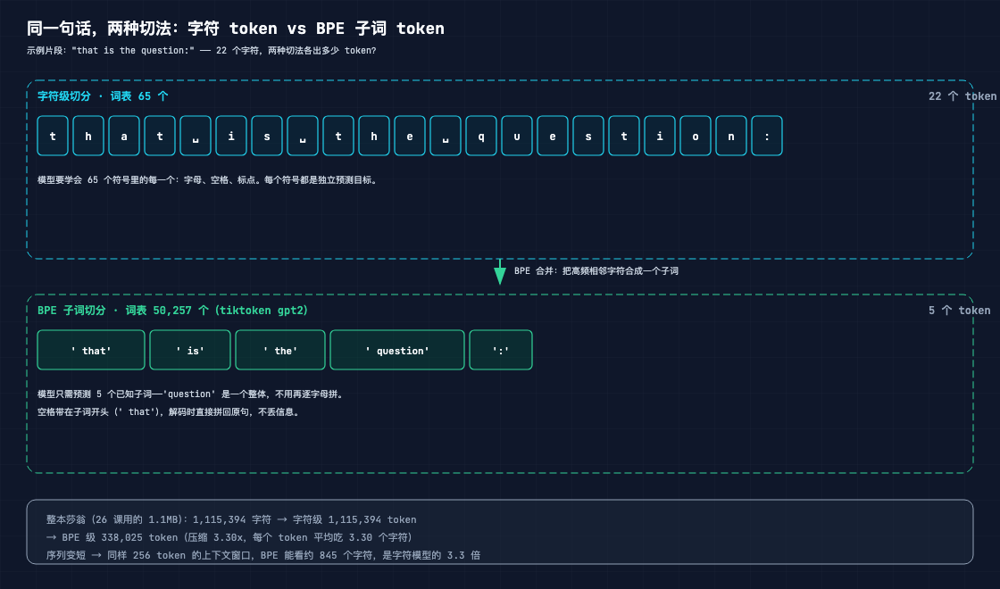
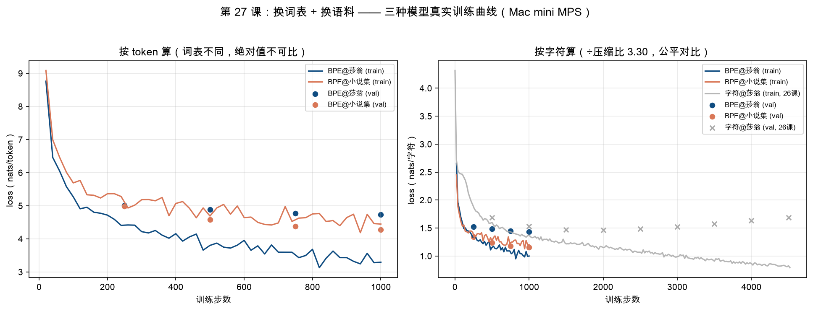

# 手搓大模型 27：换大数据集——字符换成 BPE、1.1MB 换成 11MB，同一台模型再上一个台阶

> 本节代码：✅ 见 `code/`（27-tokenize.py：字符 vs BPE 切分对比；27-download-corpus.py：六本名著语料下载；27-train.py：BPE 子词级 1000 步训练，Mac mini MPS 实测约 11 分钟一个模型）
>
> 本系列《手搓大模型：从零构建 NanoGPT》的第二十七课。
> 目标读者：零基础。第 26 课交出里程碑（完整 5000 步字符级训练），也顺手暴露了两个真实瓶颈：模型练到一半开始"背课文"，而且它认识的"字"永远只有 65 个。今天解决这两个问题：换词表 + 换语料。

先摆一组真实数字（Mac mini 实测，一字未改）：

- **26 课的字符模型 2000 步后 val loss 开始反弹**：val 最低点 1.4646（第 2000 步），到第 4500 步反而涨回 1.6857——train loss 还在一路降到 0.82。这是"背课文"的铁证：模型把训练集背下来了，却越来越看不懂没见过的文本；
- **同一段莎翁文本，BPE 只用字符级三成的 token 数**：1,115,394 个字符 → 338,025 个子词，压缩 3.30 倍；
- **同样训练 1000 步，按"每个字符"公平对比**：字符模型 val 1.5274 nats/字符，BPE@莎翁 1.4362 nats/字符——只换词表，提升约 6%，而且过拟合更重（train-val 差了 1.44 nats）；
- **真正的大头是换语料**：1.1MB 莎翁换成 11.3MB 六本名著（约 10 倍），BPE@小说集 val 4.2754 nats/token ≈ 1.1524 nats/字符（按字符算比字符模型低约 25%、比 BPE@莎翁低约 20%）；
- **模型代码一行没改**：30,018,816 参数 vs 字符版的 10,745,088，多出来的 1,927 万个参数几乎全躺在词表 embedding 表里。

**这一课的核心思想一句大白话：给模型升级数据有两招——把"切词"从字符换成子词（BPE），把"喂饭"从 1.1MB 换成 11MB。第一招让每个 token 多含 3.3 个字符的信息量，第二招给模型 10 倍的素材。实测下来，第二招才是主力，第一招是放大器。**

## 先给结论：四句话

- **BPE 不是免费的午餐**：词表从 65 涨到 50,257（约 773 倍），同样 1000 步、同样架构，BPE@莎翁按字符算只比字符模型好 6%，过拟合还更重——30M 参数去啃 30 万 token 的小语料，撑不住；
- **10 倍语料才是主角**：BPE@小说集（11.3MB）比 BPE@莎翁（1.1MB）的 val loss 低 0.46 nats/token，同样只训 1000 步；
- **per-token loss 不能跨词表直接比**：65 词表瞎猜 = ln(65) = 4.17 nats，50,257 词表瞎猜 = ln(50257) = 10.83 nats——起跑线都不一样。要比就除以压缩比，换算成"每个字符"的 loss；
- **模型一行没改**：26 课手搓的 MyGPT 原封不动，只把 vocab_size 从 65 换成 50257、把输入数据从 1.1MB 换成 11.3MB。

## 动机：26 课模型的两个真实瓶颈

第 26 课的里程碑模型确实能写出"有剧情有矛盾"的台词，但把训练日志摊开看，有两个刺眼的真相：

**瓶颈一：它练到一半开始背课文。** 26 课的 val loss 曲线不是一路向下，而是先降后升：第 2000 步最低 1.4646，之后一路反弹到第 4500 步的 1.6857；同期的 train loss 却从 1.15 一路降到 0.82。train 和 val 之间的缝越拉越大，就是第 10 课讲的过拟合——模型开始死记硬背训练集里的句子，而不是学"怎么像莎士比亚一样说话"。

**瓶颈二：它的词汇量天花板是 65。** 字符级模型的世界里只有 26 个字母 + 标点 + 空格。它不认识"question"这个词，只知道 q-u-e-s-t-i-o-n 这串字符。更麻烦的是，每"想"一个字符都要从 65 个候选中挑——平均要拿不准 4.6 个（ppl = exp(1.5274) ≈ 4.6）。

怎么破？两条路，今天一起走：**把切词从"字符"换成"子词"（BPE），把语料从"一本莎翁"换成"六本名著"**。

## 第一层解剖：字符 vs BPE——同一句话的两种切法

先看一张对比图（真实数据）：



拿莎翁里的一句 "To be, or not to be: that is the question:" 跑一遍真实编码（27-tokenize.py 的输出，一字未改）：

```
字符级（65 词表）：
  'T' 'o' ' ' 'b' 'e' ',' ' ' 'o' 'r' ' ' 'n' 'o' 't' ' ' 't' 'o' ' ' 'b' 'e' ':' ' ' 't' 'h' 'a' 't' ' ' 'i' 's' ' ' 't' 'h' 'e' ' ' 'q' 'u' 'e' 's' 't' 'i' 'o' 'n' ':'  共 43 个 token
BPE 级（50,257 词表）：
  'To' ' be' ',' ' or' ' not' ' to' ' be' ':' ' that' ' is' ' the' ' question' ':'  共 14 个 token
```

两个观察：

1. **BPE 把高频的"词块"合成一个 token**：`' question'` 是一个整体（id 1808），模型不用再逐字母拼；`' the'`、`' that'`、`' not'` 都是常见子词，各自只有一个 id。
2. **空格被"粘"在子词开头**：`' be'` 前面带个空格，这样解码时把子词直接拼起来就是原句，不会把单词粘成一坨。这是 GPT-2 分词器的设计细节（第 13 课讲过 BPE 合并，第 20 课手搓过，今天直接用官方的 tiktoken 库）。

**啊哈时刻：模型眼里没有"单词"也没有"字母"，只有词表里的一串编号。词表从 65 变成 50,257，不是"认识更多字"，而是"决策单位变大了"——每做一个预测，相当于替读者多写了 3.3 个字符。**

整本莎翁的统计（27-tokenize.py 真实输出）：

| 切法 | 词表大小 | token 数 | 压缩比 |
|------|----------|----------|--------|
| 字符级 | 65 | 1,115,394 | 1.00x |
| BPE 级（tiktoken gpt2） | 50,257 | 338,025 | 3.30x |

好处是双重的：**序列短了 3.3 倍**（同样 256 token 的上下文窗口，BPE 能看约 845 个字符，字符模型只能看 256 个），**每个预测的"信息量"大了 3.3 倍**（一次猜中一个子词 = 猜中 3.3 个字符）。

## 第二层解剖：数据怎么流动——从 txt 到训练循环

换词表之后，训练数据长什么样？以莎翁为例，全流程和 26 课只差一步：

```
input.txt（1.1MB 文本）
   │  ① tiktoken 编码（新！）：整本按 BPE 切成 338,025 个 token id
   ▼
token 数组（338,025 个整数，范围 0~50256）
   │  ② 90/10 切分：train 304,222 / val 33,803
   ▼
train / val 两个张量
   │  ③ get_batch：随机切 16 段，每段 256 个 token（与 26 课相同的循环）
   ▼
x（16×256）→ MyGPT 前向 → logits（16×256×50257）
   │  ④ 与真实文本 y 对比，算交叉熵 loss（目标空间从 65 变成 50,257）
   ▼
loss → backward → optimizer.step()（与 26 课完全相同）
```

**啊哈时刻：从字符模型切到 BPE，训练循环一行都没改——变的只有"喂进去的编号"和"输出层的候选数"。** GPT 根本不在乎喂进来的是字符还是子词，它只处理整数序列；分词器（tokenizer）就是文本和整数之间的那台翻译机。这正是第 18 课"GPT 全景"里 model.py 没有分词逻辑的原因：分词在数据准备阶段就完成了。

## 第三层解剖：数学——为什么 per-token loss 不能直接比

训练日志里，BPE@莎翁第 1000 步的 val loss 是 4.7394，字符模型是 1.5274。外行会惊呼"BPE 反而更差了！"——这是错的。两个 loss 的"分母"根本不是一回事：

- **字符模型**：每个 token = 1 个字符，loss 是"猜错 1 个字符的平均惊讶度"；
- **BPE 模型**：每个 token = 平均 3.3 个字符，loss 是"猜错 1 个子词的平均惊讶度"。

更根本的，**随机猜的基线就不同**：65 个候选全瞎猜，每步损失 ln(65) ≈ 4.17；50,257 个候选全瞎猜，每步损失 ln(50257) ≈ 10.83。词表越大，起步越"吃亏"——这不是模型笨，是选择题变难了。

公平的比法是换算成"每个字符"的损失：

```
BPE 每字符 loss = BPE 每 token loss ÷ 压缩比
                = 4.7394 ÷ 3.30
                = 1.4362 nats/字符
```

对照字符模型的 1.5274 nats/字符——同样 1000 步，BPE 每字符平均惊讶度更低（1.44 vs 1.53），换算成"每字符拿不准几个候选"：exp(1.4362) ≈ 4.21 vs exp(1.5274) ≈ 4.61。

**啊哈时刻：loss 的单位不是"损失点数"，而是"惊讶度"——跨模型比较前，先问一句'这个 loss 是在哪个预测单位上算的'。** 一个 BPE token 的"一次猜测"约等于字符模型的 3.3 次猜测，不换算就对比，等于拿"猜一道 50 选 1 的题"和"猜一道 65 选 1 的题"比正确率。

## 代码层：先看切分，再看训练

### 27-tokenize.py——字符 vs BPE，核心就 20 行

```python
import tiktoken

def char_tokenize(text):
    chars = sorted(list(set(text)))          # 找出文本里所有不重复字符
    stoi = {ch: i for i, ch in enumerate(chars)}  # 65 个字符 -> 编号 0~64
    return [stoi[c] for c in text], len(chars)

def bpe_tokenize(text, enc):
    return enc.encode(text)                  # tiktoken 一行搞定 BPE 编码

text = open("input.txt", encoding="utf-8").read()
enc = tiktoken.get_encoding("gpt2")          # GPT-2 官方词表：50,257 个子词
char_ids, char_vocab = char_tokenize(text)
bpe_ids = bpe_tokenize(text, enc)

print(f"字符级: 词表 {char_vocab} 个, token 数 {len(char_ids):,}")
print(f"BPE 级: 词表 {enc.n_vocab:,} 个, token 数 {len(bpe_ids):,}")
print(f"压缩比: {len(char_ids)/len(bpe_ids):.2f}x")
```

- `tiktoken.get_encoding("gpt2")`：OpenAI 官方分词器，第 13 课讲的 BPE 原理、第 20 课手搓的实现，这里直接用现成库——GPT-2 当年就用这套词表；
- `enc.encode(text)`：整本文本变成整数数组，纯 C 实现，几秒跑完 1.1MB；
- 解码方向是 `enc.decode(ids)`，子词拼回原句，空格天然在开头，不会出错。

### 27-train.py——和 26 课的 diff，只有三处

第 26 课的 `26-train.py` 是 9.4KB 的完整训练脚本，今天改三处就能跑 BPE：

```python
# ① 数据加载：从"字符查表"换成"tiktoken 编码"
def load_bpe_data(name):
    text = open(DATA_FILES[name], encoding="utf-8").read()
    enc = tiktoken.get_encoding("gpt2")
    ids = np.array(enc.encode(text), dtype=np.int64)   # 整本 -> token id
    n = int(0.9 * len(ids))
    train = torch.from_numpy(ids[:n])                  # 90% 训练
    val = torch.from_numpy(ids[n:])                    # 10% 验证
    return train, val, enc

# ② 模型：词表 50257，其余参数与 26 课完全一致
model = MyGPT(vocab_size=enc.n_vocab,   # 65 -> 50,257
              block_size=256, n_layer=6, n_head=6, n_embd=384, dropout=0.2)

# ③ batch：从 64 降到 16（每个样本含 3.3 倍信息，且 16GB 内存扛得住 50K 词表的输出层）
#    训练循环本体：forward -> backward -> clip -> step，与 26 课一模一样
```

三个数字值得记住：**词表 50,257、参数量 30,018,816、每步约 0.66 秒**。训练循环、学习率余弦衰减、checkpoint、生成——全是 26 课的代码原样搬过来。

## 实验层：真实运行输出

### 实验 1：token 统计——换词表到底省了多少

| 语料 | 大小 | 字符数 | BPE token 数 | 压缩比 |
|------|------|--------|--------------|--------|
| 莎翁（26 课同款） | 1.1MB | 1,115,394 | 338,025 | 3.30x |
| 六本名著（本课下载） | 11.3MB | 11,346,819 | 3,058,455 | 3.71x |

小说集 = 战争与和平 + 白鲸 + 傲慢与偏见 + 远大前程 + 悲惨世界 + 安娜·卡列尼娜（全部公共版权，Project Gutenberg 下载，`27-download-corpus.py` 一键复现）。语料约是莎翁的 **10 倍**。

### 实验 2：三条真实 loss 曲线



左图按 token 算：BPE 两个模型的 loss 都在 4~5 区间，看起来"很高"——因为 50K 词表的随机基线就是 10.83，4.x 已经是大幅进步。**但左右图不能直接比，词表不同。**

右图按字符算（BPE ÷ 压缩比）：三条曲线的真实差距一目了然——

| 模型 | 1000 步 val loss（nats/字符） | 每字符拿不准几个候选 |
|------|------------------------------|----------------------|
| 字符@莎翁（26 课） | 1.5274 | 4.61 |
| BPE@莎翁（本课） | 1.4362 | 4.21 |
| BPE@小说集（本课） | 1.1524 | 3.17 |

两个结论，都和直觉相反：

1. **BPE@莎翁只比字符@莎翁好 6%**。词表大了 773 倍，模型要学的"选择题"难多了，而语料还是那么点（BPE 后只剩 30 万 token），30M 参数严重供过于求——train-val 差 1.44 nats，过拟合比字符版更狠；
2. **BPE@小说集一骑绝尘**。同样 1000 步，语料 10 倍，val loss 显著低于另外两个——数据量把词表带来的"额外负担"彻底盖过去了。

### 实验 3：生成对比——同一句开头，三种模型的续写

三个模型都从 `KING HENRY VI:` 开头，T=0.8，随机种子相同，各续写 300 token：

**字符@莎翁（26 课，1000 步）**：

```
KING HENRY VI:
Had that with that I this majesty?

QUEEN MARGARET:
From Richard to the Lady Sir Northumberland;
Call me the Bapton of York.
...
```

**BPE@莎翁（本课，1000 步）**：

```
KING HENRY VI:
No, do it, God's past France,
While I have a little while.
...
```

**BPE@小说集（本课，1000 步）**：

```
CHAPTER I.

It was a bright cold day in April,
CHAPTER I.

It was a bright cold day in April,
the Hippoly, and in the bottom of the hand, when I had in my face
which I had never found thinking it. But when I rarely
delighted that the unwcundred years with preparing to be
wikes, and he was not quite glad to me beside, in him
and I was in me. He was working in the
EWSperm Whale's out, andomyès had done all about it. How that
then I,'s not a little aunt had been well as in the
the business, and Joe had to make a moment.
"Ah," said I, "the morning I say," he said, "you
looked in thecy,'ll get a man."

"No," said Joe, looking at his head. "You'll live,"
```

细看这段生成的文本，能同时找到三本书的影子：`Sperm Whale`（《白鲸》）、`Joe`（《远大前程》）、对话体（《悲惨世界》《傲慢与偏见》的风格）。**模型只训了 1000 步，语法还是碎的，但"六本书的词汇和人物名"已经混进了它的记忆**——换语料最直观的证据，就是模型开始认识它从没见过的词。

这里有个诚实的对比：**loss 上的提升（25%）比生成文本的观感提升大得多**。1000 步的小说集模型写出来的句子仍然破碎，只是"候选词"明显更丰富了。想要生成质量也跟上，需要像 26 课那样把训练步数拉满——但那是第 28 课之后的事了。

## 误区与彩蛋

**误区 1：BPE 是银弹，换了词表模型立刻变强。**
实测打脸：词表从 65 换到 50,257，同样 1000 步，按字符只提升 6%。词表变大是"双刃剑"——预测更难，数据需求更大。**真正的提升来自数据量，词表只是让模型"吃得下"更大数据的技术前提。**

**误区 2：拿 per-token loss 跨模型对比。**
65 词表随机基线 4.17，50K 词表随机基线 10.83——不看词表就比 loss，等于不看汇率就比物价。正确姿势：除以压缩比，换算成每字符。

**误区 3：语料越大越难训练。**
恰恰相反：数据多了，模型见过的花样多，反而不容易背——BPE@莎翁的 train-val 差高达 1.44 nats，BPE@小说集的差距只有 0.17（甚至 train 4.45 还略高于 val 4.28，毫无过拟合迹象）。**过拟合的解药不是更小的模型，而是更多的数据。**

**彩蛋 1：今天用的分词器，就是 GPT-2 当年那套。**
tiktoken 的 gpt2 编码 = 50,257 个子词，GPT-2（2019 年，15 亿参数）和它的小兄弟们用的都是这套词表。第 20 课手搓的 BPE 是"原理版"，今天这个是"生产版"。

**彩蛋 2：30M 参数里，64% 是词表。**
30,018,816 参数 = 词表 embedding 19.3M（50,257 × 384）+ 位置编码 0.1M + Transformer 核心 10.6M。**模型真正"思考"的部分和字符版一样大（10.6M），多出来的全在"认字表"里**——这也是为什么大词表模型看起来参数多，训练却不慢多少。

**彩蛋 3：两个模型、各 1000 步、一台 Mac mini、22 分钟。**
BPE@莎翁 676 秒，BPE@小说集 673 秒。第 29 课会讲 Scaling Law：模型变大、数据变多、算力变贵，但今天这个量级的实验，一台 M4 Mac mini 就能同时把"换词表"和"换语料"两条路都验证一遍。

**下一课预告**：第 28 课，微调对话风格——把预训练的文本模型，用对话数据"拧"成会聊天的样子。

---

**本课代码**：`https://github.com/flyingcloud-code/learning-nanogpt-from-0-to-1/tree/main/27-larger-dataset`

**系列仓库**：`https://github.com/flyingcloud-code/learning-nanogpt-from-0-to-1`
