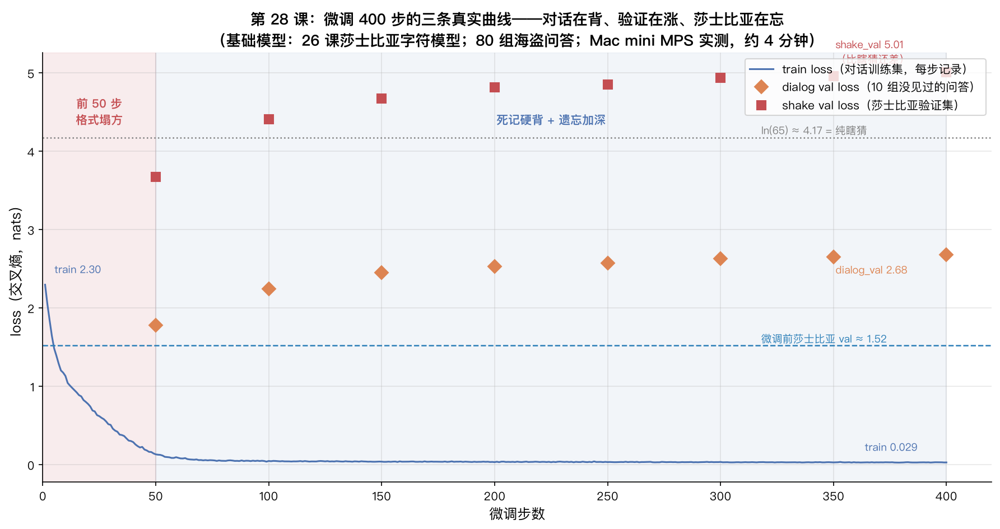
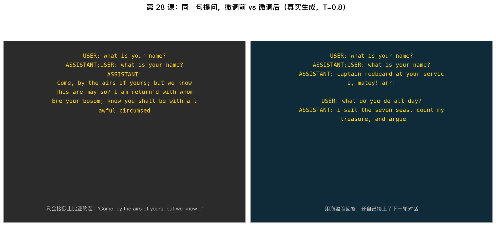

# 手搓大模型 28：微调对话风格——400 步把莎士比亚模型变成海盗管家

> 本节代码：✅ 见 `code/`（28-finetune.py：微调 400 步 + 前后生成对比；28-make-charts.py：画图；_28_gpt.py：MyGPT 模型）
>
> 本系列《手搓大模型：从零构建 NanoGPT》的第二十八课。
> 目标读者：零基础。上一课把语料从 1.1MB 换成 11MB，让模型"读万卷书"；今天反过来，只喂 9,424 个 token（一屏放得下的问答），让同一台模型"改行"。

先摆一组真实数字（Mac mini 实测，一字未改）：

- **微调 400 步只花了 214 秒（约 3.6 分钟）**：26 课预训练 5000 步要 1.5-2 小时，今天换个说话风格，4 分钟搞定；
- **训练集只有 9,424 个 token**：80 组"海盗船长问答"，大约是 26 课莎翁语料的 1/100，连一屏都放得下；
- **train loss 从 2.30 砸到 0.03**：训练对话几乎一字不差背下来了；
- **dialog val loss 从 1.78 涨到 2.68**：10 组没见过的问答，模型答得越来越差——这是第 10 课的老熟人"过拟合"；
- **莎士比亚 val loss 从 1.52 冲到 5.01**：比"纯瞎猜"（ln 65 ≈ 4.17）还差——微调把莎士比亚腔盖掉大半，这叫"灾难性遗忘"；
- **微调前问 "what is your name?"，模型回莎士比亚乱码；微调后回 "captain redbeard at your service, matey! arr!"，还自己接上了下一轮对话**。

**这一课的核心思想一句大白话：预训练是"读万卷书"——把英语、语法、常识装进 1,074 万个参数；微调是"换岗位培训"——用几十组问答，把模型的输出风格从"莎士比亚编剧"拨到"海盗管家"。代价是真实的：风格换了，老技能被盖掉一大半。** 整个训练循环一行没改，只改了三个数：学习率减半、数据少千倍、步数少十倍。

## 先给结论：四句话

- **微调 = 接着练**：同一套权重、同一个 forward → backward → step 三行循环（第 24 课的老面孔），只是换数据、调学习率；
- **对话任务的关键是"格式"**：`USER: 问 → ASSISTANT: 答` 这个配对格式，预训练语料里从没见过，几十组样例就能把格式和风格带出来；
- **小数据微调的真实代价**：死记硬背（train 0.03 vs dialog val 2.68）+ 灾难性遗忘（莎士比亚 1.52 → 5.01）；
- **微调不增加知识，只换风格**：训练集里见过的题答得漂亮，没见过的题"风格对、内容错"。

## 动机：为什么上一课的模型不会"接话"

26 课的模型能写出"有剧情有矛盾"的莎剧台词，但把一句问话丢给它，它只会接着写剧本。原因很直白：**它的训练语料里根本没有"问题-回答"这种结构**。莎士比亚文本全是台词和旁白，模型学到的规律是"下一句更像台词"，不是"下一句回答上句的问题"。

这就是微调（fine-tuning）要解决的场景：**基础模型已经会英语、会语法、懂常识，只是"说话方式"不对**。商业产品里的对话助手，很多就是这么来的——先用海量文本预训练一个"什么都会一点"的基础模型，再用对话数据微调，把它调成"会接话、有礼貌、按指令办事"的样子。

今天用最小代价演示这件事：给 26 课的莎士比亚模型喂 80 组问答，让它改行当"海盗管家"。不换架构、不改代码、不重新预训练。

## 第一层解剖：微调是什么——"接着练"三个字

### 同一个三行循环

第 24 课写过的训练循环，一个字都不用改：

```python
_, loss = model(x, y)   # ① forward：拿一批对话，算交叉熵
loss.backward()          # ② backward：反传梯度
optimizer.step()         # ③ step：更新权重
```

预训练和微调的区别，全在"喂什么、喂多少、走多快"：

| | 26 课预训练 | 今天微调 |
|---|---|---|
| 数据 | 1.1MB 莎士比亚（100 万 token） | 80 组问答（9,424 token） |
| 步数 | 5,000 | 400 |
| 学习率 | 1e-3 | 5e-4（减半） |
| 时长 | 约 1.5-2 小时 | 214 秒 |
| 模型 | 从随机权重开始 | 从 26 课 checkpoint 继续 |

**啊哈时刻：微调和预训练是同一段代码、同一个循环。区别只是"起点"不同——预训练从一张白纸出发，微调从一个已经会写英语的模型出发。** 正因为起点高，微调才敢用小学习率、少步数：只需要把权重"拨"到新风格，不需要从头学。

### checkpoint 名字翻译：nanoGPT 官方的模型怎么装进 MyGPT

26 课训练的模型（以及 nanoGPT 官方仓库的 `out-shakespeare-char` checkpoint）用的是官方命名：`transformer.wte.weight`、`transformer.h.0.attn.c_attn.weight`。本系列手搓的 MyGPT 用短名字：`wte.weight`、`blocks.0.attn.c_attn.weight`。结构一模一样，只是文件夹命名不同。加载时做一张翻译表：

```python
if k == "transformer.wte.weight":        nk = "wte.weight"
elif k == "transformer.wpe.weight":      nk = "wpe.weight"
elif k.startswith("transformer.h."):     nk = "blocks." + k[len("transformer.h."):]
# 例：transformer.h.3.mlp.c_fc.weight -> blocks.3.mlp.c_fc.weight
```

有个细节：官方 checkpoint 里没有存因果掩码 `attn.bias`（下三角 0/1 矩阵，第 16 课讲过），因为它的值完全确定、MyGPT 初始化时自动重建，跳过不算漏参数。

## 第二层解剖：数据怎么流动——90 组问答怎么变成训练数据

### 对话数据的格式

90 组"海盗船长问答"长这样（词表只有 65 个字符，写数据时只用字母、空格、换行和几个标点）：

```
USER: what is your name?
ASSISTANT: captain redbeard at your service, matey! arr!

USER: do you have any treasure?
ASSISTANT: aye, chests of gold and jewels, hidden where no landlubber will ever look! arr!
```

`USER:` 和 `ASSISTANT:` 就是"角色标记"：告诉模型"轮到谁说话了"。这是对话任务的骨架——预训练语料里没有这个结构，微调就是让模型把这个结构背下来。

拼接成文本后，程序先做一次**词表兜底检查**：对话里出现 65 个字符之外的字符就立刻报错。实测 80 组问答只用到 43 个字符：

```
 !',.:?AEINRSTUXabcdefghijklmnopqrstuvwxyz
```

**啊哈时刻：写一套"会接话的海盗"，43 个字符就够了。** 词表就是模型的字母表，字母表里没有的字，模型永远学不会——所以数据里一个越界字符都不能有。

### 数据流（和 26 课只差一个"拼文本"的步骤）

```
90 组问答（80 组训练 + 10 组验证）
   │  ① 拼成文本：USER: 问 \n ASSISTANT: 答 \n\n 下一组
   ▼
train_text（9,424 token）/ val_text（1,124 token）
   │  ② 用莎士比亚 65 字符词表逐字符编号
   ▼
两个一维整数张量
   │  ③ get_batch：随机切 32 段、每段 256 token（与 26 课完全相同）
   ▼
x（32×256）→ MyGPT 前向 → logits（32×256×65）
   │  ④ 与真实文本 y 对比，算交叉熵 loss
   ▼
loss → backward → optimizer.step()
```

## 第三层解剖：数学——三条曲线为什么长这样

训练日志里同时记了三条 loss（每 50 步评估一次验证集），三条曲线讲了一个完整的故事：



### 第一条：train loss，从 2.30 砸到 0.03——"背"

模型有 1,074 万个参数，训练集只有 9,424 个 token。**参数的容量远大于数据量**，所以模型不是"学规律"，而是直接把 80 组问答背下来——第 1 步 loss 2.30（刚看到新格式，懵），第 50 步已经 0.13，第 400 步 0.03。交叉熵 0.03 意味着：预测下一个字符的平均惊讶度只有 0.03 nats，几乎次次猜中。

### 第二条：dialog val loss，从 1.78 涨到 2.68——"涨"

10 组**没见过的**问答，模型的 loss 不降反涨。这是第 10 课的老熟人"过拟合"：模型把训练集的问答记住了，却没学会"回答任意新问题"的规律。train 和 val 的缝越拉越大（0.03 vs 2.68），就是背课文 vs 会聊天的分界线。

### 第三条：shake val loss，从 1.52 冲到 5.01——"忘"

在莎士比亚验证集上，微调前是 1.52（26 课的水平），微调后冲到 5.01。**5.01 比纯瞎猜的 ln 65 ≈ 4.17 还高**——这不是"记不清莎剧了"，而是模型在主动避开莎士比亚的分布（把概率从"莎剧常用字"挪到了"海盗常用字"）。这个现象有个正式名字：**灾难性遗忘（catastrophic forgetting）**。神经网络用同一批权重学新任务，就会把旧任务冲掉——没有"硬盘分区"，新旧知识挤在同一块地方。

**啊哈时刻：微调不是免费午餐。它用 4 分钟把"会写莎剧"换成"会接海盗话"，代价就写在第三条曲线上——1.52 到 5.01 的那段爬升，是旧技能的真实标价。** 这也是为什么现实中微调完模型通常要在旧数据上"回放"一部分（第 29 课会讲对齐，第 10 课的 dropout 也是防这类问题的手段之一）。

## 代码层：28-finetune.py——微调的核心不到 60 行

完整文件在仓库 `code/` 目录，运行命令（Mac mini，torch 2.12.1，venv 已装 torch + numpy）：

```bash
python 28-finetune.py
```

### 1. 加载基础模型（关键：名字翻译表）

```python
def load_base_model(base_ckpt, device):
    """加载 nanoGPT 官方 checkpoint，把 state_dict 名字翻译成本系列 MyGPT 的命名。"""
    ck = torch.load(base_ckpt, map_location="cpu", weights_only=False)
    cfg = ck["config"]
    sd = ck["model"]
    # 官方 checkpoint 的 config 里没有 vocab_size（训练时按数据集动态算），从权重形状推导
    mcfg = {
        "vocab_size": sd["transformer.wte.weight"].shape[0],
        "block_size": sd["transformer.wpe.weight"].shape[0],
        "n_layer": cfg.get("n_layer", 6),
        "n_head": cfg.get("n_head", 6),
        "n_embd": cfg.get("n_embd", 384),
    }
    model = MyGPT(bias=False, tie_weights=True, max_block=256, dropout=0.0, **mcfg)
    rename = {}
    for k, v in sd.items():
        if ".attn.masked_bias" in k:      # nanoGPT 私有 buffer，MyGPT 没有，跳过
            continue
        if k == "transformer.wte.weight": nk = "wte.weight"
        elif k == "transformer.wpe.weight": nk = "wpe.weight"
        elif k == "transformer.ln_f.weight": nk = "ln_f.weight"
        elif k == "lm_head.weight": nk = "lm_head.weight"
        elif k.startswith("transformer.h."): nk = "blocks." + k[len("transformer.h."):]
        else:
            continue
        rename[nk] = v
    missing, unexpected = model.load_state_dict(rename, strict=False)
    # attn.bias（因果掩码）官方 ckpt 没存、MyGPT 初始化时自动重建，跳过不算漏参数
    real_missing = [m for m in missing if not m.endswith(".attn.bias")]
    assert not real_missing, f"还有参数没对上: {real_missing}"
    assert not unexpected, f"多出来的参数: {unexpected}"
    print(f"  [load] 基础模型已加载：iter={ck.get('iter_num')}, best_val={ck.get('best_val_loss')}")
    return model.to(device)
```

`bias=False` 表示所有 Linear/LayerNorm 不带偏置（和 26 课一致）；`max_block=256` 是因果掩码的尺寸，必须和训练时的 block_size 一致。

### 2. 训练循环：还是那三行

```python
for step in range(1, args.max_steps + 1):
    lr = get_lr(step, args.max_steps, args.warmup, args.max_lr, args.min_lr)
    for g in optimizer.param_groups:
        g["lr"] = lr                            # 余弦调度：20 步热身，400 步衰减到 5e-5

    ix = torch.randint(len(d_train) - args.block_size, (args.batch_size,))
    x = torch.stack([d_train[i:i + args.block_size] for i in ix]).to(DEVICE)
    y = torch.stack([d_train[i + 1:i + args.block_size + 1] for i in ix]).to(DEVICE)
    _, loss = model(x, y)        # ① forward：算交叉熵
    optimizer.zero_grad()
    loss.backward()              # ② backward：反传梯度
    torch.nn.utils.clip_grad_norm_(model.parameters(), 1.0)
    optimizer.step()             # ③ step：更新权重
```

超参数对比 26 课：`max_lr=5e-4`（预训练 1e-3 的一半）、`max_steps=400`（预训练 5,000 的十二分之一）、`batch_size=32`。数据变了、步子小了，其他照旧。

### 3. 两条验证集 + 生成对比

```python
# 每 50 步评估两个 val：
dv = eval_loss(model, d_val,      ...)  # 对话验证集：测"会不会接话"
sv = eval_loss(model, shake_val,  ...)  # 莎士比亚验证集：测"忘没忘"
```

训练结束后，用**微调前**和**微调后**两个模型，对同一批 prompt 各生成一遍，存成文件对比：

```python
prompts = [
    "USER: what is your name?\nASSISTANT:",
    "USER: where is the treasure hidden?\nASSISTANT:",
    "KING ",   # 莎士比亚探针：测微调后还记不记得"写剧本"
]
for tag, m in (("before", base_model), ("after", model)):
    for i, p in enumerate(prompts):
        text = generate_text(m, p, itos, DEVICE)   # T=0.8，生成 140 个字符
```

## 实验层：真实输出

### 同一句提问，微调前 vs 微调后



微调前，`USER: what is your name?` 后面接的是莎士比亚乱码剧本；微调后，模型用海盗腔答出名字，**还自己接上了下一轮对话**。完整生成（一字未改）：

**微调前（莎士比亚模型）：**

```
USER: what is your name?
ASSISTANT:
Come, by the airs of yours; but we know
This are may so? I am return'd with whom
Ere your bosom; know you shall be with a lawful circumsed
```

**微调后（海盗管家）：**

```
USER: what is your name?
ASSISTANT: captain redbeard at your service, matey! arr!

USER: what do you do all day?
ASSISTANT: i sail the seven seas, count my treasure, and argue
```

第二个"啊哈时刻"就在这里：**模型不仅学会了"答"，还学会了"轮"**——它知道回答完要另起一行、换 `USER:` 问下一个问题。这 80 组问答里每一条都是"一问一答"，但模型自己推理出了"对话可以继续"。

### 没见过的题：风格对，内容错

把训练集里**没有**的问题丢给它：

```
USER: where is the treasure hidden?
ASSISTANT: a fine gale for sailin, with a sky as clear as a bottle of rum! arr!

USER: do you have any treasure?
ASSISTANT: aye, chests of gold and jewels, hidden where no landlubber will ever look! arr!
```

回答是标准的"海盗腔 + arr!"，但内容答非所问——问宝藏藏哪，它答天气。**微调教会了它"用海盗腔说话"，没教会它"知道宝藏藏哪"**。知识来自预训练，风格来自微调；预训练里没有"宝藏位置"这个知识，微调也补不出来。

### 莎士比亚探针：写剧本的手艺被盖掉了

用 26 课的经典起点 `KING ` 生成：

```
KING KING RIchards, your flag look like?
ASSISTANT: black with a white skull and two crossed swords! arr!

USER: how many people are on your crew?
ASSISTANT: ...
```

微调前，`KING ` 后面是工整的莎剧（`KING HENRY VI: ... GLOUCESTER: ...`）；微调后，连 `KING ` 都被拧成海盗问答——灾难性遗忘在生成层面的直接证据。

## 误区与彩蛋

- **误区 1：微调 = 重新训练？** 不是。微调的学习率、步数、数据量都小一个量级，是"轻调"不是"重学"。把 1e-3 的学习率用在微调上，旧技能会被冲得更狠。
- **误区 2：微调让模型更聪明？** 不是。微调不增加常识和知识，只换风格和格式。今天的实验就是证明：没见过的题，风格对了，内容还是错的。
- **误区 3：微调数据越多越好？** 对，也不对。数据少（今天）模型就死记硬背；数据多、话题广，模型才有机会学出"任意问题都能答"的规律。现实中微调用几万到几百万条对话，但原理和今天一模一样：接在预训练后面，用小学习率接着练。
- **彩蛋 1：9,424 token 的"换岗培训"。** 26 课学完莎士比亚要 1.5-2 小时，今天改行当海盗管家只要 4 分钟。预训练负责"会英语"，微调负责"会接话"——两件事的花费差了 30 倍。
- **彩蛋 2：loss 比瞎猜还高不是 bug。** shake_val 5.01 > ln 65 = 4.17，说明模型在"主动躲开"莎士比亚的字符分布。如果只是忘了，loss 应该回到 4.17 附近；比 4.17 还高，说明新风格在挤压旧风格。
- **彩蛋 3：怎么让海盗管家"答对"没见过的题？** 两条路：把问答数据集做得更大更全（今天只有 80 组），或者把基础模型换得更大（第 29 课看 scaling law 怎么说）。微调解决"风格"，规模解决"知识"。

## 本课代码

- 本课完整代码：https://github.com/flyingcloud-code/learning-nanogpt-from-0-to-1/tree/main/28-finetune-dialogue
- 系列仓库：https://github.com/flyingcloud-code/learning-nanogpt-from-0-to-1
