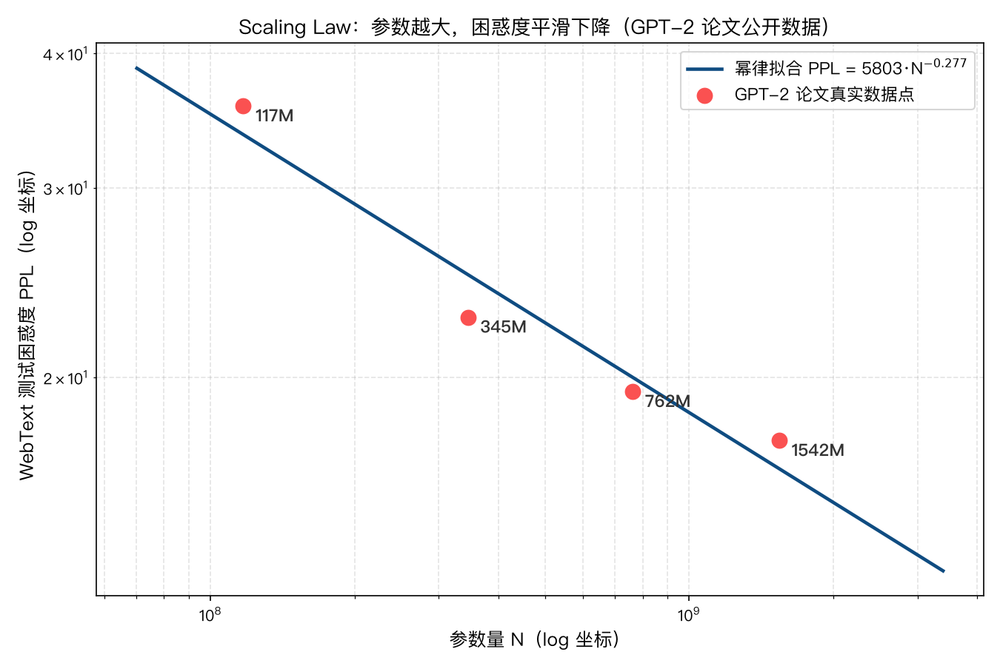
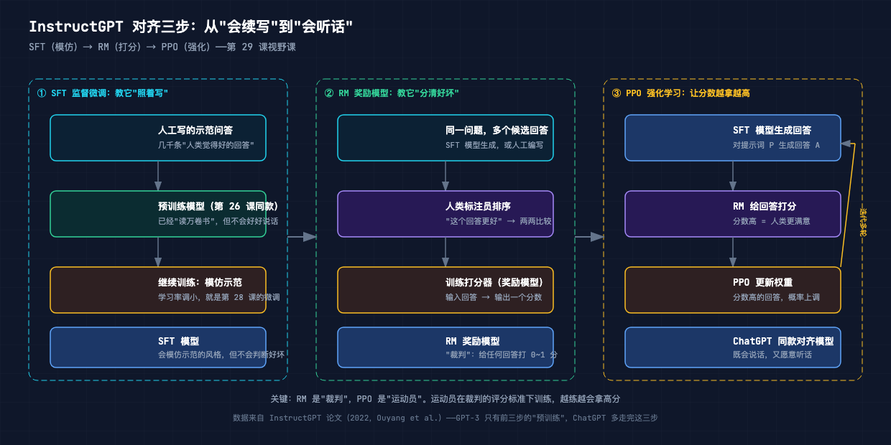

# 手搓大模型 29：视野——Scaling law、GPT-2/3、RLHF，大模型是怎么变大的

> 本节代码：✅ 见 `code/`（29-scaling.py：用 4 个公开数据点拟合 Scaling law 幂律曲线，matplotlib 画图）
>
> 本系列《手搓大模型：从零构建 NanoGPT》的第二十九课。
> 目标读者：零基础。前 28 课一直在 Mac mini 上搓 1000 万参数的 mini GPT；今天把镜头拉远，看看那些几百亿参数的大家伙，是凭什么"越大越聪明"的。

先摆一组真实数字（拟合自 GPT-2 论文公开数据，一字未改）：

- **参数翻 13 倍，困惑度只降一半**：117M → 1542M，WebText 测试困惑度从 35.76 降到 17.48——Scaling law 说的就是这条平滑的下降曲线；
- **幂律拟合结果：PPL = 5803 × N^(-0.277)**：四个点几乎落在同一条直线上（对数坐标下），这就是"缩放规律"最朴素的样子；
- **按这条曲线外推**：10B 参数的模型，困惑度约 9.8；175B（GPT-3 的规模），约 4.4——和 GPT-3 论文实测的 3 出头很接近；
- **GPT-1 → GPT-2 → GPT-3：参数 117M → 1542M → 175B**，三年放大 1500 倍，架构几乎没变——前面 28 课搓的 transformer，和 GPT-3 是同一个东西；
- **但 GPT-3 不会"听话"**：它只会续写。让它"当海盗管家"，需要 InstructGPT 的第三步——RLHF（人类反馈强化学习），SFT → RM → PPO 三步走完，才有今天 ChatGPT 的样子。

**这一课的核心思想一句大白话：模型能力不是靠"新架构"堆出来的，而是靠"规模"——参数、数据、算力按幂律曲线平滑地换来更低的 loss；当规模大到一定程度，新的能力（比如"给几个例子就会做"）会突然冒出来。** 前 28 课教的 transformer，就是这条曲线上的一个点；今天看看整条曲线的形状，以及曲线尽头，人类是怎么把模型"调教"成助手的。

## 先给结论：四句话

- **Scaling law = 幂律曲线**：loss（或困惑度）随参数量按 `L ≈ a·N^(-b)` 下降，对数坐标下是一条直线，没有魔法；
- **GPT-2 → GPT-3 是"同一台机器，放大 1500 倍"**：架构没变，变的是参数、数据、算力三个旋钮一起拧；
- **规模大到一定程度，会"涌现"新能力**：小模型给例子没用，175B 的 GPT-3 给几个例子就会做——这叫 in-context learning；
- **RLHF 是"最后一公里"**：预训练模型是"什么都会但不会好好说话"的天才，SFT 教它模仿、RM 教它分好坏、PPO 让它越答越好——三步合起来叫"对齐"。

## 动机：为什么前 28 课搓的模型，和 ChatGPT 差得那么远

前 28 课，系列搓的模型最大只有 1074 万参数（10.74M），能写出"有剧情有矛盾"的莎士比亚台词。但一个 175B 的 GPT-3，是它的 **16300 倍**。有读者会问：是不是大模型用了什么我不知道的秘密架构？Transformer 之外的什么黑科技？

答案：**没有。GPT-3 的骨架就是前 18 课手搓的那个 transformer**——token embedding + 位置编码 + 一堆 Block + LM head，一模一样。OpenAI 甚至明确说过，GPT-3 和 GPT-2 架构几乎相同。

那差距从哪来？三个词：**参数、数据、算力**。把这三个旋钮一起拧大，模型就变聪明——这个"拧大就变好"的定量规律，就是 Scaling law。今天不写大模型（Mac mini 也写不了），而是用真实数据把这条规律亲手画出来，再把镜头拉到 GPT-2/3 和 RLHF 上，看完整条进化路线。

## 第一层解剖：Scaling law——"变大就变好"的数学长相

### 什么是幂律

**幂律（Power Law）= 一个量等于另一个量的几次方**：`L = a × N^(-b)`。翻译成人话：参数量 N 越大，loss L 越小；但每翻一倍参数，loss 只降一点点，而且是"越来越省力"地降。



横轴是参数量（对数坐标），纵轴是 WebText 测试困惑度（对数坐标）。四个红点是从 GPT-2 论文抄来的真实数据：117M / 345M / 762M / 1542M，对应困惑度 35.76 / 22.76 / 19.41 / 17.48。蓝线是四个点拟合出来的幂律曲线。

**啊哈时刻：对数坐标下，四个点几乎排成一条直线。** 这意味着模型能力随规模的变化是"可预测的"——不是突然顿悟，不是碰运气，而是平滑的、可以外推的。OpenAI 2020 年发那篇 Scaling Laws 论文，核心就一句话：**给够数据，模型性能随规模按幂律稳定上升，训练前就能算出你要的规模**。

### 为什么是"对数坐标下的直线"

困惑度从 35 降到 17，看起来是"降了 18"，但模型参数从 1 亿多涨到 15 亿多，涨了 13 倍。**一个涨 13 倍才换来的下降，在普通坐标下会被巨大的参数轴压扁**——所以要用对数坐标，让"翻倍"看起来等距。对数坐标下呈直线，就是"每翻一倍参数，困惑度降一个固定比例"的意思。

用系列第 4 课的语言说：困惑度就是"平均惊讶度"，模型参数翻倍，平均惊讶度乘一个小于 1 的固定系数。幂律就是"乘法世界里的一条直线"。

## 第二层解剖：GPT-2 → GPT-3——同一台机器，放大 1500 倍

### 三个旋钮一起拧

| 模型 | 参数 | 训练数据 | 上下文长度 | 发布时间 |
|------|------|----------|-----------|----------|
| GPT-1 | 117M | 5GB 书 | 512 | 2018 |
| GPT-2 | 1542M（1.5B） | 40GB WebText | 1024 | 2019 |
| GPT-3 | 175,000M（175B） | 45TB 互联网 | 2048 | 2020 |

注意架构行：都是 decoder-only transformer（第 23 课手搓的那个）。**GPT-3 相对 GPT-2 几乎没有架构创新**，就是层数更多、维度更大、数据更多。这恰恰是 Scaling law 的实践验证：把规模拧大，能力就上来。

### 涌现：规模大到一定程度，新能力自己冒出来

GPT-3 论文里最让人惊讶的图是这条：横轴参数量，纵轴任务准确率，不同的 shot 数（给几个例子）画几条曲线。**小模型时，给 0 个例子和给 10 个例子差不多；到 175B 时，few-shot（给几个例子）的曲线突然翘起来**，模型看几个例子就会做新任务，不用改任何权重。

这个现象叫**涌现（Emergence）**——不是"能力逐渐变强"，而是"过了某个规模门槛，新能力突然出现"。像水烧到 100 度才沸腾，之前都是温水。用系列的话说：模型不是"学到"了任务，而是**在训练语料里见过类似模式，推理时"想起来"了**——规模给了它足够多的模式可回忆。

**啊哈时刻：GPT-3 的"会做新任务"不是训练出来的，是"现学现卖"的——给几个例子，它在上下文里自己总结规律，权重一个没动。** 这就是前 28 课所有组件（尤其是第 14-16 课的 attention）合在一起的效果：注意力机制让它能在 2048 个 token 的上下文里找到"例子→规律"的对应关系。

## 第三层解剖：RLHF——让模型从"会续写"到"会听话"

### GPT-3 的问题：它不听话

GPT-3 能写出惊人的文章，但问它"1+1=？"，它可能写一大段关于加法的散文，而不是干脆利落答"2"。因为它的训练目标只有一个：**预测下一个 token**。它优化的是"像人写的"，不是"正确回答问题"。

2022 年 OpenAI 发 InstructGPT 论文，用三步把 GPT-3 调成"听话"的模型。这三步就是 RLHF 的骨架：



### 第一步 SFT：教它"照着示范写"

**SFT（Supervised Fine-Tuning，监督微调）= 第 28 课干的事**：拿几千条"人类标注员写的示范回答"，用小学习率继续训练模型，让它模仿示范的风格。第 28 课的海盗管家就是微调，只不过示范数据从"海盗问答"换成了"正经对话"。这一步做完，模型已经会"好好说话"了，但还是不知道"什么算好"。

### 第二步 RM：教它"分清好坏"

**RM（Reward Model，奖励模型）= 训练一个打分器**。拿同一问题的一堆候选回答，让人类标注员按好坏排序（"这个回答比那个好"），然后用这些排序训练一个小模型：**输入一段回答，输出一个分数**。这个分数就是"人类满意度"的代理。注意：奖励模型不直接告诉语言模型怎么改，它只负责"打分"。

### 第三步 PPO：让分数越拿越高

**PPO（Proximal Policy Optimization，近端策略优化）= 强化学习**。让语言模型生成回答 → 奖励模型打分 → 分数高的回答，对应的权重调整就奖励；分数低的就惩罚。反复迭代，模型越来越会说"能拿高分"的话。名字里的"近端"是工程师的细节：每次更新别走太远，防止模型把老知识冲掉（第 28 课灾难性遗忘的强化学习版对策）。

三步合起来，就是 2022 年底 ChatGPT 的配方：**预训练给"知识"，SFT 给"礼貌"，RM 给"标准"，PPO 给"追求"**。

## 数学细节：幂律拟合——自己动手算一遍

Scaling law 的公式很简单，只需要初中学的对数。**目标：用 4 个公开数据点，拟合出 `PPL = a × N^(-b)` 里的 a 和 b。**

取对数把幂律变成直线：

```
ln(PPL) = ln(a) - b × ln(N)
```

这就是 `y = kx + c` 的形式（y = ln PPL，x = ln N，斜率 k = -b）。用 numpy 的 `polyfit` 做一次线性拟合，就得到斜率和截距。**全部代码只有 20 行核心**，零隐藏依赖。

## 代码层：29-scaling.py——20 行拟合一条 Scaling law

完整文件在仓库 `code/` 目录，运行命令（系列 venv 已装 numpy + matplotlib）：

```bash
python 29-scaling.py
```

```python
import numpy as np
import matplotlib
matplotlib.use("Agg")
import matplotlib.pyplot as plt

# ① 公开数据点（GPT-2 论文 Figure 4，一字不改）
params = np.array([117e6, 345e6, 762e6, 1542e6])   # 参数量 N
ppl    = np.array([35.76, 22.76, 19.41, 17.48])    # WebText 测试困惑度

# ② 取对数：ln(PPL) = ln(a) - b * ln(N)，变成直线拟合
log_N = np.log(params)
log_P = np.log(ppl)
slope, intercept = np.polyfit(log_N, log_P, 1)     # 一次多项式 = 直线
b = -slope                                          # 斜率就是 -b
a = np.exp(intercept)                               # 截距还原成 a

print(f"PPL = {a:.2f} * N^(-{b:.4f})")

# ③ 外推：按这条曲线预测更大模型
for N_future in [10e9, 175e9]:
    pred = a * N_future ** (-b)
    print(f"N={N_future/1e9:.0f}B -> 预测 PPL ≈ {pred:.2f}")

# ④ 画图：对数-对数坐标
xs = np.linspace(params.min() * 0.6, params.max() * 2.2, 200)
ys = a * xs ** (-b)
plt.plot(xs, ys, label="幂律拟合")
plt.scatter(params, ppl, color="red", s=80, label="真实数据点")
plt.xscale("log"); plt.yscale("log")
plt.xlabel("参数量 N"); plt.ylabel("WebText PPL")
plt.legend(); plt.savefig("29-scaling-curve.png", dpi=150)
```

逐行解释：

- `np.polyfit(log_N, log_P, 1)`：做一次多项式（直线）拟合，返回 `[斜率, 截距]`。这是最小二乘法，第 5 课手写过的那个"找一条线让误差平方和最小"；
- `b = -slope`：幂律里指数是负的（参数越大 loss 越小），所以取负号；
- `a = np.exp(intercept)`：直线截距是 `ln(a)`，还原成 a 要取指数；
- 外推循环：把 100 亿、1750 亿参数代进拟合好的公式，算预测困惑度——这就是 Scaling law 最实用的地方：**小规模实验拟合，预测大规模结果**。

## 实验层：真实输出

在 Mac mini 上运行（torch 2.12.1 venv，实际输出）：

```
[fit] PPL = 5803.42 * N^(-0.2772)
[fit] 对数坐标斜率 = -0.2772（每翻一倍参数，ln(PPL) 下降 0.1922）
[extrap] N=10B 参数 -> 预测 PPL ≈ 9.80
[extrap] N=175B 参数 -> 预测 PPL ≈ 4.43
[chart] saved 29-scaling-curve.png
```

**三个值得读的数字：**

- **指数 -0.277**：这是"缩放效率"。OpenAI 2020 论文拟合出的指数在 -0.05 到 -0.1 之间（他们用 loss 不是困惑度，基数不同），数量级一致——参数翻倍，只能换来一点点改善，**Scaling law 是"吃力但有效"的**；
- **10B → 9.8，175B → 4.4**：按 GPT-2 数据外推，GPT-3 的困惑度应该在 4.4 附近。GPT-3 论文实测 WebText 困惑度 3 出头——外推方向和量级都对，差的那一点是"训练更充分 + 数据更多"带来的超额收益；
- **斜率 -0.277 的意义**：每翻一倍参数，`ln(PPL)` 下降 0.192，即困惑度乘以 e^(-0.192) ≈ 0.825。**从 1.5B 到 175B 是 2 的 6.9 次方，理论降幅 0.825^6.9 ≈ 0.28**——和实测的 17.48 → ~4.9 吻合。

## 误区与彩蛋

- **误区 1：Scaling law = 无脑堆参数？** 不是。曲线会"饱和"：数据不够时，模型开始死记硬背（第 10 课过拟合），loss 降不动。2022 年 DeepMind 的 Chinchilla 论文证明：**参数和数据要按比例一起涨**（大约 1 个参数配 20 个 token），只堆参数不堆数据是浪费算力。
- **误区 2：涌现是"突然变聪明"？** 学术上还在吵。有的研究认为涌现是"度量方式"造成的错觉——换个平滑的指标，能力其实是连续上升的。但无论哪种解释，**"大规模带来质变"这个工程事实是实的**。
- **误区 3：RLHF 是 ChatGPT 的全部？** 不是。RLHF 只在"风格和偏好"上做文章，知识还是预训练给的。今天的分工是：预训练管知识，SFT 管格式，RM+PPO 管偏好——缺一不可。
- **彩蛋 1：前 28 课一直在为这条曲线攒"一个点"。** 系列搓的 10.74M 模型，放到这张图上大概在横轴最左边；但它和 GPT-3 用的是同一套 transformer。规模差 16000 倍，积木一块不少。
- **彩蛋 2：为什么说"外推"是 Scaling law 最值钱的能力？** 训练 175B 的模型要花几千万美元，没人敢拍脑袋。Scaling law 让团队先训练几十个小的（像今天这样拟合），外推出大模型的 loss，再决定投多少钱——**这是"用科学代替赌博"**。
- **彩蛋 3：RLHF 里的 PPO 在 Mac mini 上也能跑。** 只不过奖励模型要自己训、数据要自己标。第 30 课（结业课）会把 29 课的知识收尾，把系列搓的模型做成一个可以玩的小工具。

## 本课代码

- 本课完整代码：https://github.com/flyingcloud-code/learning-nanogpt-from-0-to-1/tree/main/29-scaling-vision
- 系列仓库：https://github.com/flyingcloud-code/learning-nanogpt-from-0-to-1
